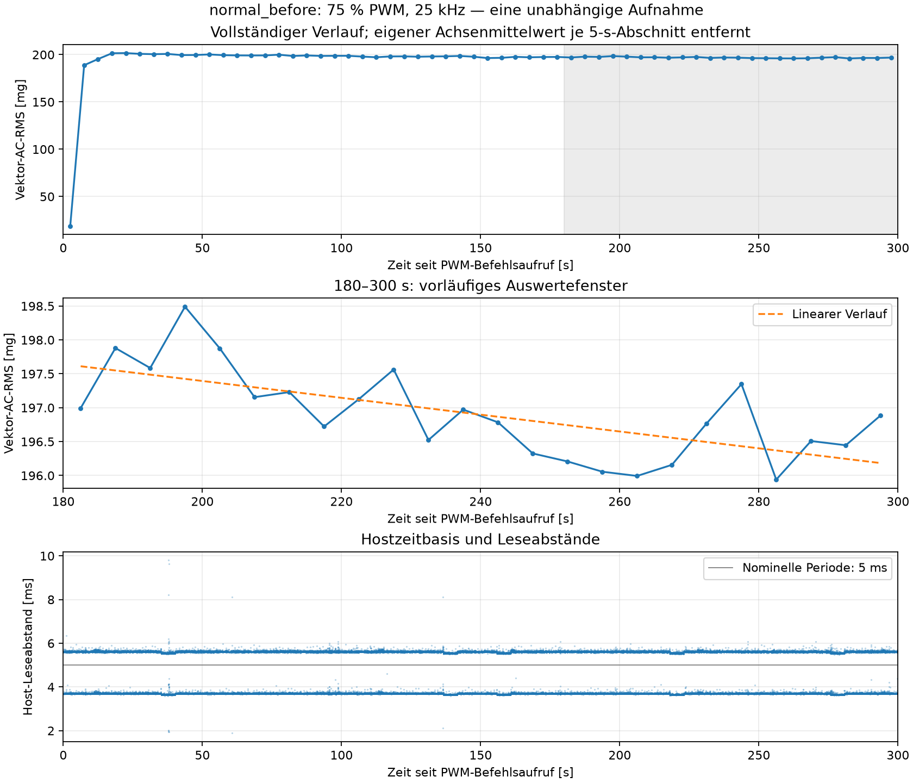

# Erste Phase abgeschlossen: normal_before

11.09.2026. Erste von drei freigegebenen Phasen der geplanten Folge N–A–N; die übrigen Phasen wurden noch nicht gestartet. Dieser Zwischenbericht enthält ausschließlich Ergebnisse der neuen Normalaufnahme. Ein Vergleich mit der Luftstromveränderung und der Rückkehrreferenz ist noch nicht möglich.

## Steuerung und Zeitpunkte

| Merkmal | Protokollierter Wert |
|---|---|
| Aufbauversion | `adxl345_mount_v2_provisional_20260911_072748` |
| Zustandslabel | `normal_before`, numerisch 0; Nutzerfreigabe des Normalaufbaus und der angeschlossenen Versorgung |
| Zusätzliche Auszeit ab Annahme der Freigabe | 60,021713 s bis Befehlsaufruf |
| Gesamte vorherige Auszeit | Nicht durchgehend protokolliert; keine mechanische oder thermische Gleichheit unterstellt |
| PWM-Befehlsaufruf | 11:24:59,176798 Uhr Europe/Berlin (09:24:59,176798 UTC) |
| Betriebsvorgabe | 75 % bei 25 kHz; vor/nach Erfassung rückgelesen, kein Drehzahlnachweis |
| Erste XYZ-Lesung | ca. 11:24:59,264507 Uhr; UTC aus Hostzeitpaar abgeleitet |
| Erste Lesung nach Befehlsaufruf / -abschluss | 87,709 / 33,706 ms |
| Eingestellte Erfassungsdauer | 300 s |
| Spanne erste–letzte XYZ-Lesung | 299,993265 s |
| Nullvorgabe abgeschlossen | 11:29:59,583077 Uhr |
| Abschließende Rücklesung | 0 % PWM, 25 kHz, aktivierter Hardware-PWM-Kanal, GPIO18 / physischer Pin 12 / Funktion `a3` |

Es gab genau einen Stellvorgang auf 75 % und einen auf 0 %. Keine Rückfragen zum sichtbaren Lauf, keine Antwortfrist, kein Wiederholungsstart. Mechanischer Stillstand und tatsächliche Drehzahl wurden durch die Software nicht gemessen. Quelle: [Sitzungsjournal](normal_before_session.json), [Steuerjournal](normal_before_fan.jsonl).

Die tatsächlichen Plattenmaße, Parkposition, Material- und Halterungsdetails wurden noch nicht mitgeteilt. Die Sollgeometrie im [Protokoll](protocol.md) ist deshalb ausdrücklich von unbekannten Istangaben getrennt. Die Freigabe des Normalaufbaus ersetzt keine Vermessung.

## Messkette und Datenqualität

Unveränderte Einstellungen: ADXL345, I²C-Bus 1 / 0x53 / konfiguriert 100 kHz, nominell 200 Hz, ±2 g, Full Resolution, FIFO-Stream. Registerrücklesungen: 0x2C=0x0B, 0x31=0x08, 0x2E=0x00, 0x38=0x90, 0x2D=0x08.

| Prüfung | Ergebnis |
|---|---:|
| Vollständige XYZ-Punkte | 62.154 |
| Einzelne Achsenwerte | 186.462 |
| Beobachteter Durchsatz aus Hostzeitstempeln | 207,1813 XYZ/s |
| Host-Leseabstand: Mittel / Median / P99 / Maximum | 4,827 / 5,590 / 5,690 / 9,795 ms |
| Host-Leseabstände über 10 ms | 0 |
| Größte protokollierte Lesedauer | 5,915 ms |
| Größter FIFO-Füllstand | 2 |
| Gap / Overrun / Sättigungsflags | 0 / 0 / 0 |
| Nicht monotone Zeitstempel | 0 |
| Größter absoluter Achsenwert | 1,3533 g |

Rohdatenhash und Sidecar stimmen überein; Zeitspalten sind konsistent, XYZ-Werte endlich und Softwareindices lückenlos. Die Zeitbasis bezeichnet Host-Leseabschlüsse, keine unabhängig gemessenen Sensorwandlungen. Nominelle 200 Hz und beobachtete 207,1813 XYZ/s bleiben getrennte Angaben. Die Lückenprüfung garantiert keine bekannte exakte Sensorverlustzahl; diese bleibt unbekannt. Eine neue Messung zur Kalibrierung der Sensoruhr wurde nicht durchgeführt.

## Vektor-AC-RMS und vorläufiger Abschnitt 180–300 s

In jedem 5-s-Abschnitt wurde für jede Achse deren eigener Mittelwert entfernt. Berechnet wurde `sqrt(mean((x−mean(x))² + (y−mean(y))² + (z−mean(z))²))`. mg bedeutet 0,001 g Beschleunigung. Die algebraische Gegenprüfung über die Summe der Achsenvarianzen stimmt überein.

Alle 60 Fenster werden auf den PWM-Befehlsaufruf bezogen. Im ersten Fenster fehlen die 87,709 ms vor der ersten XYZ-Lesung; es wurde nichts aufgefüllt. Die Rohdatei enthält aufgrund des Aufnahmebeginnversatzes 17 weitere Punkte nach t=300 s. Sie bleiben gespeichert, liegen aber außerhalb der vorgegebenen Vergleichsfenster.

| Kennwert der 24 Fenster von 180–300 s | Ergebnis |
|---|---:|
| Mittlerer Vektor-AC-RMS | 196,898 mg |
| Median | 196,835 mg |
| Beschreibende Standardabweichung, Divisor 24 | 0,651 mg |
| Beobachteter Fensterbereich | 195,940–198,490 mg |
| Lineare Steigung | −0,745 mg/min |
| Robuste Mediansteigung der Fensterpaare | −0,768 mg/min |
| Angepasste Änderung über 120 s | −1,490 mg bzw. −0,757 % |
| Letzte 60 s minus erste 60 s im Vergleichsabschnitt | −0,892 mg |

Es besteht ein kleiner fallender Anteil neben Schwankungen, kein durchgehend monotoner Verlauf. Daraus folgt weder eine allgemein gesicherte noch eine widerlegte Einlaufzeit. Die 24 Fenster sind keine 24 unabhängigen Lüfterstarts. Erst mit `airflow_modified` und `normal_after` lassen sich die Unterschiede zwischen den Zuständen und die Rückkehr zum vorherigen Normalbereich untersuchen.

[Grafik als PDF](analysis/normal_before/phase_overview.pdf), [alle 5-s-Fenster](analysis/normal_before/five_second_rms.csv), [maschinenlesbare Auswertung](analysis/normal_before/summary.json).

## Pause und nächster Schritt

Die Stellvorgabe bleibt bei 0 %. Für den manuellen Plattenumbau trennt der Nutzer die externe 12-V-Versorgung, wartet auf vollständigen Stillstand und setzt die separat befestigte Platte gemäß Plan ein. Sollwerte: 60 × 120 mm, parallel zum Auslass, 100 mm Abstand von dessen äußerer Ebene, Projektion über der rechten Rahmenhälfte. Halterung berührt weder Lüfter noch Sensor. Sensorbefestigung und Lüfterposition bleiben unverändert.

Ein nächster Start erfolgt ausschließlich nach der neuen Nutzerfreigabe „Umbau fertig, nächster Lauf freigegeben.“. Es gibt keinen laufenden Warte- oder Neustartprozess. Bisherige Dateien einschließlich Worddatei und Modelle bleiben unverändert; es wurde kein Modell trainiert. Der vollständige Messbericht folgt nach den beiden noch ausstehenden Phasen.
