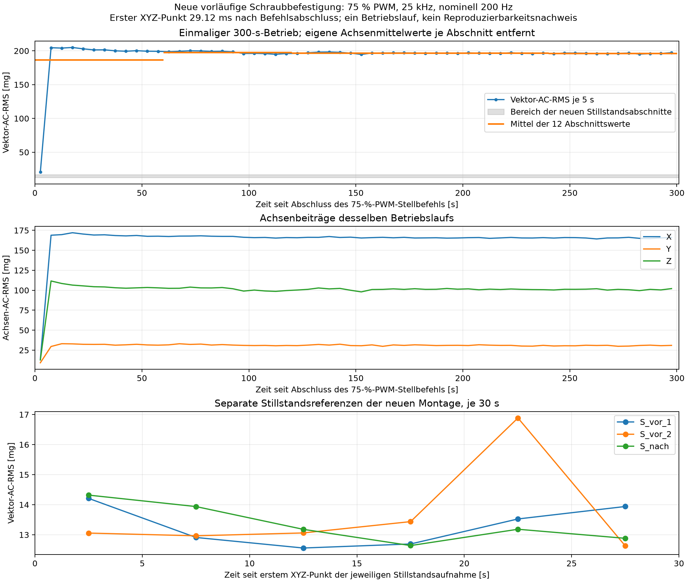
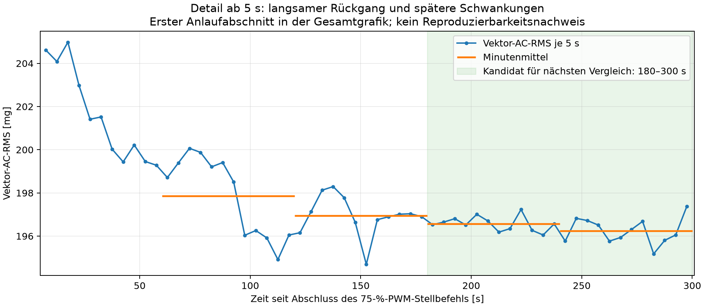

# Pilotversuch mit neuer vorläufiger Sensorbefestigung

Durchgeführt am 11.09.2026 auf dem Raspberry Pi. Die neue Montage liefert in diesem einzelnen Betriebslauf eine deutliche Trennung vom Stillstand und geringe Schwankungen im späteren Verlauf. Sie ist vorläufig für weitere Normalversuche geeignet. Allgemeine Reproduzierbarkeit, eine verbindliche Einlaufzeit und Anomalieerkennung sind noch nicht nachgewiesen.

## Aufbau und bestätigte Bedingungen

Aufbaukennung: `adxl345_mount_v2_provisional_20260911_072748`. Der ADXL345 ist nach Nutzerangabe mit zwei Schrauben am äußeren, feststehenden Lüfterrahmen befestigt; die Platine sitzt schräg. Ein Winkel oder eine Zuordnung der Sensorachsen zu Lüfterachsen wurde nicht vermessen. Befestigung und Unterlage des Lüfters sind nicht genauer beschrieben. Diese Angaben begrenzen die spätere Rekonstruktion des Aufbaus, ohne einen erneuten Umbau zu verlangen.

Die vollständige Prüfung bei getrennter Stromversorgung wurde ausdrücklich bestätigt: Rotor frei, Kabel gesichert, keine erkennbaren Kurzschlüsse, Platine fest und nicht verbogen. Die externe 12-V-Versorgung war für die Referenzen und den Betrieb angeschlossen. Der vollständige Stillstand vor den ersten Referenzen sowie nach dem Betrieb wurde per Nutzerbeobachtung bestätigt. Der gleichmäßige Lauf nach dem Anlaufen und fehlende sichtbare Lockerung oder Berührung wurden nachträglich bestätigt. Das sind Nutzerbeobachtungen, keine Drehzahlmessungen.

Die anfänglichen, mehrdeutigen Antworten und die damaligen offenen Prüfpunkte bleiben unverändert gespeichert. Die spätere eindeutige Bestätigung steht in `../safety_confirmation.json`; sie löst den früheren offenen Status aus `../mounting_details.json` auf. Die Rohdaten-Metadaten wurden nachträglich nicht umetikettiert. Die separate Laufbeobachtung steht in `../operating_observation.json`.

## Durchführung und Sensorparameter

BCM-GPIO18 entspricht physischem Pin 12. Verwendet wurde die vorhandene Hardware-PWM `pwmchip0/pwm2`, Pin-Funktion `a3/PWM0_CHAN2`, normale Polarität, 40.000 ns Periodendauer (25 kHz). 75 % entsprechen 30.000 ns Tastdauer, 0 % entsprechen 0 ns. Die Steuerung hielt den Betriebspunkt während der Aufnahme konstant und protokollierte Befehle, Rücklesungen und Zeitpunkte. Es gab einen Start und keine Ersatzstarts oder Antwortfristen. Sensor und Lüftersteuerung wurden exklusiv verwendet.

Sensorerkennung mit der vorhandenen Software: ADXL345, Gerätekennung 0xE5, I²C-Bus 1, Adresse 0x53. In allen vier Aufnahmen identisch: nominell 200 Hz, ±2 g, Full Resolution, 0,0039 g/LSB, FIFO-Stream, konfigurierte I²C-Taktfrequenz 100 kHz. Registerrücklesung: BW_RATE 0x0B, DATA_FORMAT 0x08, INT_ENABLE 0x00, FIFO_CTL 0x90, POWER_CTL 0x08. Frühere Standby-Register wurden beim Schließen der Verbindung wiederhergestellt; sie sind kein früherer Messbetriebspunkt.

| Aufnahme | Journalbeginn, MESZ | Dauer, Soll | XYZ-Punkte | Einzelne Achsenwerte | Beobachtet, XYZ/s |
|---|---|---:|---:|---:|---:|
| S_vor_1 | 09:43:25.279 | 30 s | 6,209 | 18,627 | 207.00135 |
| S_vor_2 | 09:44:00.445 | 30 s | 6,208 | 18,624 | 206.97633 |
| B75_300s | 09:44:41.069 | 300 s | 62,112 | 186,336 | 207.04462 |
| S_nach | 09:53:51.690 | 30 s | 6,209 | 18,627 | 207.00078 |

Die beiden Anfangsreferenzen sind durch eine Pause von fünf Sekunden getrennt. Die Schlussreferenz begann rund vier Minuten zehn Sekunden nach der Rückstellung auf 0 %, nach der erforderlichen Sichtbestätigung. Die Referenzen haben damit keine identische Wartezeit seit dem Ausschalten; ein schneller Nachlauf- oder Abkühlverlauf ist daraus nicht bestimmbar.

Der 75-%-Befehl wurde um 09:44:41,025 MESZ aufgerufen und um 09:44:41,070 abgeschlossen. Erster XYZ-Punkt: **29.120 ms nach Befehlsabschluss**, 73.508 ms nach Befehlsaufruf und 47.243 ms nach der Tastdauer-Rücklesung. Die Spanne vom ersten bis letzten XYZ-Punkt beträgt 299.988479 s. Der elektrische Signalbeginn und der mechanische Rotorstart wurden nicht gemessen.

Die Rückstellung auf 0 % war um 09:49:41,402 MESZ abgeschlossen. Nach zehn Sekunden Auslaufzeit wurden 0 % zurückgelesen. Die spätere Sichtbestätigung erlaubte die Schlussreferenz. Nach deren Abschluss blieb die Vorgabe bei 0 %. Ein Tachosignal wurde nicht ausgewertet; tatsächliche Drehzahl und elektrische Signalform sind nicht belegt.

## Datenqualität und Zeitbasis

Alle CSV-Hashes stimmen mit den Metadaten überein. Die Zeitstempel sind streng monoton, die gespeicherten Indizes fortlaufend und die XYZ-Werte endlich. Alle Lücken-, Überlauf- und Sättigungsflags sind null. Kein Wert wurde entfernt oder interpoliert. Fortlaufende Softwareindizes und ungesetzte Flags beweisen keine exakt verlustfreie interne Sensorabtastung; die genaue Zahl verlorener Sensorwerte bleibt unbekannt.

| Aufnahme | Host-Abstand Median / P99 / Maximum [ms] | Abstände > 10 ms | FIFO-Maximum | maximale absolute Achse [g] |
|---|---:|---:|---:|---:|
| S_vor_1 | 5.537 / 5.700 / 13.296 | 3 | 2 | 1.1115 |
| S_vor_2 | 5.590 / 5.704 / 6.189 | 0 | 1 | 1.1739 |
| B75_300s | 5.588 / 5.684 / 6.739 | 0 | 1 | 1.3845 |
| S_nach | 5.536 / 5.684 / 5.879 | 0 | 1 | 1.1193 |

Nur in S_vor_1 gab es drei Host-Abstände über 10 ms: 13,296, 12,317 und 12,336 ms, etwa 22,44–22,51 s nach dem ersten Punkt. Der FIFO erreichte höchstens zwei Einträge. Die Software setzt das Lückenflag bei Überlaufverdacht oder bei einem Host-Abstand über 32/200 s = 160 ms. Ein Abstand über 10 ms allein setzt deshalb kein Lückenflag. Die aufgezeichnete Dauer des erfolgreichen Registerlesevorgangs lag im Median bei etwa 1,74 ms; alle Quantile und Maxima stehen in `recording_summary.csv`.

Der beobachtete Durchsatz wird als (N−1)/(letzter−erster Hostzeitpunkt) berechnet. Er beträgt 206,976–207,045 XYZ/s und liegt etwa 3,49–3,52 % über der konfigurierten ODR. 200 × 30 ergäbe nominell 6.000 XYZ-Punkte; tatsächlich wurden 6.208 beziehungsweise 6.209 vollständige XYZ-Tupel erfasst. Dies ist keine Verwechslung mit einzelnen Achsenwerten. Die Hostzeiten markieren Leseabschlüsse. Die Spalte `sensor_time_estimate_s = sample_index/200` ist nur eine nominelle Konstruktion und keine zweite unabhängige Zeitmessung. Die Abweichung lässt sich hiermit beschreiben, aber nicht eindeutig auf einen Hardwaretakt oder eine andere Ursache zurückführen. Sie bleibt vor der Festlegung frequenzbezogener Messparameter zu klären.

## Vektor-AC-RMS und Referenzvergleich

Verwendet wird sqrt(mean((X−MittelX)²+(Y−MittelY)²+(Z−MittelZ)²)). In jedem der 60 Betriebsabschnitte und sechs Abschnitte je Stillstandsaufnahme werden die jeweiligen drei Achsenmittelwerte neu entfernt. Die Abschnitte dauern nominell jeweils fünf Sekunden ab dem ersten XYZ-Punkt; sie enthalten 1.033–1.036 Punkte. Die Randpunkte liegen diskret innerhalb dieser Zeitintervalle. Achsenstreuungen sind Populationsstandardabweichungen (ddof=0). 1 mg bezeichnet hier 0,001 g Beschleunigung.

| Aufnahme | Mittel X / Y / Z [g] | Streuung X / Y / Z [mg] | Vektor-AC-RMS der Gesamtaufnahme [mg] |
|---|---:|---:|---:|
| S_vor_1 | -0.22201 / -0.02338 / -1.07033 | 6.408 / 6.868 / 9.456 | 13.328 |
| S_vor_2 | -0.22202 / -0.02343 / -1.07074 | 6.659 / 7.059 / 9.757 | 13.761 |
| B75_300s | -0.21935 / -0.02612 / -1.07153 | 165.230 / 31.023 / 101.082 | 196.166 |
| S_nach | -0.22229 / -0.02369 / -1.07044 | 6.340 / 7.023 / 9.455 | 13.376 |

Die beiden Anfangsreferenzen unterscheiden sich um 0.433 mg (3.20 % ihres Mittels). Die Schlussreferenz liegt 0.169 mg beziehungsweise 1.25 % unter dem Anfangsmittel und innerhalb der beiden Anfangswerte. Die 5-s-Werte aller Stillstandsreferenzen reichen von 12.560 bis 16.886 mg und überlappen. Eine einzelne Schlussreferenz erlaubt keine Bestimmung der Wiederholungsstreuung am Ende.

Die Änderung der Achsenmittelwerte nach dem Betrieb gegenüber dem Anfangsmittel beträgt X −0,278 mg, Y −0,285 mg und Z +0,095 mg. Daraus ergibt sich kein auffälliger dauerhafter Lagewechsel in diesen Referenzen; kleine Bewegungen sind damit nicht ausgeschlossen. Die absoluten Gleichanteile sind unkalibrierte Sensorwerte in der schrägen Montage und kein Nachweis einer korrekten Beschleunigungskalibrierung.

## Verlauf während des einzigen Starts

Der erste 5-s-Abschnitt liegt bei 20,734 mg, der folgende bei 204,615 mg. Anschließend sinkt das Niveau in Richtung 196 mg. Die 5-s-Zusammenfassung erlaubt keine genaue Bestimmung des mechanischen Startzeitpunkts.

| Minute | Mittel der zwölf 5-s-RMS-Werte [mg] | Minimum–Maximum [mg] | Streuung der Abschnittswerte [mg] |
|---|---:|---:|---:|
| 1 | 186.563 | 20.734–204.982 | 50.039 |
| 2 | 197.862 | 194.913–200.066 | 1.786 |
| 3 | 196.951 | 194.691–198.293 | 0.903 |
| 4 | 196.571 | 196.051–197.231 | 0.326 |
| 5 | 196.243 | 195.176–197.375 | 0.579 |

Von Minute 2 zu Minute 5 fällt der Abschnittsmittelwert um 0,82 %. Die letzten 120 s liegen bei 196.407 mg; die Standardabweichung der 24 Abschnittswerte beträgt 0.498 mg (CV 0.253 %), der Bereich 195.176–197.375 mg. Das spricht für eine Beruhigung in diesem Lauf, beweist aber weder vollständige Stationarität noch eine allgemein gültige Einlaufzeit. Die Abschnitte sind zeitlich benachbart und keine unabhängigen Wiederholungen.

Das Mittel der letzten 120 s beträgt etwa das 14,5-Fache des Mittels der beiden 30-s-Anfangsreferenzen. Selbst der kleinste 5-s-Wert in den letzten 120 s liegt etwa 11,6-mal über dem größten Stillstandsabschnitt. Der Abstand zum Stillstand ist somit erheblich größer als die hier beobachteten Stillstands- und späteren Betriebsschwankungen. Diese rein deskriptive Trennung ist kein Nachweis einer Anomalieerkennung bei gleicher PWM.

## Konkreter nächster Schritt

Drei weitere, unabhängige Normalstarts bei 75 % und unveränderter neuer Montage untersuchen, jeweils mit durchgehenden 300 s ab Stellbefehl. Vor jedem Start vollständigen Stillstand bestätigen, anschließend wieder 0 % einstellen. Keine Antwortfristen oder automatischen Ersatzstarts. Für diesen nächsten Versuch den Bereich 180–300 s vorab als primären Vergleichsabschnitt festlegen und zugleich den gesamten Einlaufverlauf aufzeichnen. Die 180 s sind ein zu prüfender Kandidat auf Grundlage dieses Piloten, keine bereits validierte Einlaufzeit.

Zwischen den Starts sowohl Abschnittsniveaus als auch Verläufe, Achsenmittelwerte und Qualitätsbefunde vergleichen. Erst danach Messparameter und Toleranzen begründet festlegen. Die Abweichung der Zeitbasis bleibt separat zu prüfen, bei Bedarf mit unabhängiger Erfassung des Datenbereitschaftssignals; hierfür wurde jetzt keine Verkabelung geändert. Spätere normale und anomale Messungen müssen denselben gewählten PWM-Betriebspunkt verwenden. Eine höhere Schwingungsamplitude allein rechtfertigt keine Modellfreigabe.

## Dateien und Erhalt bestehender Arbeit

Rohaufnahmen und Metadaten liegen ausschließlich im neuen Verzeichnis `../../../data/mount_v2_pilot_20260911_072748/`. Jede CSV besitzt eine eigene JSON-Datei mit Zeit, Messdauer, Aufbaukennung, PWM-Vorgabe, Sensorkonfiguration und Qualitätszusammenfassung. Alle vier Rohdatenpaare sind über SHA-256 abgesichert. `report.json`, `recording_summary.csv` und `five_second_sections.csv` enthalten die maschinenlesbaren Ergebnisse. Die Grafiken liegen zusätzlich als PDF vor. `decision.json` trennt die Pilotbewertung von offenen Nachweisen.

Die vorläufige Auswertung vor Eingang der Schlussreferenz bleibt unter `../analysis_before_closing_reference/` erhalten; dieser Bericht verwendet die vollständige Folge. Lüfterbefehle und Rücklesungen stehen in `../fan.jsonl`, die beiden Stillstandsphasen in `../before_fan.jsonl` und `../after_fan.jsonl`. Die abschließende Prüfung des Dateierhalts und der Steuerung wird separat in `../final_verification.json` festgehalten.

Es wurden keine alten Messwerte als Referenz verwendet, keine Modelle trainiert, keine Anomalien erzeugt und keine historischen Protokolle oder Worddateien bearbeitet.
