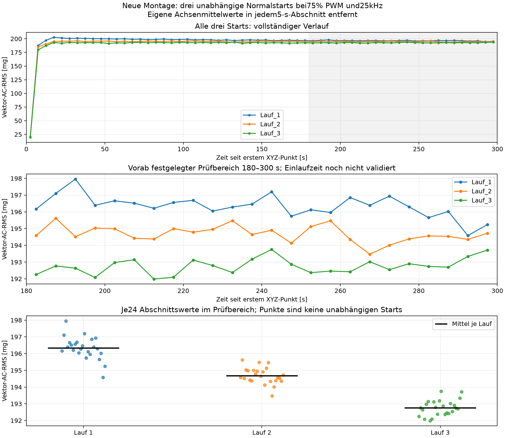

# Drei unabhängige Normalstarts mit neuer Montage

Die Messkette ist für weitere Normalversuche technisch brauchbar. Im Prüfbereich 180–300 s ist die Streuung innerhalb jedes Laufs klein; das mittlere Niveau sinkt jedoch von Start zu Start. Deshalb sind weitere Normaldaten nötig, bevor kontrollierte Anomalien durchgeführt oder Modelle kalibriert werden. Die Planung eines Anomalieprotokolls ist bereits möglich. Eine allgemein gültige Einlaufzeit von 180 s ist nicht nachgewiesen.

## Festgelegter Ablauf und Randbedingungen

Unveränderte Montage: ADXL345 mit zwei Schrauben am äußeren, feststehenden Lüfterrahmen, Platine schräg. Aufbaukennung: `adxl345_mount_v2_provisional_20260911_072748`. Die vorhandene vollständige Sicherheitsbestätigung gilt für diesen unveränderten Aufbau. Externe 12-V-Versorgung angeschlossen. Alle drei Starts erfolgten nach einer eigenen Sichtbestätigung des vollständigen Stillstands und einer angeforderten Auszeit von 60 s ab protokollierter Annahme dieser Bestätigung. Danach 75 % bei 25 kHz und jeweils 300 s Aufnahme ohne absichtliche Einlaufpause. Nach jedem Lauf Rückstellung auf 0 %, Rücklesung und zehn Sekunden Auslaufzeit. Keine Antwortfristen oder automatischen Ersatzstarts.

ADXL345: nominell 200 Hz, ±2 g, Full Resolution, FIFO Stream, I²C-Konfiguration 100 kHz. Die Registerkonfiguration wurde je Lauf gespeichert und auf Gleichheit geprüft. Steuerung: BCM-GPIO18, physischer Pin 12, Hardware-PWM PWM0_CHAN2/a3, Periode 40.000 ns, Tastdauer 30.000 ns bei 75 %. Sensor und Steuerung wurden exklusiv verwendet. Eine Stellvorgabe und ihre Rücklesung sind keine Drehzahlmessung.

Primärer, vorab festgelegter Prüfbereich: 180–300 s seit dem ersten tatsächlichen XYZ-Punkt. Darin je 24 nicht überlappende 5-s-Abschnitte. Zusätzlich wird der gesamte 300-s-Verlauf dargestellt. In jedem Abschnitt werden alle drei Achsenmittelwerte separat entfernt: Vektor-AC-RMS=sqrt(mean(sum((XYZ−Abschnitts-Achsenmittelwerte)²))). 180 s ist eine zu prüfende Einlaufzeit. 1 mg bezeichnet 0,001 g Beschleunigung.

## Zeitpunkte und Auszeiten

| Lauf | PWM-Befehl, MESZ | Auszeit ab Bestätigung bis Befehlsaufruf [s] | Gesamte Auszeit seit vorherigem 0-%-Befehlsabschluss [s] | Erster XYZ-Punkt nach Befehlsabschluss [ms] |
|---|---|---:|---:|---:|
| Lauf_1 | 10:11:09.486 | 60,018 | 1288,085 | 34,032 |
| Lauf_2 | 10:18:40.101 | 60,017 | 150,220 | 33,409 |
| Lauf_3 | 10:26:01.894 | 60,018 | 141,381 | 33,955 |

Die feste Auszeit nach Bestätigung und die gesamte Auszeit sind unterschiedliche Größen. Die variable Wartezeit auf die Sichtprüfung ist vollständig enthalten. Gleiche thermische Ausgangsbedingungen oder gleiche Rotortemperaturen sind damit nicht nachgewiesen. Zeitversätze werden aus monotonen Hostzeitstempeln berechnet; elektrische Signalflanken und Rotorstart wurden nicht gemessen.

## Datenqualität und Zeitbasis

| Lauf | XYZ-Punkte | Einzelne Achsenwerte | Beobachtet [XYZ/s] | Spanne erster–letzter XYZ-Punkt [s] | Host-Abstand P99 / Maximum [ms] | Gap / Overrun / Sättigung |
|---|---:|---:|---:|---:|---:|---|
| Lauf_1 | 62124 | 186372 | 207,08128 | 299,993322 | 5,697 / 9,172 | 0 / 0 / 0 |
| Lauf_2 | 62128 | 186384 | 207,09686 | 299,990068 | 5,691 / 11,974 | 0 / 0 / 0 |
| Lauf_3 | 62130 | 186390 | 207,10182 | 299,992539 | 5,689 / 8,540 | 0 / 0 / 0 |

Der Durchsatz ist (N−1)/(letzter−erster Hostzeitpunkt). Eine Zeile enthält ein vollständiges XYZ-Tupel, also drei einzelne Achsenwerte. Die nominelle ODR bleibt 200 Hz; `sensor_time_estimate_s = sample_index/200` ist keine unabhängige Messuhr. Die Ursache einer Abweichung des beobachteten Durchsatzes von der nominellen Einstellung kann aus den Hostzeitstempeln allein nicht abschließend bestimmt werden.

Die Auswertung prüft CSV-Hashes, Zählwerte, endliche XYZ-Werte, streng monotone Zeitstempel, fortlaufende Softwareindizes, Zeitspalten und Qualitätsflags. Daten werden weder interpoliert noch stillschweigend ausgeschlossen. Ungesetzte Flags und fortlaufende Indizes beweisen keine exakt verlustfreie interne Sensorabtastung. Host-Leseabstände und Dauer des erfolgreichen Registerlesevorgangs sind getrennte Größen; vollständige Quantile und auffällige Intervalle stehen in `report.json`.

## Schwankungen im Prüfbereich 180–300 s

| Lauf | Mittel der 24 Abschnittswerte [mg] | Streuung innerhalb des Laufs [mg] | CV [%] | Minimum–Maximum [mg] | Änderung Minute 5 gegenüber Minute 4 [%] |
|---|---:|---:|---:|---:|---:|
| Lauf_1 | 196,335 | 0,659 | 0,336 | 194,581–197,957 | -0,256 |
| Lauf_2 | 194,683 | 0,480 | 0,247 | 193,470–195,619 | -0,187 |
| Lauf_3 | 192,759 | 0,464 | 0,240 | 191,982–193,753 | 0,149 |

Die drei Laufmittel reichen von 192,759 bis 196,335 mg. Ihre Spannweite beträgt 3,577 mg beziehungsweise 1,838 % des gemeinsamen Mittels. Die Stichprobenstandardabweichung der drei Laufmittel beträgt 1,790 mg (ddof=1). Die Streuungen innerhalb eines Laufs verwenden hingegen ddof=0.

Die 24 benachbarten Abschnitte eines Laufs sind keine 24 unabhängigen Starts. Der Vergleich beruht auf drei Neustarts und erlaubt eine deskriptive Pilotbewertung. Es wurden weder nachträgliche Bestehensschwellen noch Signifikanztests verwendet.

## Bewertung und nächster Schritt

Die Standardabweichungen der 24 Abschnittswerte betragen 0,659, 0,480 und 0,464 mg; die Laufmittel 196,335, 194,683 und 192,759 mg. Die Spannweite der Laufmittel beträgt 3,577 mg (1,838 % des gemeinsamen Mittels), ihre Stichprobenstandardabweichung 1,790 mg. Diese Unterschiede sind größer als die Streuung innerhalb der Läufe. Die beobachteten Abschnittsbereiche von Lauf 1 und 3 überlappen nicht; benachbarte Läufe überlappen nur teilweise. Minute 5 liegt gegenüber Minute 4 um −0,256 %, −0,187 % beziehungsweise +0,149 % verändert. Die geringe spätere Schwankung innerhalb eines Laufs reicht somit nicht als Beleg eines identischen Normalniveaus nach 180 s. Es gab keinen vorab festgelegten Grenzwert, anhand dessen diese Abweichung als bestanden oder durchgefallen bezeichnet werden könnte.

Die kontrollierten Auszeiten bis zum nächsten Befehlsaufruf betrugen 60,018, 60,017 und 60,018 s. Einschließlich der vorherigen Wartezeiten betrug die gesamte Auszeit dagegen 1288,085, 150,220 und 141,381 s. Ein Temperatureinfluss oder eine andere zeitliche Änderung ist eine mögliche Erklärung, wurde jedoch nicht gemessen. Auch Lauf 2 und 3 unterscheiden sich trotz ähnlicher Gesamtauszeiten; die Auszeit allein ist daher keine belegte Ursache. Die geordnete Abnahme in drei Läufen ist ein Befund dieser Folge und keine allgemeine Gesetzmäßigkeit.

Als nächsten Messschritt drei weitere unabhängige Normalstarts bei unveränderten 75 % mit jeweils 600 s aufzeichnen. Vorab die Bereiche 180–300 s und 480–600 s festlegen und sowohl ihren Unterschied innerhalb jedes Starts als auch die Unterschiede zwischen Starts untersuchen. Damit lässt sich prüfen, ob nach fünf Minuten noch eine relevante zeitliche Veränderung besteht. Gesamte Auszeiten und Reihenfolge ausdrücklich dokumentieren und bei den Vergleichen berücksichtigen; für gezielte Warm-/Kaltstartvergleiche zunächst ein eigenes Protokoll mit vergleichbaren Ausgangsbedingungen festlegen. Keine bestimmte Temperatur aus einer Wartezeit ableiten. Die Abtastratenabweichung bleibt vor frequenzbezogenen Messfestlegungen unabhängig zu klären.

Kontrollierte Anomalieversuche können wir als Ablauf planen: Normal- und Anomaliebedingungen bei derselben 75-%-Vorgabe, unveränderter Montage, definiertem Aufnahmefenster und getrennten Wiederholungen. Vor ihrer Durchführung zunächst die normale Streuung zwischen Starts und spätere Drift besser erfassen sowie akzeptable Drift- und Qualitätsgrenzen vorab begründen. Noch keine Modelle oder Schwellen festlegen. Die Trennung vom Stillstand wurde hier nicht als Erfolgsnachweis einer Anomalieerkennung verwendet.

## Ablage und Grenzen

Die drei Rohaufnahmen mit individuellen JSON-Metadaten liegen im neuen Datenverzeichnis `../../../data/mount_v2_restarts_20260911_080445/`. `report.json`, `five_second_sections.csv` und `primary_summary.csv` enthalten die Ergebnisse; die Grafik liegt als PNG und PDF vor. Beobachtungen werden getrennt von PWM-Rücklesungen dokumentiert. Frühere Messwerte wurden nicht in die drei Wiederholungen aufgenommen.

Keine Modelle trainiert, keine Anomalien erzeugt und keine Worddatei oder bestehende Messdatei bearbeitet. Die abschließende Steuerungs- und Dateierhaltungsprüfung steht separat in `../final_verification.json`. Eine erfolgreiche Anomalieerkennung ist durch diesen Normalversuch nicht nachgewiesen.

## Ergänzende Qualitätsbefunde und Beobachtungsstatus

Der beobachtete Durchsatz liegt bei 207,081–207,102 XYZ/s, etwa 3,54–3,55 % über den nominellen 200 Hz. Alle drei Aufnahmen besitzen streng monotone Hostzeitstempel und keine gesetzten Gap-, Overrun- oder Sättigungsflags. Ein einziger Host-Abstand über 10 ms wurde gefunden: 11,974 ms in Lauf 2 bei 78,671 s, vor dem primären Prüfbereich. Der FIFO-Füllstand erreichte dort drei Einträge. Das Intervall und alle Werte wurden erhalten; es wurde keine Verlustfreiheit behauptet. Die maximale absolute Achsbeschleunigung lag je Lauf unter 1,346 g.

Der gleichmäßige sichtbare Lauf ohne Berührung oder erkennbare Lockerung wurde für Lauf 1 und 2 nachträglich bestätigt. Die Sichtbeobachtung für Lauf 3 ist beim Erstellen dieses Berichts noch angefragt; sie wird nicht aus den Daten oder der PWM-Vorgabe abgeleitet.

Abschließend wurden 0 % PWM bei 25 kHz eingestellt und nach zehn Sekunden Auslaufzeit zurückgelesen. Die abschließende mechanische Stillstandsbestätigung ist noch angefragt. Die bestätigten Stillstände vor den Starts gelten nicht automatisch als Bestätigung nach Lauf 3.

Die Phase 180–300 s beginnt je Lauf 33–34 ms später als derselbe Zeitbereich ab Abschluss des PWM-Befehls, weil die Abschnitte ausdrücklich am ersten XYZ-Punkt ausgerichtet wurden. Die Zeitversätze werden nicht als gemessene Rotor-Anlaufzeiten interpretiert.
