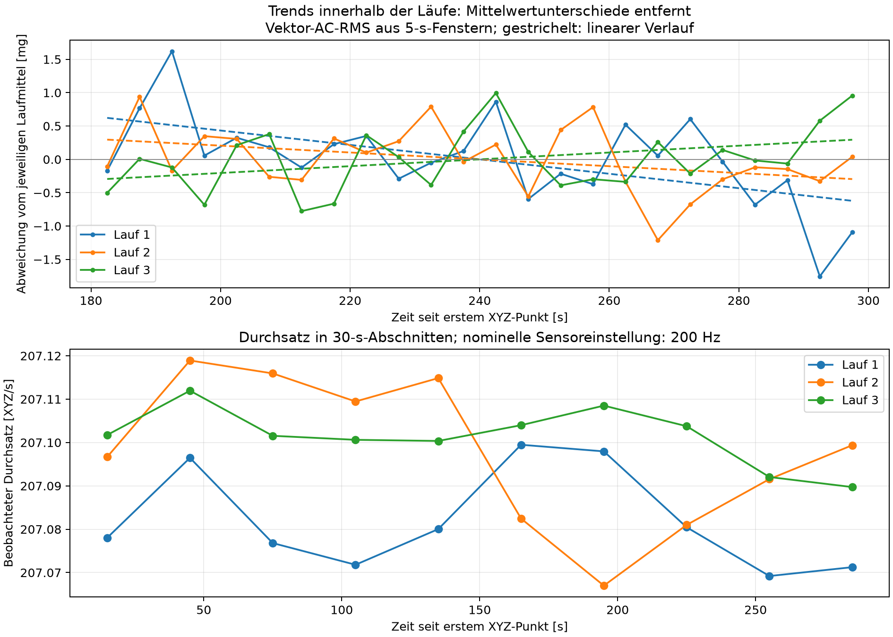

# Erneute Auswertung der drei Normalstarts: Einlaufzeit und Zeitbasis

Stand: 11.09.2026. Ausschließlich Offline-Auswertung vorhandener Dateien. Es wurden keine Sensoraufnahme, kein Lüfterstart, kein Training und keine Anomalie ausgelöst. Dieser Bericht ergänzt die bisherigen Befunde; er verändert weder deren Dateien noch die Worddatei.

## 1. Entscheidung aus den vorhandenen Daten

**180–300 Sekunden können als vorläufiges, einheitliches Auswertefenster für den nächsten kontrollierten Pilotversuch verwendet werden.** In diesem Abschnitt bestehen kleine gerichtete Veränderungen: Lauf 1 und 2 fallen, Lauf 3 steigt. Eine vollständig konstante Kurve ist damit nicht belegt. Ebenso wenig zeigen die drei Läufe einen gemeinsamen fortgesetzten Einlaufeffekt gleicher Richtung. Eine bereits allgemein abgesicherte Einlaufzeit lässt sich aus drei Starts nicht ableiten.

Die verschiedenen Mittelwerte zwischen den Starts sind eine andere Beobachtung als diese zeitlichen Veränderungen innerhalb eines Starts. Nicht überlappende RMS-Bereiche widerlegen für sich genommen keine geeignete Einlaufzeit. Die frühere Empfehlung, allein deshalb drei weitere zehnminütige Normalläufe anzuschließen, ist durch die differenzierte Auswertung nicht erforderlich. Stattdessen soll der nächste Pilot prüfen, ob eine fest definierte, reversible Veränderung gegenüber gleichzeitig erfasster normaler Variabilität unterscheidbar ist. Der [Versuchsplan](versuchsplan.md) beschreibt dafür zunächst die Folge N–A–N.

Die beobachteten etwa 207 XYZ/s sind aus Rohzeitstempeln reproduzierbar. Die Software konfiguriert nominell 200 Hz und erzeugt keine künstliche 207-Hz-Zeitreihe. Eine Abweichung des internen Sensortakts ist eine durch Herstellerinformationen gestützte Erklärung, aber noch keine unabhängige Kalibrierung dieses Sensors.

## 2. Datenbasis und belegte Randbedingungen

Verwendet wurden ausschließlich die drei vollständigen Aufnahmen aus [mount_v2_restarts_20260911_080445](../mount_v2_restarts_20260911_080445/). Die Rohdateien und ihre Sidecars sind in [review.json](review.json) mit SHA256 referenziert. Alle dort gespeicherten Quellcodehashes stimmen mit dem gegenwärtigen Quellcode überein. Ältere Aufnahmen anderer Montageversionen wurden nicht zusammengeführt.

Aufbauversion: `adxl345_mount_v2_provisional_20260911_072748`. Der ADXL345 ist mit zwei Schrauben am äußeren, feststehenden Lüfterrahmen befestigt; die Platine sitzt schräg. Diese Angaben gelten als geklärt. Ein numerischer Winkel, eine dokumentierte Lüfterunterlage und Temperaturmesswerte liegen für diese drei Läufe nicht vor. Daraus wird kein Bedarf abgeleitet, den Aufbau neu herzustellen.

| Lauf | Stellbefehl, Ortszeit Europe/Berlin | XYZ-Punkte | Erste XYZ-Lesung nach Befehlsaufruf | Nach Befehlsabschluss |
|---|---|---:|---:|---:|
| 1 | 11.09.2026, 10:11:09,487 | 62.124 | 78,604 ms | 34,032 ms |
| 2 | 11.09.2026, 10:18:40,101 | 62.128 | 81,049 ms | 33,409 ms |
| 3 | 11.09.2026, 10:26:01,895 | 62.130 | 81,652 ms | 33,955 ms |

Alle Aufnahmen dauerten eingestellt 300 s. Die Hardware-PWM wurde pro Lauf einmal auf 75 % bei 25 kHz gesetzt und nach der Aufnahme auf 0 %. GPIO18 bezeichnet BCM18, physischen Pin 12; verwendet wird RP1 PWM0, Kanal 2, Pin-Funktion `a3`. Die Journale belegen Vorgaben und Rücklesungen, keine gemessene elektrische Wellenform oder Drehzahl.

Vor jedem Start bestätigte der Nutzer vollständigen Stillstand und unveränderten Aufbau. Die zusätzliche Wartezeit ab Annahme dieser Bestätigung betrug 60,018 / 60,017 / 60,018 s. Die **gesamten** Auszeiten seit der vorausgegangenen Nullvorgabe waren dagegen 1.288,085 / 150,220 / 141,381 s. Gleiche Zusatzwartezeit ist deshalb kein Nachweis gleicher thermischer Anfangszustände. Die tatsächlichen mechanischen Stoppzeitpunkte wurden nicht gemessen.

Für Lauf 1 und 2 liegen nachträgliche Bestätigungen des sichtbaren gleichmäßigen Laufs vor. Eine entsprechende rückblickende Beobachtung für Lauf 3 wurde nicht separat bestätigt; die letzte einfache Antwort „ja“ wurde nur als abschließende Stillstandsbestätigung dokumentiert. Alle drei sind entsprechend ihrem Versuchsauftrag Normalstarts; die fehlende Beobachtung wird nicht nachträglich ergänzt. Siehe [abschließende Stillstandsbestätigung](../mount_v2_restarts_20260911_080445/final_standstill_confirmation.json).

## 3. Verfahren und Zeitbezug

Die Auswertung wurde mit [review.py](review.py) direkt aus den XYZ-Rohdaten neu berechnet. Für jedes nicht überlappende 5-s-Fenster wird zunächst für jede Achse deren eigener Mittelwert entfernt:

`AC-RMS = sqrt(mean((x − mean(x))² + (y − mean(y))² + (z − mean(z))²))`.

Die Einheit mg bezeichnet hier 0,001 g Beschleunigung, keine Masse. Verwendet wird die unveränderte Softwareskalierung von 0,0039 g/LSB, keine neue Beschleunigungskalibrierung. Die Spalte `signal`, die den Vektorbetrag einschließlich Gleichanteil enthält, wurde nicht als AC-RMS verwendet.

Die Hauptauswertung setzt den ersten XYZ-Hostzeitstempel auf t = 0. Pro Lauf entstehen 60 Abschnitte, davon 24 in [180, 300) s. Mittelwert und Streuung in den folgenden Tabellen beziehen sich auf diese 24 **Fenster-RMS-Werte**; die Streuung ist die beschreibende Standardabweichung mit Divisor 24. Sie ist weder die Rohachsenstreuung noch ein Unsicherheitsintervall für unabhängige Starts.

Als Prüfung der Fenstergrenzen wurden dieselben Berechnungen zusätzlich auf den Aufruf und den Abschluss des PWM-Stellbefehls bezogen. Bezogen auf den Aufruf ergeben sich Steigungen von −0,646 / −0,295 / +0,300 mg/min; die Trendrichtungen bleiben gleich. Die Mittelwerte ändern sich gegenüber dem ersten XYZ-Zeitpunkt um weniger als 0,008 mg. Der dokumentierte Startversatz erklärt die Schlussfolgerung somit nicht. Details: [Software- und Zeitbasisaudit](software_timebase_audit.json), reproduziert durch [audit_offline.py](audit_offline.py).

## 4. Veränderungen innerhalb von 180–300 Sekunden

| Lauf | Mittelwert [mg] | Streuung [mg] | Lineare Steigung [mg/min] | Angepasste Änderung über 120 s [mg] | Relativ zum Laufmittel |
|---|---:|---:|---:|---:|---:|
| 1 | 196,335 | 0,659 | −0,649 | −1,297 | −0,661 % |
| 2 | 194,683 | 0,480 | −0,309 | −0,617 | −0,317 % |
| 3 | 192,759 | 0,464 | +0,307 | +0,614 | +0,318 % |

Die lineare Steigung wurde gegen die Fenstermitten 182,5–297,5 s geschätzt. „Änderung über 120 s“ bedeutet Steigung × 120 s, nicht die Differenz zweier einzelner gemessener Endpunkte. Die linearen Fits erklären rund 32 / 14 / 15 % der Streuung der Fensterwerte. Sie erfassen kleine gerichtete Anteile neben weiteren Schwankungen.

Die Richtung ist nicht nur von einem Extremwert abhängig: Die Mediansteigungen aller Fensterpaare (Theil–Sen) betragen −0,577 / −0,266 / +0,338 mg/min. Beim Weglassen jeweils eines Fensters bleiben sämtliche linearen Steigungen pro Lauf beim selben Vorzeichen. Dies ist eine beschreibende Robustheitsprüfung und kein Konfidenzintervall. Auf p-Werte aus 24 vermeintlich unabhängigen Fenstern wird verzichtet.

| Lauf | 180–210 s [mg] | 210–240 s [mg] | 240–270 s [mg] | 270–300 s [mg] | Letzte 60 s minus erste 60 s [mg] |
|---|---:|---:|---:|---:|---:|
| 1 | 196,798 | 196,375 | 196,378 | 195,790 | −0,503 |
| 2 | 194,858 | 194,871 | 194,573 | 194,428 | −0,364 |
| 3 | 192,641 | 192,590 | 192,815 | 192,989 | +0,287 |

Auch die Mittelwerte der 30-s-Gruppen stützen die jeweilige Richtung. Die Änderungen zwischen den beiden 60-s-Hälften betragen nur −0,256 / −0,187 / +0,149 %. Die einzelnen 5-s-Werte fallen oder steigen keineswegs durchgehend: Alle Läufe enthalten zahlreiche Richtungswechsel.

**Abbildung 1:** Oben ist für die Darstellung zusätzlich der jeweilige Mittelwert der 24 RMS-Werte abgezogen. Dadurch werden Unterschiede zwischen Startmitteln aus der Grafik entfernt und zeitliche Änderungen sichtbar. Diese zusätzliche Zentrierung betrifft nur die Darstellung, nicht die oben berichteten AC-RMS-Werte. Gestrichelt: linearer Fit. Unten: beobachteter Durchsatz in 30-s-Abschnitten mit vergrößerter y-Skala. [PDF zum Export](trends_and_timebase.pdf).

## 5. Unterschiede zwischen den Starts und Bewertung der Einlaufzeit

Die drei Abschnittsmittelwerte unterscheiden sich um maximal **3,577 mg**, entsprechend **1,838 %** des gemeinsamen Mittelwerts. Die Stichprobenstandardabweichung der drei Startmittel beträgt 1,790 mg. Dies ist größer als die Streuung der Fenster innerhalb eines Laufs, muss also bei späteren Normal-/Anomalievergleichen berücksichtigt werden.

Die Startmittel sinken in der zeitlichen Reihenfolge. Mit drei nacheinander durchgeführten Starts lässt sich nicht entscheiden, ob hierfür unterschiedliche Anfangszustände, eine langsam veränderte Umgebung, Betriebswärme oder andere normale Bedingungen verantwortlich waren. Ein Zusammenhang mit Temperatur ist eine Hypothese; Temperatur und tatsächliche Drehzahl wurden nicht gemessen. Die Starts sind getrennte physische Ereignisse, aber keine Garantie statistisch unabhängiger Umweltbedingungen.

Für eine allgemeine Stationaritätsbehauptung reichen diese Daten nicht. Für die Planung eines begrenzten Piloten besteht jedoch kein zwingender Grund, 180 s zu verwerfen: Innerhalb des betrachteten Abschnitts sind die verbleibenden Änderungen klein und ihre Richtungen uneinheitlich. Der Vergleich soll dieselbe Zeitlage bei gleicher PWM verwenden und normale Schwankungen zwischen vollständigen Starts berücksichtigen. Eine für beliebig kleine Anomalieeffekte ausreichende Empfindlichkeit ist damit noch nicht belegt.

## 6. Qualität und nominelle gegenüber beobachteter Abtastrate

Die gespeicherten Konfigurationen sind identisch: ADXL345, I²C-Bus 1, Adresse 0x53, eingestellter I²C-Takt 100 kHz, nominell 200 Hz, ±2 g, Full Resolution, FIFO-Stream. Rückgelesene Register: `BW_RATE=0x0B`, `DATA_FORMAT=0x08`, `INT_ENABLE=0x00`, `FIFO_CTL=0x90`, `POWER_CTL=0x08`.

| Lauf | XYZ-Punkte / einzelne Achsenwerte | Spanne erster–letzter XYZ [s] | Beobachtet [XYZ/s] | Abweichung von 200 Hz | Größter Host-Leseabstand [ms] | FIFO-Maximum | Gap / Overrun / Sättigung |
|---|---:|---:|---:|---:|---:|---:|---|
| 1 | 62.124 / 186.372 | 299,993322 | 207,0813 | +3,5406 % | 9,172 | 2 | 0 / 0 / 0 |
| 2 | 62.128 / 186.384 | 299,990068 | 207,0969 | +3,5484 % | 11,974 | 3 | 0 / 0 / 0 |
| 3 | 62.130 / 186.390 | 299,992539 | 207,1018 | +3,5509 % | 8,540 | 1 | 0 / 0 / 0 |

Der Durchsatz wird als `(N − 1) / (t_letzter − t_erster)` aus ganzzahligen `host_monotonic_ns` neu bestimmt. Eine CSV-Zeile enthält einen vollständigen XYZ-Punkt, also drei Achsenwerte. Es liegt kein Faktor-drei-Zählfehler vor. Eine lineare Anpassung von Sampleindex gegen Hostzeit liefert ebenfalls 207,0824 / 207,0964 / 207,1045 XYZ/s. Die 30-s-Teilraten liegen insgesamt zwischen 207,067 und 207,119 XYZ/s; die Abweichung entsteht daher nicht nur am Aufnahmebeginn.

Die Zeitstempel sind streng zunehmend, die Sampleindices lückenlos, die XYZ-Werte endlich. Der Index wird allerdings von der Software erzeugt und ist kein unabhängiger Zähler im Sensor. Es gibt keine gesetzten Qualitätsflags. Die einzigen mehr als 10 ms auseinanderliegenden Hostlesungen treten einmal in Lauf 2 bei t ≈ 78,67 s auf, vor dem untersuchten späten Abschnitt. Der FIFO-Füllstand erreicht dort höchstens drei Punkte. Ein Hostabstand von mehr als einer nominellen Periode beweist bei gepufferter Erfassung keinen Datenverlust.

Die mittleren Hostabstände betragen etwa 4,829 ms, ihre Mediane dagegen 5,570–5,586 ms. Polling, I²C-Transaktionen und das Nachholen gepufferter Werte erklären ungleichmäßige Abstände. Der Kehrwert des Medians ist deshalb kein geeigneter Gesamtdurchsatz. Die längsten protokollierten Lesevorgänge betragen 5,669 / 11,817 / 7,585 ms. Die größten absoluten Achsenwerte sind 1,3455 / 1,3221 / 1,3065 g; Sättigung wurde nicht angezeigt.

Die implementierte Gap-Regel markiert Overrun oder einen Hostabstand größer als 32/200 s = 160 ms. Die Nullzahl der Flags bedeutet daher **keinen nachgewiesenen Verlust von exakt null Sensorwerten**. Eine exakte Zahl verlorener Messungen ist nicht verfügbar. Für die hier verwendeten 5-s-Energiekennwerte zeigen die vorhandenen Prüfungen dennoch keine Auffälligkeit, die einen der Läufe auszuschließen rechtfertigt.

### 6.1 Gesicherte Softwarebefunde

| Befund | Beleg und Bedeutung |
|---|---|
| Nominelle ODR ist 200 Hz | [adxl345.py](../../src/adxl345.py), `ODR_CODES` und `configure_sensor`; gespeicherte Registerrücklesung aller Läufe stimmt überein. |
| Pro erfolgreichem FIFO-Lesen entsteht ein XYZ-Punkt | `read_fresh_sample` prüft FIFO_STATUS > 0; `_read_raw` liest sechs Bytes und entpackt drei vorzeichenbehaftete 16-Bit-Werte. `record` schreibt genau eine Zeile. |
| Keine zusätzliche 200- oder 207-Hz-Softwaretaktung | [collect_real_data.py](../../src/collect_real_data.py), `record`: liest verfügbare FIFO-Punkte bis zum Ablauf der Hostdauer; keine Interpolation, Wiederholungsschleife für Achsen oder Resampling. Bei leerem FIFO wartet der Treiber höchstens 1 ms. |
| Bibliotheksaufruf passt zum Sechs-Byte-Burst | Die installierte smbus2-Implementierung verwendet `I2C_SMBUS_I2C_BLOCK_DATA` und gibt genau die angeforderte Datenlänge zurück; Quelltext im [Audit](software_timebase_audit.json). Ein SMBus-Längenbyte wird nicht als Achsenwert ausgegeben. |
| Vorlauf-FIFO wird geleert | `reset_fifo` schaltet vor der Aufnahme über Standby/Bypass zurück in den Stream-Modus und setzt den Softwareindex zurück. Selbst 32 mitgebrachte Punkte könnten über 300 s nur rund 0,107 XYZ/s zusätzlich erklären, nicht die beobachteten rund 7,1 XYZ/s. |
| Nominale Sensorzeit ist konstruiert | `sensor_time_estimate_s = sample_index / 200` ergibt rund 310,62–310,65 s statt der beobachteten rund 300 s. Sie ist keine gemessene Zeitbasis und kein Gegenbeleg gegen die Hostzeitstempel. |
| Hostzeit ist intern konsistent | Relative Zeitspalte, ganzzahlige Nanosekunden, Endpunktrate und Index-Zeit-Fit stimmen überein. UTC-Journaldauern von 300,248–300,259 s sind einschließlich Verwaltungsaufwand plausibel; UTC ist aber keine unabhängig kalibrierte zweite Uhr. |

Nur 3 / 1 / 1 unmittelbar aufeinanderfolgende XYZ-Tupel sind exakt gleich. Das passt nicht zur einfachen Erklärung, rund 3,5 % der Zeilen seien identische Wiederholungen. Es ist aber kein vollständiger elektrischer Nachweis fehlerfreier FIFO-Kommunikation.

### 6.2 Herstellerabgleich und offene Ursachen

Das Datenblatt ordnet Ratecode 0x0B nominell 200 Hz und 100 Hz Bandbreite zu. Für I²C mit 100 kHz wird maximal nominell 200 Hz empfohlen. Der FIFO fasst 32 XYZ-Sätze; ein vollständiger Sechs-Byte-Burst liest einen Satz. Diese Angaben beschreiben Konfiguration und Zugriff, keine Kalibrierung unseres Takts. [Analog Devices, ADXL345 Rev. G, S. 13–14, 17 und 21](https://www.analog.com/media/en/technical-documentation/data-sheets/adxl345.pdf).

Eine verifizierte Antwort eines ADI-Mitarbeiters nennt den internen RC-Oszillator und Bauteilabweichungen bis 10 % als Erklärung für eine vergleichbare ODR-Abweichung. **Daraus folgt als begründete Vermutung**, dass die hier beobachteten +3,54 bis +3,55 % vom Sensortakt stammen können. Die Supportantwort ist keine zusätzliche garantierte Datenblattspezifikation und kein Nachweis des konkreten Exemplars. Verwendet wurde die originale Mitarbeiterantwort, nicht die automatisch erzeugte Zusammenfassung der Webseite. [Analog Devices EngineerZone, Venkat, 05.06.2015](https://ez.analog.com/mems/f/q-a/86236/adxl345-tolerance).

Offen bleiben die unabhängig gemessene Sensor-Ausgaberate, die absolute Genauigkeit der Hostuhr und ein elektrischer Mitschnitt des FIFO-Zugriffs. Der aktuell gelesene Host verwendet `CLOCK_MONOTONIC` mit `arch_sys_counter`; die angegebene Nanosekundenauflösung ist kein Genauigkeitsnachweis. Temperaturabhängigkeit und Bauteilherkunft wurden hier nicht geprüft. Ein allgemeiner Softwarefehler ist mit Quellcodeprüfung allein nicht logisch ausgeschlossen; für einen konkreten Zähl- oder Zeitrechenfehler wurde jedoch kein Befund gefunden.

Ein Dokumentationsfehler im Treiber ist getrennt festzuhalten: Der Kommentar bei `read_fresh_sample` beschreibt das Löschen von Overrun durch INT_SOURCE-Lesen ungenau. Laut Registerbeschreibung werden DATA_READY, Watermark und Overrun beim Lesen der Datenregister gelöscht. Der Code liest den Interruptstatus tatsächlich vor dem Datenburst; aus der falschen Kommentarformulierung folgt deshalb kein nachgewiesener Funktionsfehler. Der Quellcode blieb unverändert. [ADXL345 Rev. G, S. 27](https://www.analog.com/media/en/technical-documentation/data-sheets/adxl345.pdf).

### 6.3 Konsequenz für folgende Auswertungen

5-s-Fenster sind über die gemessene Hostzeit zu begrenzen, nicht pauschal über 1.000 Zeilen. Für eine vorläufige Frequenzachse ist die beobachtete mittlere Rate pro Aufnahme transparenter als blind angenommene 200 Hz; sie ersetzt keinen Sensortakt- oder Aliasnachweis. Unregelmäßige Hostlesungen sind nicht automatisch unregelmäßige Sensorwandlungen. Rohdaten sollen erhalten bleiben; eine Neuabtastung oder Änderung der ODR ist aus dieser Prüfung nicht veranlasst.

Falls genaue absolute Frequenzen entscheidend werden, genügt als erster gezielter Diagnoseversuch ein **30–60-s-Mitschnitt bei 0 % PWM mit unabhängiger Zeitreferenz**, etwa ein geeigneter Logikanalysator für die I²C-Bursts. Erfolgreiche vollständige FIFO-Lesungen werden gegen dessen Zeitbasis und die Host-CSV verglichen. Eine DATA_READY-Messung wäre eine zusätzliche Option nach gesonderter Pin-/Interruptplanung; einfaches Flankenzählen bei dauerhaft gesetzter Leitung wäre unzureichend. Dieser Versuch wurde nicht ausgeführt und erfordert kein neues fünf- oder zehnminütiges Normalprogramm.

## 7. Kleinster nächster Versuch und Erhaltungsnachweis

Die offene nächste Sachfrage lautet: **Erzeugt die definierte äußere Luftstromveränderung bei gleicher PWM einen reproduzierbaren Zustandsunterschied, der sich von der normalen Variation zwischen Starts unterscheiden lässt und nach Rückkehr zu N verschwindet?** Dafür ist zunächst N–A–N mit drei vollständigen 300-s-Aufnahmen geeignet. Die beiden neuen Normalaufnahmen dienen dem zeitnahen Vorher-/Nachhervergleich; weitere reine Normalstarts sind nicht zur Erzwingung einer flachen RMS-Kurve erforderlich.

Nur falls die kleine Restdrift für einen tatsächlich beobachteten Anomalieeffekt entscheidend wird, ist zusätzlich die Frage nach dem Verlauf **nach** 300 s relevant. Der kleinste erste Prüfversuch wäre dann ein einzelner 600-s-Normalstart mit derselben Montage und Zeitfensteranalyse. Auch dieser könnte keine allgemeine Reproduzierbarkeit beweisen. Eine solche Aufnahme ist derzeit weder gestartet noch pauschal empfohlen.

Der [Versuchsplan](versuchsplan.md) hält Geometrie, Wiederholungen, Labels und die Trennung vollständiger unabhängiger Aufnahmen fest. Rohwerte und Grafiken dieser Auswertung liegen ausschließlich im neuen Verzeichnis. [baseline.json](baseline.json) enthält die vor Beginn gesicherten Dateihashes; [verification.json](verification.json) dokumentiert die abschließende Prüfung und die ausschließlich gelesene PWM-Konfiguration.
