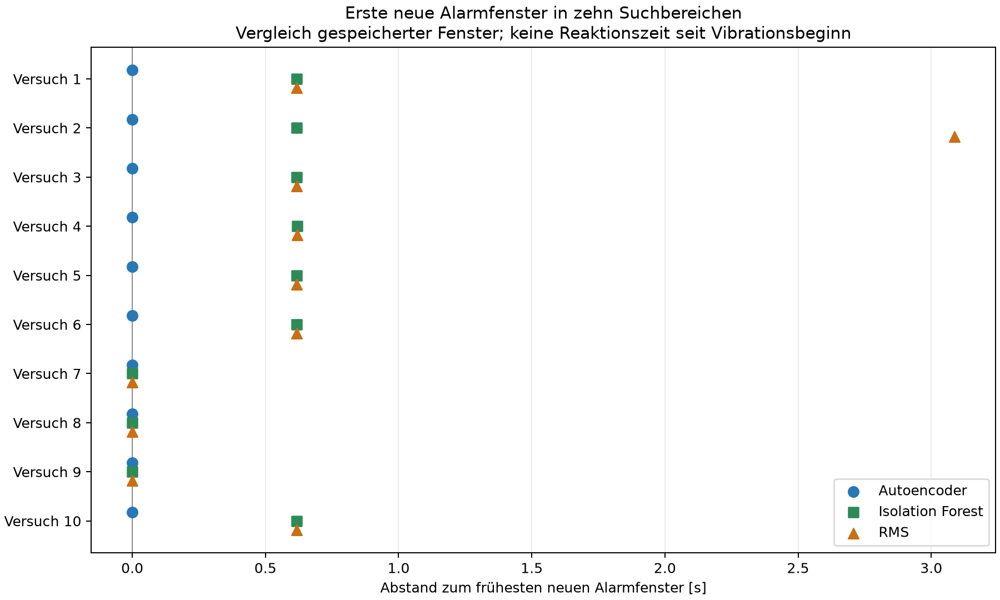

# Zehn Smartphoneversuche bei 75 % PWM und 25 kHz

Die Serie wurde mit dem Google Pixel 9a am unveränderten Aufbau als eine durchgehende Aufnahme durchgeführt. Das bestehende Profil `standlauf_pwm75_200hz`, die Modelle, Standardisierung, 128/128-Fenster und Schwellen blieben unverändert. Der Betriebspunkt wurde vor Aufnahme und Einlaufzeit gesetzt, rückgelesen und gespeichert. Alle 224 erfolgreichen Kontrollrücklesungen bestätigten 75 % bei 25 kHz; nach Aufnahmestart gab es keinen Stellbefehl. Dies belegt die PWM-Konfiguration, keine gemessene Drehzahl oder elektrische Wellenform.

Nach 30 s Einlauf wurden 48.040 s Normalvorlauf erfasst. Zwischen den Rückmeldungen und der nächsten Aufforderung lagen jeweils mindestens 44.145 s. Der kontrollierte Stopp erfolgte nach 30.134 s gespeichertem Nachlauf. Gesichert wurden 231.149 Samples über 1114.808 s. Alle zehn Versuche sind enthalten.

## Ergebnisse

Alle drei Verfahren lieferten in jedem der zehn Suchbereiche ein neues, eindeutig einem gespeicherten Fenster zugeordnetes Alarmfenster. In allen 30 Kombinationen aus Versuch und Verfahren war das unmittelbar vorhergehende Fenster gültig und NORMAL; der erste Alarm war damit kein bereits bestehender Alarm. Es gab keine fehlenden ersten Alarme und keine alarmierenden Randfenster.

Der Autoencoder hatte in 7/10 Versuchen allein das früheste neue Alarmfenster (Versuch 1 bis 6 und Versuch 10). In Versuch 7 bis 9 bestand Gleichstand aller drei Verfahren (3/10). Isolation Forest und RMS waren in keinem Versuch allein zuerst. Diese Beobachtung betrifft die wiederholte Untersuchung an diesem Aufbau und belegt keine allgemeine Überlegenheit.

| Versuch | AE: Fenster | IF: Fenster | RMS: Fenster | IF nach frühestem Fenster [s] | RMS nach frühestem Fenster [s] |
|---|---:|---:|---:|---:|---:|
| Versuch 1 | 249 | 250 | 250 | 0.617095 | 0.617095 |
| Versuch 2 | 439 | 440 | 444 | 0.618011 | 3.088023 |
| Versuch 3 | 574 | 575 | 575 | 0.617499 | 0.617499 |
| Versuch 4 | 701 | 702 | 702 | 0.619149 | 0.619149 |
| Versuch 5 | 874 | 875 | 875 | 0.618251 | 0.618251 |
| Versuch 6 | 1044 | 1045 | 1045 | 0.618193 | 0.618193 |
| Versuch 7 | 1186 | 1186 | 1186 | 0.000000 | 0.000000 |
| Versuch 8 | 1366 | 1366 | 1366 | 0.000000 | 0.000000 |
| Versuch 9 | 1526 | 1526 | 1526 | 0.000000 | 0.000000 |
| Versuch 10 | 1724 | 1725 | 1725 | 0.617252 | 0.617252 |



Die Abstände wurden aus den Aufnahmezeitstempeln der Fensterenden berechnet. Die Marker begrenzen Suchbereiche und sind keine gemessenen Vibrationsgrenzen. Die Suchbereiche dauern etwa 33 bis 123 s und enthalten auch Wartezeit bis zum Anruf bzw. zur Rückmeldung; diese Zeiten sind keine Anruf- oder Vibrationsdauern. Eine feste Dauer wurde nicht eingesetzt. Es wurden keine zusätzlichen Vibrationslabels aus den Ergebnissen einer Methode erzeugt.

## Normalbetrieb und Datenqualität

In 490,323 s dokumentierten Normalphasen nach der Einlaufzeit lagen pro Verfahren 783 gültige, vollständig enthaltene Fenster vor. Alle Verfahren hatten darin 0 Alarmfenster (0/783; 0 %). Dies ist der beobachtete Alarmfensteranteil in dieser Serie, keine allgemeine Fehlalarmrate. Fenster an Phasengrenzen werden separat ausgewiesen; sie enthalten hier ebenfalls keine Alarme.

Ein Sample trägt gleichzeitig ein Lücken- und FIFO-Überlaufflag: Sample 97.219 in Fenster 760, bei 469,015 s relativer Aufnahmezeit. Das gesamte betroffene Fenster liegt in der Ruhephase zwischen Versuch 4 und 5. Zusätzlich bleibt das unvollständige Schlussfenster mit 109 Samples gespeichert. Beide Fenstergruppen erscheinen für alle Verfahren als INVALID und zählen nicht zum Nenner gültiger Fenster. Es gab keine Sättigungen und keine verworfenen Queuefenster. Die exakte Zahl möglicherweise beim FIFO-Überlauf verlorener Sensorsamples ist unbekannt. Insgesamt sind 1.806 Fenstergruppen mit jeweils drei Ergebniszeilen gespeichert; 1.804 Gruppen sind gültig.

## Separate Verarbeitungszeit auf dem Raspberry Pi

Der Benchmark wurde nach dem Aufnahmestopp auf dem Raspberry Pi 5 ausgeführt. Jedes Verfahren erhielt dieselben 1.804 gültigen gespeicherten Fenster in sechs Runden (10.824 Messungen je Verfahren). Alle sechs Methodenreihenfolgen wurden verwendet; je Methode und Runde gingen 20 ungemessene Aufwärmberechnungen voraus. Gemessen wurde vom unskalierten Fenster im RAM über die vorhandene Standardisierung bis Score und Schwellenentscheidung. Dateizugriff, Modellladen und Plotten liegen außerhalb der Messung. Die konfigurierte Threadzahl war 1. Die protokollierte Temperatur vor den Runden lag zwischen 56,2 und 59,5 °C. Der reguläre Betriebssystem- und Desktopbetrieb blieb bestehen; die Messung beansprucht keine vollständig isolierte Rechnerlast.

| Verfahren | Median [ms] | P95 [ms] | Gemessene Fenster |
|---|---:|---:|---:|
| Autoencoder | 0.057537 | 0.062148 | 10824 |
| Isolation Forest | 12.970697 | 14.523543 | 10824 |
| RMS | 0.032500 | 0.035463 | 10824 |

Diese Werte beschreiben Rechenzeit. Während der Aufnahme wurde keine Live-Inferenz ausgeführt; es gibt daher keine gemessenen Live-Ausgabezeitpunkte und keine nachträglich bestimmbare Live-Reaktionszeit.

## Dateien und Reproduktion

- [Vergleich pro Versuch](../trial_comparison.csv)
- [Score, Schwelle und Entscheidung je Fenster und Verfahren](../window_results.csv)
- [Normalphasen einschließlich Nenner und Beobachtungsdauer](../normal_phases.csv)
- [Rohwerte des separaten Benchmarks](../processing_benchmark.csv)
- [Vollständige Rohaufnahme](../source/raw.csv)
- [Marker](../source/cues.jsonl) und [Versuchskonfiguration](../source/config.json)
- [Technischer Audit einschließlich Hashprüfungen](technical_audit.json)
- [Vorab festgelegte Auswertungsregeln](../source/analysis_rules.json)

Abbildungen mit XYZ, Scores relativ zur Schwelle und ersten Alarmfenstern:

- [Versuch 1](../figures/versuch_01.png)
- [Versuch 2](../figures/versuch_02.png)
- [Versuch 3](../figures/versuch_03.png)
- [Versuch 4](../figures/versuch_04.png)
- [Versuch 5](../figures/versuch_05.png)
- [Versuch 6](../figures/versuch_06.png)
- [Versuch 7](../figures/versuch_07.png)
- [Versuch 8](../figures/versuch_08.png)
- [Versuch 9](../figures/versuch_09.png)
- [Versuch 10](../figures/versuch_10.png)

[Gesamte XYZ-Serie](../figures/serie_xyz.png) · [Übersichtsdiagramm als PDF](erste_alarmfenster.pdf)

Reproduktion in einem neuen Ergebnisordner (der Benchmark misst dabei neue Laufzeiten):

```bash
/home/malik/masterarbeit-edge-ai/.venv/bin/python /home/malik/masterarbeit-edge-ai/results/phone_series_comparison_20260920_1611/analyze_phone_series.py --run /home/malik/masterarbeit-edge-ai/results/phone_series_comparison_20260920_1611/source --output NEUER_ERGEBNISORDNER --runtime litert --threads 1 --benchmark
/home/malik/masterarbeit-edge-ai/.venv/bin/python /home/malik/masterarbeit-edge-ai/results/phone_series_comparison_20260920_1611/report_assets/build_phone_series_overview.py --analysis NEUER_ERGEBNISORDNER --output NEUER_ERGEBNISORDNER/report_assets
```
