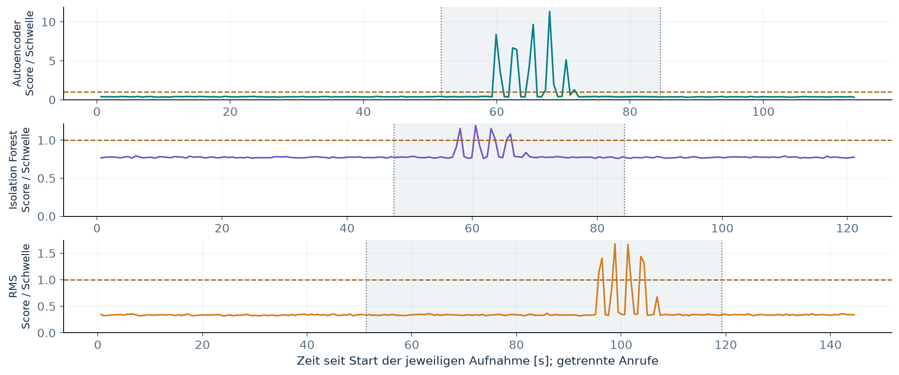
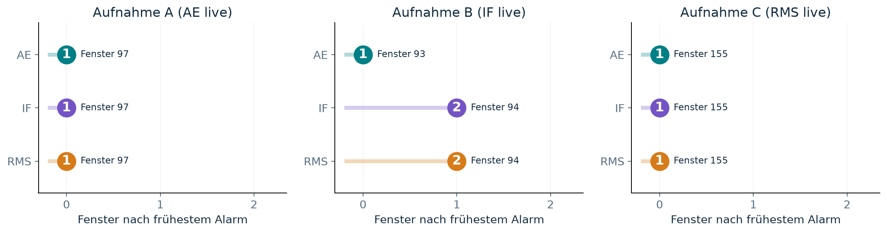
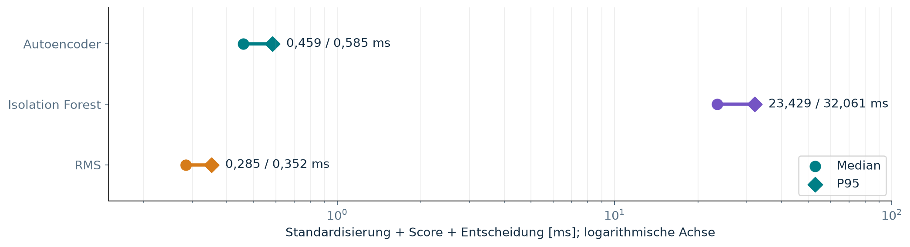
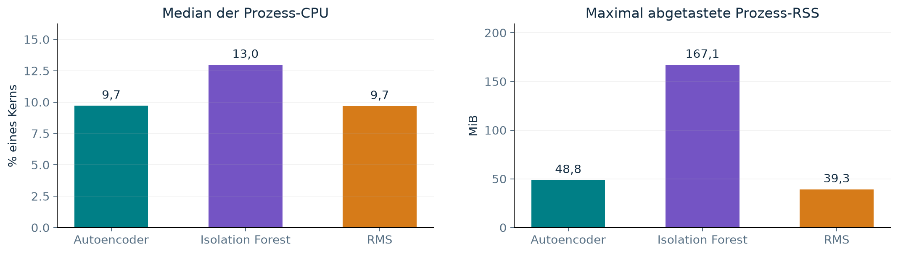

# Handyvibration: Ergebnisse des explorativen Piloten

Datum: 19.09.2026. Raspberry Pi 5, 75 % PWM (keine Drehzahlmessung). Drei ausgewählte Live-Einzelaufnahmen, jeweils eine Methode. Schwellen unverändert, kein verifizierter physischer Vibrationsbeginn. Keine allgemeine Erkennungs- oder Fehlalarmrate.

## Live-Ergebnisse

| Methode | Fenster | Alarmfenster vor / zwischen / nach Chat-Markierungen | Berechnung Median / P95 [ms] | CPU-Median [% eines Kerns] | Max. abgetastete RSS [MiB] |
| --- | ---: | --- | ---: | ---: | ---: |
| Autoencoder | 184 | 0 von 83 / 11 von 52 / 0 von 47 | 0,459 / 0,585 | 9,72 | 48,80 |
| Isolation Forest | 196 | 0 von 76 / 6 von 59 / 0 von 59 | 23,429 / 32,061 | 12,98 | 167,11 |
| RMS | 234 | 0 von 83 / 6 von 109 / 0 von 40 | 0,285 / 0,352 | 9,69 | 39,31 |

Je Lauf überlappen zwei Fenster die Chat-Abschnittsgrenzen und fehlen deshalb nur in den Phasensummen. 614 vollständige Fenster insgesamt, 0 ungültig, 0 verworfen; digitale Lücken-/Überlauf-/Sättigungsflags unauffällig. Unvollständige Schlussfenster bleiben als Rohsamples archiviert. Ein Alarmfenster ist kein unabhängiger Fehlerfall.

## Wer meldet zuerst auf identischen Eingaben?

Offline wurden alle drei Methoden auf jede der drei Rohaufnahmen angewendet. Fenstergrenzen, Modelle und Schwellen bleiben gleich. Kein zusätzlicher Anruf und kein Ressourcenbenchmark.

| Aufnahme | Erstes AE-Alarmfenster | Erstes IF-Alarmfenster | Erstes RMS-Alarmfenster |
| --- | ---: | ---: | ---: |
| A | 97 | 97 | 97 |
| B | 93 | 94 | 94 |
| C | 155 | 155 | 155 |

A und C: Gleichstand. B: Autoencoder ein Fenster früher. Gezählt wird der erste Alarm vollständig zwischen den Chat-Markierungen; in allen neun Replay-Kombinationen keine Alarme davor/danach. Alle 614 ursprünglichen Live-Vorhersagen wurden exakt reproduziert (maximale Score-Abweichung 0). Ein Fenstervorsprung ist keine absolut gemessene Fehler-Erkennungsverzögerung. Nominal: 128/200 = 0,64 s pro Fenster; Host-Zeitstempel sind keine unabhängige Störungsreferenz.

## Ressourcen richtig interpretieren

Berechnungszeit umfasst Standardisierung, Score und Entscheidung. CPU/RAM gelten für den gesamten Prozess inklusive Erfassung und Logging. CPU ist der Median der abgetasteten Intervallwerte, nicht zeitgewichtete oder systemweite Last. RSS ist der während der Aufnahme abgetastete Prozessspeicher, nicht Start-Peak oder isolierter Modellbedarf. Takt schwankte in den drei Läufen zwischen 1,5 und 2,4 GHz. Keine Wiederholungen, kein Energieverbrauch in Watt gemessen.

## Ausgewählte und wiederholte Anläufe

Ausgewählt: AE03, IF02, RMS01. AE01/AE02 und IF01 wurden auf Nutzerwunsch wegen unklarer bzw. zu früher Anrufkoordination wiederholt. Sie bleiben vollständig in sources/trials/ erhalten und werden nicht stillschweigend als störungsfreie Läufe umgedeutet. AE01: 170 Fenster/30 Alarme; AE02: 158/12 plus 1 ungültiges Fenster; IF01: 154/7. Diese Auswahl erlaubt keine allgemeine Aussage zur Fehlalarmrate.

## Wissenschaftliche Grenzen

Chat-Freigabe und Rückmeldung messen nicht den physischen Vibrationsbeginn/-ende. Nur ein ausgewählter Anruf je Methode; keine belastbare Erkennungsquote. Handyposition, Kopplung und Vibrationsmuster sind nicht unabhängig dokumentiert; endgültige Aufbaukalibrierung fehlt. Das eingefrorene Profil trägt measurement_chain_status=unverified_legacy. Tischvibration simuliert eine externe Störung, keinen nachgewiesenen Lüfterdefekt.

## Artefakte

- handyvibration_ergebnisse.pptx und .pdf: zehn Ergebnisfolien.
- speaker_notes.md: Erklärungen und Quellen je Folie.
- assets/: Diagramme als PNG/PDF.
- sources/trials/*/report_screenshot/: drei echte Browser-Screenshots der gespeicherten Berichte, keine Live-GUI.
- sources/: unveränderte Quellenkopien einschließlich Neustarts, Bundle und Replay.
- source_manifest.json und artifact_manifest.json: SHA-256-Nachweise.
- pdf_export.json: dokumentierter Exportweg; PowerPoint-Zeilenumbrüche können abweichen.
