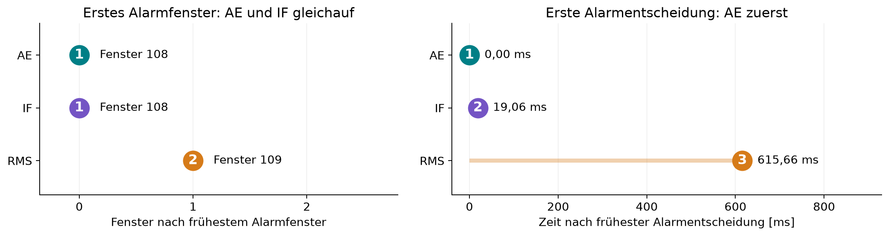
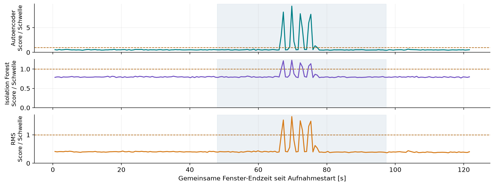
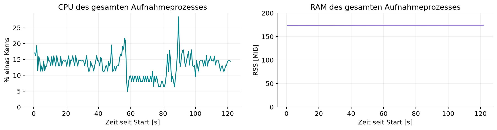

# Gemeinsamer Live-Anruf: Ergebnis

Alle drei Methoden liefen live auf denselben Rohfenstern aus einem Sensorstream. 75 % PWM, eingefrorene Modelle und Schwellen, kein erneutes Training. Ein Anruf, keine unabhängige physische Anfangs-/Endreferenz.

| Methode | Erstes Alarmfenster | Fensterrang | Ausgaberang | Abstand zur frühesten Alarmentscheidung [ms] | Alarmfenster |
| --- | ---: | ---: | ---: | ---: | ---: |
| Autoencoder | 108 | 1 | 1 | 0,000 | 11 |
| Isolation Forest | 108 | 1 | 2 | 19,061 | 7 |
| RMS | 109 | 2 | 3 | 615,659 | 6 |

Autoencoder und Isolation Forest überschreiten die Schwelle im selben Fenster. Der Autoencoder liefert seine Entscheidung rund 19,06 ms früher. RMS überschreitet die Schwelle ein Fenster später und liefert seine erste Alarmentscheidung rund 615,66 ms nach dem Autoencoder. Das sind beobachtete relative Ausgabeabstände dieses gemeinsamen Laufs, keine absolute Fehler-Erkennungsverzögerung ab physischem Vibrationsbeginn. Thread-Scheduling und konkurrierende Berechnung beeinflussen die Ausgabezeiten.

## Gemeinsame Daten und Phasen

197 identische vollständige Fenster, 591 gültige Entscheidungen. 25270 Rohsamples, davon 54 in einem unvollständigen Schlussfenster. Keine verworfenen Fenster, keine gemeldeten Sensorlücken/Überläufe/Sättigungen. Rohwerte, Eingabehashes, Fenstergrenzen und alle Entscheidungen wurden nachgerechnet; maximale Score-Abweichung 0.

Vollständig vor Freigabe: 77 Fenster ohne Alarm bei allen Methoden. Zwischen Freigabe und Rückmeldung: 79 Fenster, davon AE 11 / IF 7 / RMS 6 Alarmfenster. Nach Rückmeldung: 39 Fenster ohne Alarm. Zwei grenzüberlappende Fenster sind in dieser Aufteilung ausgeschlossen, in der Gesamtsumme enthalten und ebenfalls ohne Alarm. Die Chat-Abschnitte sind nicht die physische Vibrationsdauer.

## Einfluss auf den Pi

Prozess-CPU-Median: 13,04 % eines Kerns; maximal abgetastete RSS: 174,42 MiB. Das sind Werte des gesamten gemeinsamen Prozesses einschließlich Sensorerfassung, drei Methoden und Logging; keine getrennte CPU-/RAM-Zuordnung zu den Methoden.

| Methode | Berechnungszeit Median [ms] | P95 [ms] |
| --- | ---: | ---: |
| Autoencoder | 2,040 | 5,571 |
| Isolation Forest | 23,237 | 31,527 |
| RMS | 0,264 | 0,317 |

Berechnungszeiten enthalten Standardisierung und Entscheidung innerhalb des jeweiligen Worker-Threads. Sie entstehen unter Konkurrenz im gemeinsamen Prozess, nicht in einem isolierten Benchmark. Eine Barriere gibt die Worker pro Fenster frei, garantiert aber keinen exakt gleichen CPU-Startzeitpunkt.

## Grenzen und Dokumentation

Ein gemeinsamer Anruf reicht nicht für eine allgemeine Sieger-Rangfolge oder Erkennungsquote. Mehr Alarmfenster bedeuten nicht mehr unabhängig erkannte Fehler. Finale Handyaufstellung und Normalkalibrierung bleiben unbestätigt; externe Tischvibration ist kein belegter Lüfterdefekt. Alle Quellen und Neustarts früherer Einzelversuche bleiben erhalten. Der Screenshot zeigt den tatsächlich im Browser gerenderten gespeicherten Bericht, keine Live-GUI oder Aufbauaufnahme.

[Browser-Screenshot](joint_report_screenshot.png)

Die Präsentation enthält in Teil A (Folien 1–10) die bisherigen Einzelversuche/Replay-Ergebnisse und in Teil B (Folien 11–14) diesen zusätzlichen gemeinsamen Live-Anruf.
