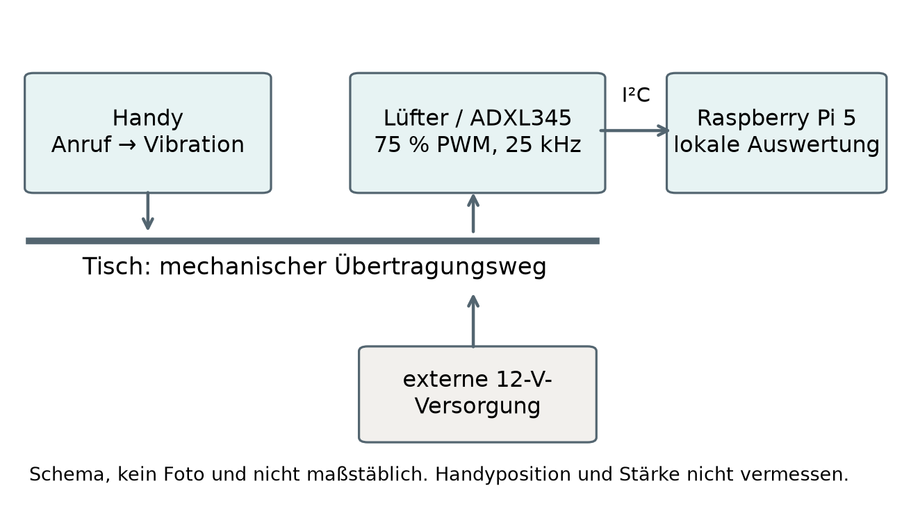
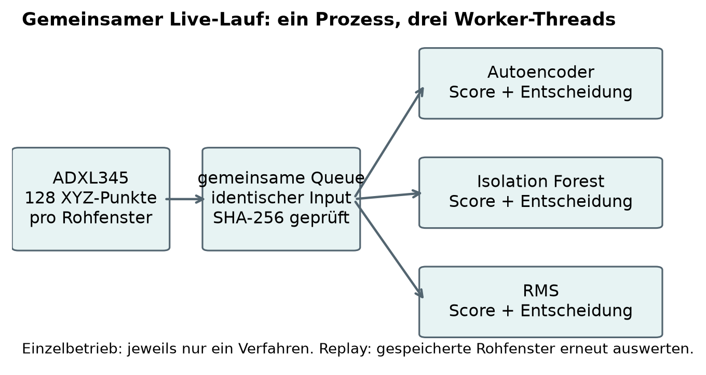
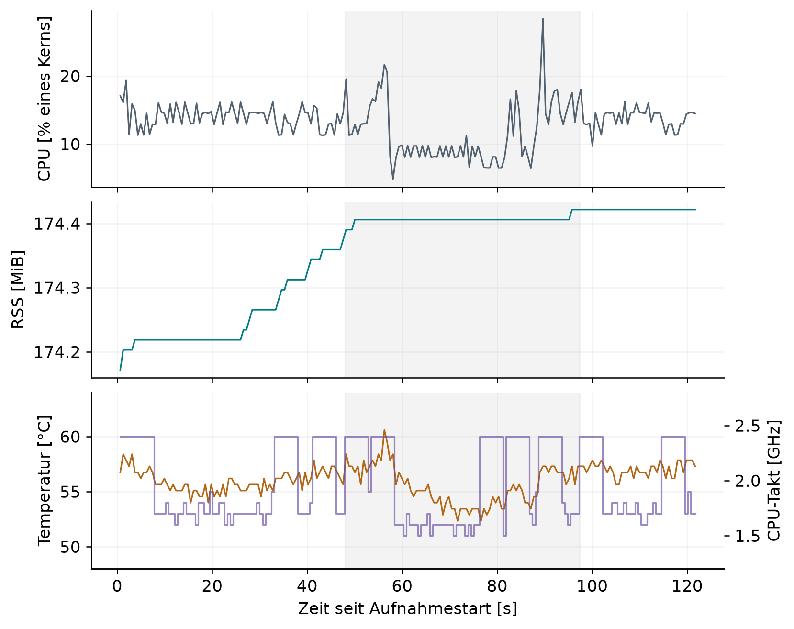

# Implementierung und aktueller Versuchsaufbau

## Ziel und Abgrenzung des Handyversuchs

Der aktuelle Vergleich untersucht, wie RMS, Isolation Forest und Autoencoder auf eine zusätzliche, über den Tisch eingeleitete Vibration reagieren. Die Anregung entsteht durch einen Anruf auf einem auf dem Tisch liegenden Handy. Der Lüfter bleibt am Betriebspunkt 75 % PWM. Eine Platte vor dem Luftauslass gehört nicht zu diesem Versuch. Die Handyvibration ist eine äußere mechanische Anregung und kein nachgewiesener innerer Lüfter- oder Lagerschaden.

Die Hardwareauswahl aus Kapitel 5 bleibt bestehen. Geändert sind die Art der Anregung, das Versuchsprotokoll und der verwendete Software-/Modellstand. Die am 19. September gespeicherten Aufnahmen verwenden das Normalprofil standlauf_pwm75_200hz vom 18. September. Es ist nicht identisch mit dem früheren v4-Paket. Deshalb werden die früheren Erkennungs- und Ressourcenwerte nicht als Messungen des neuen Versuchs ausgegeben. Innerhalb der Handyreihe bleiben Modellartefakte, Scaler und Schwellen unverändert.

Die Untersuchung besitzt drei Ebenen: Einzelprozesse zeigen die jeweilige Methode ohne die beiden anderen Auswerter; ein Offline-Replay vergleicht alle Methoden auf denselben gespeicherten Rohfenstern; der gemeinsame Live-Lauf vergleicht zusätzlich die tatsächlichen Ausgabezeitpunkte auf einer gemeinsamen Aufnahme. Nur der letzte Modus verbindet identische aktuelle Sensoreingaben mit gleichzeitig aktiven Auswertern.

## Hardware und mechanischer Übertragungsweg

Der Aufbau besteht aus einem Raspberry Pi 5, einem über I²C angeschlossenen ADXL345 und einem ARCTIC P12 Pro PST mit externer 12-V-Versorgung. Die zuvor beschriebene Befestigung des Sensors am feststehenden Lüfterrahmen bleibt die dokumentierte Hardwaregrundlage. Im aktuellen Profil ist die feste Montage als vom Nutzer bestätigt vermerkt. Eine neue metrische Vermessung der Orientierung oder der mechanischen Übertragungsfunktion liegt nicht vor.

Das Handy regt den Tisch an; die über den Aufbau übertragene Bewegung wird am ADXL345 erfasst. Für einen Vergleich zwischen getrennten Anrufen wären unveränderte Handyposition, Auflage, Vibrationsmuster und Umgebungsbedingungen erforderlich. Diese Gleichheit ist eine Versuchsannahme, keine durch zusätzliche Sensoren bestätigte Tatsache. Das vorbereitete Planungsdokument enthält keine vollständig bestätigte Handybeschreibung oder Geometrie. Das eingefrorene Paket ist deshalb als Entwicklungs-/Pilotstand zu behandeln. Im gemeinsamen Live-Lauf ist die Gleichheit der Eingaben dagegen unmittelbar durch den gemeinsamen Rohdatenstrom und Fensterhashes belegt.

Tabelle 6-1: Hardware und Betriebszustand der Handyreihe

| Bestandteil | Dokumentierter Stand | Grenze des Nachweises |
|---|---|---|
| Zielrechner | Raspberry Pi 5, ARM64, vier logische Kerne | Keine Aussage über andere Rechner |
| Lüfter | ARCTIC P12 Pro PST, externe 12 V | Keine kontinuierliche Spannungs- oder Drehzahlmessung |
| Sensor | ADXL345 am feststehenden Lüfterrahmen | Orientierung und Übertragungsfunktion nicht kalibriert |
| Stellanschluss | BCM-GPIO18, physischer Pin 12; Hardware-PWM | Rücklesung der Einstellung, keine elektrische Signalprüfung |
| Betriebspunkt | 75 % Tastgrad bei 25 kHz | Keine Gleichsetzung mit 75 % Drehzahl |
| Anregung | Handyvibration auf dem Tisch durch Anruf | Beginn, Ende und Amplitude nicht unabhängig gemessen |
| Vergleichseinheit | 128 aufeinanderfolgende XYZ-Punkte | Fenster sind innerhalb eines Ereignisses zeitlich abhängig |

## PWM, Sensor und Zeitbasis

Die protokollierte Hardware-PWM besitzt eine Periode von 40.000 ns, eine Einschaltdauer von 30.000 ns und enable = 1; daraus folgen 25 kHz und 75 % Tastgrad. Diese Einstellung wird vor den Aufnahmen zurückgelesen. Die Erkennung steuert den Lüfter nicht. Das Ende der Handyaufzeichnung ist daher nicht mit einem automatisch ausgeführten 0-%-Befehl gleichzusetzen. Der Betriebspunkt wird in dieser Revision weder geändert noch aus einer Scoreüberschreitung neu berechnet.

Der ADXL345 arbeitet nominell mit 200 Hz, ±2 g, voller Auflösung und FIFO-Stream-Erfassung. Der Umrechnungsfaktor beträgt 0,0039 g pro LSB. I²C-Bus 1 ist mit 100 kHz konfiguriert. Registerrücklesungen und Qualitätsmerkmale sind in run.json und den Rohjournalen enthalten. Ein CSV-Datensatz enthält einen XYZ-Messpunkt, keine drei getrennten Zeitpunkte.

Die monotone Host-Uhr dokumentiert den Abschluss der Messpunktlesung, der Fensterbildung und der Entscheidung. UTC dient der Zuordnung von Bedienereignissen. Nominell dauert ein nicht überlappendes Fenster 128/200 = 0,640 s. Aus den Host-Zeitstempeln ergeben sich in den ausgewählten Aufnahmen rund 207 XYZ-Punkte pro Sekunde beziehungsweise etwa 0,617 s pro Fenster. Diese Beobachtung ist keine unabhängige Messung des internen Sensortakts; die Abweichung bleibt offengelegt. Die Fensterfüllzeit gehört zur praktischen Alarmverzögerung, nicht zur nachfolgend gemessenen reinen Verarbeitung eines bereits vollständigen Fensters.

Bei erkannten Datenlücken, Überläufen oder Sättigung wird ein Fenster nicht stillschweigend als normal gewertet. Unvollständige Reste werden gespeichert, aber nicht durch künstliche Werte zu vollständigen Fenstern ergänzt. Die begrenzte Queue umfasst vier Fenster. Im gemeinsamen Lauf wurde höchstens ein wartendes Fenster protokolliert.

## Vorverarbeitung und Modellstände

Der aktuelle Pfad verarbeitet die Achsen X, Y und Z in fester Reihenfolge als Float32. Er verwendet die auf normalen Trainingsdaten bestimmten Mittelwerte μ und Standardabweichungen σ: z = (x − μ) / σ. Der gleiche Scaler wird für alle drei Methoden eingesetzt. Im aktuellen Handy-Pfad wird vorher kein eigener Mittelwert je Fenster entfernt. Das ist ein wesentlicher Unterschied zum früheren v4-Pfad mit fensterweiser Zentrierung. Die beiden Modellstände dürfen deshalb trotz gleicher Hardware und gleicher Fenstergröße nicht vermischt werden.

Tabelle 6-2: Festgelegte Skalierung des aktuellen Normalprofils, gerundet

| Achse | Trainingsmittelwert μ [g] | Trainingsstandardabweichung σ [g] |
|---|---|---|
| X | −0,624318715 | 0,028777793 |
| Y | −0,710917289 | 0,024151856 |
| Z | 0,096116970 | 0,080470853 |

Der RMS-Score ist die Quadratwurzel des Mittelwerts aller 384 quadrierten standardisierten Werte eines Fensters. Er ist ein dimensionsloser aggregierter Kennwert und nicht der unskalierte Beschleunigungs-RMS in g. Isolation Forest verarbeitet dieselben 384 Werte als abgeflachten Merkmalsvektor. Verwendet werden 200 Bäume, random_state = 42, max_samples = auto, contamination = auto und n_jobs = 1. Der Anomaliescore ist −score_samples; die Entscheidung folgt der separat eingefrorenen P99-Schwelle und nicht unmittelbar der eingebauten predict-Grenze von scikit-learn.

Der Autoencoder rekonstruiert das standardisierte 128 × 3-Fenster. Sein Score ist der mittlere quadratische Rekonstruktionsfehler über alle Zeitpunkte und Achsen. Die Architektur besitzt 507 trainierbare Parameter. Ihre Topologie bleibt gegenüber dem früheren Bericht gleich; gleichbleibende Topologie bedeutet jedoch nicht identische Gewichte oder identische Kalibrierung.

Tabelle 6-3: Architektur des verwendeten Autoencoders

{{ORIGINAL_ARCHITECTURE}}

## Normaltraining, Schwellen und Exportprüfung

Das Profil wurde vor den Handyversuchen aus vier normalen Aufnahmen von jeweils nominell 60 s bei 75 % PWM erstellt. Die ersten drei vollständigen Dateien dienen dem Training, die vierte der Validierung. Es entstehen 291 Trainings- und 97 Validierungsfenster. Der Scaler wird ausschließlich anhand der 37.248 XYZ-Punkte der Trainingsfenster angepasst. Die Aufteilung erfolgt nach vollständigen Aufnahmen; benachbarte Fenster derselben Datei werden nicht zufällig auf Training und Validierung verteilt.

Der Autoencoder wurde mit Batchgröße 32 und maximal 100 Epochen trainiert. Die dokumentierte beste Epoche ist 100; ein früherer Abbruch wurde nicht ausgelöst. Die abschließenden Verluste betragen etwa 0,25145 für Training und 0,27893 für Validierung. Diese Verluste sind Normaldaten-Rekonstruktionsfehler und keine Erkennungsquoten für die spätere Handyvibration.

Für jede Methode wird der Schwellenwert als 99. Perzentil der Scores der separaten normalen Validierungsaufnahme bestimmt. Verwendet wird lineare Quantilinterpolation. Bei 97 sortierten Scores entspricht die Nullbasisposition (97 − 1) · 0,99 = 95,04 einer Interpolation zwischen dem 96. und 97. geordneten Wert. Ein Alarm gilt bei Score > Schwelle. Die gleiche Perzentilregel bedeutet weder gleiche numerische Scorebereiche noch garantiert gleiche Fehlalarmraten auf neuen Daten.

Tabelle 6-4: Eingefrorene Schwellen der Handyreihe

| Methode | Score | Schwelle |
|---|---|---|
| Autoencoder | MSE der standardisierten Rekonstruktion | 0,477202599144 |
| Isolation Forest | −score_samples | 0,483354740160 |
| RMS | RMS der standardisierten Werte | 1,296361072562 |

Die Autoencoder-Schwelle stammt aus der eingefrorenen Keras-Validierung. Der Float32-TFLite-Export wird auf denselben 97 Validierungsfenstern geprüft: Die größte absolute Rekonstruktionsabweichung beträgt 2,623 · 10⁻⁶, die größte MSE-Abweichung 7,192 · 10⁻⁸; keine Entscheidung ändert sich. Ein Validierungsfenster liegt oberhalb der P99-Grenze. Dieser Kalibrierungsbefund ist keine unabhängig gemessene Fehlalarmrate im späteren Betrieb. Modelle und Schwellen werden nach Sichtung der Handyversuche nicht optimiert.

## Einzelbetrieb, Replay und gemeinsame Live-Auswertung

Im Einzelbetrieb läuft jeweils nur eine Methode im Aufnahmeprozess. Erfassung, Qualitätsprüfung, Vorverarbeitung, Entscheidung und Protokollierung gehören dennoch zum Prozess. Vor Beginn werden 20 Aufwärmfenster verarbeitet. Es läuft keine Live-GUI. Die drei ausgewählten Einzelaufnahmen enthalten unterschiedliche physikalische Anregungen; ein identisches Handymodell allein macht verschiedene Anrufe nicht zu identischen Sensoreingaben.

Beim Offline-Replay werden alle drei Methoden auf die gleichen gespeicherten Rohfenster jeder Einzelaufnahme angewendet. Dadurch ist der Eingabevergleich exakt reproduzierbar. Die Reihenfolge der ersten Alarmfenster lässt sich vergleichen, die Replay-Laufzeit ist jedoch keine gemessene Live-Reaktion auf eine neue Handyvibration. Die erneute Auswertung erzeugt keine zusätzlichen unabhängigen physikalischen Ereignisse.

Im gemeinsamen Live-Lauf erfasst ein Sensorpfad die Rohdaten. Jedes vollständige Fenster wird an drei Worker-Threads im selben Prozess übergeben. Ein gemeinsamer Startmechanismus koordiniert die Auswertung; gleiche Startbedingungen garantieren keine identische CPU-Zuteilung. Für jedes Fenster werden Eingabehash, Dispatch-, Worker-Start- und Entscheidungszeit gespeichert. Die feste Reihenfolge der Zeilen im Journal ist nicht das Ergebnisranking. Dieses wird aus den gemessenen Entscheidungszeitpunkten berechnet.

Tabelle 6-5: Zeitbegriffe und zulässige Interpretation

| Größe | Bezugspunkte | Bedeutung |
|---|---|---|
| Verarbeitungszeit | Start bis Ende des jeweiligen Auswerteraufrufs | Vorverarbeitung, Modellbewertung und Score im instrumentierten Aufruf; kein einheitlicher reiner Modellkern |
| Fenster-bis-Entscheidung | Host-Abschluss des letzten Fensterpunkts bis Entscheidung | Einschließlich Übergabe und Scheduling; ohne vorherige Fensterfüllzeit |
| Erstes Alarmfenster | Erster Fensterindex mit Score > Schwelle | Vergleich der Eingabesensitivität bei identischen Fenstern |
| Relative Alarmausgabe | Erste Alarmausgabe einer Methode minus früheste Alarmausgabe | Beobachteter Ausgabevorsprung im selben Live-Lauf |
| Physische Erkennungsverzögerung | Entscheidung minus unabhängig gemessener Vibrationsbeginn | Mit den vorliegenden Bedienmarkern nicht bestimmbar |

## Ablauf, Bedienmarker und Annahmen

Das vorbereitete Vorgehen sieht mindestens 30 s Ruhe vor der Anrufaufforderung und mindestens 15 s Nachlauf nach der gemeldeten Beendigung vor. Der Assistent übernimmt Start, Protokollierung, Auswertung und Diagrammerstellung; die Person am Aufbau löst den Anruf aus. Ein erster Anlauf wird bei unklarer Abstimmung nicht rückwirkend als sauber synchronisiert bezeichnet, sondern erhalten und getrennt dokumentiert.

Der Marker call_requested bezeichnet die protokollierte Aufforderung, nicht den tatsächlichen Beginn der Handyvibration. Ebenso ist die Rückmeldung zum Ende keine automatische Messung des mechanischen Abklingens. Die geplanten ungefähr 5 s Vibration werden nicht als tatsächlich gemessene Dauer übernommen. Der Zeitraum zwischen den beiden Bedienmarkern umfasst auch Reaktions-, Verbindungs- und Rückmeldezeit. Die Abbildungen schattieren diesen Bedienzeitraum ausdrücklich, nicht ein verifiziertes Störungsintervall.

Fenster werden anhand ihrer Anfangs- und Endzeit in vor der Aufforderung, zwischen den Markern, nach der Rückmeldung und markerübergreifend eingeteilt. Markerübergreifende Fenster bleiben gesondert erhalten. Ohne unabhängige physische Referenz ist die Anzahl markierter Fenster eine deskriptive Alarmzahl. Elf Alarmfenster bedeuten weder elf unabhängige Störungen noch automatisch eine bessere Erkennungsquote als sechs Alarmfenster.

Tabelle 6-6: Annahmen und offene Nachweise

| Annahme / Größe | Vorliegender Nachweis | Konsequenz |
|---|---|---|
| Gleiche Eingaben | Gemeinsamer Rohstrom und Hash je Fenster im Live-Vergleich; identische Rohdateien im Replay | Direkter Methodenvergleich innerhalb dieser Modi möglich |
| Gleiche Anrufe im Einzelbetrieb | Keine unabhängige Gleichheitsmessung | Keine direkte Rangfolge aus getrennten Startzeiten |
| Übertragbarkeit des Normalprofils | Vorheriges Normaltraining; endgültige Handygeometrie nicht vollständig bestätigt | Ergebnisse bleiben auf den Pilotaufbau begrenzt |
| Physischer Beginn / Ende | Nur Bedienmarker und Nutzerrückmeldung | Keine absolute Fehler-Erkennungsverzögerung oder bestätigte F1-Auswertung |
| Elektrischer Verbrauch | Keine Spannungs-/Strommessung | CPU und RAM werden nicht in Watt oder Wh umgerechnet |
| Wiederholbarkeit | Ein ausgewählter Anruf je Einzelmethode, ein gemeinsamer Lauf | Keine Signifikanz- oder allgemeine Zuverlässigkeitsaussage |

## Dateien, Visualisierung und Nachvollziehbarkeit

Die Recorder speichern raw.csv, decisions.csv, run.json und cues.jsonl. Im gemeinsamen Lauf kommt resources.csv hinzu. Quelle, Modellpaket, Laufzustand, Sensor-/PWM-Rücklesungen und Implementierungskennung sind den jeweiligen Laufdateien zugeordnet. Die aktuelle Auswertung stützt sich auf die abgeschlossenen Laufjournale und Ergebnisberichte. Der erhaltene Vorbereitungstext protocol.md ist ein Planungsstand und darf mit seinem damaligen Status nicht als abschließender Ergebnisbericht gelesen werden.

Die vorhandene GUI ermöglicht die Darstellung der drei Verfahren und ihrer Schwellen. Für diese Versuche wurde jedoch bewusst ohne Live-GUI aufgenommen; GUI-Zusatzlast wurde somit nicht gemessen. Diagramme werden nach Abschluss aus gespeicherten Daten erzeugt. Der vorhandene Screenshot des Ergebnisberichts dokumentiert dessen Darstellung, nicht eine während der Aufnahme beobachtete GUI. Die Präsentation unter B12 und die Word-Abbildungen unter B13 beruhen auf denselben Messwerten; die Word-Diagramme wurden für lesbare Beschriftungen neu gesetzt.

# Evaluation

## Umfang und Auswahl der Aufnahmen

Die Handyreihe vom 19. September enthält sechs Einzelanläufe und einen gemeinsamen Live-Lauf. Drei Einzelanläufe wurden nach Abstimmungsproblemen durch spätere Aufnahmen ersetzt. Sie bleiben vollständig im Archiv und werden nicht als fehlende oder gelöschte Daten behandelt. Die Auswahl folgt der protokollierten Anrufkoordination, nicht einer nachträglichen Auswahl der günstigsten Modellleistung. Auch die ausgewählten Läufe besitzen nur Bedienmarker und keine verifizierte physikalische Ereigniszeit.

Tabelle 7-1: Erhaltene Anläufe und Auswertungsrolle

| Kurzname | Vollständige Fenster | Alarmfenster | Rolle |
|---|---|---|---|
| AE01 | 170 | 30 | Früher Anlauf; möglicher zu früher Anruf, wiederholt |
| AE02 | 158 | 12 | Erneuter Abstimmungsversuch; ein ungültiges Fenster, wiederholt |
| AE03 | 184 | 11 | Ausgewählter Autoencoder-Einzelprozess |
| IF01 | 154 | 7 | Anrufkoordination unklar/verpasst, wiederholt |
| IF02 | 196 | 6 | Ausgewählter Isolation-Forest-Einzelprozess |
| RMS01 | 234 | 6 | Ausgewählter RMS-Einzelprozess |
| Gemeinsam01 | 197 je Methode | AE 11 / IF 7 / RMS 6 | Gemeinsamer Live-Vergleich |

Technische Funktionsprüfungen im Ordner technical_checks sind nicht Teil dieser Ergebnisstichprobe. AE03, IF02 und RMS01 entsprechen den vollständigen Ordnernamen autoencoder_awaiting_call_03, isolation_forest_awaiting_call_02 und rms_awaiting_call_01. Gemeinsam01 liegt unter joint_trials/all_methods_01. Diese Zuordnung verhindert die Verwechslung von Wiederholungsanläufen und ausgewerteten Aufnahmen.

## Datenintegrität und Reproduzierbarkeit

Die drei ausgewählten Einzelaufnahmen enthalten zusammen 78.843 XYZ-Punkte, 614 vollständige Fenster und 251 gespeicherte Restpunkte. Der gemeinsame Lauf enthält 25.270 XYZ-Punkte, 197 vollständige Fenster und 54 Restpunkte. Damit liegen 811 verschiedene vollständige Rohfenster der vier ausgewählten Aufnahmen vor. Der gemeinsame Lauf erzeugt daraus 591 Entscheidungen; zusammen mit den 614 Einzelentscheidungen sind es 1.205 ursprüngliche Live-Entscheidungen. Diese Anzahl ist keine Zahl unabhängiger Versuche.

In diesen vier Aufnahmen wurden keine ungültigen Modellfenster, verworfenen Fenster, Gap- oder Overrun-Ereignisse und keine Sättigungsflags protokolliert. Im gemeinsamen Lauf verblieben nach Abschluss keine vollständigen unverarbeiteten Fenster. Solche Nullbefunde belegen die protokollierte Integrität, nicht die Abwesenheit aller denkbaren unbekannten Messfehler.

Alle 614 ursprünglichen Einzelentscheidungen lassen sich beim Replay exakt reproduzieren; die größte Scoreabweichung beträgt 0. Auch die 591 Entscheidungen des gemeinsamen Laufs wurden aus denselben Rohfenstern exakt reproduziert. Für alle 197 gemeinsamen Fenster stimmen die Eingabehashes der drei Methoden überein. Zusätzlich wurden vor dem gemeinsamen Lauf 1.842 Auswertungen der drei Methoden auf den 614 gespeicherten Einzelfenstern abgeglichen. Diese Softwareprüfungen bestätigen Konsistenz, nicht zusätzliche unabhängige Erkennungsereignisse.

Tabelle 7-2: Ausgewählte Aufnahmen und Verteilung der gültigen Fenster

| Aufnahme | Rohpunkte / Rest | Vor Marker | Zwischen Markern | Nach Marker / übergreifend |
|---|---|---|---|---|
| AE03 | 23.617 / 65 | 83 | 52 | 47 / 2 |
| IF02 | 25.170 / 82 | 76 | 59 | 59 / 2 |
| RMS01 | 30.056 / 104 | 83 | 109 | 40 / 2 |
| Gemeinsam01 | 25.270 / 54 | 77 | 79 | 39 / 2 |

## Einzelbetrieb und Vergleich auf identischen Replay-Fenstern

Im ausgewählten Einzelbetrieb markiert der Autoencoder elf Fenster, Isolation Forest sechs und RMS sechs. Die Alarme liegen jeweils vollständig zwischen den Bedienmarkern. Vor der Anrufaufforderung und nach der Enderückmeldung treten in diesen ausgewählten Läufen keine Alarme auf. Weil Anrufe und Zeitverläufe voneinander abweichen, sind diese Zahlen allein weder ein Geschwindigkeitsranking noch eine faire Erkennungsquote.

Der Offline-Vergleich wertet deshalb jede dieser drei Rohaufnahmen mit allen drei eingefrorenen Methoden aus. Auf AE03 markieren alle Methoden erstmals Fenster 97. Auf IF02 markiert der Autoencoder Fenster 93, die beiden Baselines erst Fenster 94. Auf RMS01 beginnen alle drei bei Fenster 155. Der Autoencoder ist somit in diesen drei Aufnahmen nie später im ersten Alarmfenster, einmal früher und zweimal gleichauf. Die drei Befunde stammen von drei verschiedenen Anrufen; zusätzliche Verallgemeinerung erfordert mehr unabhängige Wiederholungen.

Tabelle 7-3: Replay derselben Rohfenster; erstes Alarmfenster und gesamte Alarmfenster

| Aufnahme | Autoencoder | Isolation Forest | RMS |
|---|---|---|---|
| AE03 | erstes 97; 11 Alarme | erstes 97; 6 Alarme | erstes 97; 8 Alarme |
| IF02 | erstes 93; 9 Alarme | erstes 94; 6 Alarme | erstes 94; 6 Alarme |
| RMS01 | erstes 155; 9 Alarme | erstes 155; 6 Alarme | erstes 155; 6 Alarme |

## Gemeinsamer Live-Lauf: Signal und Alarmreihenfolge

Im gemeinsamen Lauf erhalten alle Methoden dieselben 197 Fenster. Die Anrufaufforderung liegt 48,019 s, die protokollierte Enderückmeldung 97,322 s nach dem Aufnahmestart. Dazwischen befinden sich 79 vollständige Fenster. Der Autoencoder markiert elf, Isolation Forest sieben und RMS sechs davon. In den 77 Fenstern vor der Aufforderung, den 39 Fenstern nach der Rückmeldung und den zwei markerübergreifenden Fenstern gibt es bei keiner Methode einen Alarm. Diese Nullwerte beschreiben die gespeicherte Folge, nicht eine nachgewiesene allgemeine Fehlalarmrate von 0 %.

Tabelle 7-4: Erste Alarme im gemeinsamen Live-Lauf

| Methode | Erstes Alarmfenster | Rang des Fensters | Rang der Ausgabe | Abstand zur ersten Ausgabe [ms] |
|---|---|---|---|---|
| Autoencoder | 108 | 1, gleichauf mit IF | 1 | 0,000 |
| Isolation Forest | 108 | 1, gleichauf mit AE | 2 | 19,061 |
| RMS | 109 | 2 | 3 | 615,659 |

Der Autoencoder und Isolation Forest überschreiten ihre Schwelle erstmals auf demselben Fenster 108. Die Autoencoder-Entscheidung liegt um 19,061 ms früher vor. RMS benötigt wesentlich weniger Rechenzeit, markiert dieses Fenster aber noch nicht als auffällig. Seine erste Alarmausgabe erfolgt für Fenster 109 und damit 615,659 ms nach derjenigen des Autoencoders. Die Trennung zwischen erstem Alarmfenster und Ausgabezeitpunkt ist entscheidend: Das spätere RMS-Ergebnis entsteht hier nicht durch langsame RMS-Berechnung, sondern überwiegend durch die spätere Schwellenüberschreitung.

Die relative Zeitdifferenz wird aus der monotonen Uhr berechnet: Δtₘ = (tₘ,erste Alarmausgabe − minₖ tₖ,erste Alarmausgabe) / 10⁶ in Millisekunden. Dabei werden die tatsächlichen Entscheidungszeitpunkte verwendet, nicht die Reihenfolge der Methodenliste oder der CSV-Zeilen. Die Daten belegen den Ausgabevorsprung des Autoencoders für diesen Lauf. Eine absolute Reaktionszeit ab Beginn der Handyvibration ist mangels unabhängiger Referenz nicht bestimmbar.

## Warum unterscheiden sich die ersten Alarme?

Tabelle 7-5: Unmittelbarer Schwellenvergleich auf dem gemeinsamen Fenster 108

| Methode | Score | Eingefrorene Schwelle | Entscheidung |
|---|---|---|---|
| Autoencoder | 1,631938754 | 0,477202599 | Alarm |
| Isolation Forest | 0,484321113 | 0,483354740 | Alarm |
| RMS | 1,282930084 | 1,296361073 | Normal |

Auf Fenster 108 liegt der Autoencoder-Fehler deutlich oberhalb seiner Normalgrenze. Isolation Forest liegt nur knapp darüber. RMS liegt knapp darunter und überschreitet seine Schwelle erst in Fenster 109 mit einem Score von etwa 1,97525. Fenster 107 ist noch bei allen drei Methoden unauffällig. Die Werte erklären die protokollierte Rangfolge direkt und ohne eine nachträgliche Anpassung der Schwellen.

Als methodische Erklärung ist plausibel, dass der Autoencoder Veränderungen der gelernten Rekonstruktionsstruktur erfasst, während RMS die standardisierten Werte auf einen einzigen Energiekennwert verdichtet. Der Isolation Forest bewertet die Lage des gesamten abgeflachten Fensters im gelernten Merkmalsraum. Diese unterschiedlichen Scorefunktionen, ihre Normaldatenkalibrierung und die konkrete Lage der Störung im Fenster beeinflussen die erste Überschreitung. Eine isolierte kausale Überlegenheit der Architektur lässt sich aus einem Ereignis nicht ableiten. Dafür müssten unter anderem Normalprofil, Vorverarbeitung und Schwellencharakteristik gezielt variiert werden.

Die Verarbeitung des ersten Alarmfensters dauert beim Autoencoder etwa 2,789 ms und beim Isolation Forest etwa 21,733 ms. Der Ausgabeabstand von 19,061 ms entsteht im selben gemeinsam gestarteten Fenster und ist mit diesem Aufwandsunterschied vereinbar; Scheduling und weitere Übergaben sind ebenfalls enthalten. RMS benötigt im ersten eigenen Alarmfenster nur etwa 0,183 ms. Rechenzeit und frühzeitige Anomalieausgabe sind somit unterschiedliche Bewertungskriterien.

## Rechenaufwand und Verhalten des Raspberry Pi

Die Hardware wird für die neue Reihe nicht geändert. Neu gemessen werden jedoch Prozessauslastung und zeitliches Verhalten im tatsächlich verwendeten Recorder. Die Einzelprozesse und der gemeinsame Prozess besitzen unterschiedliche aktive Methoden, Bibliotheken und Konkurrenzsituationen. Identische Hardware begründet deshalb keine identischen CPU-, RAM- oder Latenzwerte. Die bisherigen Ressourcenmessungen werden im Anhang unverändert erhalten und nicht durch die neuen Zahlen ersetzt.

Tabelle 7-6: Verarbeitungszeit im jeweiligen Auswerteraufruf; ms

| Methode | Einzelbetrieb Median | Einzelbetrieb P95 | Gemeinsam Median | Gemeinsam P95 |
|---|---|---|---|---|
| Autoencoder | 0,459 | 0,585 | 2,040 | 5,571 |
| Isolation Forest | 23,429 | 32,061 | 23,237 | 31,527 |
| RMS | 0,285 | 0,352 | 0,264 | 0,317 |

Der Isolation Forest benötigt in beiden Modi die meiste Verarbeitungszeit. RMS ist am schnellsten berechnet. Der Autoencoder liegt dazwischen; seine gemessene Zeit steigt im gemeinsamen Prozess. Diese Beobachtung ist mit zusätzlicher Konkurrenz und anderem Scheduling vereinbar, ist aber ohne kontrollierte Wiederholungsmatrix keine isolierte Ursache-Wirkungs-Messung. Die Einzelaufnahmen unterscheiden sich außerdem in Dauer und Ereignisverlauf.

Die CPU-Kennzahl ist der Median der im jeweiligen Lauf protokollierten Prozessmessungen; 100 % entsprechen einem logischen Kern. Sie umfasst den gesamten Aufnahmeprozess einschließlich Erfassung und Protokollierung. Der RSS-Wert ist der größte während der protokollierten Fenster abgetastete residente Prozessspeicher. Er ist weder der gesamte RAM des Raspberry Pi noch zwingend der höchste Wert während Import, Modellstart oder Prozesslebensdauer. Ein Punkt zwischen zwei Messproben kann unbemerkt bleiben.

Tabelle 7-7: Prozessressourcen der ausgewählten Handyaufnahmen

| Betriebsart | CPU-Median [% eines Kerns] | Größter abgetasteter RSS [MiB] | Umfang |
|---|---|---|---|
| Autoencoder allein | 9,72 | 48,80 | 184 Fenster |
| Isolation Forest allein | 12,98 | 167,11 | 196 Fenster |
| RMS allein | 9,69 | 39,31 | 234 Fenster |
| Alle drei gemeinsam | 13,04 | 174,42 | 197 gemeinsame Fenster |

Die gemeinsame Speichernutzung liegt in diesem Lauf etwas oberhalb des Isolation-Forest-Einzelprozesses, nicht bei der Summe aller Einzelprozesse. Im gemeinsamen Prozess werden Teile der Erfassung, Laufzeitumgebung und geladenen Bibliotheken geteilt. Eine genaue Zuordnung einzelner Speicheranteile wurde nicht instrumentiert. Die Ergebnisse zeigen im untersuchten Umfang eine Ausführung ohne protokollierten Fensterrückstand oder Datenverlust; sie sind kein unbegrenzter Dauerbetriebsnachweis.

Im gemeinsamen Lauf liegt das empirische P99 der Zeit vom vollständigen Fenster bis zur Entscheidung bei rund 9,156 ms für AE, 45,008 ms für IF und 8,793 ms für RMS. Die größten beobachteten Werte betragen 12,205 ms, 83,893 ms und 11,455 ms. Sie liegen deutlich unter dem nominellen 640-ms-Fensterbudget. Dieses Ergebnis ist von der früheren vorab definierten Laufzeitmatrix zu unterscheiden; der damalige vollständige Fristtest bleibt separat im Anhang dokumentiert. Ein kleines Verarbeitungs-P99 beseitigt weder die Fensterfüllzeit noch die Unsicherheit des physikalischen Störungsbeginns.

Im gemeinsamen Lauf wurden Temperaturen von 52,35 bis 60,60 °C und CPU-Frequenzen von 1,5 bis 2,4 GHz protokolliert. Über die ausgewählten Einzelprozesse reichen die Temperaturproben von 51,80 bis 61,15 °C. Aus wechselnder CPU-Frequenz allein folgt kein Nachweis thermischer Drosselung. Für diese Reihe liegt keine vollständige unabhängige Drosselungsanalyse vor. Ein unauffälliger kurzer Versuch schließt spätere Temperatur- oder Speicherprobleme nicht aus.

Unter Verbrauch wird in dieser Auswertung ausschließlich der beobachtete Rechen- und Speicherbedarf verstanden. Elektrische Leistung in Watt, Stromaufnahme und Energie in Wh wurden nicht gemessen. CPU-Auslastung ist kein hinreichender Ersatz dafür. Auch die externe 12-V-Lüfterversorgung gehört nicht automatisch zum erfassten Raspberry-Pi-Prozessbedarf. Eine Aussage wie „der Autoencoder verbraucht weniger elektrische Energie“ wird deshalb nicht aus diesen Daten abgeleitet.

## Einordnung der früheren Prüfreihe

Die frühere Untersuchung vom 11./12. September verwendete dasselbe Hardwareprinzip, aber das v4-Paket mit fensterweiser Zentrierung, anderen Trainingsaufnahmen, Gewichten, Skalierungen und Schwellen. Die Anregung war eine separat befestigte Platte zur Änderung des Luftstroms. Die Handyreihe untersucht eine andere äußere Einwirkung. Ein Unterschied der Ergebnisse ist deshalb nicht allein einer geänderten Anregung oder allein einer Methode zurechenbar.

Die negativen früheren Ergebnisse bleiben erhalten: In der vollständigen Folge Normal → Luftstromänderung → Normal markierten RMS sieben, IF vier und AE keines von 194 gültigen Fenstern des geänderten Zustands. Die F1-Werte dieser gesamten historischen Folge betrugen 6,93 %, 4,04 % und 0 %. H1 war dort nicht bestätigt. Die neue frühere Autoencoder-Alarmausgabe macht aus diesem alten Ergebnis keinen höheren F1-Wert. Tabellen A-2 bis A-4 dokumentieren die ursprünglichen Zählungen unverändert.

Die frühere Ressourcenprüfung umfasste drei getrennte Prozesse je Methode und Betriebsart, insgesamt neun Sensor- und neun Replay-Prozesse mit je 300 s Aufnahme beziehungsweise Wiedergabe. Bewertet wurde [180,300) s. Ihre CPU-Werte sind zeitgewichtete Mittel aus ungefähr 100-ms-Proben; die Handyreihe verwendet dagegen Mediane der laufbezogenen Proben. Außerdem unterscheiden sich Vorverarbeitung, Recorder und Speicherhaltung. Die historischen Zahlen in Tabellen A-5 und A-6 bleiben deshalb gültig für ihren damaligen Messumfang, sind aber kein austauschbarer Schätzer des aktuellen Bedarfs.

## Forschungsfragen und Nachweisstand

Tabelle 7-8: Bewertung der Forschungsfragen und Hypothesen

| Gegenstand | Beobachtung | Bewertung |
|---|---|---|
| FF1: technische Auswahl | Raspberry Pi, ADXL345 und lokale Pipeline eingesetzt | Ausführbarkeit im untersuchten Umfang gezeigt; Messqualität nur teilweise abgesichert |
| FF2 / H1: Erkennungsqualität | Historisches F1 für AE nicht besser; Handyreihe ohne unabhängiges Zeitlabel | H1 nicht bestätigt; Handyreihe liefert keinen Ersatz-F1 |
| Ergänzende Zeitfrage | AE-Ausgabe zuerst; IF im selben Fenster, RMS ein Fenster später | Beobachteter AE-Vorteil im gemeinsamen Lauf; keine allgemeine Rangfolge |
| FF3 / H2: Zeitbudget und Ressourcen | Historischer Fristtest ohne Überschreitungen; neue Verarbeitung deutlich unter Fensterbudget | Ausführbarkeit gestützt, keine Garantie harter Echtzeit oder Dauerbetrieb |
| FF4 / H3: geänderter Normalbetrieb | Frühere 50-%-Versuche methoden-/aufnahmeabhängig | Keine einheitliche Bestätigung; Handyreihe enthält keinen neuen Drehzahlvergleich |
| Wiederholbarkeit | Wenige Anrufe und erhaltene Fehlanläufe | Pilotnachweis, keine statistisch belastbare Überlegenheit |

Die ursprünglichen Anforderungen an Nachvollziehbarkeit, gleiche Eingaben, Datentrennung und Ressourcenmessung werden durch Dateien, Hashes und getrennte Vergleichsmodi gestützt. Die Anforderungen an vollständig verifizierte Messqualität, Drehzahl, physikalische Referenz und reproduzierbare Anregung bleiben teilweise offen. Eine nachträgliche Definition günstigerer Erfolgskriterien wird nicht vorgenommen.

Tabelle 7-9: Rückbindung an die unveränderten Anforderungen aus Kapitel 4

| Anforderung | Stand der Handyreihe | Abgrenzung / Nachweis |
|---|---|---|
| A1 Messqualität | Teilnachweis | Integritätsflags geprüft; Bandbreite, Signal-Rausch-Abstand und Sensortakt nicht vollständig unabhängig abgesichert |
| A2 Datentrennung | Im dokumentierten Umfang erfüllt | Drei normale Trainingsdateien, eine getrennte normale Validierungsdatei, spätere Handyaufnahmen |
| A3 Einheitlicher Vergleich | Teilnachweis | Identische Eingaben und P99-Regel; unabhängige physikalische Zeitlabels fehlen |
| A4 Lokale Auswertung | Im dokumentierten Umfang erfüllt | Entscheidungen lokal auf dem Pi; kein Cloud-Dienst für die Inferenz |
| A5 Nachvollziehbarkeit | Im dokumentierten Umfang erfüllt | Laufkennungen, Rohdaten, Bündel-/Dateihashes und Softwareprovenienz vorhanden |
| A6 Modellkompatibilität | Im dokumentierten Umfang erfüllt | Keras-/TFLite-Prüfung und exakte Reproduktion der Live-Entscheidungen |
| A7 Latenzziel | Historisch geprüft; neuer Teilnachweis | Aktuelle Zeitverteilungen deutlich unter Fensterbudget; keine identische Wiederholung der früheren Fristmatrix |
| A8 Speicher und Rückstand | Teilnachweis | Kurze Läufe ohne protokollierten Abbruch/Rückstand; kein Dauerbetriebs- oder vollständig kontrollierter Lastnachweis |
| A9 Erkennungsqualität | In der Handyreihe offen | Keine belastbare Konfusionsmatrix ohne physische Referenz; historische Zustandskennzahlen bleiben separat |
| A10 Andere Normalbedingungen | Kein neuer Nachweis | Aktuell nur 75 % PWM; frühere 50-%-Tests unter B6 |
| A11 Reproduzierbarkeit | Teilnachweis | Protokoll und Daten erhalten; Handygeometrie und Wiederholungsgleichheit nicht vollständig bestätigt |
| A12 Live-GUI | Nicht Gegenstand dieser Messung | GUI vorhanden, Aufnahme ohne GUI; Zusatzaufwand nicht bestimmt |
| A13 Geordnetes Starten/Stoppen | Im dokumentierten Umfang erfüllt | Abgeschlossene Journale, gespeicherte Reste und keine verbliebenen vollständigen Fenster |

# Diskussion

## Beobachteter Vorteil des Autoencoders

Für die konkrete Frage „Welche Methode gibt beim gemeinsamen Ereignis zuerst einen Alarm aus?“ lautet das Ergebnis dieses Laufs: Autoencoder vor Isolation Forest vor RMS. Der Autoencoder verbindet hier eine frühe Schwellenüberschreitung mit geringerem Verarbeitungsaufwand als der Isolation Forest. Gegenüber RMS liegt der entscheidende Unterschied auf der Erkennungsseite: RMS ist rechnerisch schneller, überschreitet aber erst beim nächsten Fenster seine Grenze. Der beobachtete Autoencoder-Vorteil ist dadurch sowohl im Zeitjournal als auch im Scoreverlauf nachvollziehbar.

Auf Fensterebene sind AE und IF im gemeinsamen Lauf gleichauf. Ein alleiniger „Erkennungssieg“ des AE gegenüber IF wäre daher ungenau, wenn damit ein früheres betroffenes Sensorfenster gemeint wäre. Der Vorsprung von 19,061 ms betrifft die verfügbare Ausgabe. Im zusätzlichen Offline-Vergleich ist AE auf einer von drei Rohaufnahmen ein Fenster früher als beide Baselines und auf den anderen beiden gleichauf. Das stützt seine Eignung für weitere Untersuchungen, reicht aber nicht für einen universellen Leistungsnachweis.

## Schwellen, Alarmhäufigkeit und faire Bewertung

Eine niedriger aussehende MSE-Schwelle ist nicht automatisch falsch: Ihr Zahlenwert gehört zur standardisierten Eingabe und zur Rekonstruktionsfehlerverteilung des trainierten Modells. Ein hoher MSE im Betrieb bedeutet zunächst eine Abweichung von dieser Referenz. Mögliche Ursachen sind die beabsichtigte Anregung, veränderte Montage, Orientierung oder Normalbedingungen. Ein Schwellenwert darf nicht nur deshalb erhöht werden, weil ein aktueller Versuch viele Alarme liefert. Umgekehrt ist ein niedriger Schwellenwert kein unabhängiger Beleg hoher Qualität.

Die Normierung Score/Schwelle macht den Grenzübertritt sichtbar, gleicht aber die Verteilungen der drei Methoden nicht an. Ein Verhältnis von 3 beim Autoencoder ist nicht dreimal so viel physische Störung wie ein Verhältnis von 1 beim Isolation Forest. Die gemeinsame P99-Regel ist ein nachvollziehbarer Kalibrierungsansatz, garantiert aber bei kleinen und zeitlich abhängigen Normaldaten keine identische Sensitivität oder Spezifität im Test.

Mehr Alarmfenster können längere Empfindlichkeit, Nachschwingen oder Fehlalarme bedeuten. Ohne unabhängige Ereignisreferenz lässt sich dies nicht vollständig trennen. Ebenso ist „kein Alarm außerhalb der Bedienmarker“ ein nützlicher Kontrollbefund, aber kein statistischer Nachweis einer Fehlalarmrate von null. Alarmfenster desselben Anrufs dürfen nicht als unabhängige erfolgreiche Wiederholungen gezählt werden.

## Vergleichbarkeit und interne Gültigkeit

Der gemeinsame Live-Lauf ist für die Rangfolge im konkreten Ereignis am aussagekräftigsten, weil alle Methoden dieselben Rohfenster erhalten. Er beantwortet jedoch nicht den isolierten Ressourcenbedarf jedes Verfahrens. Die Einzelprozesse helfen bei dieser zweiten Frage, sind aber aufgrund unterschiedlicher Eingaben, Laufdauern und fehlender Wiederholungsmatrix nur deskriptiv vergleichbar. Replay trennt die Wirkung der Eingabedaten von unterschiedlichen Anrufen, ersetzt aber keine physikalische Wiederholung.

Weitere Unsicherheit entsteht durch die Kopplung Handy–Tisch–Aufbau–Sensor. Position, Unterlage und Vibrationsmuster wurden nicht unabhängig quantifiziert. Das aktuelle Normalprofil ist setupbezogen; eine Änderung des mechanischen Wegs kann bereits die Normalverteilung verschieben. Die fehlende vollständige Bestätigung der finalen Handygeometrie und der Entwicklungsstatus der Messkette werden deshalb nicht durch einen positiven Einzelbefund aufgehoben.

Die nominelle Sensorrate, die Host-Zeitstempel und der physikalische Beginn sind verschiedene Größen. Die zeitliche Lage einer Störung innerhalb des etwa 0,62-s-Fensters beeinflusst, wann ein genügend auffälliges Fenster vollständig vorliegt. Eine sehr kurze Modellberechnung allein garantiert deshalb keine entsprechend kurze Ende-zu-Ende-Erkennung. Gleichzeitige Worker-Starts beseitigen außerdem weder Betriebssystem-Scheduling noch Konkurrenz in Python und nativen Bibliotheken.

## Raspberry-Pi-Bedarf und Grenzen der Übertragung

Im beobachteten Einzelbetrieb benötigt RMS den geringsten Speicher und Rechenaufwand. Isolation Forest besitzt hier den größten Prozess-RSS und die längste Verarbeitung. Der Autoencoder ist deutlich sparsamer im beobachteten Prozessspeicher als IF und gibt im gemeinsamen Ereignis früher Alarm aus. Diese Kombination ist für die untersuchte Aufgabe günstig. Gegenüber RMS ist dagegen kein pauschaler Ressourcen- oder Energiegewinn nachgewiesen.

Die gemeinsame Ausführung bleibt in der kurzen Messung innerhalb des verfügbaren Fensterbudgets. Daraus folgt weder eine garantierte Reaktion unter jeder Systemlast noch ein Nachweis unbegrenzten Dauerbetriebs. Die Hardwaredaten selbst bleiben gleich; Last, Speicher und Temperaturen sind jedoch Betriebswerte und müssen für jeden Messmodus gesondert ausgewiesen werden. Die alten Messwerte werden deshalb nicht als unveränderliche Eigenschaften des Raspberry Pi dargestellt.

# Ausblick

Für eine belastbare Fortsetzung ist zuerst die physische Referenz zu verbessern. Vibrationsbeginn und -ende sollten mit einer unabhängigen, zeitlich zugeordneten Referenz erfasst werden. Handyposition, Auflage und Anregungsmuster sind fest zu dokumentieren. Ein automatisiertes reproduzierbares Vibrationssignal wäre für Wiederholungen geeigneter als nur die manuelle Bestätigung eines Anrufs. Es bleibt dabei zu prüfen, welche reale Fehlerklasse durch eine äußere Tischanregung tatsächlich repräsentiert wird.

Danach sind mehrere unabhängige Ereignisse und längere Normalaufnahmen mit unverändert eingefrorenen Modellen nötig. Die Auswertung sollte vorab festlegen, wie ein Ereignis als erkannt gilt, wie Nachschwingen behandelt wird und welche Zeitabweichung akzeptiert wird. Eine Train-/Validierungs-/Testtrennung nach vollständigen Aufnahmen bleibt notwendig. Erst mit solchen Daten sind Erkennungsquote, Fehlalarmrate und Erkennungsverzögerung mit sinnvoller Unsicherheit vergleichbar.

Für den Raspberry-Pi-Vergleich sollten alle Methoden wiederholt auf denselben gespeicherten Daten in getrennten Prozessen laufen, ergänzt um gemeinsame Live-Versuche. Reihenfolge, Warmup, Messdauer, CPU-Konfiguration und Hintergrundlast sind festzulegen beziehungsweise zu rotieren. GUI-Last und Modellstart sind bei Bedarf getrennt zu messen. Elektrische Leistung erfordert eine zusätzliche Spannungs-/Strommessung mit klarer Systemgrenze; erst dann sind Energie pro Fenster oder Energie pro erkanntem Ereignis sinnvoll bestimmbar.

Der Autoencoder ist aufgrund der hier beobachteten frühen Ausgabe ein begründeter Kandidat für diese Weiterführung. Eine Auswahl für einen produktiven Einsatz muss jedoch gemeinsam Erkennungsqualität, Fehlalarme, Zeitverhalten, Rechenbedarf und Messkettenqualität berücksichtigen. Die nächsten Versuche sollen die vorliegende Interpretation prüfen und nicht nur einen bevorzugten Sieger bestätigen.

# Fazit

Die aktualisierte Arbeit zeigt einen nachvollziehbaren Vergleich von RMS, Isolation Forest und TFLite-Autoencoder bei einer über den Tisch eingeleiteten Handyvibration. Raspberry Pi 5, ADXL345 und Lüfterhardware bleiben unverändert; der aktuelle Betriebspunkt ist 75 % PWM. Die neue Anregung benötigt keine Platte. Normalprofil, Vorverarbeitung und Versuchsdaten sind vom früheren v4-Stand getrennt dokumentiert.

Im gemeinsamen Live-Lauf liegen für alle drei Verfahren dieselben 197 Rohfenster vor. Der Autoencoder liefert den ersten Alarm. Isolation Forest markiert dasselbe Fenster 108, gibt seine Entscheidung aber 19,061 ms später aus. RMS markiert erst Fenster 109 und folgt 615,659 ms nach der ersten AE-Ausgabe. Der Autoencoder erzielt damit für das konkret gemessene Kriterium der frühesten Alarmausgabe das beste Ergebnis dieses Laufs. Der Replay-Vergleich ergänzt einen früheren AE-Fensterbeginn auf einer von drei Aufnahmen bei zwei Gleichständen.

Der Ressourcenvergleich zeigt einen anderen Schwerpunkt: RMS wird am schnellsten berechnet und benötigt den kleinsten beobachteten Prozessspeicher. Isolation Forest ist hier aufwendiger als der Autoencoder. Der gemeinsame Prozess erreicht einen CPU-Median von 13,04 % eines logischen Kerns und maximal 174,42 MiB abgetasteten RSS, ohne protokollierte Fensterverluste. Das belegt die lokale Ausführbarkeit im beobachteten Umfang, nicht den elektrischen Energieverbrauch oder einen unbegrenzten Dauerbetrieb.

Die ursprüngliche Hypothese eines höheren Autoencoder-F1 wird durch den neuen Zeitbefund nicht bestätigt: Für die Handyreihe fehlen unabhängig gemessene physische Ereignisgrenzen, für die frühere Zustandsfolge bleiben die negativen Ergebnisse bestehen. Der Bericht schließt daher mit einem konkret belegten Autoencoder-Vorteil bei der beobachteten Alarmausgabe, einer transparenten Ressourcenabwägung und offenen Nachweisen für allgemeine Zuverlässigkeit, Wiederholbarkeit und absolute Fehler-Erkennungszeit.

# Anhang

## Digitale Belege und Fassungszuordnung

Die folgenden Pfade sind relativ zum Projektstamm masterarbeit-edge-ai zu lesen. B1 bis B11 dokumentieren frühere Entwicklungs-, Prüf- und Berichtsstände. B12 ist die Quelle der Handyreihe; B13 dokumentiert diese Word-Revision. Historische Werte bleiben ihren ursprünglichen Eingaben, Zeitabschnitten und Modellständen zugeordnet.

Tabelle A-1: Nachweisverzeichnis

{{EVIDENCE_INDEX}}

Das historische Modellpaket pilot_bundle.json im Unterverzeichnis frozen von B1 besitzt den SHA-256-Wert cec1859bfb354bafef77a619e6d2c1ffd85b50787c87595aba9a1e20a80cdae5. Das Bündel der Handyreihe ist über den in den Laufdateien und im Replay gespeicherten SHA-256-Wert dbfad8529b642d1e4c74119b3865b0600c3a7668198328e1112707c7502b2eb1 zugeordnet. Vollständige Artefaktmanifeste stehen in den jeweiligen Verzeichnissen. Diese Kennungen bezeichnen unterschiedliche Modell-/Messkettenstände und sind nicht austauschbar.

Die Ausgangs-Worddatei ist unter docs/backups/Akz_Masterarbeit_Bericht(3)_vor_handyversuch_20260919.docx erhalten. B13 enthält die neue Textgrundlage, Diagramme als PNG/PDF, abgeleitete Kennwerte, Quellenhashes und den Änderungs-/Layoutnachweis. Rohdaten, Modellgewichte und Schwellen werden durch die Dokumentrevision nicht verändert.

## Erhaltene historische Erkennungsergebnisse

Die folgenden Tabellen übernehmen die früheren Zählungen unverändert. Positiv bezeichnet den vorab festgelegten Zustand airflow_modified der Plattenfolge vom 12. September; negativ sind die beiden Normalreferenzen derselben Folge. Bewertet werden jeweils 194 gültige Fenster im Abschnitt [180,300) s einer 300-s-Aufnahme. Diese Definition gilt nur für die historische Reihe und wird nicht auf die Handy-Bedienmarker übertragen.

Tabelle A-2: Historische Verwechslungszahlen der einen Plattenfolge auf identischen Fenstern

{{HISTORICAL_COUNTS}}

Tabelle A-3: Historische deskriptive Kennzahlen für das Zustandslabel; Prozent

{{HISTORICAL_METRICS}}

Je Methode liegen 582 gültige Fenster vor, davon 388 aus zwei Normalaufnahmen und 194 aus einer veränderten Aufnahme. Die Precision von 100 % beim IF betrifft nur vier Alarme; 190 veränderte Fenster bleiben unmarkiert. Ein immer normales Verfahren erreichte auf dieser Klassenverteilung bereits 66,67 % Accuracy. Die Kennzahlen sind keine allgemeine Defekterkennungsleistung. Eine positive Aufnahme und zeitlich abhängige Fenster erlauben keinen unabhängigen Wiederholbarkeitsnachweis.

Tabelle A-4: Historische Zählung je Aufnahme und Methode im Abschnitt [180,300) s

{{HISTORICAL_PER_RECORD}}

Die Berechnung und Quellenhashes der aufnahmespezifischen Werte stehen unter B9 in per_record_metrics.json; die Zustandsauswertung steht unter B7 in controlled_state_descriptive_metrics.json. Die früheren Normaltests bei 50 % PWM bleiben unter B6 erhalten. Sie zeigen keinen einheitlichen Anstieg der Fehlalarmrate aller Verfahren; der Autoencoder steigt in der damaligen zusammengefassten Auswertung von 5,50 % auf 6,01 %, während die beiden Baselines sinken. Dieser Befund gehört nicht zur neuen Handyreihe.

## Erhaltene historische Raspberry-Pi-Messwerte

Die Tabellen A-5 und A-6 bleiben zahlenmäßig unverändert gegenüber der Ausgangsfassung. Ihre Messmatrix umfasst drei neue Prozesse je Methode und Betriebsart, 300 s Erfassung beziehungsweise zeitgetreues Replay und den aktiven Bewertungsabschnitt [180,300) s. Zwanzig synthetische Aufwärmaufrufe liegen vor dem Messbeginn. Reihenfolgen wurden rotiert. Sensorstarts verwenden 75 % PWM bei 25 kHz; nach den damaligen Sensorläufen wurde 0 % zurückgelesen. Diese historische Stopplogik darf nicht als Verhalten der Handyrecorder beschrieben werden.

Tabelle A-5: Historische Latenzen; Bereich von drei getrennten Prozessen je Zeile

{{HISTORICAL_LATENCY}}

Die damalige gesamte Latenz beginnt beim Host-Leseabschluss des letzten XYZ-Punkts und endet vor dem Schreiben der Entscheidung ins Journal. Sie umfasst unter anderem Übergabe, Fensteraufbau, Qualitätsprüfung, fensterweise Mittelwertentfernung, Queue, Standardisierung und Auswertung. Die Rechenkernzeit bezeichnet nur die jeweils isoliert instrumentierte Berechnung, beim Autoencoder Interpreter.invoke. Sie ist nicht identisch mit processing_ms des aktuellen Handyrecorders. Die historische H2-Auswertung dokumentiert keine Fristüberschreitungen im untersuchten Umfang; sie ist kein Beleg harter Echtzeit.

Tabelle A-6: Historische Ressourcen im aktiven Abschnitt [180,300) s; Bereich von drei Prozessen

{{HISTORICAL_RESOURCE}}

Die historische CPU-Auslastung ist zeitgewichtet aus ungefähr 100-ms-Monitorproben berechnet. 100 % entsprechen einem logischen Kern. Der erste CPU-Wert ohne vorherigen Monitorzeitstempel ist aus dieser Gewichtung ausgeschlossen. RSS erfasst den vollständigen Python-Prozess. Beim Replay waren die Quelldaten bereits als DataFrame und Datensatzliste geladen; dieser Zusatzspeicher ist kein reiner Modellbedarf. Modellstart und abschließendes erneutes Laden von Daten liegen außerhalb des dargestellten aktiven Ressourcenverlaufs. Die Zahlen dürfen nicht unmittelbar gegen die anders definierten CPU-Mediane und abgetasteten RSS-Werte der Handyreihe als Optimierungsnachweis verrechnet werden.

Umgebung der dokumentierten Ausführung: Raspberry Pi 5 mit vier logischen Kernen, 64-Bit-Linux und Python 3.13.5. Die Laufdateien der Handyaufnahme nennen NumPy 2.5.1, scikit-learn 1.9.0, ai-edge-litert 2.1.6 und psutil 7.2.2. Der Trainingsprofil-Snapshot stammt aus einer separat erfassten Umgebung und nennt unter anderem NumPy 2.5.2 und TensorFlow 2.21.0. Die jeweilige Provenienzdatei hat Vorrang vor einer pauschalen Gleichsetzung aller Softwarestände. Die Hardwareauswahl ist davon unberührt.

## Lesen der aktuellen Messdateien

raw.csv enthält sample_index, window_index, monotone und UTC-Hostzeit, x_g, y_g, z_g und Qualitätsmerkmale. Ein vollständiges Modellfenster besteht aus 128 aufeinanderfolgenden XYZ-Punkten desselben Laufs. Anders als in der früheren 300-s-Matrix wird im Handyversuch nicht nur [180,300) s ausgewertet. Die ganze nach Warmup gestartete Aufnahme liefert vollständige Fenster; Restpunkte bleiben dokumentiert.

decisions.csv ordnet Score, eingefrorene Schwelle, Entscheidung und Fehlerstatus dem Fenster zu. Im gemeinsamen Lauf kommen method, input_sha256, dispatch_ns, worker_start_ns und decision_ns hinzu. window_to_decision_ms verwendet den Host-Abschluss des letzten Fensterpunkts. resources.csv gehört zum gemeinsamen Prozess, nicht zu einer isolierten Methode. CPU-Prozente, RSS, Temperatur und Takt sind Messproben des beobachteten Prozesses und Systems.

cues.jsonl speichert die Bedienereignisse; run.json beschreibt Laufstatus, Sensor, PWM und Erfassungsintegrität. Eine Null oder ein fehlender Wert für true_detection_delay_ms, detection_rate beziehungsweise false_alarm_rate bedeutet nicht null Millisekunden oder null Prozent, sondern einen nicht bestimmbaren Nachweis. UTC-Einträge sind keine nachträglich erfundenen physikalischen Ereignisgrenzen. Bilder und Präsentationsansichten sind Ergebnisdarstellungen, keine zusätzlichen Messungen.

## KI-Unterstützung und fachliche Verantwortung

Bei der Bearbeitung wurde Codex von OpenAI als KI-gestütztes Werkzeug für Softwareentwicklung und Fehlersuche, Datenauswertung und Grafikaufbereitung, Quellenprüfung sowie die Formulierung, Überarbeitung und Formatprüfung des Berichts verwendet. Dies umfasst auch generierte und überarbeitete Textpassagen; die Unterstützung beschränkt sich nicht auf Rechtschreibkorrekturen. Die physische Einrichtung und die im Kontrolljournal ausgewiesenen Sichtbeobachtungen stammen aus Nutzerangaben. KI-Ausgaben gelten nicht als eigenständige wissenschaftliche Quellen oder als Ersatz für Messnachweise.

Der digitale Nachweis B13 dokumentiert die aktuelle Überarbeitung anhand der archivierten Versuchsdaten; B10 und B11 enthalten frühere Unterstützungs- und Änderungsnachweise. Eine positive Darstellung des beobachteten Autoencoder-Vorteils darf weder fehlende Messungen ersetzen noch historische negative Ergebnisse verändern. Die persönliche fachliche Prüfung, die Eigenständigkeitserklärung und die Einhaltung der geltenden Hilfsmittelregeln können nicht durch die Software bestätigt werden.
