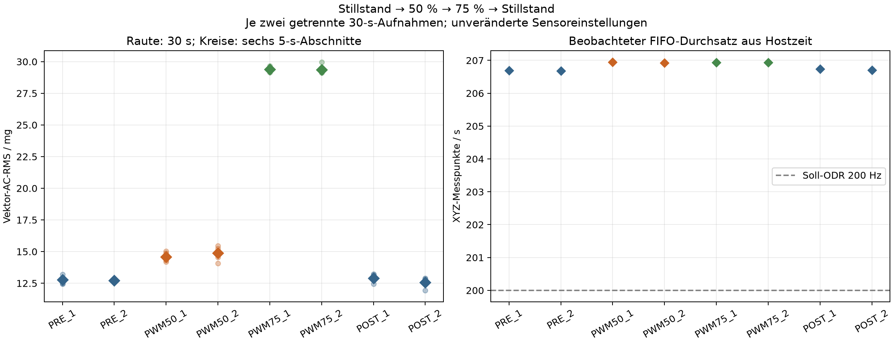

# Pilotmessbericht: Stillstand → 50 % → 75 % → Stillstand

Messdatum: 10.09.2026. Auswertung ausschließlich der acht neuen Aufnahmen in
`data/pwm50_75_sequence_20260910/`. Zeitangaben in den Tabellen: Europe/Berlin,
CEST (UTC+2); Dateinamen, Rohmetadaten und Steuerjournale verwenden UTC.

## 1. Ergebnis und Geltungsbereich

**75 % PWM ist der bevorzugte vorläufige Betriebspunkt für die nächste Prüfung.**
Bei 75 % ist der Abstand zum Stillstand größer; zugleich sind die Differenz der
beiden vollständigen Aufnahmen und die absolute sowie relative Schwankung der
5-s-Abschnitte kleiner als bei 50 %. Die Empfehlung beruht damit auch auf der
beobachteten Wiederholbarkeit, nicht allein auf der höheren Schwingungsamplitude.

Alle acht getrennten 30-s-Aufnahmen wurden tatsächlich auf dem Raspberry Pi
erfasst. Die gewünschte Zustandsreihenfolge wurde eingehalten. Eine kurze,
ununterbrochene Versuchsfolge wurde jedoch **nicht vollständig erreicht**:
Zwischen Beginn der ersten und Ende der letzten Aufnahme lagen
48,85 Minuten. Lange Wartezeiten auf Sichtbestätigungen und
ein nicht mehr verfügbarer Steuerprozess vor den Schlussreferenzen sind
dokumentiert. Die tatsächlichen Zeiten seit der PWM-Änderung waren ungleich.
Diese Einschränkungen begrenzen die endgültige Auswahl eines Betriebspunktes.

Zwei Dateien je Phase sind ein Pilotversuch, kein belastbarer statistischer
Nachweis. Die Dateien einer Phase stammen aus demselben ununterbrochenen
Betriebszustand und sind keine unabhängigen Neustartversuche. Die Trennung
Stillstand/Betrieb belegt keine Anomalieerkennung bei gleicher PWM.

## 2. Aufbau, Messkette und Steuerung

Der feststehende Aufbau wurde weiterverwendet: ARCTIC P12 Pro PST mit externer
12-V-Versorgung; ADXL345 entsprechend der vorgesehenen I²C-Beschaltung an einer
Ecke des Lüfterrahmens. Montagekennung:
`fan_frame_corner_adxl345_gpio18_v1`. Die Montage blieb laut Nutzerbestätigung
unverändert. Ein Neuaufbau oder eine Positionsänderung wurde nicht durchgeführt.

| Parameter | Für alle acht Aufnahmen dokumentierter Stand |
| --- | --- |
| Lüftersteuerung | BCM GPIO18, physischer Headerpin 12; physischer Pin 18 wäre GPIO24 |
| PWM-Ausgang | RP1 `pwmchip0/pwm2`, Pin-Funktion `a3` / `PWM0_CHAN2` |
| PWM-Frequenz | Stellvorgabe 25 kHz, Periode 40.000 ns, normale Polarität, aktiviert |
| Tastgrade | 0 %: 0 ns; 50 %: 20.000 ns; 75 %: 30.000 ns |
| ADXL345 | nominell 200 Hz ODR; ±2 g; Full Resolution; FIFO Stream |
| Registerrücklesung | BW_RATE 0x0b; DATA_FORMAT 0x08; FIFO_CTL 0x90; INT_ENABLE 0x00; POWER_CTL 0x08 |
| I²C | Bus 1, konfigurierte Busfrequenz 100 kHz |
| Skalierung | 0,0039 g je LSB; keine neue Kalibrierung durchgeführt |
| Aufnahmen | je 30 s zeitgesteuert; fünf Sekunden programmierte Pause innerhalb eines Paares |
| Zeitstempel | monotone Hostzeit beim Abschluss der Registerlesung |
| Drehzahl | nicht gemessen; kein bestätigter separater Tachokanal verwendet |

Die unveränderte Sensorkonfiguration wurde anhand aller acht Metadatensätze
verglichen. GPIO18 ist hier der Steuerausgang; er wurde nicht gleichzeitig als
Tachoeingang interpretiert. Die ausgelesene PWM-Konfiguration und Pin-Funktion
belegen eine Einstellung. Eine elektrische Signalmessung oder eine Drehzahlmessung
ersetzt dies nicht. Gleichmäßiger Lauf bzw. vollständiger Stillstand wurden durch
Sichtbestätigungen des Nutzers festgestellt.

Der bestehende `FanPWM`-Controller hielt während der Aufnahmegruppen seine
gemeinsame Steuerungssperre und überprüfte den Sollwert vor und nach jeder Datei.
Diese Sperre schützt gegen kooperierende Programme, nicht gegen beliebige direkte
GPIO-Schreibzugriffe. In den Prozessprüfungen gab es keinen gefundenen konkurrierenden
Controller. Keine Erkennungsmethode beeinflusste den Betriebspunkt.

## 3. Tatsächlicher Ablauf und Abweichungen

| Ereignis | Zeit CEST | Nachweis / Einordnung |
| --- | --- | --- |
| Anfangszustand | vor 09:48:35 | bestehende 0-%-Vorgabe rückgelesen; vollständiger Stillstand vom Nutzer bestätigt |
| 50 % eingestellt | 09:50:18 | Hardware-PWM: 20.000 / 40.000 ns; mindestens 30 s gewartet, anschließend Sichtbestätigung |
| Erste Aufnahme bei 50 % | 10:15:05 | protokollierte Zeit seit Stellbefehl ca. 1.487,56 s (24,79 min) |
| 75 % eingestellt | 10:16:44 | Hardware-PWM: 30.000 / 40.000 ns; mindestens 30 s gewartet, anschließend Sichtbestätigung |
| Erste Aufnahme bei 75 % | 10:18:28 | protokollierte Zeit seit Stellbefehl ca. 103,53 s |
| 0 % eingestellt | 10:20:04 | Hardware-PWM: 0 / 40.000 ns; zehn Sekunden Auslaufzeit vor Anfrage |
| Wiederaufnahme geprüft | ab 10:34:44 | ursprüngliche Toolsitzung nicht verfügbar; kein Python-Controller gefunden; PWM weiterhin 0 % |
| Schlussreferenzen | ab 10:36:21 | aktuelle Antwort „ja“ als Bestätigung vollständigen Stillstands dokumentiert; keine PWM-Schreibbefehle in der Fortsetzung |

Die Mindestwartezeit von 30 s wurde bei beiden Betriebspunkten eingehalten;
sie war nicht die tatsächliche einheitliche Einlaufzeit. Insbesondere die lange
Wartezeit bei 50 % kann einen Zeit- oder Erwärmungseffekt mit dem Betriebspunkt
vermischen. Eine solche Ursache wurde nicht gemessen.

Vor den Schlussreferenzen ließ sich die ursprüngliche Toolsitzung 65289 nicht
fortsetzen. Ursache und genauer Zeitpunkt ihres Endes sind unbekannt. Das originale
Sitzungsjournal enthält sechs abgeschlossene Aufnahmen und weiterhin den gespeicherten
Status `running`; es wurde nicht nachträglich korrigiert. Nach erneuter Prozess- und
PWM-Prüfung sowie der aktuellen Stillstandsbestätigung wurden die beiden fehlenden
Referenzen mit einem neuen, protokollierten Aufnahmeprozess ohne PWM-Änderung erfasst.
Das abgeleitete `completed_measurement_manifest.json` führt beide Quellsitzungen
mit Prüfsummen zusammen und kennzeichnet die fehlende Prozesskontinuität ausdrücklich.
Sein Status `completed` bedeutet, dass alle acht Aufnahmen vorliegen.

## 4. Einzelaufnahmen und Datenqualität

Die angeforderte Messdauer beträgt für jede Datei 30 s. Die unten angegebene
Zeitspanne umfasst den ersten bis letzten XYZ-Messpunkt, nicht Initialisierung und
Dateiabschluss. N zählt vollständige XYZ-Messpunkte; die Zahl einzelner Achsenwerte
ist 3N. Flagspalte: Lücke / FIFO-Überlauf / Sättigung.

| Aufnahme | PWM % | Beginn–Ende CEST | N XYZ | Zeitspanne s | Durchsatz XYZ/s | Flags | Vektor-AC-RMS mg |
| --- | ---: | --- | ---: | ---: | ---: | --- | ---: |
| PRE_1 | 0 | 09:48:35–09:49:05 | 6200 | 29,9922 | 206,687 | 0/0/0 | 12,780 |
| PRE_2 | 0 | 09:49:10–09:49:41 | 6200 | 29,9927 | 206,684 | 0/0/0 | 12,709 |
| PWM50_1 | 50 | 10:15:05–10:15:36 | 6207 | 29,9882 | 206,948 | 0/0/0 | 14,591 |
| PWM50_2 | 50 | 10:15:41–10:16:11 | 6207 | 29,9918 | 206,923 | 0/0/0 | 14,878 |
| PWM75_1 | 75 | 10:18:28–10:18:58 | 6207 | 29,9901 | 206,935 | 0/0/0 | 29,387 |
| PWM75_2 | 75 | 10:19:03–10:19:33 | 6207 | 29,9904 | 206,933 | 0/0/0 | 29,362 |
| POST_1 | 0 | 10:36:21–10:36:51 | 6201 | 29,9897 | 206,738 | 0/0/0 | 12,895 |
| POST_2 | 0 | 10:36:56–10:37:26 | 6200 | 29,9901 | 206,702 | 0/0/0 | 12,574 |

Der beobachtete Durchsatz wurde aus `(N−1)/(t_letzter−t_erster)` berechnet und liegt
zwischen 206,684 und 206,948 vollständigen XYZ-Punkten/s.
Das sind 3,342 bis
3,474 % über den nominell eingestellten 200 Hz.
30 s bei exakt 200 Hz entsprächen ungefähr 6.000 XYZ-Punkten; die tatsächlich
beobachteten rund 6.200 Punkte entsprechen ungefähr 206,7 Punkten/s. Ein
XYZ-Datensatz ist nicht mit drei zeitlich getrennten Abtastungen gleichzusetzen.
Die Erfassung wird zeitlich beendet und erzeugt daher keine fest vorgegebene
Messpunktzahl. Die früher genannten 6.205 Punkte sind mit diesem höheren beobachteten
Durchsatz vereinbar; die aktuelle Folge enthält je nach Datei 6.200 bis 6.207 Punkte.
Die Ursache der Abweichung wird durch diesen Pilotversuch nicht abschließend bestimmt.

Alle Hostzeitstempel sind streng monoton und die gespeicherten Messpunktindizes
lückenlos. Es wurden keine Lücken-, Überlauf- oder Sättigungsflags gesetzt. Die
größte Hostzeitdifferenz beträgt 9,565 ms; keine überschreitet zwei nominelle
Sensorperioden (10 ms). Die maximale beobachtete FIFO-Belegung beträgt 1. Der größte
Betrag eines einzelnen Achsenwertes beträgt 1,1427 g, innerhalb des konfigurierten
Bereichs. Endliche Werte, Zeitdarstellungen, Dateihashes und identische
Sensorkonfiguration wurden geprüft.

Die Hostzeitstempel sind keine Zeitstempel der internen Sensorwandlung. Die
nominale Zeitachse `sample_index / 200` darf nicht als gemessene Sensorzeit
interpretiert werden. Fehlende Flags beweisen nicht die exakte Zahl eventuell
verlorener physischer Wandlungen; diese bleibt unbekannt. Die Prüfungen liefern
keinen Nachweis von Aliasfreiheit oder kalibrierter absoluter Genauigkeit.

## 5. Achsenmittelwerte und Streuungen

Für jede vollständige Datei wird zunächst der jeweilige Achsenmittelwert entfernt:
`a_AC,i = a_i − mean(a)`. Die hier verwendete Standardabweichung hat den Nenner N
(`ddof=0`) und entspricht damit dem AC-RMS der betreffenden Achse.

`Vektor-AC-RMS = sqrt(mean(x_AC² + y_AC² + z_AC²)) = sqrt(σx² + σy² + σz²)`.

Es wird nicht durch √3 dividiert. Das Verfahren ist außerdem nicht gleich dem
AC-RMS des zuvor gebildeten Vektorbetrags. Alle Beschleunigungsangaben beruhen auf
der bestehenden LSB-Skalierung; mg bedeutet hier 0,001 g.

| Aufnahme | Mittel X g | Mittel Y g | Mittel Z g | σX g | σY g | σZ g |
| --- | ---: | ---: | ---: | ---: | ---: | ---: |
| PRE_1 | -0,153488 | 0,014312 | -1,092435 | 0,006580 | 0,005792 | 0,009300 |
| PRE_2 | -0,153742 | 0,014145 | -1,092264 | 0,006556 | 0,005700 | 0,009276 |
| PWM50_1 | -0,154129 | 0,015502 | -1,091670 | 0,008491 | 0,006597 | 0,009863 |
| PWM50_2 | -0,154356 | 0,015586 | -1,091423 | 0,008702 | 0,006827 | 0,009951 |
| PWM75_1 | -0,154040 | 0,016163 | -1,091566 | 0,023578 | 0,013272 | 0,011468 |
| PWM75_2 | -0,154307 | 0,016188 | -1,091652 | 0,023551 | 0,013374 | 0,011340 |
| POST_1 | -0,153854 | 0,014599 | -1,092183 | 0,006643 | 0,005811 | 0,009402 |
| POST_2 | -0,153359 | 0,014601 | -1,092489 | 0,006491 | 0,005741 | 0,009111 |

Die stärkere AC-Amplitude bei 75 % tritt besonders auf der X-Achse auf. Das
zustandsabhängige Ergebnis bleibt nach Entfernung der Gleichanteile bestehen.
Die Gleichanteile enthalten unter anderem die statische Beschleunigung und
Sensoroffsets; die Mittelwertentfernung ist keine vollständige Sensorkalibrierung.

## 6. Wiederholbarkeit und gleich lange Zeitabschnitte

Jede Datei wurde zusätzlich in sechs nicht überlappende, durch die relative
Hostzeit definierte 5-s-Abschnitte `[0,5), …, [25,30)` zerlegt. Jeder Abschnitt
erhält eigene Achsenmittelwerte. Eventuelle Punkte ab 30 s gehören weiter zur
vollständigen Aufnahme, nicht zu diesen sechs Abschnitten. Die zwölf Abschnittswerte
pro Phase sind keine zwölf unabhängigen Versuche.

Die relative Wiederholungsdifferenz lautet `100 × |RMS2−RMS1| / Mittel(RMS1,RMS2)`.
Der deskriptive Variationskoeffizient (CV) beschreibt die Standardabweichung der
zwölf Abschnitts-RMS-Werte geteilt durch deren Mittelwert.

| Phase | Mittel der beiden RMS mg | Differenz mg | Differenz % | 5-s-RMS min–max mg | 5-s-CV % |
| --- | ---: | ---: | ---: | ---: | ---: |
| Stillstand vorher | 12,745 | 0,072 | 0,561 | 12,447–13,209 | 1,553 |
| 50 % PWM | 14,735 | 0,287 | 1,948 | 14,058–15,469 | 2,814 |
| 75 % PWM | 29,374 | 0,025 | 0,086 | 29,110–29,966 | 0,846 |
| Stillstand nachher | 12,735 | 0,320 | 2,515 | 11,937–13,213 | 2,598 |

Alle 48 Abschnittswerte sind in [five_second_metrics.csv](five_second_metrics.csv)
enthalten. Die Darstellung verbindet Messpunkte nur zur Lesbarkeit; sie zeigt keine
kontinuierliche Aufzeichnung in den Pausen.

| Betrieb | Abstand zum Anfangsmittel mg | Abstand zum Endmittel mg | Kleinster Dateiabstand zum gesamten Stillstand mg | Kleinster 5-s-Abstand zum gesamten Stillstand mg |
| --- | ---: | ---: | ---: | ---: |
| 50 % PWM | 1,990 | 2,000 | 1,696 | 0,845 |
| 75 % PWM | 16,630 | 16,640 | 16,467 | 15,897 |

Für die beiden letzten Spalten wurde jeweils der kleinste Betriebswert minus dem
größten Wert aus allen vier Stillstandsdateien bzw. allen 24 Stillstandsabschnitten
berechnet. In diesem Pilotdatensatz überlappen die Bereiche von Stillstand und 50 %,
Stillstand und 75 % sowie 50 % und 75 % weder für die vollständigen Aufnahmen noch
für die 5-s-Abschnitte. Das ist eine deskriptive Beobachtung, keine Klassifikationsgüte.

Bereits bei 50 % beträgt der Abstand zum Stillstandsmittel etwa 1,99–2,00 mg und
ist damit größer als die gemessene Wiederholungsdifferenz bei 50 % (0,287 mg) und
die größte Wiederholungsdifferenz der Stillstandsphasen (0,320 mg). Bei 75 % ist der
Abstand etwa 16,63–16,64 mg bei einer Wiederholungsdifferenz von 0,025 mg. Zugleich
ist die gesamte Spannweite der 5-s-Werte bei 75 % mit 0,856 mg kleiner als die
1,411 mg bei 50 %. Die besonders kleine Dateidifferenz bei 75 % darf angesichts
von nur zwei Wiederholungen nicht als garantierte Reproduzierbarkeit gelten.

## 7. Stillstand am Anfang und Ende

Das mittlere Vektor-AC-RMS änderte sich von 12,745 auf
12,735 mg, also um -0,010 mg bzw.
-0,079 %. Die Bereiche der Anfangs- und
Schlussreferenzen überlappen. Die Schlussreferenzen schwanken untereinander
stärker (2,515 % statt 0,561 %), obwohl ihre Mittelwerte eng beieinander liegen.

Die Änderung der gemittelten Achsengleichanteile Ende minus Anfang beträgt
X 0,009 mg, Y 0,372 mg,
Z 0,013 mg. Eine Ursache dieser Änderungen wurde nicht
untersucht. Ähnliche Anfangs- und Endmittelwerte beweisen weder durchgängige
Stationarität noch das Fehlen zeitlicher Einflüsse während der dazwischenliegenden
Betriebsphasen.

## 8. Empfehlung und nächste Prüfung

Die Messkette ist für diesen beschreibenden RMS-Pilotvergleich verwendbar: Es
liegen vollständige, prüfbare Dateien ohne erkannte Qualitätsflags und eine
beobachtbare Zustandstrennung vor. **75 % PWM bei unveränderten 25 kHz ist ein
begründeter Kandidat, aber noch kein endgültig validierter Betriebspunkt.**

Vor der endgültigen Festlegung sollte eine weitere kontrollierte Normalbetriebsserie
die Reproduzierbarkeit über separate Neustarts prüfen. Dabei sollten 50 % und 75 %
mit vergleichbarer tatsächlicher Einlaufzeit, zeitnahen Sichtbestätigungen und
abwechselnder Reihenfolge aufgenommen werden; Stillstandsreferenzen bleiben
erforderlich. Der Aufnahmeprozess sollte über die Bestätigungswartezeiten hinweg
zuverlässig verfügbar bleiben. Eine feste Einlaufdauer ist prospektiv zu bestimmen
und mit Zeitverläufen zu prüfen; die bisherige Mindestwartezeit allein beweist
keine erreichte stationäre Drehzahl oder Schwingungsamplitude.

Spätere Normal- und Anomalieversuche müssen am jeweils gleichen PWM-Sollwert
stattfinden. Der hier beobachtete Unterschied 50 %/75 % darf nicht als künstlicher
Anomaliefall benutzt werden. Vor dem Methodenvergleich sind Messfenster und der
Umgang mit nominaler ODR gegenüber beobachtetem Durchsatz festzulegen. Bei der
späteren Prüfung eines zweiten normalen Betriebspunktes müssen Modelle,
Skalierung und Schwellen unverändert bleiben. Jetzt wurden keine Modelle trainiert,
keine Schwellen angepasst und keine künstlichen Anomalien erzeugt.

## 9. Endzustand und Nachvollziehbarkeit

Der letzte Stellbefehl war **0 % PWM bei 25 kHz** um 08:20:04 UTC / 10:20:04 CEST.
Vollständiger mechanischer Stillstand wurde anschließend vom Nutzer vor den beiden
Schlussreferenzen bestätigt. Die Schlussreferenzen erfolgten bei rückgelesenen 0 %;
die Fortsetzung änderte die PWM nicht. Eine automatische Drehzahl- oder
Stillstandsmessung wird damit nicht behauptet.

Rohdaten und Metadaten wurden separat und ohne Überschreiben vorhandener Dateien
gespeichert. Worddatei und historische Messprotokolle werden durch diesen Bericht
nicht verändert. Der abschließende Hashvergleich wird separat in
`../final_verification.json` festgehalten.

| Nachweis | Datei |
| --- | --- |
| Numerische Gesamtauswertung mit Definitionen und Hashes | [report.json](report.json) |
| Einzelaufnahmen und Qualitätskennzahlen | [recording_metrics.csv](recording_metrics.csv) |
| Alle 5-s-Abschnitte | [five_second_metrics.csv](five_second_metrics.csv) |
| Deskriptive Phasenvergleiche | [phase_contrasts.csv](phase_contrasts.csv) |
| Grafik als PDF | [comparison.pdf](comparison.pdf) |
| Ergänzende Spektren, keine Zuordnung zu RPM | [spectra.csv](spectra.csv) |
| Abgeleitetes vollständiges Manifest | [completed_measurement_manifest.json](../completed_measurement_manifest.json) |
| Unveränderte ursprüngliche Sitzung | [sequence_20260910_074455.json](../sequence_20260910_074455.json) |
| Ursprüngliche PWM-Befehle und Rücklesungen | [sequence_20260910_074455_fan.jsonl](../sequence_20260910_074455_fan.jsonl) |
| Fortsetzung mit Schlussreferenzen | [closing_references_20260910_083621.json](../closing_references_20260910_083621.json) |
| Nur lesende PWM-Prüfungen der Fortsetzung | [closing_references_20260910_083621_fan.jsonl](../closing_references_20260910_083621_fan.jsonl) |

Die Datengrundlage und die Auswertungsskripte sind über SHA-256-Prüfsummen
zugeordnet. Die ergänzenden Spektren begründen in diesem Bericht keine mechanische
Frequenzzuordnung oder Drehzahl. Die Entscheidung beruht auf den ausdrücklich
dargestellten AC-RMS- und Wiederholbarkeitskennzahlen.
