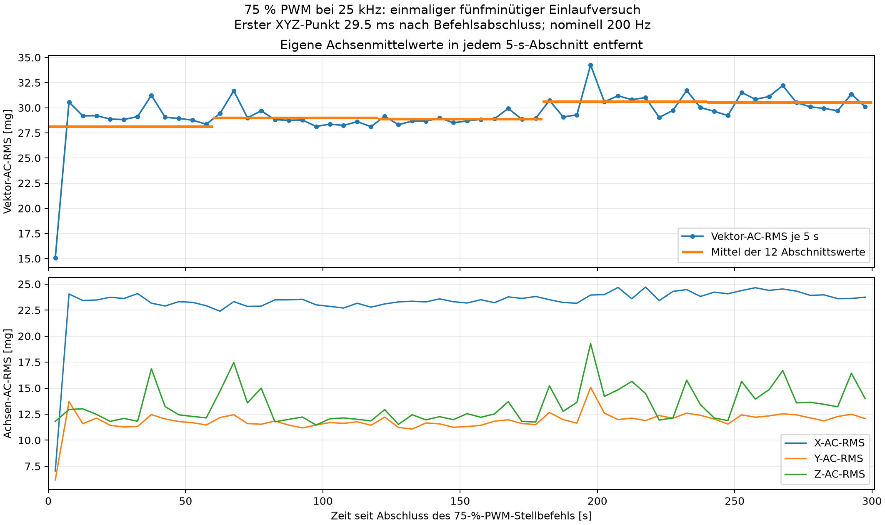

# Fünfminütiger Einlaufversuch bei 75 % PWM

Messdatum: 10.09.2026. Es wurde **ein Start mit einer durchgehenden 300-s-Aufnahme**
ausgeführt. Nach bestätigtem vollständigem Stillstand wurde 75 % PWM bei 25 kHz
eingestellt und ohne absichtliche Wartezeit aufgezeichnet. Es gab keine
Antwortfrist, keinen zusätzlichen Start und keinen Abbruch.

## Ergebnis

Das Vibrationsniveau verändert sich während dieser Einzelaufnahme. Im ersten
5-s-Abschnitt beträgt das Vektor-AC-RMS 15,068 mg, im zweiten 30,560 mg. Danach
liegen die Werte zunächst überwiegend um 29 mg, mit einzelnen höheren Werten.
Zwischen 120 und 180 s ist die Schwankung vergleichsweise klein. In den letzten
zwei Minuten beträgt der Mittelwert der 5-s-RMS-Werte jedoch
30,571 mg statt 28,868 mg in Minute 3;
das sind 5,899 % mehr. Zudem treten erneut deutliche
Ausschläge auf, bis 34,246 mg im Abschnitt 195–200 s.

**Ein dauerhaft konstantes Vibrationsniveau ab 60 s ist damit nicht belegt.**
Die Mittelwerte von Minute 4 und 5 liegen zwar nahe beieinander, die einzelnen
Abschnitte schwanken weiterhin. Aus diesem Verlauf lässt sich weder eine
allgemeingültige Einlaufzeit noch Reproduzierbarkeit über verschiedene Starts
ableiten. Es wurde keine nachträgliche Bestehensschwelle gewählt.

Die orange Linie zeigt je Minute das arithmetische Mittel der zwölf
5-s-Vektor-AC-RMS-Werte. Sie ist kein separat nach einmaliger
60-s-Mittelwertentfernung berechnetes RMS. Die unteren Kurven zeigen die
Achsenbeiträge. Die Verbindungslinien dienen der Lesbarkeit; ausgewertet
werden die markierten, nicht überlappenden Zeitabschnitte.

## Messkette und unveränderte Bedingungen

| Größe | Einstellung bzw. Nachweis |
| --- | --- |
| Prüflüfter | ARCTIC P12 Pro PST mit externer 12-V-Versorgung |
| Sensor | ADXL345 an einer Ecke des Lüfterrahmens; bestehende I²C-Beschaltung |
| Montage | Kennung `fan_frame_corner_adxl345_gpio18_v1`; unverändert lassen war vor dem Start vereinbart |
| Steuerpin | BCM GPIO18, physischer Headerpin 12, `a3` / `PWM0_CHAN2` |
| PWM | vorhandenes RP1 `pwmchip0/pwm2`, 25 kHz, normale Polarität, aktiviert |
| Betrieb | 75 %: 30.000 ns Tastzeit bei 40.000 ns Periode |
| Ende | 0 %: 0 ns Tastzeit bei unveränderter Periode |
| Sensorkonfiguration | nominell 200 Hz ODR, ±2 g, Full Resolution, FIFO Stream |
| Register | BW_RATE 0x0b, DATA_FORMAT 0x08, FIFO_CTL 0x90, INT_ENABLE 0x00, POWER_CTL 0x08 |
| I²C | Bus 1, konfigurierte Busfrequenz 100 kHz |
| Umrechnung | bestehende 0,0039 g/LSB; keine neue absolute Kalibrierung |
| Drehzahl | nicht gemessen; keine RPM-Ableitung aus PWM oder Signalspitzen |

Vor dem Start wurden keine konkurrierenden Gerätenutzer gefunden. Die
gemeinsamen PWM- und Sensorsperren waren während des Versuchs gehalten.
Die Erfassung verwendet die vorhandenen Funktionen `connect` und `record`;
die produktiven Quelldateien wurden nicht geändert. Der Sensor und die
Ausgabepfade wurden vor dem Stellbefehl vorbereitet. Der Recorder setzt
den FIFO beim Beginn der Messung zurück. Eine Erkennung änderte die PWM nicht.

Der vollständige Stillstand vor dem Start ist als Nutzerbeobachtung in
`../prestart_standstill_confirmation.json` dokumentiert. Die nach der Aufnahme angefragte Nutzerbeobachtung zum Anlaufen, weiteren Lauf und möglichen Berührungen liegt zum Erstellen dieses Berichts noch nicht vor. Die Aufnahme beschreibt deshalb zunächst den beabsichtigten Normalbetrieb bei dokumentierter Stellvorgabe; störungsfreie äußere Bedingungen werden nicht automatisch bestätigt.
Das Rohdatenlabel bleibt −1 mit Hinweis auf die bei Aufnahmebeginn noch
ausstehende Laufbeobachtung. Es werden daraus keine Trainingsdaten oder
automatisch bestätigten Zustandslabels erzeugt.

## Zeitbezug und tatsächlicher Aufnahmebeginn

| Ereignis | UTC am 10.09.2026 |
| --- | --- |
| Aufruf des 75-%-Stellbefehls | 2026-09-10T09:34:54.917241+00:00 |
| Journal vor Schreiben von 30.000 ns | 2026-09-10T09:34:54.943191+00:00 |
| Journal der Rücklesung von 30.000 ns | 2026-09-10T09:34:54.947180+00:00 |
| Abschluss des Steuerbefehls einschließlich Rücklesung | 2026-09-10T09:34:54.969504+00:00 |
| Aufnahme-Metadatum „started_at“ | 2026-09-10T09:34:54.969821+00:00 |
| Ende der Aufnahme laut Metadatum | 2026-09-10T09:39:55.205410+00:00 |
| Abschluss der Rückstellung auf 0 % | 2026-09-10T09:39:55.307036+00:00 |

Zur lokalen Sommerzeit CEST sind jeweils zwei Stunden zu addieren. Die
Berechnung kurzer Zeitabstände verwendet ausschließlich monotone Nanosekunden.
Der erste gelesene XYZ-Punkt liegt **29,522 ms
nach Abschluss** und **81,758 ms
nach Aufruf** des PWM-Stellbefehls. Gegenüber dem Journal vor dem eigentlichen
Tastzeitschreiben beträgt der Abstand 55,821 ms,
gegenüber dessen Rücklesejournal 51,833 ms.

Diese Schreibjournale begrenzen einen softwareseitigen Vorgang. Weder der
elektrische Signalwechsel am Lüfter noch der tatsächliche Rotoranlauf wurden
zeitlich gemessen. `started_at` bezeichnet zudem einen Schritt der
Recorderinitialisierung und nicht den ersten Sensorwert. Der kurze Abschnitt
zwischen Stellbefehl und erstem gelesenen Messpunkt ist nicht aufgezeichnet.

Die angeforderte Erfassungsdauer ist 300 s. Zwischen erstem und letztem
XYZ-Punkt liegen 299,989448 s; der letzte Messpunkt
liegt 300,018970 s nach
Befehlsabschluss. Ein geringer Unterschied zu 300 s entsteht durch
Initialisierung, diskrete Messpunkte und das zeitgesteuerte Ende der Leseschleife.

## Datenqualität

| Kennzahl | Ergebnis |
| --- | ---: |
| Vollständige XYZ-Messpunkte | 62063 |
| Einzelne Achsenwerte | 186189 |
| Nominelle Sensor-ODR | 200 Hz |
| Beobachteter Hostdurchsatz | 206,880610 XYZ/s |
| Abweichung vom nominellen Wert | +3,440 % |
| Nicht monotone Zeitabstände | 0 |
| Lücken-/Überlauf-/Sättigungsflags | 0 / 0 / 0 |
| Hostabstände über zwei nominelle Perioden (10 ms) | 3 |
| Größter Hostabstand | 12,558051 ms |
| Maximale beobachtete FIFO-Belegung | 2 |
| Größter absoluter Achsenwert | 1,2636 g |
| Qualitätsmarkierte 5-s-Abschnitte | 0 |
| Punkte außerhalb der 60 ausgewerteten Abschnitte | 0 |

Die Indizes beginnen bei null und sind lückenlos; alle XYZ-Werte sind endlich.
CSV-/Metadatenhash, Messpunktzahl, Flaganzahlen, Zeitdarstellungen und nominale
Sensorzeitachse wurden auf Konsistenz geprüft. Es wurden keine gesetzten
Lücken-, Überlauf- oder Sättigungsflags gefunden.

Die drei größeren Hostabstände liegen bei ungefähr 137,408 s, 137,453 s und
137,500 s nach dem ersten Messpunkt und betragen 10,795 ms, 12,558 ms und
11,676 ms. Der FIFO meldete dabei zwei Einträge und keine Überlaufflags.
Der Befund wird ausdrücklich als Unregelmäßigkeit der Host-Lesezeiten
festgehalten. Aus fehlenden Flags folgt kein exakter Nachweis von null
verlorenen internen Sensorwandlungen; deren Anzahl bleibt unbekannt.

Der Durchsatz ist `(N−1)/(t_letzter−t_erster)` aus Hostzeitstempeln.
Ein XYZ-Tupel ist ein Messpunkt mit drei Achsenwerten, keine dreifache zeitliche
Abtastung. Bei exakt 200 Hz wären in 300 s ungefähr 60.000 XYZ-Punkte zu
erwarten; hier wurden 62.063 erfasst. Die nominelle ODR und der beobachtete
Durchsatz werden nicht gleichgesetzt. Die Ursache der Abweichung wird durch
diese Einzelaufnahme nicht abschließend geklärt.

Hostzeitstempel sind keine Zeitstempel der internen Wandlung.
`sample_index / 200` bleibt eine nominale Schätzung. Eine elektrische
Signalprüfung, Aliasfreiheit oder absolute Sensorkalibrierung wurde nicht
nachgewiesen. Die Daten sind für die hier dargestellte deskriptive
Verlaufsprüfung auswertbar; ein Nachweis erfolgreicher Anomalieerkennung
ergibt sich daraus nicht.

## Berechnung der 5-s-Werte

Die 60 Fenster `[0,5), …, [295,300)` beziehen sich auf den ersten tatsächlichen
XYZ-Hostzeitstempel. In der Grafik ist zusätzlich der gemessene Versatz zum
PWM-Befehlsabschluss berücksichtigt: Das erste Fenster entspricht etwa
0,029522–5,029522 s nach Befehlsabschluss. Alle Abschnitte haben dieselbe
festgelegte Länge von fünf Sekunden; es wird nicht nachträglich umgetaktet
oder interpoliert.

In jedem Abschnitt werden X-, Y- und Z-Mittelwert neu berechnet und entfernt:

`x_AC = x−mean(x)`, entsprechend für Y und Z.

`Vektor-AC-RMS = sqrt(mean(x_AC²+y_AC²+z_AC²))`.

Die Achsen-AC-RMS-Werte entsprechen den Populationsstandardabweichungen
(`ddof=0`). Die Vektorgröße wird nicht durch √3 dividiert und ist nicht das
AC-RMS eines zuvor berechneten Vektorbetrags. Es wurden keine Punkte anhand
ihres Ausschlags entfernt. Qualitätsflags werden zusätzlich pro Abschnitt
geführt. Alle Achsenmittelwerte, Streuungen und RMS-Werte stehen in der
separaten CSV-Datei.

## Verlauf und Stabilisierung

Die folgenden Bereiche sind relativ zum ersten XYZ-Punkt angegeben; für
Zeiten seit Befehlsabschluss sind jeweils rund 0,029522 s zu addieren.
CV bedeutet deskriptive Populationsstandardabweichung der zwölf RMS-Werte
geteilt durch deren Mittelwert. Die lineare Steigung ist eine einfache
Geradenanpassung an diese zwölf Abschnittswerte, kein Signifikanztest.

| Zeitraum s | Mittel der 5-s-RMS mg | Minimum–Maximum mg | CV % | Lineare Steigung mg/min |
| --- | ---: | ---: | ---: | ---: |
| 0–60 | 28,101 | 15,068–31,243 | 14,252 | 5,659 |
| 60–120 | 28,970 | 28,115–31,678 | 3,246 | -2,348 |
| 120–180 | 28,868 | 28,307–29,928 | 1,334 | 0,508 |
| 180–240 | 30,622 | 29,043–34,246 | 4,485 | -0,263 |
| 240–300 | 30,521 | 29,222–32,210 | 2,816 | 0,087 |

Der erste niedrige Abschnitt und der anschließende Anstieg sind mit dem
beabsichtigten Anlauf vereinbar. Daraus lässt sich keine Rotorhochlaufzeit
bestimmen; die erste Sekunde ist im 5-s-RMS zeitlich zusammengefasst und die
Drehzahl ungemessen.

Die geringere Streuung zwischen 120 und 180 s hält über den gesamten restlichen
Verlauf nicht an. Der Abschnitt 195–200 s erreicht 34,246 mg; spätere
Abschnitte erreichen erneut Werte über 31 mg. In den letzten 120 s beträgt
der Mittelwert 30,571 mg, der Bereich 29,043–34,246 mg und der CV 3,751 %.
Die lineare Steigung dieses letzten Bereichs ist mit rund −0,098 mg/min
klein, belegt bei den weiterhin auftretenden Schwankungen aber keine
allgemein gültige Stationarität.

Minute 4 und 5 besitzen ähnliche Mittelwerte (30,622 und 30,521 mg).
Damit ist am Ende ein annähernd gleiches mittleres Niveau über zwei Minuten
zu beobachten, während die Einzelabschnitte variieren. Es wäre nicht
begründet, allein den ruhigen Bereich der dritten Minute auszuwählen und
alle späteren Veränderungen als nicht relevant zu behandeln.

Eine physische Ursache der späteren Niveauänderung wurde nicht bestimmt.
Erwärmung, Drehzahlveränderungen und äußere Anregungen bleiben mögliche
Erklärungen, keine nachgewiesenen Ursachen. Die 60 Abschnitte stammen aus
einem einzigen Lauf und sind keine 60 unabhängigen Wiederholungen.

## Schlussfolgerung und nächster Schritt

Aus dieser Aufnahme sollte keine neue feste Einlaufzeit als validiert
übernommen werden. Als nächster Schritt bieten sich weitere lange
Normalbetriebsläufe mit gleicher Auszeit, gleicher Montage und dokumentierter
Vorgeschichte an. Vorab sollte festgelegt werden, welche Änderung der
Abschnittsmittelwerte und welche Streuung für den vorgesehenen Vergleich
vertretbar sind. Anschließend lässt sich prüfen, ob ein über mehrere Starts
hinweg geeigneter Aufnahmezeitpunkt existiert. Diese Folgeversuche wurden
hier nicht begonnen.

Keine Modelle wurden trainiert und keine Anomalien erzeugt. Der Anlaufbereich
wird nicht automatisch als stationäre Normalreferenz verwendet. Für spätere
Normal-/Anomalievergleiche ist dieselbe PWM einzuhalten; ein zweiter normaler
Betriebspunkt wird mit unveränderten Modellen, Skalierungen und Schwellen geprüft.

## Endzustand und Dateien

Die letzte Stellvorgabe beträgt **0 % PWM bei 25 kHz**. Sie wurde nach dem
Aufnahmeende angefordert und nach zehn Sekunden Auslaufzeit erneut rückgelesen.
Vollständiger mechanischer Stillstand nach dieser Abschaltung ist zum Erstellen dieses Berichts noch nicht durch eine neue Sichtangabe bestätigt; 0 % ist die rückgelesene Stellvorgabe. Es ist kein weiterer Start vorgesehen.

| Artefakt | Datei |
| --- | --- |
| Grafik PNG | [startup_rms.png](startup_rms.png) |
| Grafik PDF | [startup_rms.pdf](startup_rms.pdf) |
| Alle 60 Abschnitte einschließlich Achsenmittelwerten und Flags | [five_second_rms.csv](five_second_rms.csv) |
| Minutenzusammenfassung | [minute_summary.csv](minute_summary.csv) |
| Numerische Auswertung und Hashes | [report.json](report.json) |
| Aufnahme-/Steuersitzung | [session.json](../session.json) |
| PWM-Befehle und Rücklesungen | [fan.jsonl](../fan.jsonl) |
| Ausgangsstand und vorab festgelegtes Vorgehen | [baseline_and_protocol.json](../baseline_and_protocol.json) |

Die Rohaufnahme liegt unter `data/pwm75_startup_5min_20260910_093215/normal75_startup300s_20260910_093454_841661.csv` mit gleichnamiger JSON-Metadatendatei.
Alle Dateien wurden separat gespeichert. Worddatei, historische Protokolle,
bestehende Modelle und produktiver Quellcode werden nicht verändert. Die
abschließende Erhaltungsprüfung wird in `../final_verification.json` dokumentiert.
