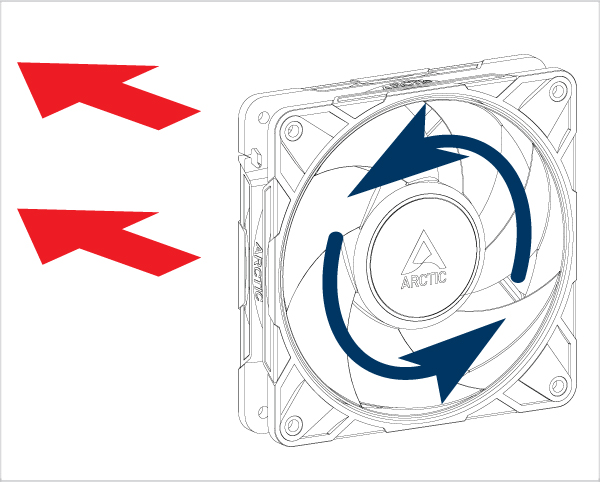

# Aufrechte Aufstellung: Stillstand → Normal → Luftstrom verändert → Normal

Vorbereitung vom 11.09.2026. Neue Aufbauversion: **`fan_upright_mount_v3_20260911_095035`**. Noch keine Aufnahme dieser Version durchgeführt. Die separate Auswertung und der Messbericht werden nach den freigegebenen Phasen ergänzt; aktuelle Sollangaben sind keine Messergebnisse.

## Aufbauänderung und vorhandene Bestätigungen

Der Nutzer berichtet: „Der Lüfter steht jetzt aufrecht und ist nach meiner Prüfung fest und sicher befestigt.“ Diese Bestätigung ist übernommen; eine Wiederholung der Befestigungs- oder Sicherheitsfragen ist nicht erforderlich. Sensorbefestigung: bislang zwei Schrauben am äußeren stationären Rahmen. Während der neuen Folge bleiben Sensorbefestigung, Lüfterposition und Sensoreinstellungen unverändert. Die numerische Orientierung der Sensorachsen zur Schwerkraft wurde nicht gemessen.

Die zuvor abgeschlossene liegende Aufnahme `normal_before` aus `airflow_sequence_20260911_091537` bleibt unverändert erhalten. Ihre vorgesehene Fortsetzung wird durch die nun verlangte aufrechte Folge ersetzt. Sie wird weder erneut aufgenommen noch als direkte Normalreferenz der neuen Aufstellung verwendet. Dasselbe gilt für alle älteren liegenden Aufnahmen. Die neue Stillstands- und beide Normalreferenzen müssen aus dieser aufrechten Folge stammen.

Die anfänglich rückgelesene PWM beträgt 0 % bei 25 kHz, GPIO18 (BCM) / physischer Pin 12 / RP1 PWM0 Kanal 2, Pin-Funktion `a3`. Kein konkurrierender Gerätehalter wurde gefunden. Software-Rücklesung ist keine mechanische Beobachtung. Noch offen sind ausschließlich der aktuelle mechanische Stillstand und der aktuelle Zustand der externen 12-V-Versorgung; beide wurden in einer gemeinsamen Nachricht erfragt. Bis zu ihrer Klärung erfolgt keine Aufnahme und kein Start.

## Geometrie und Auslassrichtung

Der bestehende Plan wird beibehalten: separat befestigte Platte, vorgesehen 60 × 120 mm, parallel zur äußeren Auslassebene, 100 mm Abstand davor; Projektion über der rechten Hälfte der rechteckigen Rahmenfläche, beim Blick auf den Auslass. In beiden Normalphasen liegt keine Platte im Auslassbereich. Halterung und Platte dürfen weder Lüfter noch Sensor berühren und müssen kippsicher bleiben.

Die Herstellerzeichnung wurde angesehen. Gerade rote Pfeile zeigen dort die Luftstromrichtung, gebogene blaue Pfeile die Rotation. Die Auslassseite ist entsprechend der Luftstromrichtung zu wählen; ein Rotationspfeil ist dafür nicht geeignet. [ARCTIC, P12 Pro PST: Luftstromrichtung](https://support.arctic.de/de/p12-pro-pst), [Originalzeichnung](https://support.arctic.de/products/p12-pro-pst/img/001.jpg).

Dies ist eine Herstellerzeichnung und kein Foto der tatsächlichen aufrechten Aufstellung. Eine konkrete räumliche Auslassrichtung, die tatsächlich gewählte Plattenseite, Istmaße, Material, Abstand und Klemmung sind aus den bisherigen Nutzernachrichten nicht ersichtlich. `geometry.json` trennt diese unbekannten Istwerte von den Sollwerten. Spätere tatsächliche Angaben werden vor der jeweiligen Aufnahme in einer eigenen phasenbezogenen Geometriedatei mit Herkunft dokumentiert. Unbekannte Werte bleiben `null`; die allgemeine Lauf-Freigabe wird nicht als Vermessung ausgegeben.

## Phasen und Freigaben

| Phase | Stellvorgabe | Aufnahme | Startbedingung / danach |
|---|---|---|---|
| `standstill` | 0 %, 25 kHz | 30 s | Aktueller Stillstand bestätigt, Versorgungszustand geklärt; anschließend Qualitätsprüfung |
| `normal_before` | 75 %, 25 kHz | 300 s | Erst nach gültiger neuer Stillstandsaufnahme und Ablauf der 60-s-Zusatz-Auszeit; danach 0 % rücklesen und für Umbau pausieren |
| `airflow_modified` | 75 %, 25 kHz | 300 s | Neue Nachricht „Umbau fertig, nächster Lauf freigegeben.“ nach Einsetzen der Platte; danach 0 % rücklesen und pausieren |
| `normal_after` | 75 %, 25 kHz | 300 s | Erneute Nachricht „Umbau fertig, nächster Lauf freigegeben.“ nach Entfernen; abschließend 0 % rücklesen |

Der aktuelle Auftrag autorisiert die anfängliche Stillstandsaufnahme und den anschließenden ersten Normallauf, sobald die fehlenden Anfangszustände ausdrücklich geklärt sind. Dafür wird keine zusätzliche Frage zum sichtbaren Lauf gestellt. Für die vorbereitete zusammenhängende Anfangsphase bleibt die 12-V-Versorgung angeschlossen: Falls sie aktuell getrennt ist, muss vor dieser Anfangsphase zunächst das Wiederanschließen bei 0 % dokumentiert werden. Eine getrennte Versorgung wird nicht stillschweigend als angeschlossen übernommen.

Die **30-s-Stillstandsaufnahme liegt innerhalb der 60-s-Zusatz-Auszeit** ab softwareseitiger Annahme der Anfangsbestätigung. Der erste Start liegt frühestens 60 s danach; ein tatsächlicher zusätzlicher Softwareaufwand wird ausgewiesen. Für die beiden folgenden Betriebsläufe läuft derselbe 60-s-Timer ab der jeweiligen neuen Freigabe. Gesamte Auszeiten seit dem vorangegangenen Nullbefehl werden zusätzlich erfasst; gleiche Zusatzwartezeit belegt keine gleiche Gesamtauszeit oder Temperatur.

Für jeden Plattenumbau übernimmt der Nutzer das Trennen der externen 12-V-Versorgung, das Abwarten des vollständigen Stillstands, den Umbau und das Wiederanschließen. Die Freigabe eines Betriebslaufs autorisiert keinen folgenden Umbau oder Start. Es gibt weder Antwortfristen noch automatische Wiederholungsstarts. Die Software fragt nicht nach sichtbarem Lüfterlauf während einer Aufnahme.

Jeder Betriebslauf wird möglichst unmittelbar nach dem Stellbefehl mit der bestehenden Erfassung begonnen. Befehlsaufruf, Befehlsabschluss, Erfassungsaufruf sowie erste und letzte XYZ-Hostzeit werden protokolliert. Eine tatsächliche Drehzahl wird nicht aus PWM oder Spektren abgeleitet. Bei Fehlern wird nach Möglichkeit 0 % gesetzt und der auslesbare Zustand dokumentiert. Fehlerhafte Versuche bleiben erhalten; ein erneuter Start erfolgt nicht automatisch.

## Messkette, Speicherung und Auswertung

ADXL345: nominell 200 Hz, ±2 g, Full Resolution, FIFO-Stream; I²C-Bus 1, Adresse 0x53, eingestellter Bustakt 100 kHz und Softwareskalierung 0,0039 g/LSB. Die vorhandene Software prüft Gerätekennung und Register beim Start der freigegebenen Erfassung. Es wird kein zusätzlicher Sensorpilot vorweg ausgeführt.

Alle CSV/JSON-Dateien werden ausschließlich im neuen Sitzungsordner angelegt, einschließlich Rohdatenhash, Aufbauversion, Freigaben, Geometriequelle, Sensorregister, PWM-Zeitpunkten, Auszeiten und tatsächlicher Aufnahmezeit. `state` und `anomaly_type` entsprechen den vier verlangten Labels. Numerisch kennzeichnet 0 Stillstand/Normal und 1 den kontrolliert veränderten Betriebszustand; dies ist keine behauptete Defektdiagnose. Alle Aufnahmen gehören zum Entwicklungspiloten, nicht zu einem unabhängigen Abschlusstest.

Zu prüfen sind XYZ-Punktzahl (drei Achsenwerte pro Punkt), Zeitmonotonie, konsistente Zeitspalten, beobachteter XYZ-Durchsatz, Host-Leseabstände und Lesedauern, FIFO-Füllstand sowie Gap-/Overrun-/Sättigungsflags. Nominelle 200 Hz werden getrennt vom beobachteten Durchsatz berichtet. Die genaue Zahl eventuell verlorener Sensorwerte bleibt ohne unabhängigen Zähler unbekannt.

Pro nicht überlappendem 5-s-Abschnitt wird für jede Achse deren eigener Mittelwert entfernt. Vektor-AC-RMS: `sqrt(mean((x−mean(x))² + (y−mean(y))² + (z−mean(z))²))`. Die Betriebsfenster beziehen sich auf den PWM-Befehlsaufruf, die Stillstandsfenster auf den Erfassungsaufruf. Fehlende Millisekunden vor der ersten Lesung werden nicht aufgefüllt. Vollständige Rohdaten bleiben einschließlich etwaiger Punkte knapp nach dem Auswerteende erhalten.

Geplant sind vollständige Verlaufsgrafiken und je 24 Fenster von 180–300 s für die drei Betriebsläufe. Diese Zeitlage ist für die neue Aufstellung lediglich ein Prüfkandidat. Zeitliche Steigungen innerhalb eines Laufs werden von unterschiedlichen Mittelwerten zwischen Läufen getrennt. Die Luftstromveränderung wird gegen beide Normalreferenzen verglichen; Rückkehrbereich, Normalverschiebung und Schwankungen werden ausdrücklich dargestellt. Fenster werden nicht als unabhängige Versuchsreplikate oder als Ersatz für mehrere N–A–N-Folgen behandelt.

Eine Trennung zum Stillstand oder zwischen diesen Zuständen beweist weder einen Defekt noch erfolgreiche KI-Erkennung oder allgemeine Reproduzierbarkeit. Es wird kein Modell trainiert. Ein abschließender separater Bericht folgt erst nach den entsprechenden Messungen. Die Worddatei, bestehenden Modelle, Quellcodedateien und historischen Protokolle bleiben unverändert; `baseline.json` enthält 910 bestehende Dateihashes.
