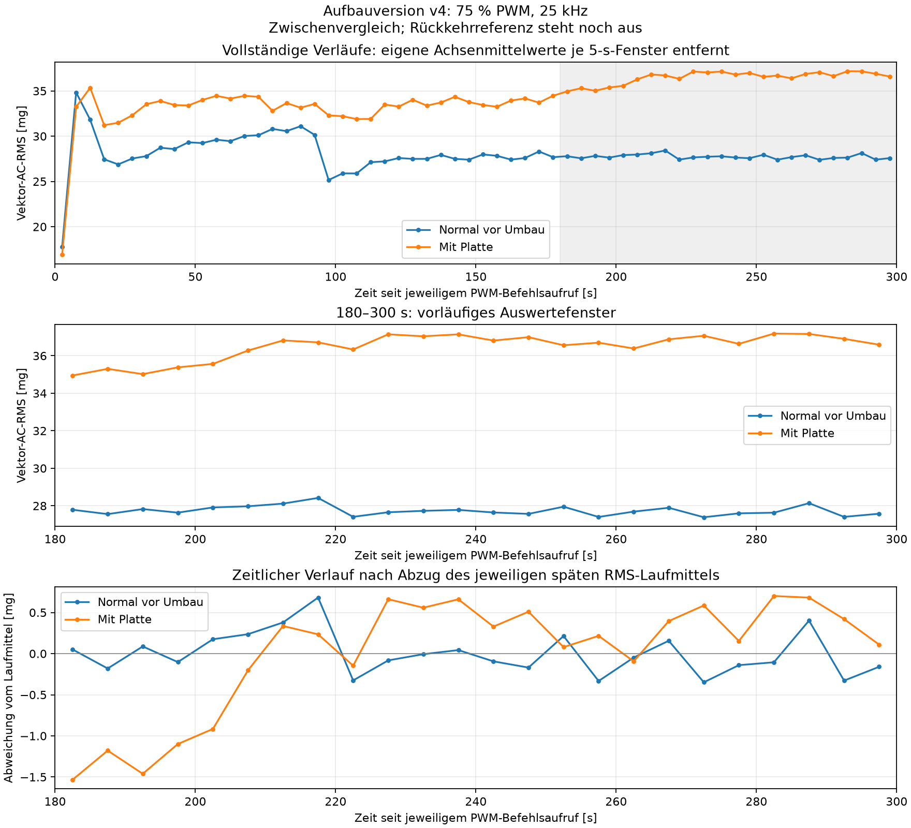
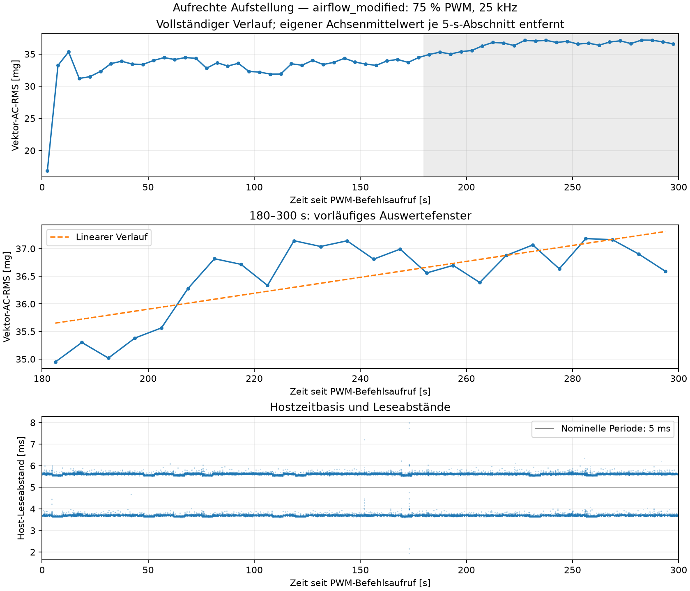

# Zwischenbericht: Normalbetrieb und eingesetzte Platte

Aufbauversion **`fan_upright_position_v4_20260911_103726`**. `standstill`, `normal_before` und `airflow_modified` sind abgeschlossen. Die Rückkehrreferenz `normal_after` steht aus und ist noch nicht freigegeben. Frühere Aufstellungen werden nicht als direkte Normalreferenz verwendet.

## Bedingungen und Durchführung

Der Nutzer berichtete, vor dem Plattenumbau die externe 12-V-Versorgung getrennt und vollständigen Stillstand abgewartet zu haben. Nur die Platte wurde eingesetzt; Lüfter und Sensor blieben nach seiner Angabe an ihrer Position. Die anschließend wieder angeschlossene Versorgung und die Freigabe ausschließlich dieses Laufs sind in [airflow_modified_release.json](airflow_modified_release.json) dokumentiert. Der Originalwortlaut bleibt dort neben der für die bestehende Software normalisierten Freigabe erhalten.

Geplant sind eine separat befestigte Platte von 60 × 120 mm, parallel zum Luftauslass, mit 100 mm Abstand. Tatsächliche Maße, Abstand, Ausrichtung, Auslassidentifikation und Material sind weiterhin unbekannt. Die Angabe „Platte eingesetzt“ ist keine Vermessung. [Phasengeometrie](airflow_modified_geometry.json) trennt Sollwerte und Nutzerangaben. Der Luftstrom wurde nicht direkt gemessen. Die Bedingung heißt kontrollierter veränderter Betriebszustand, nicht nachgewiesener Defekt. Ein numerisches CSV-Label 1 bezeichnet allein diese Versuchsbedingung.

Der PWM-Befehlsaufruf erfolgte **2026-09-11T11:01:18.201286+00:00**. Alle hier genannten Zeitstempel sind UTC; Ortszeit Europe/Berlin liegt zwei Stunden später. Die zusätzliche Auszeit ab softwareseitiger Annahme der Freigabe betrug **60,022068 s** bei geplanten 60 s. Der Abstand zum Abschluss des vorangegangenen Nullbefehls betrug **707,072170 s**; dies ist keine unabhängig gemessene mechanische Stillstands-, Abkühl- oder Spannungsunterbrechungsdauer. Beim ersten Normallauf waren es wegen der Vorbereitung 84,097 s ab Freigabe. Gleiche gesamte Auszeiten werden nicht behauptet.

Die erste XYZ-Lesung erfolgte **2026-09-11T11:01:18.279706+00:00**, **78,420 ms nach Befehlsaufruf** bzw. 34,239 ms nach Befehlsabschluss. Elektrische PWM-Flanke, Rotorstart und Drehzahl wurden nicht gemessen. Es gab genau einen Start auf 75 % bei 25 kHz, 300 s Erfassung und anschließend genau einen Nullbefehl. Keine Antwortfrist, Laufbeobachtungsfrage oder automatische Wiederholung wurde verwendet.

## Datenqualität und Zeitbasis

Die rückgelesene Sensorkonfiguration entspricht der neuen Normalreferenz: ADXL345, nominell **200 Hz**, ±2 g, Full Resolution, FIFO-Stream, 0,0039 g/LSB, I²C-Bus 1 und konfigurierter Bustakt 100 kHz. Register BW_RATE=0x0B, DATA_FORMAT=0x08, INT_ENABLE=0x00, FIFO_CTL=0x90, POWER_CTL=0x08. Die Hostzeitpunkte stammen vom Abschluss der jeweiligen XYZ-Lesung. Der Durchsatz wird als `(N−1)/(t_letzter−t_erster)` berechnet, getrennt von der nominellen Sensor-ODR.

| Phase | XYZ-Punkte | Beobachtet [XYZ/s] | Hostabstand max. [ms] | Abstände >10 ms | FIFO max. | Gap / Overrun / Sättigung |
|---|---:|---:|---:|---:|---:|---|
| `normal_before` | 62148 | 207,1650 | 13,467 | 3 | 2 | 0 / 0 / 0 |
| `airflow_modified` | 62154 | 207,1839 | 7,981 | 0 | 1 | 0 / 0 / 0 |

Die neue Plattenaufnahme enthält **186462 einzelne Achsenwerte**, also drei pro XYZ-Messpunkt; erste bis letzte XYZ-Lesung umfassen 299,989581 s. Rohdatenhashes, endliche Achsenwerte, streng steigende Hostzeitstempel, Zeitspaltenkonsistenz und fortlaufende Softwareindices wurden geprüft. Die genaue Sensorverlustzahl bleibt unbekannt: fehlende Flags und fortlaufende Softwareindices beweisen nicht, dass jede physische Sensorwandlung erfasst wurde. Größere Host-Leseabstände sind nicht automatisch verlorene Messpunkte. Die Beobachtung von etwa 207 XYZ/s wird nicht in 200 Hz umetikettiert; eine unabhängige Kalibrierung der Sensorzeitbasis liegt nicht vor.

Zeitpunkte größerer Hostabstände, Achsenmittelwerte und Achsenstreuungen stehen in der [Phasenauswertung](analysis/airflow_modified/summary.json). Die bisherige Stillstandsreferenz bleibt separat im [ersten Zwischenbericht](initial_report.md) dokumentiert. In dieser Phase wurde keine weitere Stillstandsaufnahme vorgenommen.

## Vibration und zeitlicher Verlauf

In jedem nicht überlappenden 5-s-Fenster werden zunächst die drei jeweiligen Achsenmittelwerte abgezogen. Danach wird `sqrt(mean(x_ac² + y_ac² + z_ac²))` berechnet. mg bezeichnet 0,001 g Beschleunigung. Pro Betriebslauf entstehen 60 Fenster, davon 24 im Prüfabschnitt 180–300 s. Die kurze Lücke zwischen Stellbefehl und erster Lesung wird nicht aufgefüllt. Rohdaten nach 300 s bleiben erhalten und werden außerhalb der festgelegten Fenster nicht einbezogen.

| Kennwert in 180–300 s | Normal vor Umbau | Mit Platte |
|---|---:|---:|
| Mittlerer Fenster-AC-RMS [mg] | 27,737 | 36,481 |
| Fensterstandardabweichung, Divisor 24 [mg] | 0,253 | 0,690 |
| Minimum [mg] | 27,388 | 34,948 |
| Maximum [mg] | 28,419 | 37,181 |
| Lineare Steigung [mg/min] | -0,118 | 0,865 |
| Robuste Mediansteigung [mg/min] | -0,113 | 0,852 |
| Angepasste Änderung über 120 s [mg] | -0,235 | 1,730 |
| Angepasste Änderung relativ zum Laufmittel [%] | -0,848 | 4,742 |
| Letzte 60 s minus erste 60 s [mg] | -0,159 | 0,681 |

Der Unterschied der späten RMS-Mittelwerte beträgt **8,744 mg (31,524 % des Normalmittelwerts)**. Die beobachteten Fensterbereiche überlappen: **nein**. Dies beschreibt zwei konkrete Aufnahmen; die 24 benachbarten Fenster sind keine unabhängigen Versuchsreplikate. Der Unterschied zwischen Aufnahmen ist getrennt von den tabellierten zeitlichen Steigungen innerhalb jeder Aufnahme zu betrachten. 180 s bleiben ein Prüfkandidat, keine gesicherte allgemeine Einlaufzeit.

[Fensterwerte](analysis/airflow_modified/five_second_rms.csv), [Vergleich als JSON](analysis/airflow_before_comparison/comparison.json), [Vergleichsgrafik als PDF](analysis/airflow_before_comparison/comparison.pdf). Rohdaten: [airflow_modified_75pwm_300s_20260911_110050_628158.csv](../../data/upright_position_v4_sequence_20260911_104025/airflow_modified_75pwm_300s_20260911_110050_628158.csv). Die Rohdaten- und Steuerjournalhashes stehen in der Phasenauswertung.

### Beurteilung des späten zeitlichen Verlaufs

In der Plattenaufnahme enthalten auch die ersten etwa 30 s des Prüfabschnitts noch einen Anstieg. Die vier aufeinanderfolgenden 30-s-Gruppen von 180–300 s haben mittlere Fenster-RMS-Werte von **35,415; 36,865; 36,720 und 36,922 mg**. Die letzten drei Gruppen liegen näher beisammen. Die positive lineare Steigung von **0,865 mg/min** über den gesamten Prüfabschnitt beschreibt daher keine gleichmäßige lineare Zunahme bis zum Aufnahmeende. Im Normallauf beträgt die entsprechende Steigung **−0,118 mg/min**. Ein vollständiges zeitlich unverändertes Niveau ab 180 s wird für den Plattenlauf nicht behauptet; aus dieser einzelnen Kurve wird auch keine neue allgemeine Einlaufzeit abgeleitet.

Der mittlere Abstand zur bisherigen Normalaufnahme von **8,744 mg** ist größer als die beobachtete Spannweite der 24 Normalfenster von **1,031 mg** und der Plattenfenster von **2,233 mg**. Das stützt eine sichtbare Trennung in diesen beiden Aufnahmen. Die noch fehlende zweite Normalaufnahme wird jedoch benötigt, um diesen Abstand auch mit der normalen Veränderung zwischen Starts und mit einer möglichen zeitlichen Verschiebung des gesamten Versuchsaufbaus zu vergleichen.

## Grenzen und nächster Schritt

Ohne Rückkehrreferenz ist noch ungeklärt, ob das Signal nach Entfernen der Platte zurückkehrt und wie groß die normalen Unterschiede zwischen den beiden Starts dieser Folge sind. Die Veränderung kann daher noch nicht eindeutig der Platte zugeschrieben werden. Selbst die vollständige einzelne Folge belegt weder allgemeine Reproduzierbarkeit noch einen Defekt oder erfolgreiche Anomalieerkennung. Die fehlenden Istmaße begrenzen zusätzlich die Wiederholbarkeit des Plattenzustands. Es wurden keine Modelle trainiert.

Nach der Aufnahme wurde **0 % PWM bei 25 kHz** eingestellt und mit korrekter Pin-Funktion rückgelesen; Nullbefehlsabschluss: **2026-09-11T11:06:18.566497+00:00**. Mechanischer Stillstand nach diesem Lauf wurde nicht beobachtet.

Nächster manueller Schritt: externe 12-V-Versorgung trennen, vollständigen Stillstand abwarten und nur die Platte entfernen. Lüfter und Sensor bleiben unverändert. Nach Wiederanschließen der Versorgung sendet der Nutzer selbstständig seine Freigabe für den nächsten Lauf. Bis dahin wird pausiert. Erst dann folgen 60 s zusätzliche Auszeit und einmalig 300 s `normal_after` bei 75 % und 25 kHz, anschließend 0 % mit Rücklesen. Die vollständige Rückkehrbewertung folgt nach dieser Aufnahme. Worddatei, Modelle und historische Dateien werden nicht bearbeitet.
