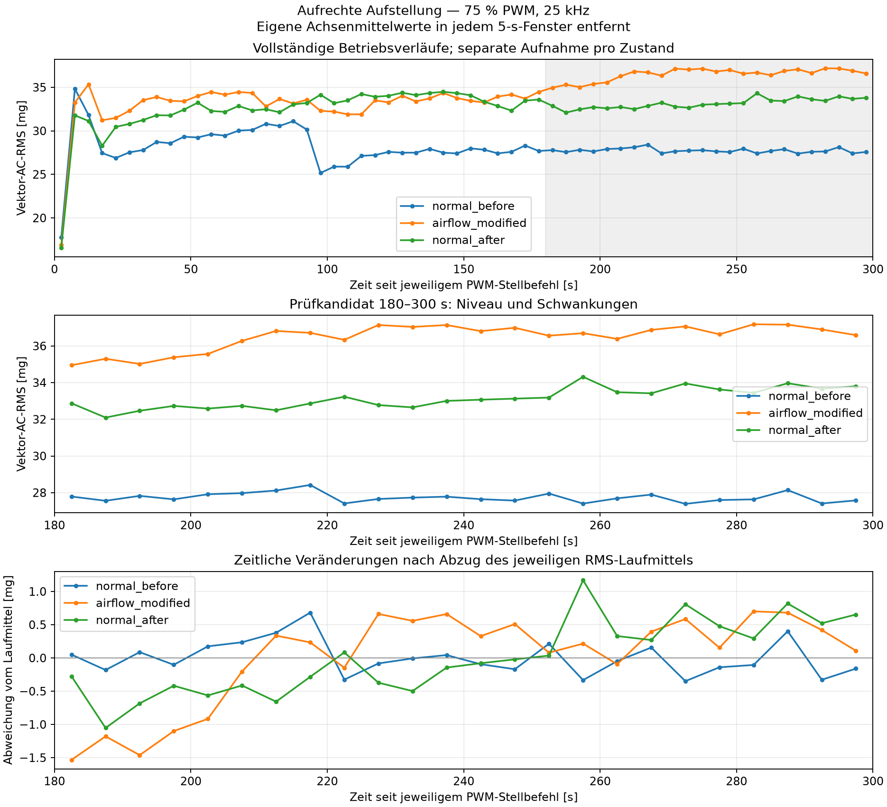
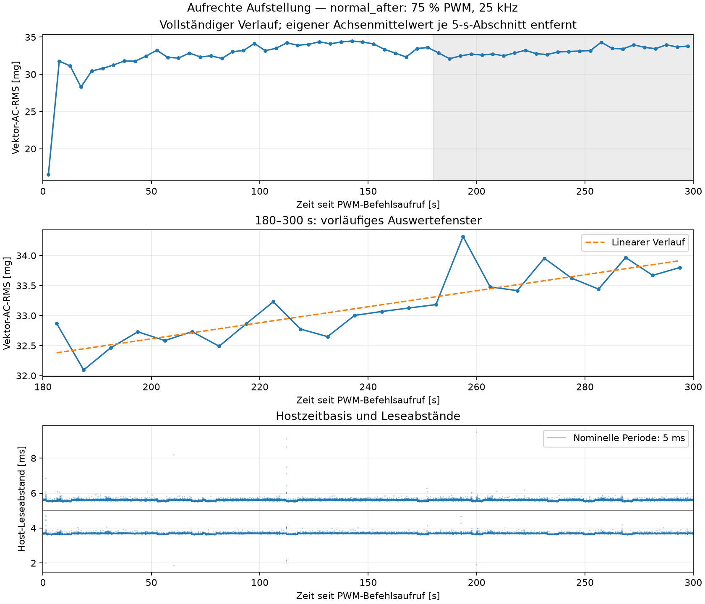

# Messbericht: aufrechte Aufstellung, Normal → Platte → Normal

Erstellt am 2026-09-11T11:17:11.025099+00:00. Aufbauversion **`fan_upright_position_v4_20260911_103726`**. Die neue 30-s-Stillstandsreferenz und alle drei freigegebenen 300-s-Betriebsaufnahmen sind abgeschlossen. Ausschließlich Daten dieser Aufbauversion werden direkt verglichen. Frühere liegende oder zwischenzeitlich verschobene Aufstellungen bleiben getrennt erhalten.

**Ergebnis:** Im Prüfabschnitt 180–300 s wurde keine Rückkehr in den zuvor beobachteten Normalbereich erfasst. Die mittleren Vektor-AC-RMS-Werte betragen **27,737 mg vor der Platte, 36,481 mg mit Platte und 33,148 mg nach dem Entfernen**. Die Rückkehrreferenz liegt damit **19,508 %** über dem vorherigen Normalmittel und enthält selbst noch einen positiven zeitlichen Trend. Die Daten sind zur weiteren Pilotuntersuchung nutzbar; eine reproduzierbare, allein durch die Platte hervorgerufene Zustandsänderung ist mit dieser Folge nicht belegt. Am Ende sind **0 % PWM bei 25 kHz** rückgelesen; mechanischer Stillstand wurde nicht beobachtet.

## Aufbau und belegte Randbedingungen

Der Lüfter steht aufrecht. Die neue Position nach der berichteten Bewegung zum Einpassen der Platte wurde als eigene Aufbauversion v4 dokumentiert und mit neuen Referenzen begonnen. Die feste und sichere Aufstellung wurde als Nutzerangabe übernommen. Der ADXL345 ist mit zwei Schrauben am äußeren, feststehenden Lüfterrahmen befestigt; die Platine sitzt schräg. Lüfterposition, Sensorbefestigung und Sensoreinstellungen sollten innerhalb dieser Folge unverändert bleiben. Beim Einsetzen der Platte berichtete der Nutzer ausdrücklich, nur die Platte bewegt zu haben. Eine unabhängige Vermessung oder Sichtbeobachtung durch die Software liegt nicht vor.

Angeschlossene externe 12-V-Versorgung und die jeweilige Phasenfreigabe wurden durch Nutzernachrichten dokumentiert. Vollständiger mechanischer Stillstand vor der Anfangsreferenz wurde vom Nutzer bestätigt. Vor den manuellen Umbauten war die externe Versorgung zu trennen und vollständiger Stillstand abzuwarten; dies wurde beim Einsetzen als durchgeführt berichtet. Das Entfernen der Platte und die wieder angeschlossene Versorgung wurden für den letzten Lauf ausdrücklich bestätigt. Es wurden keine Fragen zum sichtbaren Lauf gestellt. Aus fehlenden Beobachtungen wird kein mechanischer Zustand abgeleitet.

Geplant war eine separat und kippsicher befestigte Platte von **60 × 120 mm**, parallel zur Auslassseite, mit **100 mm Abstand** zur äußeren Rahmenebene und ohne Berührung von Lüfter oder Sensor. Die vorgesehene Überdeckung betrifft die rechte Hälfte der projizierten Rahmenfläche bei Blick in den Auslass; dies ist keine Angabe über den tatsächlichen Volumenstrom. Tatsächliche Maße, Material, Abstand, Ausrichtung, Halterungsdetails, räumliche Auslassidentifikation und Parkabstand in den Normalphasen wurden nicht vermessen oder konkret berichtet. Diese Angaben bleiben unbekannt. Das eingesetzte bzw. entfernte Bauteil ist eine bestätigte Versuchsbedingung, kein direkt gemessener Luftstrom. Die erhaltene Herstellerzeichnung bezeichnet die beabsichtigte Auslassrichtung, belegt aber keine Istorientierung des Aufbaus.

Belege: [Aufbauversion](mounting.json), [Sollgeometrie](geometry.json), [Plattenphase](airflow_modified_geometry.json), [Rückkehrphase](normal_after_geometry.json), [Anfangsfreigabe](initial_release.json), [Plattenfreigabe](airflow_modified_release.json), [letzte Freigabe](normal_after_release.json). Die `mounting`-Kopie in den Metadaten ist der erhaltene Anfangszustand; den aktuellen Plattenzustand benennt jeweils die Phasengeometrie. Originalwortlaut und technische Normalisierung der Freigaben sind getrennt gespeichert.

## Steuerung und tatsächliche Zeitpunkte

Alle Betriebsläufe verwenden **75 % PWM bei 25 kHz**, anschließend **0 %**. GPIO18 ist die BCM-Nummer und entspricht dem physischen Pin 12. Verwendet wurde die bestehende RP1-Hardware-PWM, Kanal 2, Pin-Funktion `a3` / `PWM0_CHAN2`, Periode 40.000 ns, Tastzeit im Betrieb 30.000 ns. Die Steuerjournale belegen pro Betriebslauf genau einen 75-%- und einen 0-%-Stellvorgang. Zugriffssperren und Prozessprüfung verhindern konkurrierende kooperierende Steuerungen. Zusätzliche Kontrollablesungen veränderten keine PWM-Vorgabe. Es gab keine erkennungsabhängige Steuerung, Antwortfristen oder automatischen Wiederholungsstarts.

Alle Tabellenzeitpunkte sind **UTC**; Ortszeit Europe/Berlin liegt am Versuchstag zwei Stunden später. Der Aufnahmebeginn bezeichnet die erste vollständige XYZ-Lesung. Deren UTC-Schätzung wird aus den gemeinsam erfassten UTC- und monotonen Hostzeiten des Befehlsaufrufs abgeleitet. Elektrische Signalflanke, Rotorstart und tatsächliche Drehzahl wurden nicht gemessen.

| Phase | PWM-Aufruf [UTC] | Erste XYZ-Lesung [UTC] | Versatz ab Aufruf [ms] | Zusatz-Auszeit ab Freigabe [s] | Abstand zum vorigen Nullbefehlsabschluss [s] | Nullbefehlsabschluss [UTC] |
| --- | --- | --- | --- | --- | --- | --- |
| `normal_before` | 2026-09-11T10:44:30.439605+00:00 | 2026-09-11T10:44:30.512543+00:00 | 72,938 | 84,096527 | unbekannt | 2026-09-11T10:49:31.129129+00:00 |
| `airflow_modified` | 2026-09-11T11:01:18.201286+00:00 | 2026-09-11T11:01:18.279706+00:00 | 78,420 | 60,022068 | 707,072170 | 2026-09-11T11:06:18.566497+00:00 |
| `normal_after` | 2026-09-11T11:11:27.590835+00:00 | 2026-09-11T11:11:27.668953+00:00 | 78,118 | 60,021970 | 309,024351 | 2026-09-11T11:16:27.980960+00:00 |

Vorgesehen waren einheitlich 60 s zusätzliche Auszeit ab softwareseitig angenommener Freigabe. Der erste Start erfolgte wegen Vorbereitung und vorangehender Stillstandsaufnahme erst nach **84,097 s**; die Abweichung bleibt ausdrücklich dokumentiert und wurde nicht durch einen Wiederholungsstart ersetzt. Bei den späteren Starts wird die tatsächlich erzielte Zeit in der Tabelle ausgewiesen. Der Abstand zwischen Null- und Startbefehl ist weder eine gemessene mechanische Stillstandsdauer noch eine identische Abkühl- oder Versorgungsauszeit. Insbesondere sind die gesamten Auszeiten der drei Läufe nicht gleich.

## Messkette, Datenqualität und Zeitbasis

Die rückgelesene Konfiguration ist in allen vier Aufnahmen gleich: ADXL345, nominell **200 Hz**, ±2 g, Full Resolution, FIFO-Stream, Skalierung 0,0039 g/LSB. I²C-Bus 1, Adresse 0x53, konfigurierter Bustakt 100 kHz; BW_RATE=0x0B, DATA_FORMAT=0x08, INT_ENABLE=0x00, FIFO_CTL=0x90, POWER_CTL=0x08. Gerätekennung und Registerzustand wurden mit der vorhandenen Software geprüft.

| Phase | Soll-Dauer [s] | XYZ-Punkte | Erste–letzte Hostlesung [s] | Beobachtet [XYZ/s] | Hostabstand max. [ms] | Abstände >10 ms | FIFO max. | Gap / Overrun / Sättigung |
| --- | --- | --- | --- | --- | --- | --- | --- | --- |
| `standstill` | 30 | 6212 | 29,991670 | 207,0908 | 5,885 | 0 | 1 | 0 / 0 / 0 |
| `normal_before` | 300 | 62148 | 299,987994 | 207,1650 | 13,467 | 3 | 2 | 0 / 0 / 0 |
| `airflow_modified` | 300 | 62154 | 299,989581 | 207,1839 | 7,981 | 0 | 1 | 0 / 0 / 0 |
| `normal_after` | 300 | 62156 | 299,992181 | 207,1887 | 9,483 | 0 | 2 | 0 / 0 / 0 |

Eine Datenzeile enthält einen vollständigen XYZ-Messpunkt und damit drei einzelne Achsenwerte. Die beobachtete Rate wird als `(N−1)/(t_letzter−t_erster)` aus den monotonen Host-Leseabschlüssen ermittelt. Sie wird getrennt von nominellen 200 Hz berichtet. Die Spalte `sample_index / 200` ist nur eine nominelle Zeitschätzung; sie wird nicht für die hier verwendeten 5-s-Grenzen herangezogen. Eine unabhängige Kalibrierung der Wandlungszeitbasis liegt nicht vor.

Gesichert aus dem vorhandenen Code: Eine 6-Byte-XYZ-Lesung wird nur nach positivem FIFO-Füllstand übernommen. Der FIFO wird an der Aufnahmegrenze zurückgesetzt. Die Software erzeugt keine zusätzlichen interpolierten Messpunkte und erzwingt keine Schleifenrate von 207 Hz. Mehrfach identische quantisierte XYZ-Tupel sind nicht allein ein Beleg für Mehrfachzählung. Die genaue Ursache der Abweichung zwischen nomineller und beobachteter Rate bleibt offen; die Sensorzeitbasis wurde nicht unabhängig gemessen. Host-Leseabschlüsse sind keine Sensor-Wandlungszeitstempel.

Rohdatenhashes, endliche XYZ-Werte, steigende Hostzeitstempel, konsistente Zeitspalten und fortlaufende Softwareindices wurden geprüft. Der implementierte Gap-Indikator umfasst Überlaufverdacht oder einen Hostabstand über `32 / 200 = 0,160 s`. Kürzere auffällige Hostabstände werden deshalb zusätzlich gesondert ausgewertet. Overrun wird aus dem Statusbit oder einem vollen FIFO abgeleitet; Sättigung anhand der Rohwerte am konfigurierten Messbereichsrand. Fehlende Flags und fortlaufende Softwareindices beweisen keine exakte physische Sensorverlustzahl; diese bleibt unbekannt.

Achsenmittelwerte und Streuungen beziehen sich in der folgenden Tabelle auf die jeweils gesamte Rohaufnahme. mg bezeichnet 0,001 g Beschleunigung; die Streuung verwendet den Divisor N.

| Phase | Mittel X [g] | Mittel Y [g] | Mittel Z [g] | Streuung X [mg] | Streuung Y [mg] | Streuung Z [mg] |
| --- | --- | --- | --- | --- | --- | --- |
| `standstill` | -0,626736 | -0,712735 | 0,089558 | 6,766 | 6,862 | 9,609 |
| `normal_before` | -0,626921 | -0,712629 | 0,090004 | 9,428 | 10,538 | 24,276 |
| `airflow_modified` | -0,626955 | -0,712624 | 0,090273 | 10,776 | 11,163 | 30,808 |
| `normal_after` | -0,627056 | -0,712488 | 0,090315 | 9,834 | 11,404 | 29,088 |

## Vektor-AC-RMS und zeitliche Veränderungen

Für jedes nicht überlappende 5-s-Fenster werden zunächst dessen drei Achsenmittelwerte entfernt. Danach wird `sqrt(mean(x_ac² + y_ac² + z_ac²))` berechnet. Die Berechnung wurde gegen die Summe der Achsenvarianzen geprüft. Die Fenster beziehen sich im Betrieb auf den PWM-Befehlsaufruf, im Stillstand auf den Erfassungsaufruf. Die kurze Zeit bis zur ersten Lesung wird nicht aufgefüllt. Rohdatenpunkte nach 300 s bleiben gespeichert, liegen aber außerhalb der festgelegten Auswertefenster.

Pro Betriebslauf liegen 60 Fenster vor, davon 24 in **180–300 s**. Diese Einlaufzeit ist für die aktuelle Aufstellung weiterhin ein Prüfkandidat. Nachfolgend stehen getrennt das mittlere Niveau und zeitliche Trendkennwerte innerhalb jedes Laufs. Die Fensterstandardabweichung verwendet den Divisor 24. Die Fenster sind keine unabhängigen Versuchsreplikate.

| Phase | RMS-Mittel [mg] | Fenster-SD [mg] | Fensterbereich [mg] | Lineare Steigung [mg/min] | Robuste Mediansteigung [mg/min] | Angepasste 120-s-Änderung [%] | Letzte–erste 60 s [mg] |
| --- | --- | --- | --- | --- | --- | --- | --- |
| `normal_before` | 27,737 | 0,253 | 27,388–28,419 | -0,118 | -0,113 | -0,848 | -0,159 |
| `airflow_modified` | 36,481 | 0,690 | 34,948–37,181 | 0,865 | 0,852 | 4,742 | 0,681 |
| `normal_after` | 33,148 | 0,545 | 32,095–34,316 | 0,800 | 0,768 | 4,828 | 0,879 |

Vier aufeinanderfolgende 30-s-Gruppen des späten Abschnitts, jeweils Mittelwert der enthaltenen sechs 5-s-RMS-Werte:

| Phase | 180–210 s [mg] | 210–240 s [mg] | 240–270 s [mg] | 270–300 s [mg] |
| --- | --- | --- | --- | --- |
| `normal_before` | 27,781 | 27,852 | 27,691 | 27,623 |
| `airflow_modified` | 35,415 | 36,865 | 36,720 | 36,922 |
| `normal_after` | 32,580 | 32,836 | 33,431 | 33,743 |

[Vergleichsgrafik als PDF](analysis/sequence_comparison/sequence_comparison.pdf), [Vergleichszahlen als JSON](analysis/sequence_comparison/comparison.json). Die dritte Grafikachse entfernt zusätzlich den jeweiligen späten RMS-Laufmittelwert, um zeitliche Veränderungen ohne den Niveauunterschied zu zeigen; dies ist keine neue Entfernung der XYZ-Gleichanteile.

## Rückkehr und Grenzen des Zustandsvergleichs

Der späte Mittelwert der Rückkehrreferenz unterscheidet sich vom vorherigen Normalmittel um **5,411 mg (19,508 %)**. Die beobachteten Normal-Fensterbereiche überlappen: **nein**. **0 von 24** Rückkehrfenstern liegen innerhalb des beobachteten Bereichs der vorherigen Normalaufnahme. Dies ist eine beschreibende Bereichsprüfung, kein Konfidenz- oder Toleranzintervall und kein vorher festgelegtes Akzeptanzkriterium.

| Vergleich | Mittelwertdifferenz [mg] | Relativ zum Normalmittel [%] | Fensterbereiche überlappen | Abstand größer als normaler Mittelwertwechsel |
| --- | --- | --- | --- | --- |
| Platte minus `normal_before` | 8,744 | 31,524 | nein | ja |
| Platte minus `normal_after` | 3,333 | 10,054 | nein | nein |

Die quadratisch gemittelte Streuung innerhalb der beiden späten Normalaufnahmen beträgt 0,425 mg. Der oben ausgewiesene Wechsel zwischen deren Mittelwerten ist eine andere Größe. Nur ein Normal→Platte→Normal-Durchlauf wurde ausgeführt. Aussagen über normale Startvariabilität beruhen damit auf zwei zeitlich getrennten Normalaufnahmen; sie sind keine belastbare Verteilungsschätzung.

Die Stillstandsreferenz wurde einmal zu Beginn erfasst; eine zweite abschließende Stillstandsaufnahme gehört nicht zu dieser freigegebenen Folge. Ihre sechs 5-s-Fenster beschreiben nur diese Anfangsreferenz. Ein Unterschied zwischen Stillstand und Betrieb ist kein Nachweis erfolgreicher Anomalieerkennung.

Die Platte bezeichnet einen kontrollierten veränderten Betriebszustand. Es wurde weder ein Defekt nachgewiesen noch ein Modell trainiert oder eine Erkennungsleistung gemessen. Eine einzelne Folge belegt keine allgemeine Reproduzierbarkeit. Unbekannte Istgeometrie, unterschiedliche gesamte Auszeiten, nicht gemessene Drehzahl und die nicht unabhängig kalibrierte Sensorzeitbasis begrenzen die Interpretation. Zeitliche Entwicklungen innerhalb der Läufe dürfen nicht allein als Unterschiede zwischen Bedingungen interpretiert werden; umgekehrt widerlegen unterschiedliche Laufmittelwerte allein keine geeignete Einlaufzeit.

## Bewertung und konkreter nächster Schritt

Die Prüfung ergibt keine gesetzten Lücken-, Überlauf- oder Sättigungsflags und konsistente monotone Zeitspalten in allen vier Aufnahmen. Im ersten Normallauf traten drei Hostabstände über 10 ms bei etwa 12 s auf, maximal 13,467 ms; sie liegen vor dem Vergleichsabschnitt 180–300 s. Im Plattenlauf und in der Rückkehrreferenz gab es keine Hostabstände über 10 ms. Die Flagprüfung liefert somit keinen dokumentierten Erfassungsfehler, der den späten Niveauwechsel unmittelbar erklärt. Sie ersetzt keine unabhängige Zeit- oder Schwingungskalibrierung.

Zeitlicher Verlauf und Niveauwechsel sind getrennt zu beurteilen. Im ersten Normalbetrieb ist die späte lineare Steigung mit **−0,118 mg/min** gering negativ. Mit Platte beträgt sie **+0,865 mg/min**; ein wesentlicher Anstieg liegt dabei zwischen etwa 180 und 210 s, danach liegen die 30-s-Gruppen näher beisammen. Nach Entfernen der Platte beträgt die Steigung **+0,800 mg/min**, die robuste Mediansteigung **+0,768 mg/min**. Die vier Gruppenmittel steigen dort von **32,580 über 32,836 und 33,431 auf 33,743 mg**. Der angepasste Anstieg über 120 s entspricht **4,828 %** des späten Laufmittels. Ein vollständig zeitlich unverändertes Niveau ab 180 s wird deshalb nicht angenommen. Das Vorhandensein normaler zeitlicher Variation ist jedoch für sich genommen kein Ausschlussgrund für spätere Methodenvergleiche.

Zwischen den Normalstarts liegt ein Mittelwertwechsel von **5,411 mg**. Die Plattenaufnahme liegt **8,744 mg** über der ersten und **3,333 mg** über der zweiten Normalreferenz. Beide Abstände sind größer als die beobachteten Spannweiten innerhalb der jeweiligen Normalaufnahme, doch der Abstand zur Rückkehrreferenz ist **kleiner als der normale Mittelwertwechsel zwischen Starts**. Die drei späten Fensterbereiche überlappen in dieser Folge nicht. Daraus folgt eine Trennung der konkret aufgenommenen Verläufe, aber keine eindeutige Kausalzuordnung zur Platte: Normale Startvariabilität, zeitliche Entwicklung und mögliche nicht gemessene Randbedingungen sind mit nur einer Folge nicht voneinander trennbar. Eine Verringerung gegenüber dem Plattenlauf ist beobachtet, eine vollständige Rückkehr zum vorherigen Normalbereich dagegen nicht. Ein thermischer oder mechanischer Grund dafür wurde nicht nachgewiesen.

**Offene Frage vor weiteren Plattenversuchen:** Tritt das erhöhte Normalniveau nach einem weiteren unabhängigen Start auch ohne erneuten Plattenumbau auf, und wie verläuft es innerhalb von 180–300 s?

**Kleinster nächster Pilot dafür:** Eine zusätzliche, getrennte **300-s-Normalaufnahme ohne Platte** bei unveränderter Position, Sensorbefestigung und Sensorkonfiguration sowie **75 % PWM und 25 kHz**. Vorher vollständigen Stillstand bestätigen, ab ausdrücklicher Freigabe erneut 60 s zusätzliche Auszeit einhalten und die tatsächliche gesamte Auszeit gesondert dokumentieren. Wieder möglichst ab Stellbefehl aufnehmen, anschließend 0 % einstellen und rücklesen. Dieselben 5-s-Fenster und derselbe Prüfabschnitt 180–300 s bleiben für den Vergleich erhalten; die Einlaufzeit wird nicht nachträglich passend zur Kurve gewählt. Diese Aufnahme ist hier nur vorgeschlagen und wurde nicht ausgeführt. Sie kann zeigen, ob das erhöhte Niveau erneut auftritt, schätzt allein aber ebenfalls noch keine allgemeine Normalverteilung.

Die nötige Vorbereitung besteht zunächst darin, **die Platte entfernt und Lüfter sowie Sensor unverändert zu lassen**. Es ist kein weiterer Umbau nötig. Vor einer späteren Wiederholung des Plattenversuchs sollten die bislang fehlenden Istmaße, der Abstand und die Auslassausrichtung nachvollziehbar dokumentiert werden, ohne Lüfter oder Sensor zu versetzen. Danach kann eine weitere vollständige Normal→Platte→Normal-Folge die Wiederholung des Effekts prüfen. Modelle und Schwellen werden aus dieser einzelnen Pilotfolge noch nicht abgeleitet.

Für die spätere Modellphase bleiben vollständige unabhängige Aufnahmen die Einheit der Aufteilung in Training, Validierung und Test. Benachbarte 5-s-Fenster eines Laufs dürfen nicht auf diese Gruppen verteilt werden. Die aktuelle Folge dient der Entwicklung des Versuchs und ist kein unabhängiger abschließender Test. Vor einem späteren Methodenvergleich sind Normalvariabilität und Messparameter gemeinsam festzulegen; die bloße Trennung zum Stillstand oder zwischen diesen drei Kurven ist keine nachgewiesene Anomalieerkennung.

## Dateien und Abschluss

- `standstill`: [Rohdaten](../../data/upright_position_v4_sequence_20260911_104025/standstill_0pwm_30s_20260911_104359_704943.csv), [Metadaten](../../data/upright_position_v4_sequence_20260911_104025/standstill_0pwm_30s_20260911_104359_704943.json), [Sitzung](standstill_session.json), [Steuerjournal](standstill_fan.jsonl), [Kennwerte](analysis/standstill/summary.json), [5-s-Fenster](analysis/standstill/five_second_rms.csv).
- `normal_before`: [Rohdaten](../../data/upright_position_v4_sequence_20260911_104025/normal_before_75pwm_300s_20260911_104430_339886.csv), [Metadaten](../../data/upright_position_v4_sequence_20260911_104025/normal_before_75pwm_300s_20260911_104430_339886.json), [Sitzung](normal_before_session.json), [Steuerjournal](normal_before_fan.jsonl), [Kennwerte](analysis/normal_before/summary.json), [5-s-Fenster](analysis/normal_before/five_second_rms.csv).
- `airflow_modified`: [Rohdaten](../../data/upright_position_v4_sequence_20260911_104025/airflow_modified_75pwm_300s_20260911_110050_628158.csv), [Metadaten](../../data/upright_position_v4_sequence_20260911_104025/airflow_modified_75pwm_300s_20260911_110050_628158.json), [Sitzung](airflow_modified_session.json), [Steuerjournal](airflow_modified_fan.jsonl), [Kennwerte](analysis/airflow_modified/summary.json), [5-s-Fenster](analysis/airflow_modified/five_second_rms.csv).
- `normal_after`: [Rohdaten](../../data/upright_position_v4_sequence_20260911_104025/normal_after_75pwm_300s_20260911_111103_206329.csv), [Metadaten](../../data/upright_position_v4_sequence_20260911_104025/normal_after_75pwm_300s_20260911_111103_206329.json), [Sitzung](normal_after_session.json), [Steuerjournal](normal_after_fan.jsonl), [Kennwerte](analysis/normal_after/summary.json), [5-s-Fenster](analysis/normal_after/five_second_rms.csv).

Nach dem letzten Lauf wurde **0 % PWM bei 25 kHz** eingestellt und mit korrekter PWM-Pin-Funktion rückgelesen. Nullbefehlsabschluss: **2026-09-11T11:16:27.980960+00:00**. Ein abschließender mechanischer Stillstand wurde nicht beobachtet. Es ist kein weiterer Start vorgesehen. Worddatei, Modelle und historische Dateien bleiben unverändert.
