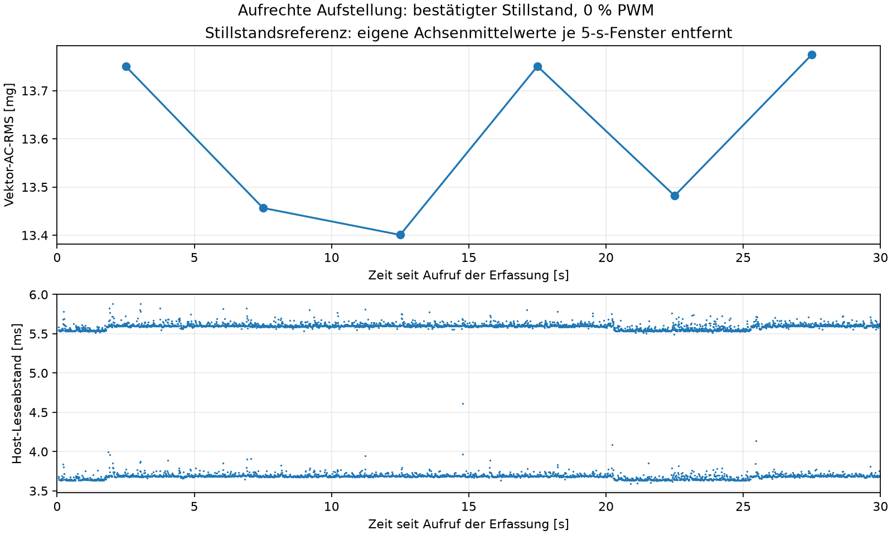
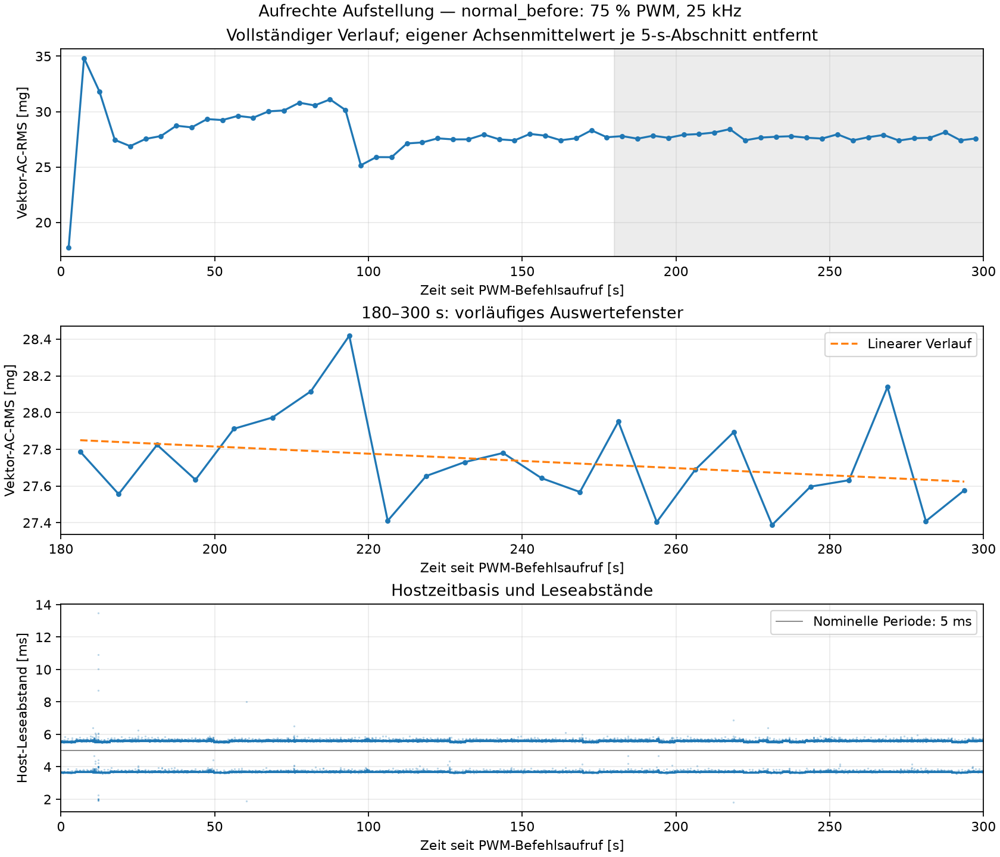

# Aufrechte Aufstellung: Stillstandsreferenz und erster Normallauf

Zwischenbericht vom 11.09.2026. Aufbauversion **`fan_upright_position_v4_20260911_103726`**. Die Phasen `standstill` und `normal_before` sind abgeschlossen. `airflow_modified` und `normal_after` wurden noch nicht ausgeführt. Dieser Bericht enthält ausschließlich neue Daten der aufrechten Aufstellung; Aufnahmen früherer Positionen werden nicht als direkte Referenz verwendet.

## Bestätigte Bedingungen und offene Geometriedetails

Die feste und sichere aufrechte Befestigung ist entsprechend der Nutzerangabe übernommen. Angeschlossene externe 12-V-Versorgung und vollständiger mechanischer Stillstand wurden vor der Anfangsphase getrennt vom Nutzer bestätigt; dokumentiert in [initial_release.json](initial_release.json). Sensorbefestigung und Lüfterposition sollten während der neuen Folge unverändert bleiben. Es wurden keine erneuten Fragen zum sichtbaren Lüfterlauf gestellt.

Die tatsächliche Auslassseite im Raum, Plattenmaße, Material, Halterungsdetails und Abstand sind noch nicht berichtet. Sollwerte und Herstellerzeichnung stehen getrennt davon in [protocol.md](protocol.md) und [geometry.json](geometry.json). Die Stillstandsaufnahme und der erste Betrieb wurden als ohne Platte freigegeben. Daraus wird keine vermessene Geometrie abgeleitet.

## Ablauf und Zeitbasis

Die 30-s-Stillstandsaufnahme erfolgte bei 0 % PWM vor dem Betriebsstart. Sie lag aufgrund der Vorbereitung nur teilweise innerhalb des geplanten 60-s-Zeitfensters. Vom softwareseitigen Annahmezeitpunkt der Anfangsbestätigung bis zum ersten PWM-Befehlsaufruf vergingen **84,096527 s**. Dies ist keine gemessene gesamte mechanische Stillstands- oder Abkühlzeit; die zuvor vollständig verifizierte Gesamtauszeit ist unbekannt.

Abweichung vom Zeitplan: Vorgesehen waren 60 s ab Bereitschaftsmeldung. Tatsächlich wurden es beim ersten Start 84,097 s, weil die neue Aufbauversion zunächst eingerichtet und anschließend die Stillstandsreferenz erfasst wurde. Die Zusatzwartezeit war damit 24,097 s länger. Dieser Start wird nicht als exakt gleich lange Auszeit zu späteren Starts ausgegeben. Es gab keinen automatischen Wiederholungsstart; Beleg: [initial_wait_deviation.json](initial_wait_deviation.json).

Der erste Betriebsbefehl auf 75 % bei 25 kHz wurde um **2026-09-11T10:44:30.439605+00:00** aufgerufen (UTC; Ortszeit Europe/Berlin = UTC+2). Die erste XYZ-Lesung folgte **72,938 ms nach Befehlsaufruf**, beziehungsweise 29,498 ms nach Befehlsabschluss. Elektrische Signalflanke und tatsächlicher Rotorstart wurden nicht gemessen.

Nach der 300-s-Erfassung wurde auf **0 % PWM** zurückgestellt und die Einstellung rückgelesen. Der Nullbefehl war um **2026-09-11T10:49:31.129129+00:00** abgeschlossen. Der Betriebspunkt wurde vor und nach der Aufnahme mit 75 % bestätigt; das Steuerjournal enthält genau einen 75-%- und einen 0-%-Stellvorgang. Eine mechanische Stillstandsbestätigung nach diesem Lauf liegt nicht vor.

## Messkette und Qualitätsprüfung

Beide neuen Phasen verwenden dieselbe rückgelesene Konfiguration: ADXL345, nominell 200 Hz, ±2 g, Full Resolution, FIFO-Stream, I²C-Bus 1/Adresse 0x53, konfigurierter Bustakt 100 kHz. Register: BW_RATE=0x0B, DATA_FORMAT=0x08, INT_ENABLE=0x00, FIFO_CTL=0x90, POWER_CTL=0x08. Die Software skaliert unverändert mit 0,0039 g/LSB.

| Phase | Soll-Dauer [s] | XYZ-Punkte | Spanne erste–letzte Lesung [s] | Beobachtet [XYZ/s] | Größter Hostabstand [ms] | FIFO max. | Gap / Overrun / Sättigung | Mittlerer Fenster-AC-RMS [mg] |
|---|---:|---:|---:|---:|---:|---:|---|---:|
| `standstill` | 30 | 6.212 | 29,991670 | 207,0908 | 5,885 | 1 | 0 / 0 / 0 | 13,603 |
| `normal_before` | 300 | 62.148 | 299,987994 | 207,1650 | 13,467 | 2 | 0 / 0 / 0 | 27,737 |

Der RMS-Mittelwert bezieht sich beim Stillstand auf sechs 5-s-Fenster und beim Normalbetrieb auf 24 Fenster in 180–300 s. Pro XYZ-Punkt liegen drei einzelne Achsenwerte vor. Die Zahl gesetzter Qualitätsflags ist der Tabelle zu entnehmen; alle Flags über beide Aufnahmen frei: **ja**. Rohdatenhashes, steigende Hostzeitstempel, konsistente Zeitspalten, endliche XYZ-Werte und lückenlose Softwareindices wurden geprüft.

Die beobachtete Rate wird aus `(N−1)/(t_letzter−t_erster)` berechnet und bleibt von nominellen 200 Hz getrennt. Host-Leseabschlüsse sind keine unabhängig gemessenen Wandlungszeitpunkte. Ein lückenloser Softwareindex und nicht gesetzte Flags beweisen keine exakte Sensorverlustzahl; diese ist unbekannt. Sämtliche Host-Leseabstände, Lesedauern und Achsenkennwerte stehen in den verlinkten JSON-Auswertungen.

Die Stillstandsreferenz ist nicht völlig konstant: Vom ersten zum letzten 5-s-Fenster verändert sich der Vektor-AC-RMS von **13,751 auf 13,775 mg**, entsprechend 0,024 mg bzw. 0,177 %. Die Ursache ist mit diesen Daten nicht geklärt; das Signal wird deshalb nicht als konstantes reines Sensorrauschen interpretiert. Diese Beobachtung ändert die dokumentierte Nutzerbestätigung des mechanischen Stillstands nicht und wird nicht nachträglich als Lüfterrotation gedeutet.

## Vorläufiges Auswertefenster 180–300 Sekunden

Vektor-AC-RMS wird in jedem nicht überlappenden 5-s-Fenster nach Entfernung der jeweiligen drei Achsenmittelwerte berechnet. mg bedeutet 0,001 g Beschleunigung. Die Berechnung wurde algebraisch gegen die Summe der Achsenvarianzen geprüft. Die Zeitfenster beziehen sich im Betrieb auf den PWM-Befehlsaufruf und im Stillstand auf den Erfassungsaufruf. Der kurze Zeitraum vor der ersten XYZ-Lesung wird nicht aufgefüllt; Rohdaten knapp nach dem Auswerteende bleiben erhalten.

| Kennwert des ersten Normallaufs, 180–300 s | Ergebnis |
|---|---:|
| Mittlerer Fenster-AC-RMS | 27,737 mg |
| Standardabweichung der 24 Fenster, Divisor 24 | 0,253 mg |
| Minimum–Maximum der Fenster | 27,388–28,419 mg |
| Lineare Steigung | -0,118 mg/min |
| Robuste Mediansteigung der Fensterpaare | -0,113 mg/min |
| Angepasste Änderung über 120 s | -0,235 mg / -0,848 % |
| Letzte 60 s minus erste 60 s im späten Abschnitt | -0,159 mg |

Die 180-s-Einlaufzeit bleibt für die neue Aufstellung ein Prüfkandidat. Ein gerichteter Verlauf innerhalb dieser Aufnahme ist von späteren Unterschieden zwischen den drei Betriebsläufen zu trennen. Die 24 Fenster sind keine unabhängigen Lüfterstarts. Weder die Trennung zum Stillstand noch diese einzelne Normalaufnahme belegt allgemeine Reproduzierbarkeit oder erfolgreiche Anomalieerkennung.

Die verschiedenen Trendkennwerte sind gemeinsam zu beurteilen; ihre konkreten Werte stehen in der Tabelle. Ein innerhalb dieser Einzelaufnahme beobachteter Verlauf begründet noch keine allgemeine Einlaufzeit. Ob Unterschiede zwischen Normal- und verändertem Betrieb größer als normale Startschwankungen sind, bleibt bis zur Durchführung der übrigen Phasen offen.

Auswertungen: [Stillstand](analysis/standstill/summary.json), [Normalbetrieb](analysis/normal_before/summary.json). Fensterdaten: [Stillstand](analysis/standstill/five_second_rms.csv), [Normalbetrieb](analysis/normal_before/five_second_rms.csv). Rohdateien und deren Hashes sind jeweils dort referenziert. PDFs liegen neben den PNG-Grafiken.

## Nächster manueller Schritt und Pause

Stellvorgabe: **0 % PWM bei 25 kHz**. Der Nutzer trennt nun vor dem Umbau die externe 12-V-Versorgung, wartet auf vollständigen mechanischen Stillstand und befestigt die Platte separat und kippsicher gemäß Plan: vorgesehen 60 × 120 mm, parallel zur Auslassseite, 100 mm Abstand. Platte und Halterung berühren weder Lüfter noch Sensor. Die tatsächlichen Angaben werden dokumentiert, soweit berichtet; Sollwerte werden nicht als Istwerte ausgegeben.

Erst nach „Umbau fertig, nächster Lauf freigegeben.“ beginnt die nächste 60-s-Zusatz-Auszeit und anschließend einmalig `airflow_modified`. Eine fehlende Nachricht ist keine Freigabe. Bis dahin erfolgt kein Start. Nach Entfernen der Platte ist für `normal_after` eine weitere eigene Freigabe erforderlich. Der Zustands- und Rückkehrvergleich folgt erst nach diesen Messungen. Keine Modelle wurden trainiert; Worddatei, Modelle und historische Dateien bleiben unverändert.
