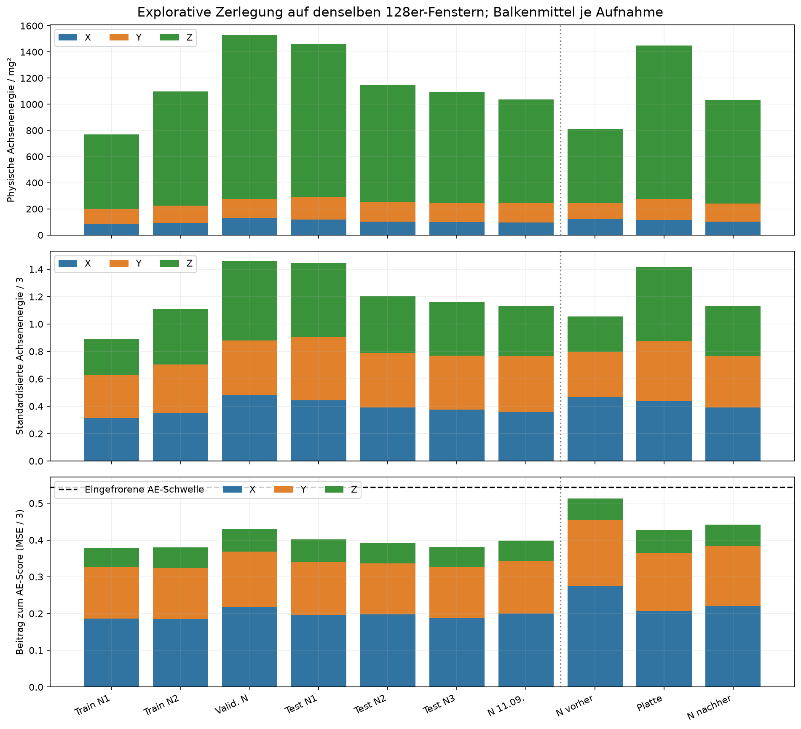
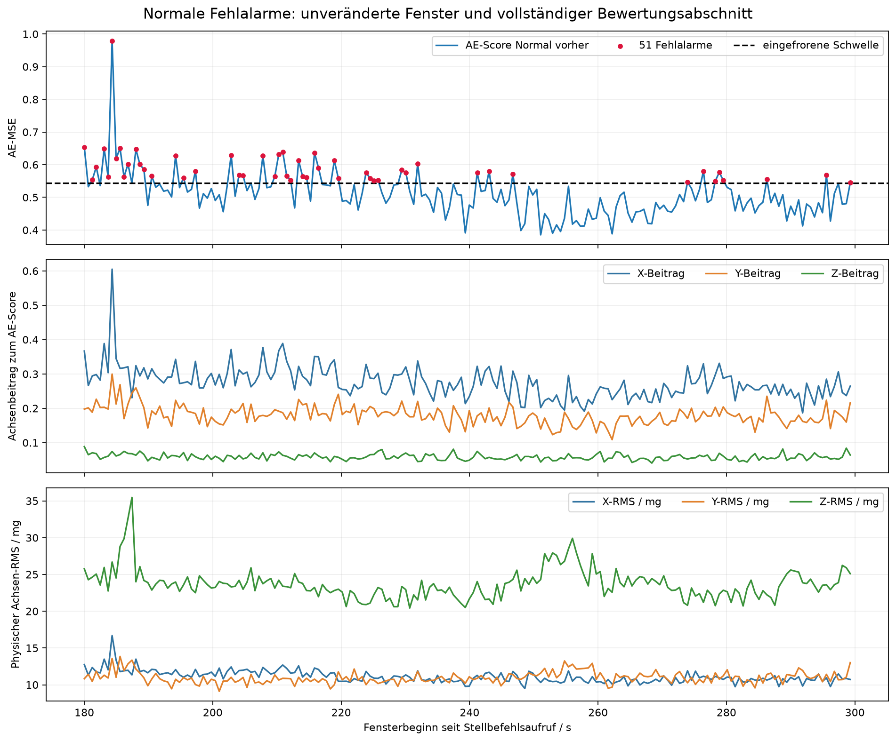
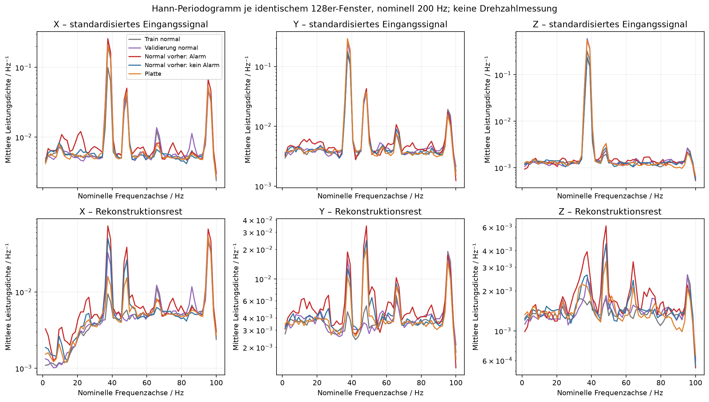
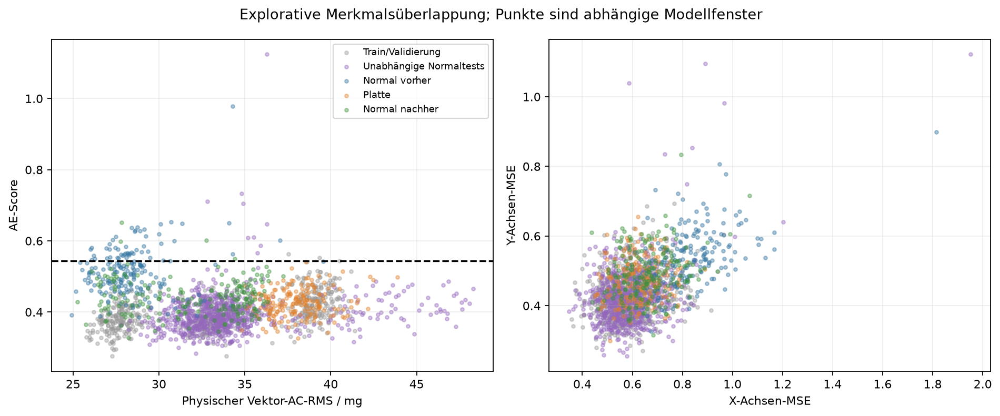

# Explorative Fehleranalyse des eingefrorenen v4-Pilotpakets

Die Entscheidungen sind numerisch nachvollziehbar. Der Plattenzustand erhöht überwiegend eine starke, gut rekonstruierbare Z-Komponente. Normale Fehlalarme entstehen dagegen überwiegend durch größere Rekonstruktionsreste in X und Y. Das Pilotpaket reagiert auf Rekonstruierbarkeit der standardisierten Signale, nicht unmittelbar auf gesamte Vibrationsstärke oder auf das semantische Label „Platte“.

Diese **nachträgliche explorative Analyse** erklärt vorhandene Testergebnisse. Sie ist kein neuer unabhängiger Test und keine Parameterwahl. Keine Aufnahme, kein Fenster, keine Schwelle und kein bisheriger Testabschnitt wurden verändert. Es gab keinen Sensorzugriff, keinen PWM-Befehl, kein Training und keine Anpassung des Scalers. Die vorausgehende vollständige Folge und ihre 5-s-Diagnostik bleiben [unverändert](../upright_v4_frozen_airflow_test_20260912_073015/complete_sequence_report.md).

## Datenbasis und Identität der Verarbeitung

Analysiert wurden **1.940 gültige 128er-Fenster aus zehn vollständigen v4-Aufnahmeidentitäten**, jeweils ausschließlich [180,300) s ab Stellbefehlsaufruf und Schrittweite 128. Darunter sind zwei Trainingsaufnahmen, die separate Normalvalidierung, drei unabhängige Normaltests, die weitere Normalaufnahme vom 11.09. und die aktuelle Dreierfolge. Historische Aufnahmen anderer Aufbauversionen wurden nicht gepoolt. Ungültige Fenster würden erhalten bleiben; hier gibt es keine. Die unveränderten Restpunkte liegen weiterhin in den Originaldateien.

Die ursprünglichen Float64-XYZ-Werte werden in der ursprünglichen Fensterlage und spaltenweisen Speicheranordnung gelesen. Danach werden achsenweise Mittelwerte entfernt, nach Float32 konvertiert und der gespeicherte Scaler angewandt. Für **582 Trainings-/Validierungsfenster** sind die AC-Arrays exakt gleich den vorbereiteten Arrays. Für **1.358 Testfenster × drei Methoden** stimmen erneut ausgeführte Scores und Entscheidungen exakt mit den archivierten Werten überein; maximale Scoreabweichung 0. Die separate Ausgabe der TFLite-Rekonstruktion ergibt exakt denselben Gesamt-MSE wie der eingefrorene Scorer. Algebraische Prüfungen und zwei bekannte Sinusfrequenzen prüfen die neue Diagnoseberechnung. [Prüfnachweis](verification.json), [Quellen mit Hashes](source_inventory.json), [Fensterdiagnostik](window_diagnostics.csv).

## Was den Unterschied erklärt

Die drei Größen sind verschieden:

* Physischer Vektor-AC-RMS: Wurzel der Summe der drei mittleren Achsenenergien in g².
* Standardisierter RMS-Score: Wurzel des Mittels über **128 × 3** quadrierte, skalierte Werte. Er ist dimensionslos.
* AE-Score: Mittel der quadrierten Float32-Rekonstruktionsreste über **128 × 3**, mit Float64-Akkumulation. Er entspricht dem Mittel der drei Achsen-MSE.

Der gespeicherte Scaler teilt X durch **9,4023 mg**, Y durch **11,1045 mg** und Z durch **26,8505 mg**. Die gespeicherten Mittelwerte liegen nahezu bei null. Bei gleicher physischer Achsenenergie ist das Gewicht in der standardisierten quadratischen Summe relativ zu Z deshalb X = **8,155**, Y = **5,847**, Z = **1**. Das ist eine belegte Eigenschaft des trainierten Scalers, kein Rechenfehler und keine nachträglich eingeführte Gewichtung.

Die folgende Tabelle enthält **Mittelwerte derselben 128er-Fenster**, ausdrücklich keine 5-s-Werte:

| Aufnahme | Vektor-AC-RMS / mg | X / Y / Z-RMS / mg | Standard-RMS | IF-Score | AE-MSE | X / Y / Z-Achsen-MSE |
|---|---:|---|---:|---:|---:|---|
| Train N1 | 27,697 | 9,118 / 10,743 / 23,832 | 0,9431 | 0,4402 | 0,3776 | 0,5604 / 0,4179 / 0,1545 |
| Train N2 | 33,115 | 9,648 / 11,429 / 29,533 | 1,0531 | 0,4549 | 0,3800 | 0,5552 / 0,4152 / 0,1695 |
| Normalvalidierung | 39,100 | 11,317 / 12,093 / 35,409 | 1,2081 | 0,4814 | 0,4296 | 0,6538 / 0,4511 / 0,1840 |
| Normal vorher | 28,408 | 11,114 / 10,972 / 23,698 | 1,0266 | 0,4534 | 0,5128 | 0,8247 / 0,5385 / 0,1751 |
| Platte | 38,025 | 10,790 / 12,650 / 34,186 | 1,1890 | 0,4796 | 0,4268 | 0,6219 / 0,4737 / 0,1847 |
| Normal nachher | 32,001 | 10,144 / 11,764 / 27,928 | 1,0618 | 0,4588 | 0,4421 | 0,6618 / 0,4924 / 0,1722 |

Von der zusätzlichen mittleren physischen Energie zwischen Normal vorher und Platte entfallen **94,97 % auf Z**. Die Z-Energie steigt von 565,74 auf 1.171,11 mg². Gleichzeitig sinkt die X-Energie geringfügig. Der AE-Score ändert sich um −0,0860: Beiträge dazu sind X **−0,06761**, Y **−0,02161**, Z **+0,00320**. Das erklärt den Rückgang des Gesamtfehlers algebraisch vollständig. In Normal vorher stammen **88,62 %** des gesamten Rekonstruktionsfehlers aus X und Y.

Die mittlere Korrelation zwischen Eingang und Rekonstruktion steigt mit Platte von 0,660 auf 0,728 für X, von 0,669 auf 0,798 für Y und von 0,884 auf 0,942 für Z. Der mittlere Quotient Achsen-MSE/standardisierte Eingangsenergie sinkt ebenfalls (X 0,588 → 0,472; Y 0,555 → 0,366; Z 0,228 → 0,114). Die stärkere Schwingung ist für dieses Modell somit teilweise leichter rekonstruierbar. Korrelation und Energiequotient sind deskriptive Diagnosewerte, keine separaten Gütemaße einer Defekterkennung.

## Wann die normalen Fehlalarme auftreten

| Fensterbeginn in Normal vorher | Fenster | AE-Fehlalarme | Mittlerer AE-Score |
|---|---:|---:|---:|
| [180,210) s | 49 | 22 | 0,5604 |
| [210,240) s | 49 | 18 | 0,5299 |
| [240,270) s | 48 | 3 | 0,4653 |
| [270,300) s | 48 | 8 | 0,4941 |

**40 der 51 Fehlalarme** liegen in den ersten 60 s des unveränderten Bewertungsabschnitts. Diese Fenster bleiben im Ergebnis; die Einlaufgrenze wird nicht verschoben. Die 51 Alarmfenster haben im Mittel X-RMS 11,868 mg gegenüber 10,845 mg in den übrigen 143 Fenstern. Der Z-RMS bleibt dagegen nahezu gleich (23,748 gegenüber 23,680 mg). X-Achsen-MSE: 0,9725 gegenüber 0,7721; Y: 0,6175 gegenüber 0,5103.

Innerhalb dieser einen Aufnahme korreliert der AE-Score deskriptiv mit X-RMS (Pearson r = 0,821), aber kaum mit Z-RMS (r = 0,002) und nur schwach mit physischem Vektor-RMS (r = 0,158). Die hohe Korrelation mit X-Achsen-MSE (0,921) ist teilweise schon durch dessen rechnerischen Anteil am Gesamt-MSE bedingt; sie ist keine kausale Entdeckung. Es werden keine p-Werte aus abhängigen Nachbarfenstern abgeleitet.

## Frequenzbefunde und Grenzen der Zeitbasis

Für jedes identische 128er-Fenster wurde ein Hann-Periodogramm ohne erneute Mittelwertentfernung nach der bereits erfolgten AC-Bereinigung berechnet. Die Darstellung nutzt zunächst **200 Hz nominell**, Frequenzraster **1,5625 Hz**. Der dominante Z-Bin ist in sämtlichen untersuchten Fenstern 37,5 Hz; auf einer aus Hostdurchsatz abgeleiteten Achse wären dies ungefähr 38,8 Hz. Das ist keine genaue Wandlungsfrequenz, Drehzahl oder gesicherte mechanische Ursache. Kein Resampling und keine Änderung der Modellzeitbasis. Die kurze Fensterlänge und der unbekannte physische Sensortakt begrenzen die Frequenzauflösung und Zuordnung.

Die Platten- und Validierungssignale zeigen ähnliche dominante Komponenten. Bei Z entfallen im Mittel **95,43 %** der Fenster-Spektralleistung im Plattenlauf auf den explorativ zusammengefassten Bereich 20–60 Hz; in der Normalvalidierung **95,46 %**. Bei den normalen Alarmfenstern sind es 89,40 %. Der Hauptpeak allein trennt die Zustände somit nicht.

Die normalen Fehlalarme haben höhere Rekonstruktionsreste an vorhandenen Komponenten, insbesondere in X um den nominellen 37,5-Hz-Bin und in X/Y um 46,875 Hz, sowie teilweise erhöhten niederfrequenten Rest. Beispielsweise beträgt die mittlere standardisierte X-Restleistungsdichte bei 37,5 Hz 0,0732 für normale Alarmfenster, 0,0504 ohne Alarm und 0,0159 mit Platte. Das beschreibt eine schlechtere Rekonstruktion derselben Frequenzregion, keinen neu nachgewiesenen Defektpeak. Ein pauschaler Hochfrequenzanteil erklärt die Fehlalarme nicht: Sein standardisierter Anteil korreliert innerhalb Normal vorher nur mit r = 0,098 mit dem AE-Score. Bandgrenzen und Gruppenbildung sind explorativ, keine neuen Entscheidungsregeln.

## Liegt die Platte bereits innerhalb bekannter Normalvariabilität?

**In vielen untersuchten Merkmalen ja; Training und Validierung müssen dabei getrennt werden.** Nur 13/194 Plattenfenster liegen im beobachteten physischen RMS-Bereich der zwei Trainingsaufnahmen. Dagegen liegen 188/194 im vereinigten Trainings-/Validierungsbereich und 194/194 im Bereich der früheren unabhängigen Normalaufnahmen. Die Normalvalidierung hatte bereits ein höheres mittleres Vibrationsniveau als der Plattenlauf.

Alle **194 AE-Scores** mit Platte liegen im beobachteten Bereich der Normalvalidierung, 180/194 sogar innerhalb des Trainingsbereichs. Der Plattenmittelwert 0,4268 ähnelt dem Validierungsmittel 0,4296. Auch der IF-Mittelwert ist ähnlich (0,4796 gegenüber 0,4814). Die eingefrorenen oberen Schwellen betragen RMS 1,2747695, IF 0,5045395 und AE 0,5443580; sie wurden anhand dieser bereits stärkeren Normalvalidierung festgelegt. Es ist daher nachvollziehbar, dass der Plattenzustand nur 7, 4 und 0 Schwellenüberschreitungen auslöst.

Der Vergleich mit Minima/Maxima ist nur eine deskriptive eindimensionale Überlappungsprüfung. Dass alle elf betrachteten Merkmale einzeln innerhalb früherer Normalbereiche liegen, beweist weder gemeinsame multivariate Zugehörigkeit noch identische Rohwellenformen. [Vollständige Überlappungstabelle einschließlich 5.–95. Perzentilen](normal_envelope_overlap.csv).

## Abschließende Diagnose und offene Ursachen

**Belegt:** Die implementierte Vorverarbeitung, Skalierung und Scoreberechnung reproduzieren den eingefrorenen Vergleich exakt. Der physische RMS-Anstieg stammt vor allem aus Z; der geringere AE-Fehler aus besserer X-/Y-Rekonstruktion. Normale Fehlalarme sind zeitlich konzentriert und mit höheren X-/Y-Fehlern verbunden. Die Platte liegt in wesentlichen Merkmalen nahe bereits bekannter Normalvariabilität. Das erklärt die beobachteten Entscheidungen; eine korrigierende Schwellenverschiebung ist dafür nicht erforderlich und nicht zulässig.

**Ungeklärt:** Warum sich konkrete mechanische Anregung, Achsenanteile oder Signalstruktur zwischen Starts ändern. Temperatur, Drehzahl, Lagerzustand, Resonanzen, Versorgungseinflüsse und verbleibende Montageeinflüsse sind ungemessene Möglichkeiten, keine bestätigten Ursachen. Die begrenzte Bandbreite und unbekannte genaue Sensorzeitbasis erlauben auch keine gesicherte Zuordnung einzelner Peaks oder eine allgemeine Aussage zur Aliasfreiheit. Der Vergleich zeigt keinen Codefehler als Ursache, schließt aber nicht jede denkbare Messkettenabweichung aus.

**Aussage über dieses Paket:** Technischer Offlinebetrieb und Konvertierungskonsistenz sind belegt; zuverlässige Erkennung des untersuchten Plattenzustands ist nicht belegt. Der AE ist zudem nicht gegenüber sämtlichen normalen Starts fehlalarmarm. Die früheren Null-Fehlalarm-Läufe gelten weiter jeweils für ihre eigenen Aufnahmen, nicht als allgemeine Zusicherung. Der Plattenzustand bleibt eine kontrollierte Luftstromveränderung und wird nicht rückwirkend zum Defekt umbenannt; keine nachträglichen Defekt-Recall- oder F1-Werte.

Eine neue Modellversion ist **keine Voraussetzung für einen wissenschaftlich ehrlichen Abschluss** dieses negativen Pilotbefunds. Falls später ein praktisch robuster Detektor entwickelt werden soll, wären zuerst repräsentativere unabhängige Normaldaten und eine überprüfbar abgrenzbare Zielveränderung nötig. Erst dann wären Merkmals-/Architekturänderungen als neue Entwicklungsversion zu prüfen. Diese bereits explorativ untersuchten Daten wären keine unabhängige Erfolgsprüfung der neuen Version. In diesem Auftrag wurde keine solche Version implementiert.

Die Diagnose ist damit auf der Ebene der vorhandenen Daten abgeschlossen. Die noch fehlenden Nachweise und der kleinste nächste Versuch stehen im [Nachweis- und Aufwandsplan](remaining_evidence_plan.md), das vorbereitete zweite Betriebspunktprotokoll in [second_pwm_protocol.md](second_pwm_protocol.md).
