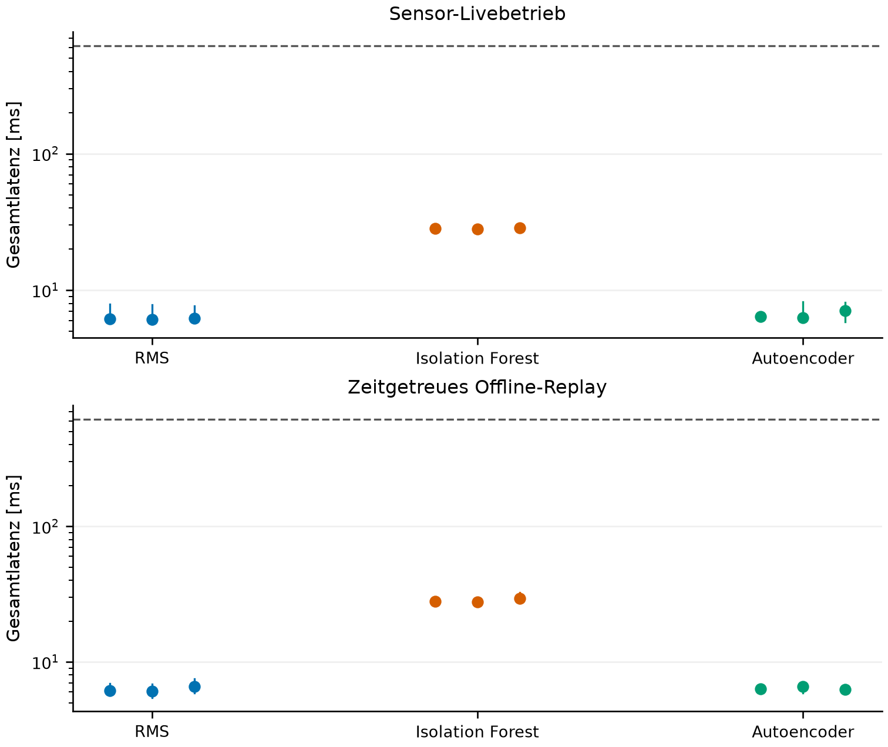

# Abschluss des v4-Pilotvergleichs und der Berichtsbearbeitung

Stand: 12.09.2026. Die im zuletzt freigegebenen Umfang selbstständig ausführbare Software-, Mess- und Dokumentationsarbeit ist abgeschlossen. Der eingefrorene Pilotstand wird mit seinen negativen und positiven Befunden erhalten. Das ist ein wissenschaftlich dokumentierter Pilotvergleich, kein vollständig validiertes Defekterkennungssystem. Ein weiterer Lüfterstart ist nicht vorgesehen.

## Ergebnis in verständlicher Form

Der Datenweg arbeitet im geprüften Umfang konsistent: Neue Rohfenster, gespeicherte Skalierung und Modellauswertung liefern im Sensorbetrieb dieselben Scores wie die eingefrorene Offline-Referenz. Die Verfahren haben jedoch unterschiedliche fachliche Schwächen. Der Autoencoder meldet in einer normalen Referenz 51 von 194 Fenstern als auffällig und im Plattenzustand keines. Stärkere physische Vibration ist daher kein zuverlässiger Ersatz für einen Anomaliescore.

Die explorative Fehleranalyse erklärt die Entscheidungen anhand der tatsächlichen Eingaben: Die Platte erhöht vor allem den Beitrag der Z-Achse. Deren gespeicherter Skalierungsfaktor ist größer, wodurch sie relativ schwächer gewichtet wird. Gleichzeitig sind die mittleren Rekonstruktionsfehler von X und Y im Plattenzustand kleiner. Die untersuchten Merkmale des Plattenzustands überschneiden sich außerdem mit bereits bekannten normalen Entwicklungsdaten. Die genaue mechanische Ursache bleibt ungeklärt. Weder Schwellen noch Testabschnitte wurden nachträglich angepasst.

## Abgeschlossene Nachweise

| Prüfung | Tatsächlicher Umfang und Ergebnis |
|---|---|
| Zweiter normaler Betriebspunkt | Drei unabhängige 300-s-Starts bei 50 % PWM, unverändertes Paket; je 194 gültige Fenster. Fehlalarme: RMS 3/582 = 0,52 %, IF 1/582 = 0,17 %, Autoencoder 35/582 = 6,01 %. |
| Vergleich mit 75 % | Vorab zugeordnete sechs Normalreferenzen mit zusammen 1.164 gültigen Fenstern: RMS 5,15 %, IF 3,01 %, Autoencoder 5,50 %. Die Serien sind nicht zeitgleich/randomisiert; daraus folgt keine allgemeine kausale PWM-Wirkung. |
| Laufzeit im Sensorbetrieb | Drei eigene Prozesse je Methode, jeweils 300 s Rohaufnahme; Bewertung ausschließlich [180,300) s. Zusammen neun Starts und 1.746 gültige Entscheidungen. |
| Zeitgetreues Offline-Replay | Drei eigene Prozesse je Methode auf derselben gespeicherten Normalaufnahme: weitere neun Prozesse und 1.746 Entscheidungen. Keine zusätzlichen physikalischen Replikate. |
| Numerische Konsistenz | Alle 3.492 gültigen Scores stimmen exakt mit der eingefrorenen Offline-Verarbeitung derselben Rohfenster überein; keine Entscheidungsabweichung. |
| Daten-/Pufferqualität | In der neuen Matrix keine gemeldeten Gap-, Overrun- oder Sättigungsflags, keine verworfenen/unverarbeiteten Entscheidungsfenster und keine ungültigen Entscheidungen. Unbekannte physische Verluste bleiben unbekannt. |
| Fehlerpfade | 15 gezielte Softwaretests der Verarbeitung plus drei Tests der Ablaufsteuerung bestanden; darunter Qualitätsfehler, Queue-Überlast und Rückstellung bei Fehler/Unterbrechung. |
| Integrität | 1.506 zuvor vorhandene geschützte Dateien unverändert, keine fehlende Datei; eingefrorene Modelle, Scaler, Schwellen und gepinnte Quellmodule unverändert. |

Die Modellfenster bestehen weiterhin aus 128 XYZ-Punkten, Schrittweite 128, ohne Überlappung oder Überschreiten einer Aufnahmegrenze. Vorverarbeitung: achsenweise Mittelwertentfernung in Float64, anschließend Float32 und gespeicherter Scaler. Benachbarte Fenster werden nicht als unabhängige Wiederholungen behandelt.

### Gemessener Aufwand im Sensorbetrieb

Die Bereiche umfassen jeweils drei vollständige Prozesse. CPU bezieht sich auf den aktiven Abschnitt [180,300) s; 100 % entsprechen einem logischen Kern.

| Methode | P99 gesamte Verarbeitung [ms] | Mittlere CPU [% eines Kerns] | maximaler Prozess-RSS [MiB] |
|---|---:|---:|---:|
| RMS | 6,113–6,203 | 5,02–5,12 | 75,47–75,48 |
| Isolation Forest | 27,896–28,577 | 8,59–8,62 | 171,00 |
| TFLite-Autoencoder | 6,261–7,062 | 5,02–5,16 | 86,30–86,42 |

Das beobachtete Fensterintervall liegt bei ungefähr 618 ms. Unter den 1.746 gültigen Sensorentscheidungen trat keine Überschreitung dieses Intervalls auf. Die Latenz beginnt beim Host-Abschluss des letzten XYZ-Punkts; Fensterfüllzeit und unbekannte Sensorwandlungsverzögerung liegen davor. Dies ist ein endlicher Linux-Messnachweis, keine harte Echtzeitgarantie.

Die nominelle ODR bleibt 200 Hz; die neun neuen Sensorläufe liefern beobachtet 207,077–207,103 XYZ/s. Erste Punkte liegen rund 81–98 ms nach dem Stellbefehl. Die längste Host-Lesepause beträgt 30,278 ms. Vollständige Punktzahlen, Auszeiten, Ressourcenreihen, Rechenkern-/Transferanteile und Hashes stehen im [Laufzeitbericht](runtime_analysis/runtime_report.md).

Der RSS nimmt im aktiven Sensorabschnitt um 1,219–1,844 MiB zu. Eine getrennte [explorative Speicherprobe](memory_probe_report.md) erklärt, warum RSS und aktuell erfasste Python-Allokationen nicht gleichgesetzt werden dürfen. Sie beweist weder unbegrenztes Speicherwachstum noch eine allgemeine Speicherobergrenze. Die Implementierung wurde nach den Messungen nicht verändert, um diesen Befund zu verdecken.

## Fertige Dokumente und Formatprüfung

Die [Worddatei](../../docs/Akz_Masterarbeit_Bericht(3).docx) enthält nun Kapitel 6–10 mit Implementierung, Evaluation, Diskussion, Ausblick und Fazit, einen Beleganhang sowie das zu den vorhandenen Zitaten ergänzte Literaturverzeichnis. Der [PDF-Export](thesis_final.pdf) umfasst 66 Seiten, 34 Tabellen einschließlich Abkürzungsverzeichnis, 33 nummerierte Tabellenbeschriftungen und sechs Grafiken.

Der Wortlaut der Hauptkapitel 1–5 und die mathematische Struktur ihrer drei Gleichungen sind gegenüber der [Ausgangskopie](../../docs/backups/Akz_Masterarbeit_Bericht(3)_vor_abschluss_20260912_103145.docx) erhalten. Kapitelnummerierung 1–10, römische Vorseiten, arabische Hauptseiten, sämtliche Einträge der drei Verzeichnisse und eindeutige Beschriftungen sind geprüft. Alle PDF-Seiten wurden als Kontaktübersichten und die kritischen Formeln/Grafiken/Tabellen zusätzlich vergrößert kontrolliert; die Textgrenzenprüfung meldet keine Überläufe am Seitenrand.

Bei der Prüfung wurde die fehlende LibreOffice-Math-Komponente ergänzt, weil der erste Export Formeln nicht darstellte. Es wurden nur `libreoffice-math` und `libreoffice-uiconfig-math` nach den Laufzeitmessungen installiert; keine vorhandenen Pakete aktualisiert. Der fehlerhafte erste Export ist als Diagnosefassung separat erhalten. Die finale Fassung enthält die Formeln korrekt.

Die vorhandene alte Unterschriftsgrafik wurde in der neu bearbeiteten Fassung nicht als erneute Bestätigung übernommen; sie bleibt in der Ausgangskopie erhalten. Datum und Unterschrift sind in der aktuellen Erklärung leer. Der Autor muss den Inhalt, das Literaturverzeichnis und die zutreffende Angabe der verwendeten Hilfsmittel selbst prüfen, bevor er die Erklärung unterschreibt. Das ist keine Aufgabe, die eine technische Bearbeitung stellvertretend abschließen kann.

Neue deskriptive Verwechslungszahlen für das vorab vergebene Plattenlabel stehen transparent im Anhang. Sie stammen aus vorhandenen Entscheidungen der einen Normal–Platte–Normal-Folge und sind ausdrücklich keine allgemeine Defektleistung. Historische Berichte und Daten wurden nicht umgeschrieben.

## Priorisierte verbleibende Grenzen und nächster Schritt

1. **Für den Berichtsabschluss:** Kapitel 6–10 und die Bewertung der teilweise erfüllten Muss-Anforderungen mit dem Betreuer fachlich durchsehen. Die schlechte Plattenerkennung bleibt ein Ergebnis. Weitere gleichartige Normalstarts sind nicht erforderlich, um dieses Pilotpaket ehrlich abzuschließen.
2. **Für einen vollständigeren physikalischen Nachweis:** Die Abweichung 200 Hz/etwa 207 XYZ/s unabhängig referenzieren; tatsächliche Drehzahl und Signalform sind weiterhin ungemessen. Ein vorhandener PWM-Wert ersetzt diese Messungen nicht.
3. **Für weitergehende Erkennungsaussagen:** Vorab eine sichere, klar definierte Zieländerung und mehrere ganze unabhängige Folgen planen. Eine Platte ist ein veränderter Betriebszustand, kein nachgewiesener Defekt. Eine neue Modellversion würde neue Entwicklungsdaten und anschließend neue, unbenutzte Tests benötigen; sie wurde nicht begonnen.
4. **Nur für einen erweiterten Betriebsumfang:** Längerer Dauerbetrieb und optionale GUI-Zusatzlast separat untersuchen. Das neue Paket ist im Sensorweg ohne GUI geprüft. Das ist kein Nachweis seiner Anzeige-/Bedienintegration oder unbegrenzter Speicherstabilität.

**Kleinster sinnvoller nächster Schritt:** zunächst die vorliegende Abschlussfassung lesen und den zulässigen Aussageumfang abstimmen; dafür muss der Aufbau nicht verändert werden. Falls der Sensortaktnachweis zusätzlich verlangt wird, genügt als kleinster gezielter Versuch eine kurze, beispielsweise 60-s-Erfassung mit unabhängig gemessenem Data-Ready-Takt und gleichzeitig unverändertem FIFO-Datenweg. Ein dafür geeigneter Referenzanschluss und Messmittel sind erst noch vorzubereiten; dieser Versuch benötigt keinen absichtlich veränderten Rotorzustand. Eine neue Montage oder eine kleinere PWM ohne konkrete Prüfentscheidung würde die offenen Fragen nicht gezielt beantworten.

### Aufwand ab diesem Stand – Schätzungen, keine bereits ausgeführten Arbeiten

| Umfang | Software-/Berichtsarbeit | Messzeit | Manuelle Vorbereitung |
|---|---|---|---|
| Fachlicher Abschluss des vorhandenen Piloten | Technische Bearbeitung erledigt; etwa 1–3 h eigene Durchsicht und gegebenenfalls redaktionelle Rückmeldung | Keine neue Messung notwendig | Bericht und Erklärung prüfen; Aufbau unverändert lassen |
| Optionaler unabhängiger Sensortaktnachweis | Etwa 2–4 h für Referenzimport, Zeitabgleich und Dokumentation | Etwa 1–5 min Rohaufnahme nach erfolgreicher Einrichtung | Etwa 30–90 min für geeignetes Messgerät, bestätigte Signalanbindung und Vorbereitung bei getrennter Versorgung; Verfügbarkeit derzeit unbekannt |
| Optionale drei unabhängige Normal–Änderung–Normal-Folgen | Etwa 2–4 h für vorab fixiertes Protokoll, Import und Bericht bei unverändertem Modell | 45 min reine Aufnahme plus mindestens 9 min zusätzliche Auszeit und tatsächliche Umbaupausen | Sechs kontrollierte Umbauten; Aufwand hängt von der vorher festzulegenden Änderung ab |
| Optionale GUI-/Dauerbetriebsprüfung | Etwa 4–8 h für Integration und neue Instrumentierung; Umfang zuerst festlegen | Zusätzlich eigene längere Laufzeitreihe; noch nicht festgelegt | Unveränderter freigegebener Prüfstand; keine automatische Erkennungsabschaltung im Vergleich |

## Endzustand und digitale Nachweise

Am 12.09.2026 um **14:32:50 Uhr (Europe/Berlin)** wurde nochmals **0 % PWM bei 25 kHz** eingestellt und zurückgelesen: Periodendauer 40.000 ns, Tastzeit 0 ns, Kanal aktiviert, GPIO18 in Funktion PWM0_CHAN2. Kein weiterer Start ist vorgesehen. Eine neue mechanische Stillstandsbeobachtung liegt nicht vor und wird nicht behauptet. Siehe [Steuerungsstatus](final_control_status.json).

Die neue Laufzeitmatrix enthält 90 Minuten reine Erfassung/Wiedergabe: 45 Minuten Sensoraufnahmen und 45 Minuten Wiedergabe. Hinzu kamen die dokumentierten Auszeiten und Prozessvorbereitungen. Der vorher abgeschlossene zweite Betriebspunkt umfasst weitere 15 Minuten Rohaufnahme. Speicherdiagnose, Scoreabgleich und Dokumentrendering fanden nach der Messmatrix statt.

- [Abschlussprüfung und Hash-Erhaltung](completion_verification.json)
- [Laufzeitbericht mit Einzelprozessen](runtime_analysis/runtime_report.md)
- [Zweiter Betriebspunkt 50 % und Vergleich zu 75 %](../upright_v4_second_pwm50_20260912_091000/result_summary.md)
- [Explorative Fehleranalyse der Plattenerkennung](../upright_v4_exploratory_diagnosis_20260912_081728/diagnosis_report.md)
- [Unabhängige Plattenfolge](../upright_v4_frozen_airflow_test_20260912_073015/complete_sequence_report.md)
- [Ergänzende deskriptive Zustandskennzahlen](controlled_state_descriptive_metrics.json)

Es wurde nicht neu trainiert, nicht nachkalibriert und nichts veröffentlicht. Der aktuelle Arbeitsbaum bleibt lokal zur Prüfung verfügbar.

Die Einzelheiten der Dokumentprüfung stehen in [document_review_report.md](document_review_report.md).
