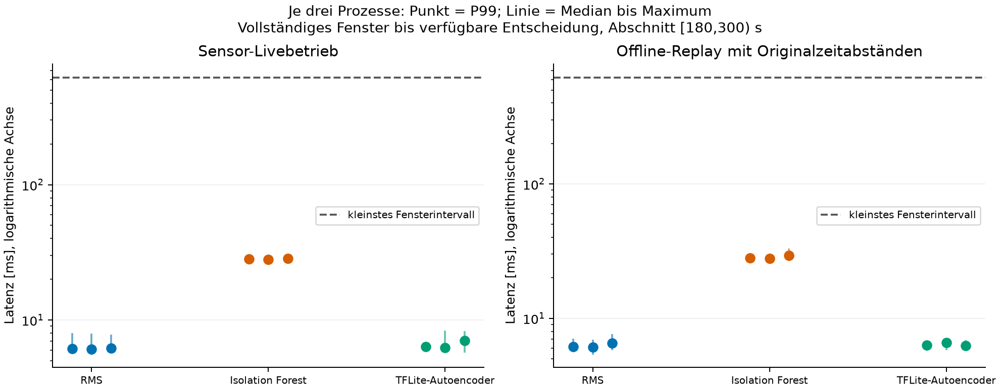
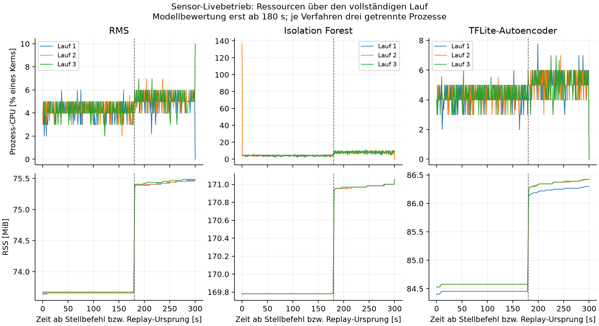
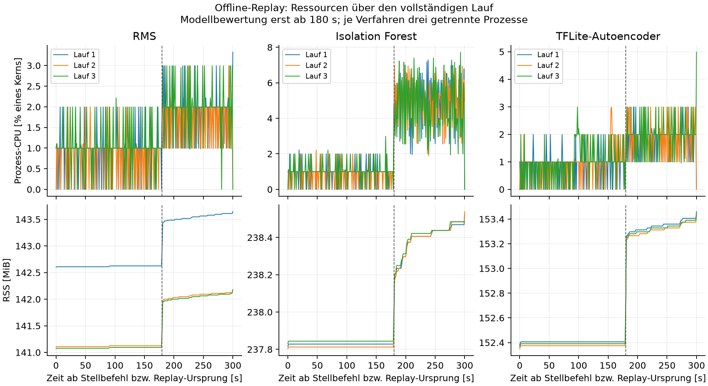

# Abschließender Nachweis des lokalen Datenwegs für Aufbau v4

Die Laufzeitprüfung verwendet das unveränderte, eingefrorene Pilotpaket. Sie ergänzt die Erkennungstests um Sensor-Livebetrieb und zeitgetreues Offline-Replay. Sie ist kein Nachtraining und keine neue Bewertung einer Defektklasse.

Protokoll-SHA-256: `7e3d0bc807b0d4b9868d4bf507dac944ecc015bc65bc595f2f77981d899f1da6`. Protokoll vor dem ersten Lauf fixiert; vollständige Artefakthashes in `analysis.json`.

## Messumfang und Grenzen

Je Methode und Betriebsart wurden drei eigene Prozesse vorgesehen. Die Methodenreihenfolge ist über die drei Wiederholungen rotiert. Sensorläufe verwenden unveränderten Aufbau v4 ohne Platte, 75 % PWM bei 25 kHz und nominell 200 Hz. Je Start werden 300 s Rohdaten gespeichert. Nach jeweils mindestens 60 s zusätzlicher Vorgabe 0 % folgt ein einzelner Start; gesamte Auszeiten werden gesondert angegeben. Neue mechanische Sichtprüfungen wurden im ausdrücklich freigegebenen unbeaufsichtigten Ablauf nicht behauptet.

Die Modellbewertung beginnt gemäß eingefrorenem Vertrag bei 180 s und endet vor 300 s. Damit werden je Prozess nur 120 s aktiver Modellverarbeitung gemessen. Der gesamte Anlauf wird erfasst, jedoch nicht vom Modell bewertet. 180 s bleiben eine vorläufige Messabschnittswahl. 20 synthetische Modellaufrufe zum Aufwärmen erfolgen vor dem Lüfterstart; sie passen keine Parameter an.

Offline-Replay verwendet in allen neun Prozessen dieselbe bereits vorhandene Aufnahme und ihre ursprünglichen Host-Abstände. Es sind keine neuen physikalischen Replikate. Die Sensorläufe verwenden eigene neue Rohdaten. Für den Aufwand je Methode laufen die anderen beiden Methoden jeweils nicht im selben Prozess. Diese neuen Läufe sind deshalb kein Vergleich ihrer Erkennungsleistung auf identischen neuen Signalen.

Beim Replay wird die gesamte Quelldatei vor Beginn in einen DataFrame und eine Liste von Datensätzen geladen. Dieser belegte Zusatzspeicher gehört zur Replay-Implementierung; er ist keine Modelldateigröße und kein direkter Maßstab für die stromweise Sensorerfassung. Der kontinuierliche Ressourcenmonitor umfasst die Erfassung/Wiedergabe; Modellstart und abschließendes Laden der gespeicherten Sensor-CSV liegen außerhalb dieses Verlaufs und sind durch getrennte Umgebungssnapshots beziehungsweise Ladezeiten dokumentiert.

Keine grafische Oberfläche war beteiligt. Die optionale frühere GUI ist damit nicht als Teil dieses validierten Datenwegs nachgewiesen. Hintergrund: gewöhnliche Betriebssystemdienste sowie kurze lesende Statusabfragen und leichte Dokumentvorbereitung; keine parallel absichtlich laufenden Trainings-, Test- oder Rendering-Benchmarks. Der Rechner ist kein abgeschottetes Echtzeitsystem.

## Ergebnisse je vollständigem Prozess

| Modus / Methode / Lauf | gültig / ungültig | verworfen / unverarbeitet | P99 gesamt [ms] | P99 Rechenkern [ms] | Fristüberschreitungen | CPU aktiv [% Kern] | max. RSS aktiv [MiB] |
|---|---:|---:|---:|---:|---:|---:|---:|
| sensor_live / rms / 1 | 194 / 0 | 0 / 0 | 6.162 | 0.049 | 0 | 5.02 | 75.47 |
| sensor_live / isolation_forest / 1 | 194 / 0 | 0 / 0 | 28.320 | 22.035 | 0 | 8.60 | 171.00 |
| sensor_live / tflite_autoencoder / 1 | 194 / 0 | 0 / 0 | 6.383 | 0.114 | 0 | 5.16 | 86.30 |
| sensor_live / isolation_forest / 2 | 194 / 0 | 0 / 0 | 27.896 | 22.004 | 0 | 8.59 | 171.00 |
| sensor_live / tflite_autoencoder / 2 | 194 / 0 | 0 / 0 | 6.261 | 0.101 | 0 | 5.08 | 86.42 |
| sensor_live / rms / 2 | 194 / 0 | 0 / 0 | 6.113 | 0.045 | 0 | 5.12 | 75.47 |
| sensor_live / tflite_autoencoder / 3 | 194 / 0 | 0 / 0 | 7.062 | 0.086 | 0 | 5.02 | 86.42 |
| sensor_live / rms / 3 | 194 / 0 | 0 / 0 | 6.203 | 0.048 | 0 | 5.04 | 75.48 |
| sensor_live / isolation_forest / 3 | 194 / 0 | 0 / 0 | 28.577 | 22.049 | 0 | 8.62 | 171.00 |
| offline_replay / rms / 1 | 194 / 0 | 0 / 0 | 6.149 | 0.046 | 0 | 1.84 | 143.61 |
| offline_replay / isolation_forest / 1 | 194 / 0 | 0 / 0 | 28.016 | 21.884 | 0 | 5.32 | 238.47 |
| offline_replay / tflite_autoencoder / 1 | 194 / 0 | 0 / 0 | 6.321 | 0.111 | 0 | 1.80 | 153.41 |
| offline_replay / isolation_forest / 2 | 194 / 0 | 0 / 0 | 27.802 | 21.920 | 0 | 5.28 | 238.48 |
| offline_replay / tflite_autoencoder / 2 | 194 / 0 | 0 / 0 | 6.587 | 0.116 | 0 | 1.88 | 153.38 |
| offline_replay / rms / 2 | 194 / 0 | 0 / 0 | 6.077 | 0.045 | 0 | 1.65 | 142.12 |
| offline_replay / tflite_autoencoder / 3 | 194 / 0 | 0 / 0 | 6.236 | 0.099 | 0 | 1.99 | 153.39 |
| offline_replay / rms / 3 | 194 / 0 | 0 / 0 | 6.558 | 0.057 | 0 | 2.04 | 142.12 |
| offline_replay / isolation_forest / 3 | 194 / 0 | 0 / 0 | 29.325 | 22.957 | 0 | 5.06 | 238.48 |

CPU: 100 % entspricht einem vollständig ausgelasteten logischen Kern, nicht dem gesamten Vierkernrechner. RSS ist Prozessspeicher einschließlich Python, Bibliotheken, Erfassung und Protokollierung; er ist keine reine Modellgröße. Die zeitgewichtete CPU-Auslastung bezieht sich auf [180,300) s. Die vollständigen Ressourcenreihen werden separat erhalten.

Rechenkern: RMS-Berechnung, `IsolationForest.score_samples` oder ausschließlich `Interpreter.invoke`. Tensorübertragung sowie AE-Fehlerberechnung sind außerhalb des AE-Rechenkerns separat gemessen. Die gesamte Latenz beginnt beim Host-Abschluss des letzten XYZ-Punkts im Fenster und umfasst Rohdatenübergabe, Fensteraufbau, Qualitätsprüfung, Float64-Mittelwertentfernung, Queue, gespeicherte Standardisierung und Entscheidung. Sie endet vor dem Schreiben der Entscheidung ins Journal. Die Fensterfüllzeit und noch nicht am Host sichtbare Sensor-/FIFO-Zeit sind nicht enthalten.

## Zeitbasis, Datenqualität und Auszeiten

| Sensorlauf | XYZ | beobachtet [XYZ/s] | erster Punkt nach Befehl [ms] | längster Host-Abstand [ms] | Gap / Overrun / Sättigung | gesamte vorherige 0-%-Zeit [s] |
|---|---:|---:|---:|---:|---:|---:|
| sensor_live_rms_01 | 62126 | 207.088218 | 91.271 | 9.466 | 0 / 0 / 0 | unbekannt |
| sensor_live_isolation_forest_01 | 62125 | 207.085270 | 97.750 | 29.795 | 0 / 0 / 0 | 80.852 |
| sensor_live_tflite_autoencoder_01 | 62122 | 207.077267 | 81.215 | 8.945 | 0 / 0 / 0 | 78.244 |
| sensor_live_isolation_forest_02 | 62124 | 207.083938 | 88.635 | 29.517 | 0 / 0 / 0 | 80.782 |
| sensor_live_tflite_autoencoder_02 | 62130 | 207.103048 | 93.857 | 9.670 | 0 / 0 / 0 | 78.279 |
| sensor_live_rms_02 | 62126 | 207.087490 | 89.258 | 9.404 | 0 / 0 / 0 | 79.544 |
| sensor_live_tflite_autoencoder_03 | 62127 | 207.092912 | 93.644 | 10.088 | 0 / 0 / 0 | 79.586 |
| sensor_live_rms_03 | 62123 | 207.080149 | 89.131 | 9.226 | 0 / 0 / 0 | 79.398 |
| sensor_live_isolation_forest_03 | 62127 | 207.092741 | 93.502 | 30.278 | 0 / 0 / 0 | 80.790 |

Nominelle Sensor-ODR: 200 Hz. Beobachteter Durchsatz: (XYZ-Punkte − 1) / Zeit zwischen erstem und letztem Host-Zeitstempel. Ein XYZ-Punkt enthält drei einzelne Achsenwerte. Sampleindex/200 ist nur eine rechnerische Sensorzeit. Die monotone Host-Zeit und die daraus abgeleitete relative CSV-Zeit werden getrennt geprüft. Die Abweichung von ungefähr 3,5 % ist nicht durch das Zählen der drei Achsen erklärbar. Ein unbekannter Sensortakt und unbekannte physische Verluste werden nicht nachträglich durch eine korrigierte Sollrate ersetzt.

Zwischen vollständigen Fenstern wurden zusätzlich der Abstand vom letzten XYZ-Punkt zum ersten Punkt des Folgefensters sowie die Zeit zwischen zwei vollständigen Fensterankünften geprüft. Diese Host-Abstände stehen je Lauf in analysis.json. Ein solcher Abstand ist kein unabhängig gemessener Stillstand der Sensorwandlung; verworfene Entscheidungen werden bei der Prüfung der Rohfenstergrenzen nicht übergangen.

Die dargestellten Auszeiten beginnen bei der vorigen abgeschlossenen 0-%-Rückstellung. Sie sind softwareseitige Auszeiten, keine gemessene mechanische Stillstandsdauer. PWM-Rücklesung und mechanischer Zustand sind verschiedene Nachweise; die Drehzahl bleibt unbekannt.

## Ressourcenverlauf und numerische Konsistenz

Für 3492 ausgegebene gültige Scores wurde der identische eingefrorene Offline-Datenweg erneut auf genau denselben Rohfenstern angewendet. Die maximale absolute Scoreabweichung beträgt 0.0; auch die Entscheidungen stimmen überein. Dies ist eine Software-Konsistenzprüfung, keine unabhängige Erkennungsvalidierung.

Die begrenzte Queue fasst vier vollständige Fenster; bei Überlast wird das neue Entscheidungsfenster mit Ereignisprotokoll verworfen, während die Rohdaten erhalten bleiben. Bereits vor der Hardwareprüfung wurden Qualitätsfehler, Queue-Überlast, Quellenfehler, Float64/Float32-Gleichheit und die 0-%-Rückstellung bei Fehler beziehungsweise Unterbrechung mit Softwaretests geprüft. Reale Nullbefunde der Flags beweisen keine physikalische Verlustfreiheit.

## Schlussfolgerung und verbleibender Umfang

Der RSS-Unterschied zwischen erster und letzter Ressourcenprobe in [180,300) s beträgt im Sensorbetrieb 1.219 bis 1.844 MiB. Ein positiver Verlauf wird ausdrücklich erhalten. Null Rückstand und kein Speicherabbruch in 300 s belegen für sich keinen stationären Speicherbedarf; eine Speicherleck-Ursache wird aus RSS allein nicht abgeleitet. Eine gegebenenfalls anschließende instrumentierte Speicherdiagnose ist vom Benchmark getrennt und verändert seine Messwerte nicht.

H2 ist im definierten Sensor-Liveumfang erfüllt: Maßstab ist das empirische P99 gegenüber dem pro Lauf beobachteten Fensterintervall. Insgesamt wurden 0 Überschreitungen unter 1746 gültigen Entscheidungen gezählt. Eine harte Echtzeitgarantie oder ein Nachweis über industriellen Dauerbetrieb folgt daraus nicht.

Die Sensorläufe meldeten insgesamt 0 verworfene Entscheidungsfenster, 0 unverarbeitete Fenster und 0 ungültige Entscheidungen. Speicher- und Rückstandsverläufe werden für die gemessene Dauer beurteilt; ein endlicher Lauf beweist keine allgemeine Speicherobergrenze über unbegrenzte Laufzeiten.

Die bisherigen Fehlalarme und die schwache Erkennung des Plattenzustands bleiben unverändert gültige Ergebnisse. Für eine gesicherte Defekterkennung fehlen weiterhin passende unabhängige Defektaufnahmen. Die fehlende Drehzahlmessung und nicht vollständig geklärte physische Zeitbasis begrenzen die Interpretation. Diese Punkte werden als nicht oder nur teilweise erfüllte Nachweise in der Arbeit ausgewiesen. Ein erneut geändertes Modell benötigte eine neue Version und neue, zuvor ungenutzte Tests.

Empfehlung: Das unveränderte Pilotpaket mit diesen Grenzen abschließend dokumentieren. Keine weitere Wiederholung derselben Normalaufnahme zur Verbesserung von Kennzahlen. Ein späterer Defektversuch oder ein genauer Drehzahl-/Sensortaktnachweis ist ein eigener, vorher festzulegender Messauftrag mit geeigneter zusätzlicher physischer Vorbereitung.
