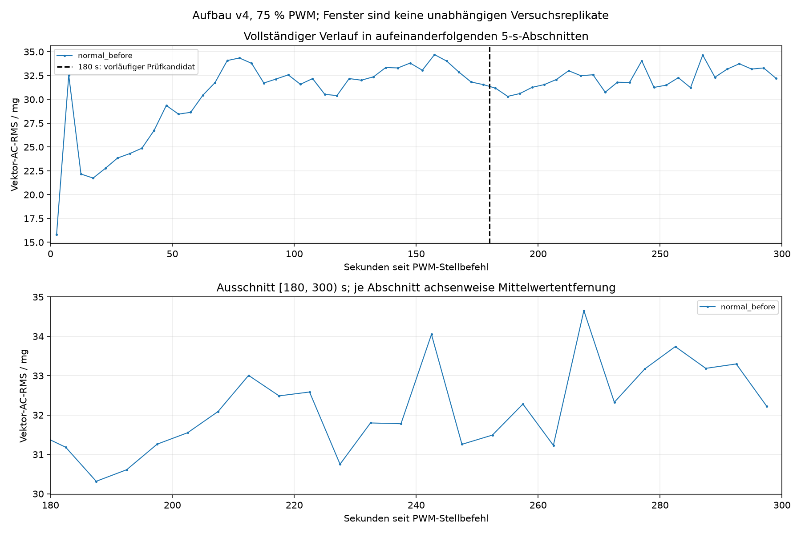
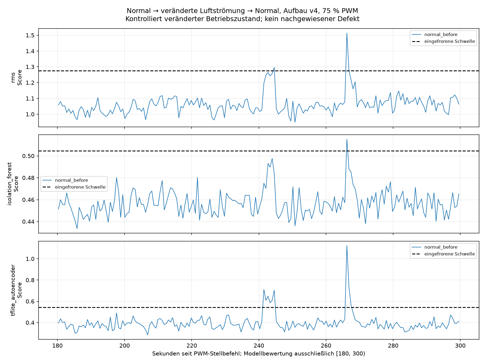

# Zwischenstand: erste Normalreferenz des eingefrorenen Plattenpiloten

Phase normal_before ist vollständig abgeschlossen und ausgewertet. Die Plattenphase und Rückkehrreferenz sind noch nicht aufgenommen. Keine neue Phase ist bereits freigegeben.

Aufnahme-ID: `normal_before_75pwm_300s_20260911_165633_681800`. Aufbau v4, ohne Platte, 75 % PWM bei 25 kHz. Nach der Aufnahme wurden 0 % eingestellt und zurückgelesen. Mechanischer Stillstand nach diesem Lauf ist noch nicht bestätigt.

62134 vollständige XYZ-Punkte (186402 Achsenwerte), 299.989720550 s Hostzeitspanne; nominell 200 Hz, beobachtet 207.117097 XYZ/s. Erster XYZ-Leseabschluss 359.989037 ms nach Stellbefehlsaufruf; der Befehl selbst benötigte einen Teil dieses Versatzes. Der Versatz ist größer als in den vorausgegangenen Normalläufen und bleibt ausdrücklich dokumentiert, liegt aber unter der vorab festgelegten Grenze von 1 s.

Zusätzliche Auszeit ab Freigabe: 60.085976872 s. Gesamtes Softwareintervall seit der gehashten vorherigen 0-%-Referenz: 1447.803610348 s. Mechanische Stopp-, Stromtrennungs- und Abkühlintervalle sind dadurch nicht gemessen.

Kein gesetztes Lücken-, Überlauf- oder Sättigungsflag, keine nichtmonotonen Zeitstempel. Maximaler Host-Leseabstand 10.096460 ms, 1 Abstand über 10 ms, keiner über 160 ms; maximaler FIFO-Füllstand 2. Genaue physische Verluste bleiben unbekannt. Die Aufnahme besteht die eingefrorene Qualitätsprüfung.

Bewertung ausschließlich [180,300) s, 128 XYZ-Punkte pro Fenster, Schritt 128, Float64-Mittelwertentfernung je Achse und Fenster, dann Float32 und gespeicherter Scaler. Alle Methoden erhalten identische Eingabefenster; Modelle und Schwellen unverändert.

| Methode | Gültig | Ungültig | Fehlalarme | Fehlalarmrate |
|---|---:|---:|---:|---:|
| RMS | 194 | 0 | 2 | 1.03 % |
| Isolation Forest | 194 | 0 | 1 | 0.52 % |
| TFLite-Autoencoder | 194 | 0 | 9 | 4.64 % |

In dieser neuen normalen Aufnahme treten auch beim Autoencoder Fehlalarme auf. Die vorherige separate Dreistartprüfung mit dort 0/582 AE-Fehlalarmen bleibt unverändert; sie hatte keine allgemeine Fehlalarmfreiheit belegt. Die jetzigen Ergebnisse werden nicht zum Ändern der Modelle, Schwellen oder Abschnittsauswahl verwendet.

Alle 60 5-s-Abschnitte sind nach den festgelegten Regeln gültig. Für die 24 Abschnitte in [180,300): Vektor-AC-RMS-Mittel 32.180669 mg, Stichprobenstandardabweichung 1.123479 mg, beobachteter Bereich 30.317304–34.654711 mg. Deskriptive lineare Steigung 1.116511 mg/min; Mittel der zweiten Minute liegt um 1.123557 mg höher als das der ersten. Das ist ein zeitlicher Befund innerhalb eines Laufs, kein Nachweis einer Ursache. 180 s bleiben eine vorläufige Einlaufzeit und die 5-s-Abschnitte keine unabhängigen Replikate.

Eine abschließende Zustands- oder Rückkehrbeurteilung ist erst nach den beiden noch offenen Phasen möglich. Die Steuerung bleibt auf 0 %. Als Nächstes erfolgt ausschließlich der angekündigte manuelle Plattenumbau bei getrennter 12-V-Versorgung und bestätigtem Stillstand. Vor dem nächsten Start müssen Istgeometrie und Freigabe vorliegen.

[Vollständige Qualitätswerte, Metadaten und Artefakthashes](evaluation_normal_before/summary.json) · [Sitzungsprotokoll](normal_before_session.json) · [Nachprüfung der 1.241 unveränderten bestehenden Dateien und 0-%-Einstellung](normal_before_verification.json).
