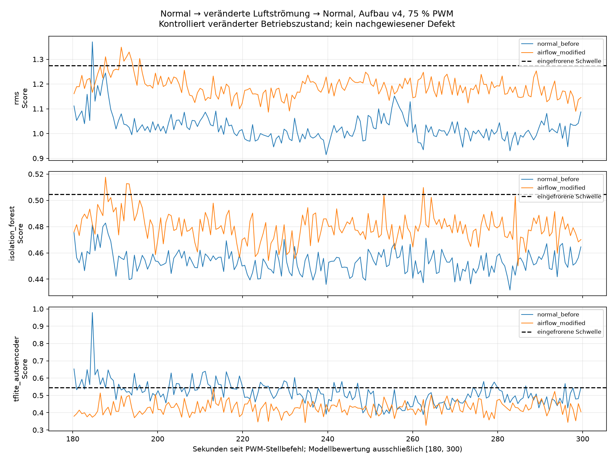
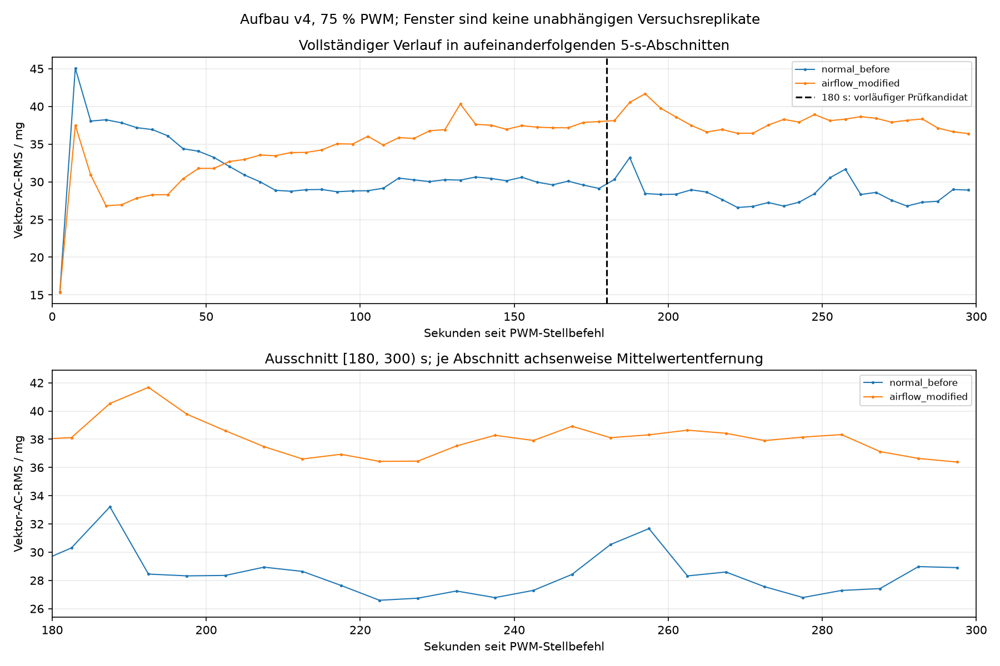

# Zwischenbericht: Normalreferenz und veränderte Luftströmung

**Status: zwei von drei Phasen abgeschlossen.** Die Rückkehrreferenz ohne Platte fehlt noch; sie ist nicht freigegeben. Der Plattenlauf wurde separat gespeichert und anschließend auf 0 % PWM zurückgestellt. Es gibt keinen weiteren Start ohne Nutzerfreigabe.

## Aufbau und Durchführung

Aufbau `fan_upright_position_v4_20260911_103726`; 75 % PWM bei 25 kHz, je 300 s. ADXL345 unverändert nominell 200 Hz, ±2 g, volle Auflösung, FIFO-Stream, 0,0039 g/LSB; I²C-Taktkonfiguration 100 kHz. Die Platte wurde als 120 × 120 mm, parallel und mittig 100 mm vor dem Luftauslass, separat und kippsicher befestigt sowie ohne Berührung von Lüfter und Sensor bestätigt. Abstand: Auslass-Rahmenebene zur nächsten Plattenfläche. Das sind Nutzerangaben, keine unabhängige Geometrievermessung. Die tatsächliche Auslassseite war zuvor vom Nutzer bestätigt; eine zusätzliche Pfeilbeobachtung wird nicht behauptet.

Der Nutzer bestätigte den Umbau entsprechend der Anleitung bei getrennter Versorgung, unveränderte Lüfter-/Sensorposition, Stillstand vor Start und wieder angeschlossene Versorgung. Stellbefehlsaufruf: 2026-09-12T07:48:45.339029+00:00 UTC. Erster XYZ-Punkt 0.097458 s danach; erste bis letzte Probe 299.991595 s. Zusätzliche Auszeit nach protokollierter Freigabeannahme 60.022426 s. Abstand seit vorherigem 0-%-Befehlsabschluss 321.440292 s; keine gemessene mechanische Stillstands-, Versorgungstrennungs- oder Abkühlzeit. Laufbeobachtungen wurden während der Erfassung weder angefordert noch nachträglich angenommen.

## Qualität und Modellreaktion

62121 XYZ-Punkte (186363 Achsenwerte), beobachtet 207.072468 XYZ/s gegenüber nominell 200 Hz. Host-Abstände: Median 5.583385 ms, P99 5.689257 ms, Maximum 8.172495 ms; 0 über 10 ms und 0 über 160 ms. Nichtmonotone Abstände 0, FIFO-Maximum 1. Lücken-/Überlauf-/Sättigungsflags: 0/0/0; nichtendliche XYZ-Punkte 0. Host-Lesezeitstempel messen nicht unmittelbar die Sensorwandlungszeit. Exakte physische Verluste und Drehzahl bleiben unbekannt.

Modellbewertung unverändert ausschließlich [180,300) s ab Stellbefehlsaufruf, 128 XYZ-Punkte und Schrittweite 128. Achsenweise Mittelwertentfernung in Float64, anschließend Float32 und gespeicherter Scaler; identische Eingabefenster für alle drei Methoden. Kein Nachtraining und keine Schwellenanpassung.

| Methode | Normal: gültig / ungültig | Normale Fehlalarme | Platte: gültig / ungültig | Alarme bei verändertem Zustand |
|---|---:|---:|---:|---:|
| RMS | 194 / 0 | 1 (0.515 %) | 194 / 0 | 7 (3.608 %) |
| Isolation Forest | 194 / 0 | 0 (0.000 %) | 194 / 0 | 4 (2.062 %) |
| TFLite-Autoencoder | 194 / 0 | 51 (26.289 %) | 194 / 0 | 0 (0.000 %) |

Alarme in der Normalreferenz sind Fehlalarme. Der Plattenzustand ist eine kontrollierte Luftstromveränderung, kein nachgewiesener Defekt; sein Alarmanteil ist kein Defekt-Recall. Ungültige Fenster zählen nicht als NORMAL und nicht zum Nenner gültiger Fenster. Benachbarte Fenster sind keine unabhängigen Versuchsreplikate. Auffällig ist die gegenläufige Autoencoder-Reaktion: 51/194 Alarme im normalen Lauf, aber 0/194 mit Platte. Mit der eingefrorenen oberen Schwelle zeigt sich für diesen Plattenlauf somit keine Alarmreaktion. Auch RMS und Isolation Forest überschreiten ihre Schwellen nur in 7 beziehungsweise 4 von 194 Fenstern. Eine klare Trennung der physischen RMS-Niveaus ist daher nicht gleichbedeutend mit erfolgreicher Erkennung durch das vorhandene Modellpaket.

## Vektor-AC-RMS und Grenzen

Je 5-s-Abschnitt wurden die jeweiligen Achsenmittelwerte in Float64 entfernt. Die folgenden physischen RMS-Werte in mg sind vom standardisierten RMS-Modellscore zu unterscheiden.

| Aufnahme, Abschnitt 180–300 s | Mittelwert / mg | SD der 5-s-Werte / mg | Min.–Max. / mg | Lineare Steigung / mg/min | Zweite minus erste Minute / mg |
|---|---:|---:|---:|---:|---:|
| Normal ohne Platte | 28.458001 | 1.618381 | 26.592935–33.214155 | -0.706648 | +0.046258 |
| Luftströmung verändert | 38.052535 | 1.299051 | 36.386318–41.675628 | -0.902973 | -0.295580 |

Der Unterschied der späten Mittelwerte (Platte minus Normal) beträgt +9.594534 mg. Er beschreibt einen Unterschied zwischen diesen beiden Aufnahmen; zeitliche Veränderungen innerhalb der Läufe werden separat über Verlauf, Steigung und Halbabschnitte dargestellt. 180 s bleiben der vorab bestimmte Prüfkandidat; eine konstante RMS-Kurve ist keine notwendige Normalbedingung. Die beobachteten späten 5-s-Bereiche überlappen hier nicht: 26,593–33,214 mg ohne Platte gegenüber 36,386–41,676 mg mit Platte. Der Mittelwertunterschied von 9,595 mg ist größer als die innerhalb der jeweiligen Aufnahme beobachteten Standardabweichungen von 1,618 und 1,299 mg. Diese Beschreibung ersetzt keine unabhängigen Wiederholungen und umfasst nicht die gesamte normale Variabilität. Ohne Rückkehrreferenz lässt sich der Unterschied noch nicht eindeutig dem Plattenzustand zuordnen oder eine Rückkehr beurteilen. Die Folge ist ein Pilot, kein allgemeiner Reproduzierbarkeits- oder Erkennungsnachweis.

## Abschluss und nächster manueller Schritt

Rückstellung abgeschlossen 2026-09-12T07:53:45.738411+00:00 UTC; 0 % bei 25 kHz und PWM-Pinfunktion sind zurückgelesen. Mechanischer Stillstand danach ist nicht beobachtet oder gemessen. Modelle, Schwellen, Protokoll und die 1291 geschützten bisherigen Dateien einschließlich Worddatei bleiben unverändert. [Integritätsprüfung](airflow_modified_verification.json).

Für die Rückkehrreferenz muss der Nutzer die externe 12-V-Versorgung trennen, vollständigen Stillstand abwarten und nur die Platte entfernen. Lüfter und Sensor unverändert lassen. Nach Wiederanschluss: „Platte entfernt, Lüfter steht, Versorgung angeschlossen, letzter Lauf freigegeben.“ Erst danach folgen 60 Sekunden zusätzliche Auszeit und der letzte 300-s-Normallauf. Bis dahin keine Aufnahme und keine automatische Wiederholung.

[Numerischer Vergleich](comparison_before_modified/comparison.json) · [Vergleichstabelle](comparison_before_modified/comparison.csv) · [Plattenaufnahme und Qualität](evaluation_airflow_modified/summary.json) · [Steuerungsjournal](airflow_modified_session.json)

Protokoll-SHA256 `5375fda6aff23f8f3c7651ac25e638a0dbbfbb52b49a33611e528bade3644a5d`; Paket-SHA256 `cec1859bfb354bafef77a619e6d2c1ffd85b50787c87595aba9a1e20a80cdae5`; Aufnahme-ID `airflow_modified_75pwm_300s_20260912_074845_333651`; CSV-SHA256 `4627309c3a60dcf2bb941150176ae0995faf6112f42941d6cf986354e2251b3d`.
