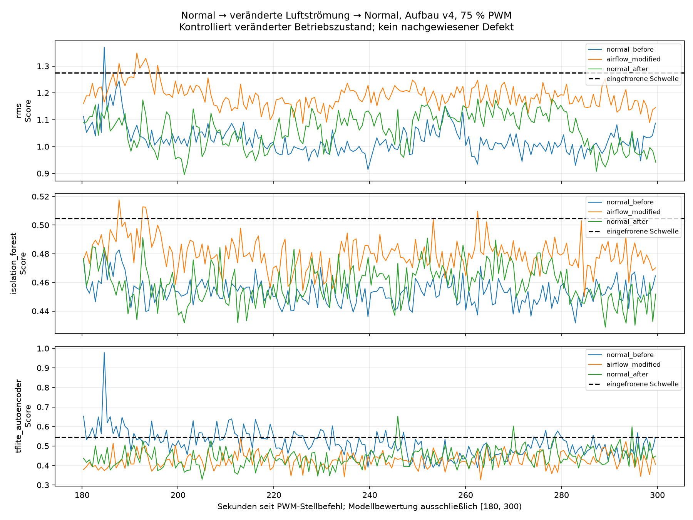
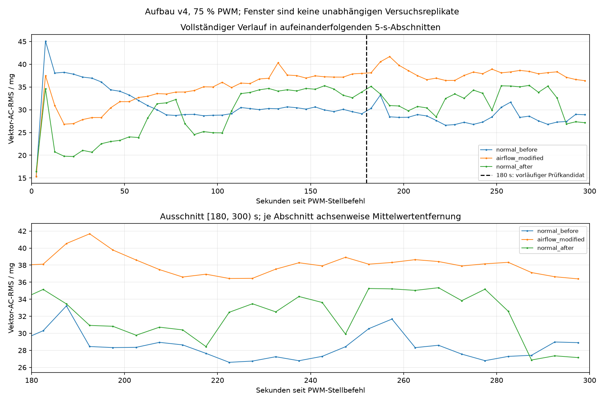

# Kontrollierter Normal–Luftstrom–Normal-Versuch mit eingefrorenem v4-Pilotpaket

Ausgewertet: 3 vollständige Aufnahmen. Modellbewertung ausschließlich [180,300) s in 128er-XYZ-Fenstern ohne Überlappung, bei 75 % PWM und 25 kHz.

| Phase | Methode | Gültig | Ungültig | Alarme | Anteil unter gültigen Fenstern |
|---|---|---:|---:|---:|---:|
| normal_before | rms | 194 | 0 | 1 | 0.52 % |
| normal_before | isolation_forest | 194 | 0 | 0 | 0.00 % |
| normal_before | tflite_autoencoder | 194 | 0 | 51 | 26.29 % |
| airflow_modified | rms | 194 | 0 | 7 | 3.61 % |
| airflow_modified | isolation_forest | 194 | 0 | 4 | 2.06 % |
| airflow_modified | tflite_autoencoder | 194 | 0 | 0 | 0.00 % |
| normal_after | rms | 194 | 0 | 0 | 0.00 % |
| normal_after | isolation_forest | 194 | 0 | 0 | 0.00 % |
| normal_after | tflite_autoencoder | 194 | 0 | 4 | 2.06 % |
| normal_references_pooled | rms | 388 | 0 | 1 | 0.26 % |
| normal_references_pooled | isolation_forest | 388 | 0 | 0 | 0.00 % |
| normal_references_pooled | tflite_autoencoder | 388 | 0 | 55 | 14.18 % |

| Phase | XYZ-Punkte | Beobachtet / XYZ/s | Erste XYZ nach Stellbefehl / s | Host-Abstand P99 / ms | Max. / ms | Lücke / Überlauf / Sättigung |
|---|---:|---:|---:|---:|---:|---|
| normal_before | 62140 | 207.136909 | 0.095444 | 5.6949 | 13.4375 | 0 / 0 / 0 |
| airflow_modified | 62121 | 207.072468 | 0.097458 | 5.6893 | 8.1725 | 0 / 0 / 0 |
| normal_after | 62105 | 207.020301 | 0.092900 | 5.6923 | 8.0600 | 0 / 0 / 0 |

| Phase | Zusätzliche Auszeit ab Freigabe / s | Gesamte Stellvorgaben-Auszeit seit vorherigem 0-%-Befehl / s |
|---|---:|---:|
| normal_before | 60.025137 | unbekannt |
| airflow_modified | 60.022426 | 321.440292 |
| normal_after | 60.032063 | 209.412212 |

Die nominelle Sensor-Abtastrate beträgt unverändert 200 Hz. Je 60 s zusätzliche Auszeit bedeuten keine identischen gesamten Auszeiten; manuelle Umbauten und Antwortzeiten kommen hinzu. Die gesamten Zeiten beziehen sich auf protokollierte Stellbefehle, nicht auf gemessenen mechanischen Stillstand.

Alarme im Normalzustand sind Fehlalarme. Der Alarmanteil bei veränderter Luftströmung beschreibt die Reaktion auf einen kontrolliert veränderten Betriebszustand; er ist kein Defekt-Recall.

| Phase | Mittlerer AC-RMS 180–300 s / mg | Streuung der 5-s-Werte / mg | Linearer Verlauf / (mg/min) | Zweite minus erste Minute / mg |
|---|---:|---:|---:|---:|
| normal_before | 28.4580 | 1.6184 | -0.7066 | 0.0463 |
| airflow_modified | 38.0525 | 1.2991 | -0.9030 | -0.2956 |
| normal_after | 32.0741 | 2.7809 | -0.5438 | 0.4080 |

Jeder 5-s-Abschnitt wird in Float64 um seinen jeweiligen Achsenmittelwert bereinigt. Die Tabelle trennt zeitliche Veränderungen innerhalb einer Aufnahme von unterschiedlichen Mittelwerten zwischen Aufnahmen. Der Zeitabschnitt ab 180 s bleibt ein Prüfkandidat.

Nach Entfernen der Platte unterscheidet sich der späte Normalmittelwert um 3.6161 mg vom vorherigen Normalmittelwert. 13 von 24 gültigen späten Rückkehrabschnitten liegen im zuvor beobachteten 5-s-Bereich. Dieser Bereich ist keine statistisch gesicherte Akzeptanzgrenze.

Der veränderte Zustand liegt gegenüber normal_before bei +9.5945 mg und gegenüber normal_after bei +5.9784 mg. Der gesamte beobachtete Bereich der beiden Normalreferenzen beträgt 8.7565 mg.

Nominell 200 Hz und beobachteter XYZ-Durchsatz bleiben getrennt. Host-Leseabstände, Zeitstempel und Qualitätsflags stehen je Aufnahme in summary.json. Genaue physische Verluste und die tatsächliche Drehzahl sind unbekannt. 0 % PWM im Steuerjournal belegen keinen mechanischen Stillstand.

Modelle, Skalierung, Schwellen und Abschnittsauswahl sind eingefroren. Ungültige Fenster zählen weder als NORMAL noch zum Nenner der Alarmanteile. Fenster innerhalb einer Aufnahme sind abhängig. Eine einzelne Folge belegt weder allgemeine Reproduzierbarkeit noch erfolgreiche Anomalieerkennung; es werden kein Defekt-Recall und kein F1-Wert abgeleitet.

Nächster Schritt: anhand dieser vollständigen Folge die Rückkehr zur Normalreferenz und beide Normalfehlalarmraten beurteilen. Für einen belastbareren Vergleich sind unabhängig freigegebene Wiederholungen derselben dokumentierten äußeren Geometrie vorzusehen. Bei fehlender Rückkehr zuerst die konkrete offene Frage zu zeitlicher Normalvariabilität oder unveränderter Geometrie prüfen. Keine Schwelle anhand dieser Tests nachträglich ändern; Änderungen benötigen ein neues Modellpaket und neue unabhängige Tests.
