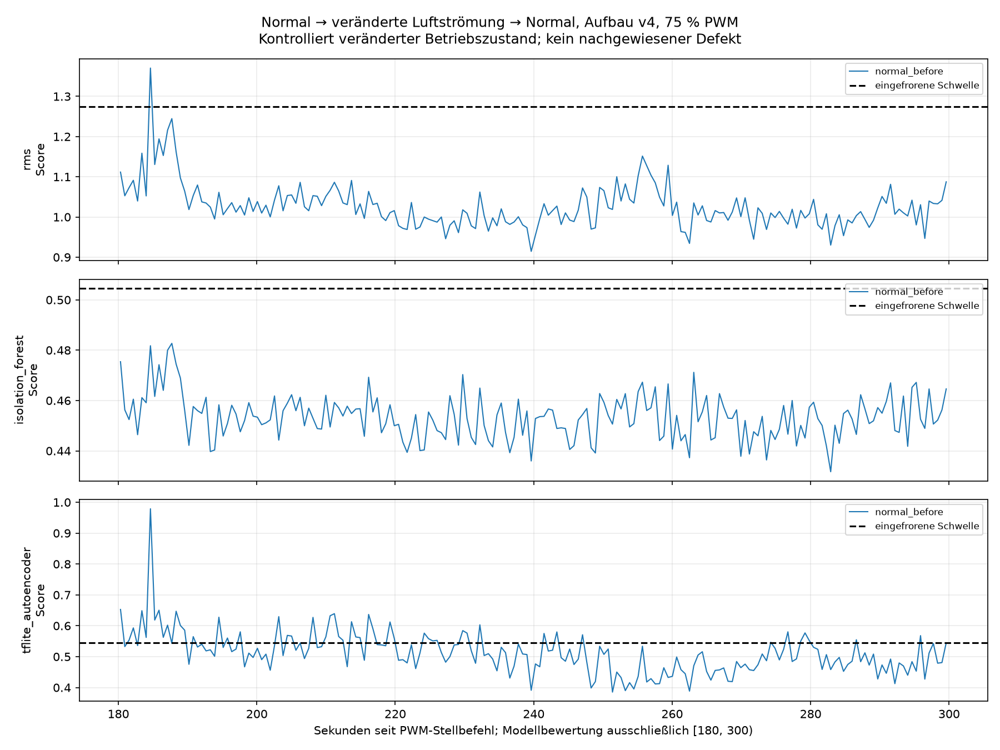
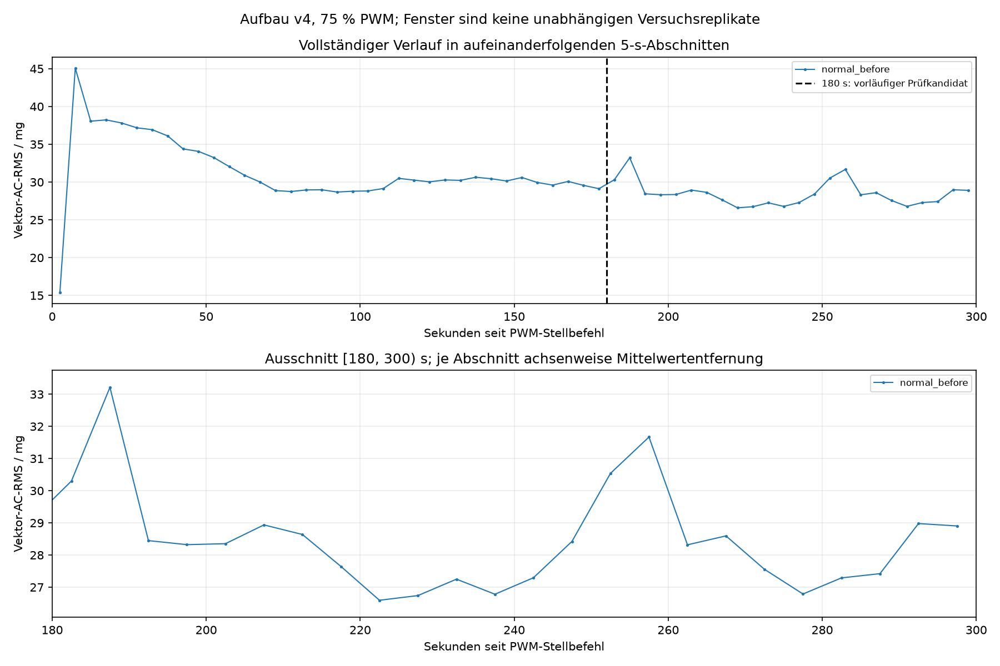

# Neue v4-Folge: abgeschlossene erste Normalaufnahme

Status: `normal_before` abgeschlossen und ausgewertet. Die Phasen `airflow_modified` und `normal_after` sind noch nicht freigegeben oder gestartet. Nach diesem Lauf pausiert die Steuerung entsprechend der Nutzeranweisung. Alte Aufnahmen und der abgebrochene Versuch vom Vortag bleiben eigenständige Datensätze.

Aufbau: `fan_upright_position_v4_20260911_103726`. Ohne Platte, 75 % PWM bei 25 kHz, 300 Sekunden. Der Nutzer bestätigte vor dem Start Stillstand und angeschlossene Versorgung. Die sichere v4-Aufstellung und Sensorbefestigung wurden unverändert übernommen. Eine Laufbeobachtung während der Aufnahme wurde weder angefordert noch nachträglich behauptet.

## Zeitbasis und Datenqualität

Stellbefehlsaufruf: 2026-09-12T07:38:23.502252+00:00 (UTC; Ortszeit UTC+2). Erster XYZ-Punkt: 2026-09-12T07:38:23.597696+00:00, 0.095444 s nach Befehlsaufruf und 0.046579 s nach Befehlsabschluss. Erste bis letzte Probe: 299.989994 s. Der erste Abschnitt enthält deshalb nicht die kurze Zeit vor dem ersten Sensorpunkt.

Zusätzliche Auszeit seit protokollierter Annahme der Freigabe: 60.025137 s. Die Annahme wurde nach Abschluss der Vorbereitung dokumentiert; sie ist kein behaupteter Nachrichtensendezeitpunkt. Die gesamte vorherige Auszeit einschließlich Versorgungstrennung und Übernachtpause ist unbekannt und wird nicht als identisch zu späteren Auszeiten bezeichnet.

| Merkmal | Ergebnis |
|---|---:|
| Vollständige XYZ-Punkte / einzelne Achsenwerte | 62140 / 186420 |
| Nominelle Sensor-ODR | 200 Hz |
| Beobachteter Durchsatz | 207.136909 XYZ/s |
| Host-Leseabstand Median / P99 / Maximum | 5.588826 / 5.694864 / 13.437473 ms |
| Host-Abstände >10 ms / >160 ms | 1 / 0 |
| Nichtmonotone Abstände | 0 |
| Maximale FIFO-Belegung | 2 |
| Lücken- / Überlauf- / Sättigungsflags (XYZ) | 0 / 0 / 0 |
| Nichtendliche XYZ-Punkte | 0 |
| Exakte physische Verluste / Drehzahl | unbekannt / nicht gemessen |

Sensor: ADXL345, nominell 200 Hz, ±2 g, volle Auflösung, 0,0039 g/LSB, FIFO-Stream, konfigurierte I²C-Frequenz 100 kHz. Host-Zeitstempel beschreiben Leseabschlüsse und keine unmittelbar gemessenen Sensorwandlungszeitpunkte. Der beobachtete Durchsatz wird nicht durch Umdeutung von Achsenwerten oder nachträgliche Zeitneuskalierung an 200 Hz angepasst.

## Unveränderte Modellbewertung

Bewertet wird ausschließlich [180,300) s ab Stellbefehlsaufruf: 128 XYZ-Punkte je Fenster, Schrittweite 128, keine Überlappung und keine Fenster über Aufnahmegrenzen. Achsenmittelwerte werden je Fenster in Float64 entfernt; anschließend folgen Float32 und der gespeicherte Scaler. Alle drei Methoden erhalten dieselben geprüften Fenster. Modelle, Skalierung und Schwellen bleiben eingefroren.

| Methode | Gültig | Ungültig | Normale Fehlalarme | Fehlalarmrate |
|---|---:|---:|---:|---:|
| RMS | 194 | 0 | 1 | 0.515 % |
| Isolation Forest | 194 | 0 | 0 | 0.000 % |
| TFLite-Autoencoder | 194 | 0 | 51 | 26.289 % |

Ausgewählter Abschnitt: 24854 XYZ-Punkte; 22 verbleibende Punkte wurden nicht zu einem unvollständigen Modellfenster ergänzt. Ungültige Fenster zählen nicht als NORMAL und nicht zum Nenner gültiger normaler Fenster. Hohe Fehlalarmraten bleiben als Ergebnis erhalten. Der Autoencoder stuft hier 51 normale Fenster als auffällig ein (26,289 %). Das zeigt für diesen Lauf eine erhebliche Einschränkung seiner Normalitätsbewertung. Die unterschiedlichen Ergebnisse der Methoden belegen keine fehlerhafte RMS-Berechnung; die Scores bewerten unterschiedliche Signaleigenschaften. Die Ursache der veränderten Scoreverteilung ist mit dieser Einzelaufnahme nicht geklärt. Aus den wenigen Fehlalarmen der anderen Methoden folgt noch keine Empfindlichkeit gegenüber der Platte.

## Physischer Vektor-AC-RMS

Die folgenden Werte sind in mg aus den physisch skalierten Achsen berechnet, nicht der standardisierte RMS-Modellscore. Je aufeinanderfolgendem 5-s-Abschnitt wird der jeweilige Achsenmittelwert in Float64 entfernt; anschließend wird sqrt(mean(ax_ac²+ay_ac²+az_ac²)) berechnet.

Im vorab gewählten späten Abschnitt sind 24 von 24 Blöcken gültig. Mittelwert 28.458001 mg, Stichprobenstandardabweichung 1.618381 mg, beobachteter Bereich 26.592935–33.214155 mg. Deskriptive lineare Steigung -0.706648 mg/min. Mittelwertdifferenz zwischen 240–300 s und 180–240 s: +0.046258 mg.

Im vollständigen Verlauf fällt das Vibrationsniveau nach der Anlaufspitze zunächst deutlich ab. Im späten Abschnitt sind einzelne Erhöhungen sichtbar; die nahezu gleichen Mittelwerte der beiden späten Minuten sprechen gegen einen gleichmäßigen Abfall über diesen gesamten Abschnitt. Die negative lineare Steigung allein beschreibt diesen Verlauf daher nur unvollständig. Eine geeignete Einlaufzeit erfordert keine vollkommen konstante RMS-Kurve; 180 s bleiben unverändert der vorab bestimmte Prüfkandidat. Die Fenster sind keine unabhängigen Versuchsreplikate. Ein Platteneffekt, eine Rückkehr und allgemeine Reproduzierbarkeit können aus dieser einzelnen Normalaufnahme nicht beurteilt werden.

## Abschluss und nächster Schritt

Die Rückstellung auf 0 % wurde am 2026-09-12T07:43:23.898754+00:00 abgeschlossen und die korrekte Hardware-PWM-Pinfunktion bei 25 kHz zurückgelesen. Ein mechanischer Stillstand nach dem Lauf wurde nicht beobachtet oder gemessen. Die zusätzliche Abschlussprüfung ist in [normal_before_verification.json](normal_before_verification.json) gespeichert.

Die 1291 geschützten bestehenden Dateien sind unverändert. Protokoll-SHA256: `5375fda6aff23f8f3c7651ac25e638a0dbbfbb52b49a33611e528bade3644a5d`. Paket-SHA256: `cec1859bfb354bafef77a619e6d2c1ffd85b50787c87595aba9a1e20a80cdae5`. CSV-SHA256: `fdfcec021dc9f9ad2d86b41025a05259a66ed10d29e07a6ed98da3b593ac6960`. Aufnahme-ID: `normal_before_75pwm_300s_20260912_073823_494120`. Weitere Hashes und Messwerte: [summary.json](evaluation_normal_before/summary.json), [5-s-Werte](evaluation_normal_before/rms_5s.csv), [Scores](evaluation_normal_before/scores.csv) und [Steuerungssitzung](normal_before_session.json).

Es erfolgt kein weiterer Start bis zur Nutzerantwort. Danach ist der nächste manuelle Schritt das Einsetzen der separat befestigten Platte (120 × 120 mm, parallel und mittig 100 mm vor der Auslass-Rahmenebene). Vor dem Umbau externe 12-V-Versorgung trennen und vollständigen Stillstand abwarten; nur die Platte bewegen, Lüfter und Sensor unverändert lassen. Die tatsächliche Geometrie wird mit der nächsten Freigabe dokumentiert. Nach Wiederanschluss und ausdrücklicher Freigabe folgen erneut mindestens 60 Sekunden zusätzliche Auszeit und genau ein Plattenlauf. Keine automatische Wiederholung, kein Nachtraining und kein Defekt-Recall oder F1 aus normalen Daten.
