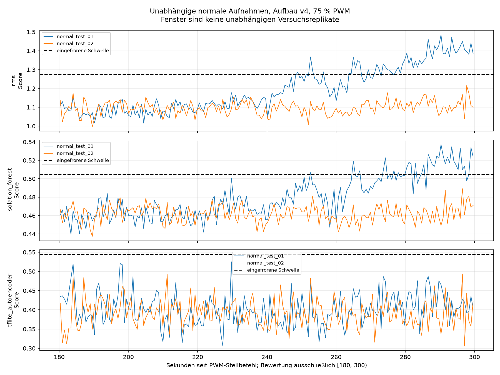

# Unabhängige Normalitätsprüfung des eingefrorenen v4-Pilotpakets

Ausgewertet: 2 vollständige unabhängige Normalläufe. Bewertung ausschließlich [180,300) s in 128er-XYZ-Fenstern ohne Überlappung.

| Lauf | Methode | Gültig | Ungültig | Fehlalarme | Fehlalarmrate unter gültigen Fenstern |
|---|---|---:|---:|---:|---:|
| normal_test_01 | rms | 194 | 0 | 57 | 29.38 % |
| normal_test_01 | isolation_forest | 194 | 0 | 34 | 17.53 % |
| normal_test_01 | tflite_autoencoder | 194 | 0 | 0 | 0.00 % |
| normal_test_02 | rms | 194 | 0 | 0 | 0.00 % |
| normal_test_02 | isolation_forest | 194 | 0 | 0 | 0.00 % |
| normal_test_02 | tflite_autoencoder | 194 | 0 | 0 | 0.00 % |
| pooled | rms | 388 | 0 | 57 | 14.69 % |
| pooled | isolation_forest | 388 | 0 | 34 | 8.76 % |
| pooled | tflite_autoencoder | 388 | 0 | 0 | 0.00 % |

Die gesamte Anlaufphase bleibt in den Rohdaten. 180 Sekunden sind weiterhin eine vorläufige Einlaufzeit. Hohe Fehlalarmraten bleiben als Testergebnis erhalten; es erfolgt keine Anpassung.

Ungültige Fenster zählen weder als NORMAL noch zum Fehlalarmnenner. Benachbarte Fenster sind abhängig. Aus diesen ausschließlich normalen Daten werden kein Anomalie-Recall, kein F1-Wert und keine allgemeine Erkennungsleistung abgeleitet.

Nominell 200 Hz und beobachteter XYZ-Durchsatz bleiben getrennt; genaue physische Verluste und Drehzahl sind unbekannt. 0 % PWM im Steuerjournal belegen keinen mechanischen Stillstand.

Nächster kontrolliert veränderter Testzustand: separat und kippsicher befestigte äußere Platte bei unverändertem Aufbau und 75 % PWM. Vor einer Durchführung sind konkrete Geometrie und Freigabe zu dokumentieren. Bestehende Testergebnisse dürfen nicht für eine nachträgliche Schwellenwahl verwendet werden; Änderungen erfordern ein neues Modellpaket und neue unabhängige Tests.
