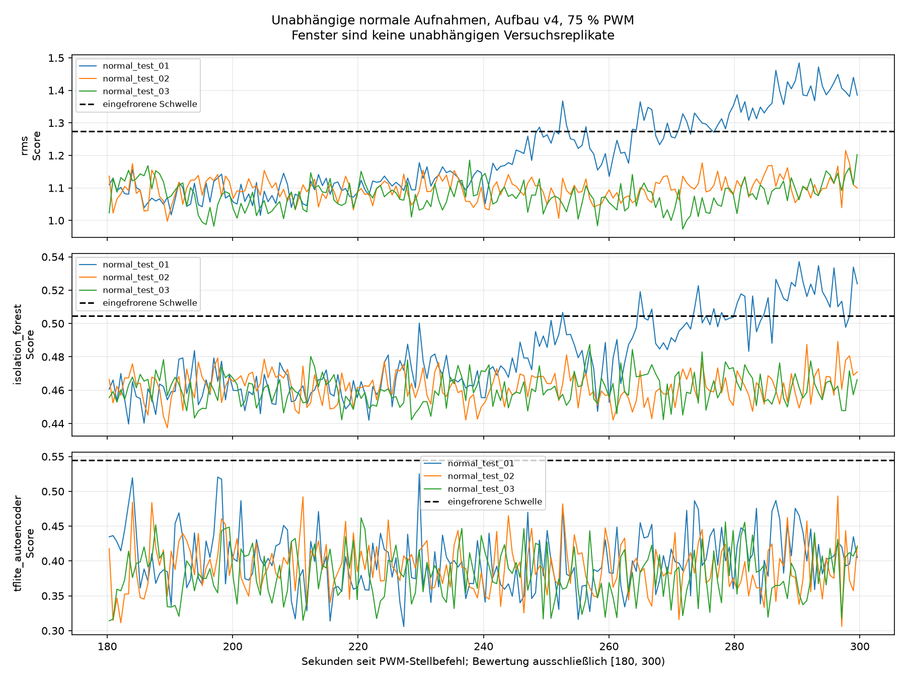

# Unabhängige Normalitätsprüfung des eingefrorenen Modellpakets für Aufbau v4

Drei separate Normalstarts ohne Platte wurden mit unveränderter Aufbauversion `fan_upright_position_v4_20260911_103726` aufgezeichnet und unabhängig vom Training ausgewertet. Die nachfolgend ausgewiesenen normalen Fehlalarme bleiben vollständig als Testergebnis erhalten. Dieser Bericht bewertet die Normalverträglichkeit des eingefrorenen Pilotpakets; er enthält keinen Nachweis der Erkennung veränderter Betriebszustände.

## Vorab festgelegter Vergleich und Softwareprüfung

Das [Testprotokoll](test_protocol.md) wurde am 2026-09-11T13:43:55.780683+00:00 eingefroren, vor den drei Aufnahmen. Pro Start waren 300 Sekunden bei 75 % PWM und 25 kHz sowie 60 Sekunden zusätzliche Auszeit nach der jeweiligen Freigabe vorgesehen. Bewertet wird ausschließlich [180,300) Sekunden seit Aufruf des PWM-Stellbefehls. 128 XYZ-Punkte je Fenster und Schrittweite 128 ergeben nicht überlappende Fenster, die keine Aufnahmegrenze überschreiten. Unvollständige Restfenster werden weder aufgefüllt noch als ungültige Modellfenster gezählt. Der vollständige Anlauf bleibt in den Rohdateien gespeichert; 180 Sekunden sind weiterhin eine vorläufige Einlaufzeit.

Die vorab eingefrorene Ausschlussliste enthält 246 historische CSV-Pfade einschließlich der Trainings-, Validierungs- und bereits untersuchten Aufnahmen. Die drei neuen vollständigen Aufnahmen haben unterschiedliche IDs und Rohdatenhashes, stehen nicht in dieser Ausschlussliste und wurden erst nach dem Einfrieren erzeugt. Die Aufteilung erfolgt damit nach vollständigen Aufnahmen, nicht durch zufälliges Verteilen benachbarter Fenster.

Vor Aufnahmebeginn bestanden 112 Softwaretests. Der [Paritätsnachweis](training_test_preprocessing_parity.json) verglich 388 Trainings- und 194 Validierungsfenster exakt mit dem Trainingsweg: achsenweise Mittelwertentfernung je 128er-Fenster in Float64, danach Float32 und Anwendung des gespeicherten Scalers. Die hierfür gelesenen alten Quellen dienten ausschließlich der Softwareprüfung und sind von den unabhängigen Tests ausgeschlossen. Alle drei Methoden erhalten wertgleiche standardisierte Eingaben. Modelle, Skalierung, Schwellen und Abschnittsauswahl wurden nicht angepasst. Der RMS-Methodenscore ist ein RMS des standardisierten Fensters und kein unskalierter physischer Vektor-AC-RMS in g.

| Methode | Eingefrorene Schwelle |
| --- | --- |
| RMS | 1.274769537714431 |
| Isolation Forest | 0.5045395247064507 |
| TFLite-Autoencoder | 0.544357966122261 |

## Durchführung, Aufbau und tatsächliche Zeitintervalle

Der Lüfter blieb aufrecht an der festen v4-Position; der ADXL345 blieb mit zwei Schrauben am feststehenden äußeren Lüfterrahmen befestigt, bei schräger Platinenlage. Der bereits bestätigte sichere Aufbau und die angeschlossene externe 12-V-Versorgung wurden übernommen. Vor jedem Start lag eine neue Nutzerbestätigung des mechanischen Stillstands und eine Freigabe ausschließlich dieses Laufs vor. Es wurden keine Antworten während der Aufnahme, Antwortfristen oder automatischen Wiederholungsstarts verlangt. Die Erfassung hielt die Lüftersteuerung exklusiv; Erkennungsentscheidungen steuerten den Lüfter nicht.

| Lauf | Freigabe, MESZ | 75-%-Befehlsaufruf, MESZ | Erster XYZ-Punkt, MESZ (aus Hostzeit abgeleitet) | 0-%-Befehlsabschluss, MESZ |
| --- | --- | --- | --- | --- |
| 1 | 2026-09-11T17:58:59.779+02:00 | 2026-09-11T17:59:59.805+02:00 | 2026-09-11T17:59:59.898+02:00 | 2026-09-11T18:05:00.227+02:00 |
| 2 | 2026-09-11T18:12:06.304+02:00 | 2026-09-11T18:13:06.326+02:00 | 2026-09-11T18:13:06.423+02:00 | 2026-09-11T18:18:06.723+02:00 |
| 3 | 2026-09-11T18:26:25.481+02:00 | 2026-09-11T18:27:25.504+02:00 | 2026-09-11T18:27:25.600+02:00 | 2026-09-11T18:32:25.898+02:00 |

| Lauf | Zusätzliche Auszeit ab Freigabe, s | Gesamte Auszeit seit vorherigem 0-%-Befehlsabschluss, s | Erster XYZ-Punkt nach Befehlsaufruf, ms | Erster XYZ-Punkt nach Befehlsabschluss, ms | Hostzeitspanne erster–letzter XYZ-Punkt, s |
| --- | --- | --- | --- | --- | --- |
| 1 | 60.026400 | unbekannt | 93.229489 | 47.526365 | 299.991083 |
| 2 | 60.022449 | 486.099037 | 96.559631 | 47.566547 | 299.990130 |
| 3 | 60.022892 | 558.781061 | 96.318398 | 47.733208 | 299.989954 |

Die zusätzlichen Auszeiten umfassen die vorgesehenen 60 Sekunden und den anschließend gemessenen Softwareaufwand. Die gesamten Auszeiten waren nicht gleich; vor Lauf 1 ist die vollständige vorherige Auszeit unbekannt. Diese Intervalle beruhen auf monotoner Hostzeit zwischen Softwareereignissen, nicht auf gemessenen mechanischen Stopp- oder Anlaufzeitpunkten. Auch die angegebenen UTC/MESZ-Zeiten des ersten XYZ-Punkts sind aus Hostzeit abgeleitet. Der kleine Versatz zwischen Stellbefehl und erstem gelesenen Punkt bleibt dokumentiert; ein vollständig lückenlos abgebildeter Rotorstart wird nicht behauptet.

## Datenqualität und Zeitbasis

Unveränderte Sensorparameter: ADXL345, nominell 200 Hz, ±2 g, Full Resolution, 0,0039 g/LSB, FIFO-Stream, I²C-Bus 1 mit konfigurierten 100 kHz. Registerrücklesung: `0x2c=0x0b`, `0x31=0x08`, `0x2e=0x00`, `0x38=0x90`, `0x2d=0x08`. GPIO18 bezeichnet BCM GPIO18, physischen Pin 12, mit Pin-Funktion `PWM0_CHAN2`, PWM-Kanal 2 und 40.000 ns Periode. Die PWM-Konfiguration wurde zurückgelesen; elektrische Wellenform und tatsächliche Drehzahl wurden nicht gemessen.

| Merkmal | Lauf 1 | Lauf 2 | Lauf 3 |
| --- | --- | --- | --- |
| Vollständige XYZ-Punkte | 62133 | 62133 | 62140 |
| Einzelne Achsenwerte | 186399 | 186399 | 186420 |
| Nominelle Sensor-Abtastrate, Hz | 200 | 200 | 200 |
| Beobachteter Durchsatz, XYZ/s | 207.112823 | 207.113481 | 207.136936 |
| Host-Leseabstand Median, ms | 5.561991 | 5.586499 | 5.548869 |
| Host-Leseabstand 99. Perzentil, ms | 5.698256 | 5.691956 | 5.688073 |
| Host-Leseabstand Maximum, ms | 15.099650 | 11.103869 | 10.155460 |
| Host-Leseabstände über 10 ms | 3 | 3 | 1 |
| Host-Leseabstände über 160 ms | 0 | 0 | 0 |
| Maximale Sensor-Lesedauer, ms | 5.638205 | 8.752184 | 5.082406 |
| Maximaler FIFO-Füllstand | 3 | 2 | 2 |
| XYZ-Punkte mit Lückenflag | 0 | 0 | 0 |
| XYZ-Punkte mit Überlaufflag | 0 | 0 | 0 |
| XYZ-Punkte mit Sättigungsflag | 0 | 0 | 0 |
| Nichtmonotone Hostintervalle | 0 | 0 | 0 |
| Nichtendliche XYZ-Punkte | 0 | 0 | 0 |
| Exakte physische Sensorverluste | unbekannt | unbekannt | unbekannt |

Der beobachtete Durchsatz wird als (N−1)/(Zeit des letzten minus Zeit des ersten Host-Leseabschlusses) berechnet. N zählt vollständige XYZ-Messpunkte; die Zahl einzelner Achsenwerte beträgt 3N. Der gegenüber nominell 200 Hz erhöhte Durchsatz ist ein Befund der Erfassung und keine nachgewiesene Umkonfiguration des Sensors. Die Software liest vollständige XYZ-Punkte aus dem FIFO und protokolliert monotone Host-Leseabschlüsse. FIFO-Abarbeitung und Hostplanung können ungleichmäßige Leseabstände verursachen, belegen jedoch nicht die Ursache der mittleren Ratendifferenz. Sensorwandlungstakt und Hostzeit wurden nicht unabhängig gegeneinander kalibriert. `sample_index / 200` ist nur eine nominelle Sensorzeitschätzung; es wurde weder auf 200 Hz umgerechnet noch neu abgetastet. Die tatsächliche Ursache der Rateabweichung und die exakte Zahl etwaiger physischer Verluste bleiben offen. Fehlende Flags sind kein Nachweis einer vollständig verlustfreien Wandlungsfolge.

| Lauf | XYZ-Punkte in [180,300) | Vollständige Modellfenster | Nicht aufgefüllte Restpunkte |
| --- | --- | --- | --- |
| 1 | 24853 | 194 | 21 |
| 2 | 24854 | 194 | 22 |
| 3 | 24857 | 194 | 25 |

## Fehlalarme unter normalen Testfenstern

Fehlalarmrate = Anzahl als ANOMALY bewerteter normaler Fenster / Anzahl gültiger normaler Fenster. Ungültige Fenster zählen weder als NORMAL noch im Nenner. Die zusammengefasste Rate ist ein deskriptiver Fensteranteil. Die drei vollständigen Starts sind die Versuchsreplikate; die benachbarten Fenster sind keine unabhängigen Replikate.

| Lauf | Methode | Gültige Fenster | Ungültige Fenster | Fehlalarme | Fehlalarmrate unter gültigen normalen Fenstern |
| --- | --- | --- | --- | --- | --- |
| Lauf 1 | RMS | 194 | 0 | 57 | 29.38 % |
| Lauf 1 | Isolation Forest | 194 | 0 | 34 | 17.53 % |
| Lauf 1 | TFLite-Autoencoder | 194 | 0 | 0 | 0.00 % |
| Lauf 2 | RMS | 194 | 0 | 0 | 0.00 % |
| Lauf 2 | Isolation Forest | 194 | 0 | 0 | 0.00 % |
| Lauf 2 | TFLite-Autoencoder | 194 | 0 | 0 | 0.00 % |
| Lauf 3 | RMS | 194 | 0 | 0 | 0.00 % |
| Lauf 3 | Isolation Forest | 194 | 0 | 0 | 0.00 % |
| Lauf 3 | TFLite-Autoencoder | 194 | 0 | 0 | 0.00 % |
| Zusammen, 3 Läufe | RMS | 582 | 0 | 57 | 9.79 % |
| Zusammen, 3 Läufe | Isolation Forest | 582 | 0 | 34 | 5.84 % |
| Zusammen, 3 Läufe | TFLite-Autoencoder | 582 | 0 | 0 | 0.00 % |

[Grafik als PDF](comparison/scores.pdf) · [Maschinenlesbare Vergleichstabelle](comparison/comparison.csv)

## Zeitliche Veränderungen innerhalb der Läufe und Unterschiede zwischen Starts

Zur rein deskriptiven Prüfung werden die bereits bewerteten Fenster anhand der Mitte zwischen erstem und letztem Hostzeitstempel den vier 30-s-Gruppen [180,210), [210,240), [240,270) und [270,300) zugeordnet. Diese nachträgliche Zusammenfassung ändert weder die vorab gewählte Bewertungsstrecke noch Modellfenster oder Entscheidungen. Sie dient keiner Parameterwahl und keinem statistischen Signifikanztest. Die Tabelle enthält je Gruppe den Mittelwert der gültigen Scores; die [zusätzliche CSV](descriptive_score_groups_30s.csv) enthält auch Stichprobenstandardabweichung, Minima, Maxima, gültige/ungültige Fenster und Fehlalarme.

| Lauf | Methode | 180–210 s | 210–240 s | 240–270 s | 270–300 s | Letzte minus erste Gruppe |
| --- | --- | --- | --- | --- | --- | --- |
| normal_test_01 | RMS | 1.080911 | 1.114403 | 1.231752 | 1.360411 | 0.279500 |
| normal_test_02 | RMS | 1.094337 | 1.093069 | 1.086703 | 1.113777 | 0.019440 |
| normal_test_03 | RMS | 1.073100 | 1.082300 | 1.067138 | 1.085937 | 0.012837 |
| normal_test_01 | Isolation Forest | 0.460816 | 0.465795 | 0.483261 | 0.510983 | 0.050168 |
| normal_test_02 | Isolation Forest | 0.463477 | 0.460116 | 0.460080 | 0.463731 | 0.000254 |
| normal_test_03 | Isolation Forest | 0.459951 | 0.458895 | 0.462078 | 0.462068 | 0.002117 |
| normal_test_01 | TFLite-Autoencoder | 0.412495 | 0.387646 | 0.386876 | 0.419221 | 0.006726 |
| normal_test_02 | TFLite-Autoencoder | 0.393702 | 0.396128 | 0.389719 | 0.388597 | -0.005106 |
| normal_test_03 | TFLite-Autoencoder | 0.381946 | 0.383146 | 0.377632 | 0.384183 | 0.002237 |

| Methode | Gesamtmittel Lauf 1 | Gesamtmittel Lauf 2 | Gesamtmittel Lauf 3 | Spanne der drei Laufmittel |
| --- | --- | --- | --- | --- |
| RMS | 1.196451 | 1.096905 | 1.077046 | 0.119405 |
| Isolation Forest | 0.480129 | 0.461850 | 0.460751 | 0.019379 |
| TFLite-Autoencoder | 0.401540 | 0.392033 | 0.381707 | 0.019834 |

Die Differenz der letzten und ersten Gruppe beschreibt eine Veränderung innerhalb desselben Laufs; die Spanne der Laufmittel beschreibt Unterschiede zwischen Starts. Eine Endpunktdifferenz allein beweist keinen monotonen oder systematischen Verlauf; dafür sind auch die beiden mittleren Gruppen und die vollständige Grafik zu beachten. Unterschiedliche Mittelwerte oder nicht überlappende Scorebereiche zwischen Starts widerlegen für sich allein keine geeignete Einlaufzeit. Umgekehrt rechtfertigen späte zeitliche Veränderungen keine nachträgliche Verschiebung des Testabschnitts. Eine physische Ursache wie Erwärmung oder mechanische Veränderung lässt sich aus diesen Scoreverläufen nicht ableiten.

## Bewertung und konkreter nächster Schritt

RMS: Insgesamt 57 Fehlalarme unter 582 gültigen normalen Fenstern (9.79 %); je Lauf 29.38 %, 0.00 %, 0.00 %. Die beobachteten normalen Fehlalarme begrenzen die Zuordnung späterer Alarme zu einer kontrollierten Luftstromveränderung. Sie dürfen weder durch Mittelung verborgen noch nachträglich aus der Bewertung entfernt werden.

Isolation Forest: Insgesamt 34 Fehlalarme unter 582 gültigen normalen Fenstern (5.84 %); je Lauf 17.53 %, 0.00 %, 0.00 %. Die beobachteten normalen Fehlalarme begrenzen die Zuordnung späterer Alarme zu einer kontrollierten Luftstromveränderung. Sie dürfen weder durch Mittelung verborgen noch nachträglich aus der Bewertung entfernt werden.

TFLite-Autoencoder: Insgesamt 0 Fehlalarme unter 582 gültigen normalen Fenstern (0.00 %); je Lauf 0.00 %, 0.00 %, 0.00 %. In diesen drei Aufnahmen wurde kein Fehlalarm beobachtet. Das belegt weder eine allgemeine Nullfehlalarmrate noch Empfindlichkeit gegenüber veränderten Zuständen.

Das Pilotpaket bleibt als eingefrorener Vergleichsstand nutzbar, ist anhand dieser Prüfung jedoch nicht als zuverlässiger automatischer Störungsnachweis freigegeben. Die bereits im ersten Lauf hohen normalen RMS-/IF-Fehlalarmanteile bleiben ein wesentlicher Befund. Weitere perfekte oder konstante Normalverläufe sind keine Voraussetzung für die Beschreibung normaler Variabilität. Eine spätere Verbesserung der Modelle oder Schwellen müsste eine neue Modellversion erhalten; diese Testdaten wären dann Entwicklungswissen und dürften nicht erneut als unabhängiger Test dieser neuen Version gelten.

Als nächsten kontrolliert veränderten Testzustand empfehle ich zunächst eine separat freizugebende Folge Normal → äußere Luftstromveränderung → Normal, jeweils 300 Sekunden bei denselben 75 % PWM und 25 kHz, gleicher Sensorerfassung und unverändertem Aufbau v4. Der gesamte Anlauf wird gespeichert; [180,300), 128er-Fenster und das hier eingefrorene Paket bleiben für diesen Vergleich vorab festgelegt. Zeitnahe Normalreferenzen sind notwendig, weil normale Fehlalarme bereits auftreten; die Platte darf nicht allein deshalb als erkennbar gelten, weil einzelne Alarme vorliegen. Die Folge ist zunächst ein Pilot und kein Reproduzierbarkeitsnachweis. Weitere unabhängige Folgen sollten nur anhand einer vorab benannten offenen Frage geplant werden.

Für diesen späteren Versuch sind als bisherige Nutzerangaben eine Platte von 120 × 120 mm und 100 mm Abstand dokumentiert. Vor dem Versuch müssen die tatsächliche Auslassseite, die Bezugsebenen des Abstands, Position/Ausrichtung und Überdeckung eindeutig dokumentiert werden; diese Istangaben wurden hier nicht neu geprüft. Die Platte wird separat und kippsicher befestigt und berührt weder Sensor noch Lüfter. Zum Einsetzen oder Entfernen wird die externe 12-V-Versorgung getrennt und der vollständige Stillstand abgewartet; Lüfter und Sensor behalten ihre Position. Es gibt keinen Eingriff am laufenden Rotor. Es handelt sich um einen kontrolliert veränderten Betriebszustand, nicht um einen nachgewiesenen Defekt. Jetzt wurde kein Plattenversuch und kein weiterer PWM-Betriebspunkt gestartet.

Aus ausschließlich normalen Testdaten werden kein Anomalie-Recall, kein F1-Wert und keine allgemeine Erkennungsleistung abgeleitet. Eine erfolgreiche Rückkehr oder Trennung in einem späteren Plattenpilot wäre ebenfalls noch kein allgemeiner KI-Erkennungsnachweis.

## Abschlussstatus und Nachvollziehbarkeit

Nach Lauf 3 wurden am 2026-09-11T18:32:25.898+02:00 0 % PWM bei 25 kHz eingestellt und zurückgelesen (Periode 40.000 ns, Tastdauer 0 ns, aktivierter PWM-Kanal, bestätigte Pin-Funktion). Ein vollständiger mechanischer Stillstand nach diesem letzten Lauf wurde zu diesem Berichtszeitpunkt nicht beobachtet oder bestätigt. Der Softwarestellwert ist kein Drehzahl- oder Stillstandsnachweis.

Die separat durchgeführte [abschließende Erhaltungs- und Statusprüfung](final_verification.json) ist als eigener Nachweis verlinkt. Der Hashvergleich aller 1.172 bereits vor dieser Testreihe vorhandenen Dateien ergab keine Änderungen; Worddatei, historische Daten und vorhandene Modelle blieben unverändert. Protokoll, eingefrorenes Modellpaket, Implementierung sowie Quellen- und Ergebnishashes stimmen mit den erwarteten Werten überein.

Modellpaket: `/home/malik/masterarbeit-edge-ai/results/upright_v4_training_pilot_20260911_130614/run_001/frozen/pilot_bundle.json`; SHA256 `cec1859bfb354bafef77a619e6d2c1ffd85b50787c87595aba9a1e20a80cdae5`. Protokoll-SHA256: `d208261cdbe9e258b4a56ae87769c3700145b2221c4b92fed4fb55eb67fd73a7`. Evaluator-SHA256: `6210cc61160834ea75dc489cd738118c840aae6573dadb864132ebd454eefc0d`.

Die vollständigen SHA256-Werte der Rohdateien, Metadaten, Sitzungsprotokolle, Freigaben, Steuerjournale, Einzel- und Vergleichsergebnisse sowie Modellartefakte stehen in [report_artifact_hashes.json](report_artifact_hashes.json). Die Hashliste enthält auch die neu erzeugte Gruppen-CSV und diesen Bericht. Sie ergänzt die bereits in den Einzelergebnissen gespeicherten Herkunftsnachweise.

| Lauf | Aufnahme-ID | Rohdaten-SHA256 | Ergebnis / Sitzung |
| --- | --- | --- | --- |
| 1 | `normal_test_01_75pwm_300s_20260911_155959_798760` | `058f4aec69a567236dbe7e4c0d84590f51f3210ef320a2cd4ae794be5baa8e18` | [Ergebnis](evaluation_normal_test_01/summary.json) · [Sitzung](normal_test_01_session.json) |
| 2 | `normal_test_02_75pwm_300s_20260911_161306_321362` | `20760adbcad23554c0b49745b6163444e7974a01be20412b040304a1ff1708f2` | [Ergebnis](evaluation_normal_test_02/summary.json) · [Sitzung](normal_test_02_session.json) |
| 3 | `normal_test_03_75pwm_300s_20260911_162725_498007` | `ca13bde6fe4e7e72a13e81d90b688568bbdd8ce223869f56f397a0e4875013c6` | [Ergebnis](evaluation_normal_test_03/summary.json) · [Sitzung](normal_test_03_session.json) |
