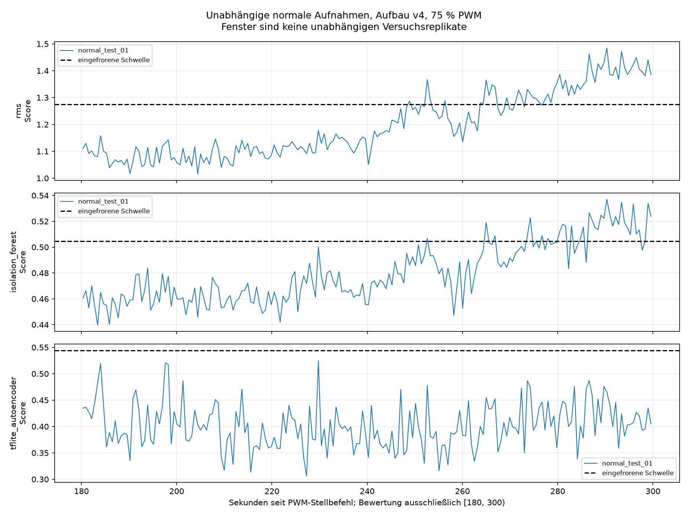

# Unabhängige Normalitätsprüfung v4 – Zwischenbericht nach Lauf 1

Status: **1 von 3 geplanten unabhängigen Normalläufen abgeschlossen**. Lauf 2 und Lauf 3 wurden noch nicht gestartet. Dieser Bericht bewertet ausschließlich Lauf 1; ein Vergleich zwischen unabhängigen Teststarts und der abschließende Gesamtbericht stehen aus.

## Durchführung und Herkunft

Aufnahme-ID: `normal_test_01_75pwm_300s_20260911_155959_798760`. Aufbauversion: `fan_upright_position_v4_20260911_103726`. Der Nutzer bestätigte auf die konkrete Bereitschaftsfrage den unveränderten Normalaufbau ohne Platte, vollständigen Stillstand und angeschlossene externe 12-V-Versorgung mit „ja“. Die Freigabe gilt ausschließlich für diesen Start und ist in [normal_test_01_release.json](normal_test_01_release.json) dokumentiert.

Nach 60.026400232 s zusätzlicher Auszeit ab erfasster Freigabe stellte die Software einmalig 75 % PWM bei 25 kHz ein. Der Stellbefehlsaufruf erfolgte am 11.09.2026 um 17:59:59,805742 Uhr MESZ / 15:59:59,805742 UTC. Der erste XYZ-Punkt folgte nach 93.229489 ms; die Zeitspanne zwischen erstem und letztem XYZ-Punkt beträgt 299.99108277 s. Die gesamte vorherige Auszeit von Lauf 1 ist unbekannt. Host-Leseabschluss, elektrisches PWM-Signal und mechanischer Rotorstart sind unterschiedliche Zeitpunkte; die beiden letztgenannten wurden nicht gemessen.

Die Software setzte nach der vollständigen 300-s-Aufnahme wieder 0 % PWM und las die Einstellung zurück. Der 0-%-Befehl war um 18:05:00,227875 Uhr MESZ abgeschlossen. Eine spätere unabhängige Rücklesung bestätigte 0 ns Tastdauer, 40.000 ns Periode, aktivierten PWM-Kanal und GPIO18-Pinfunktion `PWM0_CHAN2`. **Mechanischer Stillstand nach diesem Lauf ist noch nicht bestätigt.** Es gibt keinen automatischen Folgestart.

Sensor unverändert: ADXL345, nominell 200 Hz, ±2 g, Full Resolution, 0,0039 g/LSB, FIFO-Stream, I²C-Bus 1 mit konfigurierten 100 kHz. Registerrücklesungen und sämtliche Steuerzeiten stehen im [Sitzungsprotokoll](normal_test_01_session.json) und [Steuerjournal](normal_test_01_fan.jsonl). Keine Drehzahlmessung liegt vor.

## Datenqualität und Zeitbasis

| Merkmal | Lauf 1 |
|---|---:|
| Vollständige XYZ-Punkte | 62133 |
| Einzelne Achsenwerte | 186399 |
| Nominelle Sensor-Abtastrate | 200 Hz |
| Beobachteter Durchsatz, (N−1)/Hostzeitspanne | 207.112823 XYZ/s |
| Host-Leseabstand Median / 99. Perzentil | 5.561991 / 5.698256 ms |
| Maximaler Host-Leseabstand | 15.099650 ms |
| Host-Leseabstände über 10 ms / über 160 ms | 3 / 0 |
| Maximale Dauer eines Sensorlesevorgangs | 5.638205 ms |
| Maximal beobachteter FIFO-Füllstand | 3 |
| Lücken- / Überlauf- / Sättigungsflags | 0 / 0 / 0 |
| Nichtmonotone Hostabstände / nichtendliche XYZ-Punkte | 0 / 0 |

Die Aufnahme besteht die vorab festgelegten Qualitäts- und Herkunftsprüfungen. Hostzeitstempel messen Leseabschlüsse, nicht die tatsächlichen Wandlungszeitpunkte des Sensors. Die Abweichung zwischen 200 Hz und rund 207 XYZ/s bleibt getrennt dokumentiert; eine genaue physische Verlustzahl ist weiterhin unbekannt. Fehlende Qualitätsflags beweisen keine lückenlose physische Wandlungsfolge.

## Bewertung mit eingefrorenen Modellen

Das vor Aufnahmebeginn festgeschriebene [Testprotokoll](test_protocol.md) legt ausschließlich [180,300) Sekunden seit Stellbefehlsaufruf für die Bewertung fest. Daraus ergeben sich 24853 XYZ-Punkte, 194 vollständige Fenster zu jeweils 128 XYZ-Punkten und 21 nicht aufgefüllte Restpunkte. Schrittweite 128, keine Überlappung und keine Fenster über Aufnahmegrenzen. 180 Sekunden bleiben eine vorläufige Einlaufzeit; der Abschnitt wurde nicht anhand der Testergebnisse verändert.

Die achsenweise Float64-Mittelwertentfernung je Fenster, Float32-Konvertierung und gespeicherte Skalierung sind mit dem Trainingsweg auf exakte numerische Übereinstimmung geprüft. 112 Softwaretests bestanden vor der Aufnahme. Alle Methoden erhalten wertgleiche standardisierte Eingabefenster. Modellpaket, Scaler und Schwellen bleiben unverändert; die 246 vorab registrierten historischen CSV-Quellen sind als unabhängige Testdaten ausgeschlossen.

| Methode | Gültige Fenster | Ungültige Fenster | Fehlalarme | Fehlalarmrate unter gültigen normalen Fenstern |
|---|---:|---:|---:|---:|
| RMS | 194 | 0 | 57 | 29.38 % |
| Isolation Forest | 194 | 0 | 34 | 17.53 % |
| TFLite-Autoencoder | 194 | 0 | 0 | 0.00 % |

RMS- und Isolation-Forest-Scores steigen innerhalb des bewerteten Abschnitts sichtbar an; ihre erhöhten Fehlalarmraten sind Ergebnisse dieses unabhängigen Normallaufs und werden nicht durch Änderungen der Schwellen korrigiert. Der RMS-Score ist ein standardisierter Modellscore und kein Vektor-AC-RMS in g. Der Autoencoder blieb in diesem Lauf unter seiner eingefrorenen Schwelle. Das belegt weder allgemeine Fehlalarmfreiheit noch die Fähigkeit, veränderte oder anomale Zustände zu erkennen.

Es liegt bisher nur **eine vollständige unabhängige Testaufnahme** vor. Benachbarte Fenster sind keine unabhängigen Versuchsreplikate. Es werden weder Anomalie-Recall noch F1 oder allgemeine Erkennungsleistung aus diesen Normaldaten abgeleitet. Ungültige Fenster würden weder als NORMAL noch im Nenner der Fehlalarmrate zählen.

## Nächster Schritt und Erhaltung

Als Nächstes folgen die bereits vorab festgelegten Normalläufe 2 und 3 unter unveränderten Bedingungen. Jeder Start wartet auf eine neue Nutzerfreigabe „Lüfter steht, nächster Lauf freigegeben“, danach folgen jeweils weitere 60 Sekunden Auszeit. Tatsächliche gesamte Auszeiten werden separat dokumentiert. Keine erneute Frage zum sichtbaren Lauf, Antwortfrist oder automatische Wiederholung ist vorgesehen.

Erst nach den drei Normalläufen erfolgt die abschließende Beurteilung und Empfehlung für einen kontrolliert veränderten Testzustand. Der vorbereitete Kandidat ist eine separat befestigte äußere Platte bei gleicher PWM; tatsächliche Geometrie und Freigabe wären vor einer späteren Durchführung festzuhalten. Dieser Versuch wird jetzt nicht gestartet. Hohe normale Fehlalarmraten schränken die Interpretierbarkeit späterer Zustandsalarme ein und bleiben als Vergleichsergebnis erhalten. Etwaige Modelländerungen würden eine neue Version und neue unabhängige Tests erfordern.

Die Nachprüfung von 1.172 bereits vorhandenen Dateien ergab keine Änderungen; Worddatei und eingefrorene Artefakte blieben erhalten ([Nachprüfung](verification_after_normal_test_01.json)). Neue Rohdaten, Sidecar, Sitzung, Scores und Grafiken sind separat gespeichert. SHA256 der Rohdatei: `058f4aec69a567236dbe7e4c0d84590f51f3210ef320a2cd4ae794be5baa8e18`. Modellpaket: `cec1859bfb354bafef77a619e6d2c1ffd85b50787c87595aba9a1e20a80cdae5`. Weitere Quell- und Ergebnishashes stehen in [summary.json](evaluation_normal_test_01/summary.json).
