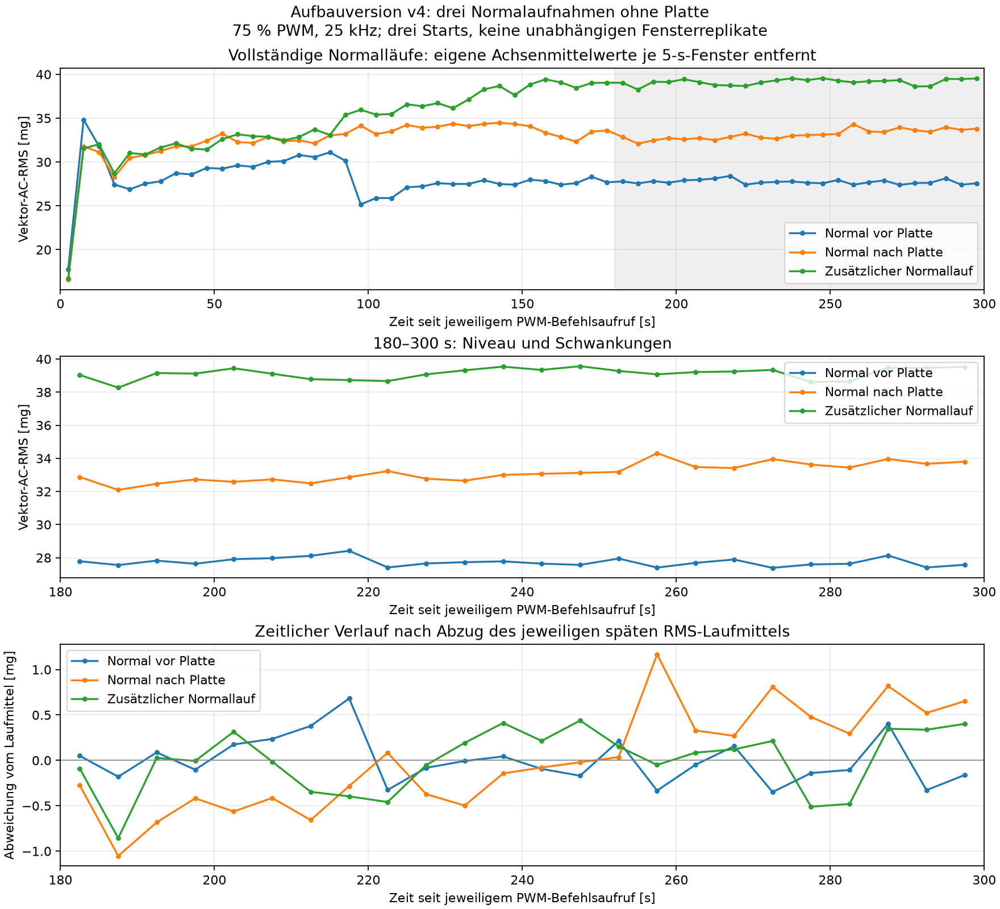
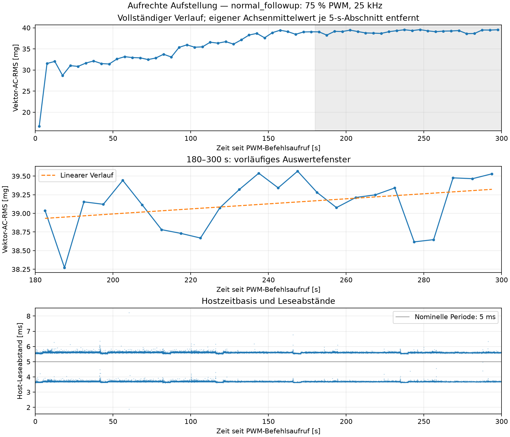

# Zusätzlicher Normallauf ohne Platte: Aufbauversion v4

Messdatum: 11.09.2026. Aufbauversion **`fan_upright_position_v4_20260911_103726`**. Diese Aufnahme ergänzt die zuvor abgeschlossene Folge Normal → Platte → Normal, ohne deren Daten oder Berichte zu verändern.

**Ergebnis:** Ein höheres Vibrationsniveau tritt auch ohne erneuten Plattenumbau auf. Der mittlere Vektor-AC-RMS in 180–300 s beträgt im Zusatzlauf **39,128 mg**, gegenüber **27,737 und 33,148 mg** in den vorherigen Normalaufnahmen. Auch das Niveau der einmaligen Plattenaufnahme von **36,481 mg** wird überschritten. Eine höhere RMS-Amplitude ist deshalb in diesen Pilotdaten kein eindeutiges Merkmal der Plattenbedingung. Das ist weder ein nachgewiesener Defekt noch eine bewertete KI-Erkennung.

## Freigabe, Aufbau und Steuerung

Der Nutzer hatte vollständigen Stillstand nach dem vorherigen Lauf bestätigt. Danach wurde der einzelne Zusatzlauf einschließlich Wartezeit, Messdauer und abschließendem Rückstellen erläutert. Der Nutzer wurde angewiesen, die Platte entfernt, die externe 12-V-Versorgung angeschlossen sowie Lüfter und Sensor unverändert zu lassen. Mit „alles klar dann starte“ gab er diesen Lauf ausdrücklich frei. Die frühere Stillstandsbestätigung und die aktuelle Freigabe sind getrennt dokumentiert; eine neue unabhängige Sichtbeobachtung vor dem Start wird nicht behauptet.

Der Lüfter steht unverändert aufrecht. Der ADXL345 ist mit zwei Schrauben am äußeren feststehenden Rahmen befestigt; die Platine sitzt schräg. Für diesen Lauf wurde kein Plattenumbau angefordert. Tatsächlicher Parkabstand der entfernten Platte, Drehzahl, Versorgungsspannung unter Last und Temperaturen wurden nicht gemessen. Auch die Istmaße der zuvor verwendeten Platte bleiben unbekannt.

Einmalige Steuerfolge: **0 % → 75 % → 0 % PWM bei 25 kHz**. BCM-GPIO18 entspricht dem physischen Pin 12. Die vorhandene RP1-Hardware-PWM an Kanal 2 mit `a3` / `PWM0_CHAN2` verwendet 40.000 ns Periode und im Betrieb 30.000 ns Tastzeit. Prozessprüfung und Zugriffssperren wurden verwendet; im Betrieb erfolgten zwei zusätzliche reine Kontrollablesungen. Das Journal enthält genau einen 75-%- und einen 0-%-Stellvorgang. Es gab keine Antwortfrist, Laufbeobachtungsfrage, automatische Wiederholung oder erkennungsabhängige Stelländerung.

| Zeitangabe | Dokumentierter Wert |
|---|---|
| Annahme der Startfreigabe | 11:27:31,256394 UTC / 13:27:31,256394 Ortszeit |
| PWM-Befehlsaufruf | 11:28:35,161292 UTC / 13:28:35,161292 Ortszeit |
| Erste XYZ-Lesung, UTC-Schätzung | 11:28:35,235875 UTC |
| Erste Lesung nach Befehlsaufruf | 74,583 ms |
| Erste Lesung nach Befehlsabschluss | 27,592 ms |
| Zusätzliche Auszeit ab Freigabe | 63,904916 s; geplant 60 s |
| Abstand zum vorherigen Nullbefehlsabschluss | 727,180349 s |
| Abschluss des neuen Nullbefehls | 11:33:35,535956 UTC / 13:33:35,535956 Ortszeit |

Die zusätzliche Auszeit war wegen der Vorbereitung des getrennten Messordners **3,904916 s länger** als geplant. Dies wurde während des Versuchs mitgeteilt; die Abweichung führte zu keinem Wiederholungsstart. Die gesamte Auszeit ist von den zusätzlichen 60 s zu unterscheiden. Der Abstand zwischen Steuerbefehlen ist keine unabhängig gemessene mechanische Stillstands-, Abkühl- oder Spannungsunterbrechungsdauer. Die tatsächlichen gesamten Auszeiten der verglichenen Starts unterscheiden sich.

Die UTC-Schätzung der ersten Lesung wird aus den gemeinsam erfassten UTC- und monotonen Hostzeiten des PWM-Befehlsaufrufs abgeleitet. Elektrische Signalflanke und Rotorstart wurden nicht gemessen. Das gesonderte [Steuerjournal](normal_followup_fan.jsonl) dokumentiert die Befehle und Rücklesungen, die [Sitzung](normal_followup_session.json) die tatsächlichen Zeiten.

## Messkette und Datenqualität

Die neue Aufnahme verwendet dieselbe rückgelesene Sensorkonfiguration wie beide vorherigen v4-Normalaufnahmen: ADXL345, nominell **200 Hz**, ±2 g, Full Resolution, FIFO-Stream, 0,0039 g/LSB, I²C-Bus 1, Adresse 0x53, konfigurierter Bustakt 100 kHz. Register: BW_RATE=0x0B, DATA_FORMAT=0x08, INT_ENABLE=0x00, FIFO_CTL=0x90, POWER_CTL=0x08. Eine zusätzliche Prüfung im neuen Einzelphasen-Runner verlangt die vollständige Übereinstimmung mit der vorherigen Sensorkonfiguration vor dem Start.

| Kennwert des Zusatzlaufs | Ergebnis |
|---|---:|
| Vorgesehene Erfassungsdauer | 300 s |
| Vollständige XYZ-Messpunkte | 62.151 |
| Einzelne Achsenwerte | 186.453 |
| Spanne erste–letzte Hostlesung | 299,993708 s |
| Nominelle Sensor-ODR | 200 Hz |
| Beobachteter Durchsatz | 207,1710 XYZ/s |
| Hostabstand Mittel / Median / 99. Perzentil | 4,827 / 5,588 / 5,670 ms |
| Größter Host-Leseabstand | 8,217 ms |
| Hostabstände über 10 ms | 0 |
| Größte dokumentierte Lesedauer | 6,238 ms |
| Größter FIFO-Füllstand | 1 |
| Gap / Overrun / Sättigung | 0 / 0 / 0 gesetzte Flags |
| Nicht steigende Hostzeitabstände | 0 |
| Größter absoluter Achsenwert | 0,7566 g |

Rohdatenhash, endliche XYZ-Werte, streng steigende Hostzeitstempel, Zeitspaltenkonsistenz und fortlaufende Softwareindices wurden geprüft. Die beobachtete Rate folgt aus `(N−1)/(t_letzter−t_erster)` und wird nicht als nominelle ODR ausgegeben. Jede Datenzeile enthält drei Achsenwerte, nicht drei zeitlich unabhängige Messpunkte. Die genaue Sensorverlustzahl bleibt unbekannt: Fehlende Flags und fortlaufende Softwareindices beweisen nicht, dass jede physische Sensorwandlung erfasst wurde. Der Gap-Indikator umfasst Überlaufverdacht oder Hostabstände über 160 ms; kürzere Hostabstände wurden zusätzlich separat untersucht.

Die Software übernimmt einen 6-Byte-XYZ-Burst nur bei positivem FIFO-Füllstand und setzt den FIFO an der Aufnahmegrenze zurück. Sie interpoliert keine Werte auf etwa 207 Hz. Die Spalte `sample_index / 200` ist nur eine nominelle Zeitschätzung und wird nicht zur Abgrenzung der folgenden 5-s-Fenster verwendet. Host-Leseabschlüsse sind keine unabhängigen Sensor-Wandlungszeitstempel; die Ursache der Abweichung zwischen nomineller und beobachteter Rate ist weiterhin nicht abschließend geklärt.

| Achsenkennwert, gesamte neue Rohaufnahme | X | Y | Z |
|---|---:|---:|---:|
| Mittelwert [g] | −0,626773 | −0,712580 | 0,090347 |
| Standardabweichung, Divisor N [mg] | 11,021 | 11,603 | 32,765 |

## Vibration innerhalb und zwischen den Normalaufnahmen

In jedem nicht überlappenden 5-s-Fenster werden zuerst dessen drei Achsenmittelwerte entfernt. Danach wird `sqrt(mean(x_ac² + y_ac² + z_ac²))` berechnet. Die Formel wurde gegen die Summe der Achsenvarianzen geprüft. Pro Betriebslauf entstehen 60 Fenster, davon 24 im unveränderten Prüfabschnitt 180–300 s. Die Zeitbasis ist der monotone Hostzeitabstand zum jeweiligen PWM-Befehlsaufruf. Die kurze Zeit vor der ersten Lesung wird nicht aufgefüllt. 15 Rohdatenpunkte knapp nach 300 s bleiben gespeichert, liegen aber außerhalb der festgelegten Auswertung.

| Normalaufnahme | Mittel der späten Fenster [mg] | Fenster-SD, Divisor 24 [mg] | Fensterbereich [mg] | Lineare Steigung [mg/min] | Robuste Mediansteigung [mg/min] |
|---|---:|---:|---:|---:|---:|
| Vor Plattenumbau | 27,737 | 0,253 | 27,388–28,419 | −0,118 | −0,113 |
| Nach Entfernen der Platte | 33,148 | 0,545 | 32,095–34,316 | +0,800 | +0,768 |
| Zusätzlicher Lauf ohne erneuten Umbau | 39,128 | 0,339 | 38,271–39,566 | +0,203 | +0,209 |

Die späte RMS-Mittelwertdifferenz des Zusatzlaufs beträgt **+11,391 mg (+41,068 %)** zur ersten und **+5,980 mg (+18,040 %)** zur zweiten Normalreferenz. Keines der 24 neuen Fenster liegt innerhalb eines dieser beiden zuvor beobachteten Fensterbereiche. Diese beschreibende Bereichsprüfung ist kein statistischer Nachweis und kein vorab festgelegtes Akzeptanzkriterium für einen Normalzustand.

Zwischen den drei späten Laufmitteln beträgt die Spannweite **11,391 mg**, ihre Standardabweichung mit Divisor 2 **5,698 mg**. Die quadratisch gemittelte Standardabweichung innerhalb der drei Läufe beträgt dagegen **0,398 mg**. Damit dominieren in diesen Aufnahmen die Unterschiede zwischen Starts gegenüber den Schwankungen innerhalb der späten Abschnitte. Drei Starts liefern allerdings noch keine belastbare Verteilung der Normalvariabilität; die 72 späten Fenster sind keine 72 unabhängigen Versuchsreplikate.

Im Zusatzlauf steigt das Niveau zunächst über etwa 150 s deutlich an. Im Abschnitt 180–300 s beträgt die angepasste Änderung nur noch **+0,406 mg bzw. +1,038 %**. Die vier aufeinanderfolgenden 30-s-Gruppen dort liegen bei **39,024; 39,019; 39,288 und 39,180 mg**. Die letzten 60 s liegen im Mittel **0,212 mg** über den ersten 60 s dieses Abschnitts. Das beschreibt einen kleinen positiven Trend mit lokalen Schwankungen, keinen völlig konstanten Verlauf. Die vorläufige Einlaufzeit von 180 s wird weder wegen unterschiedlicher Laufmittel automatisch verworfen noch durch diesen einzelnen relativ ruhigen Abschnitt allgemein bestätigt.

Der zuvor einmalig gemessene Plattenzustand hatte in 180–300 s **36,481 mg** mittleren Vektor-AC-RMS. Der neue, als Normalbetrieb ohne Platte freigegebene Lauf liegt **2,647 mg bzw. 7,256 % darüber**. Das höhere Niveau tritt also ohne erneuten Plattenumbau auf. Damit ist die offene Pilotfrage beantwortet; daraus folgt keine geklärte Ursache des Niveauwechsels. Ein einzelner oberer RMS-Schwellenwert, der die bisherige Plattenaufnahme auffällig nennt, würde bei gleicher Auswertung auch diesen höheren Normallauf auffällig nennen. Das ist eine Folgerung aus den Messwerten, kein durchgeführtes Modelltraining oder Evaluationsergebnis. Über eine Trennbarkeit mit anderen Merkmalen sagt der reine RMS-Vergleich noch nichts aus.

## Schlussfolgerung und nächster Schritt

Die Messung ist als weitere Normalaufnahme dieser Aufbauversion nutzbar. Der Anstieg gegenüber den vorangegangenen Normalstarts darf nicht allein wegen seiner Höhe nachträglich als Anomalie umetikettiert werden. Eine vollkommen konstante RMS-Kurve ist kein notwendiges Ziel; die normale Variation muss in späteren Trainings- und Prüfaufnahmen vertreten sein. Drei Normalstarts und eine Plattenaufnahme erlauben jedoch noch keine verlässliche Zustandsbewertung. Insbesondere darf das erste, niedrigere Normalniveau nicht allein zur Skalierung oder Schwellensetzung benutzt werden, während die anderen Normalstarts bereits deutlich höher liegen.

Die Gründe des Niveauwechsels sind offen. Alle verglichenen Aufnahmen haben denselben konfigurierten Sensorbetrieb und 75 % PWM bei 25 kHz; eine unabhängige Drehzahl-, Temperatur- oder Versorgungsspannungsmessung liegt nicht vor. Die erneute Softwareprüfung zeigt in `collect_real_data.py` und `live_tflite_monitor.py` nur Felder zur Übernahme einer extern gemessenen Drehzahl, keine aktive Tachoerfassung. Die bestehende Dokumentation bestätigt GPIO18 als Steueranschluss, nicht als separaten Tachoeingang. PWM-Vorgaben und mögliche Spektralspitzen werden deshalb nicht als gemessene Drehzahl ausgegeben.

**Konkreter nächster Schritt ohne neue Aufnahme:** Die vorhandenen drei v4-Normalaufnahmen im Frequenzbereich vergleichen, insbesondere dieselben Abschnitte 180–300 s. Zu klären ist, ob überwiegend dieselben Frequenzanteile stärker werden oder ob sich deren Verteilung zwischen Starts ändert. Dazu dieselbe Fensterung und Normierung verwenden, nominelle und beobachtete Zeitbasis getrennt behandeln und die Grenzen der nicht unabhängig gemessenen Sensorzeitpunkte beachten. Die vorhandene Plattenaufnahme kann daneben separat betrachtet werden. Diese zusätzliche Frequenzauswertung wurde im vorliegenden RMS-Bericht noch nicht durchgeführt; aus Peaks dürfen weder eine bestimmte Drehzahl noch eine Fehlerursache ohne unabhängigen Beleg abgeleitet werden.

Erst anhand dieser Prüfung ist ein gezielter weiterer Hardwareversuch festzulegen. Vor einer erneuten Plattenfolge sind die tatsächliche Geometrie und gegebenenfalls die Möglichkeit einer unabhängigen Drehzahlmessung zu klären. Die bisher unbekannten Istangaben werden nicht als erfüllt ausgegeben. Dafür werden jetzt weder Lüfter noch Sensor verändert und keine weiteren Starts durchgeführt.

Vorbereitung des Nutzers: **Platte entfernt und den Aufbau unverändert lassen.** Kein Eingriff am Rotor, kein weiterer Plattenumbau und keine neue Freigabe sind für die vorgeschlagene reine Dateiauswertung nötig. Die zuletzt angefragte abschließende Sichtbestätigung des Stillstands ist zum Zeitpunkt dieses Berichts noch offen. Die frühere Bestätigung vor dem Zusatzlauf wird nicht als neue Bestätigung nach ihm übernommen.

## Dateien, Erhaltung und Abschluss

- [Rohdaten](../../data/upright_v4_normal_followup_20260911_112731/normal_followup_75pwm_300s_20260911_112835_067380.csv) und [Metadaten](../../data/upright_v4_normal_followup_20260911_112731/normal_followup_75pwm_300s_20260911_112835_067380.json).
- [Auswertung des Zusatzlaufs](analysis/normal_followup/summary.json), [5-s-Fenster](analysis/normal_followup/five_second_rms.csv), [Vergleich der Normalstarts](analysis/normal_comparison/comparison.json), [Vergleichsgrafik als PDF](analysis/normal_comparison/comparison.pdf).
- [Freigabe](normal_followup_release.json), [Aufbau](mounting.json), [Geometrie](geometry.json), [Protokoll](protocol.md), [reine PWM-Kontrollablesungen](normal_followup_readonly_spotchecks.jsonl).
- [Unveränderter Bericht der vorangegangenen Folge](../upright_position_v4_sequence_20260911_104025/final_sequence_report.md). Es werden nur deren Aufnahmen derselben Aufbauversion direkt verglichen; frühere liegende oder verschobene Aufstellungen bleiben getrennt.

Nach dem Zusatzlauf sind **0 % PWM bei 25 kHz** mit korrekter Pin-Funktion rückgelesen. Die Einstellung ist keine automatische Bestätigung des mechanischen Stillstands. Der Lauf wird nicht wiederholt. Rohdaten und neue Ergebnisse wurden separat gespeichert. Worddatei, bestehende Modelle, frühere Rohdaten und Protokolle bleiben unverändert; es wurde kein Modell trainiert. Für spätere Training-, Validierungs- und Testgruppen bleiben vollständige unabhängige Aufnahmen die Einheit der Trennung. Benachbarte Fenster werden nicht zufällig zwischen diesen Gruppen verteilt. Diese entwicklungsbegleitend ausgewerteten Pilotaufnahmen sind kein unabhängiger abschließender Test.
