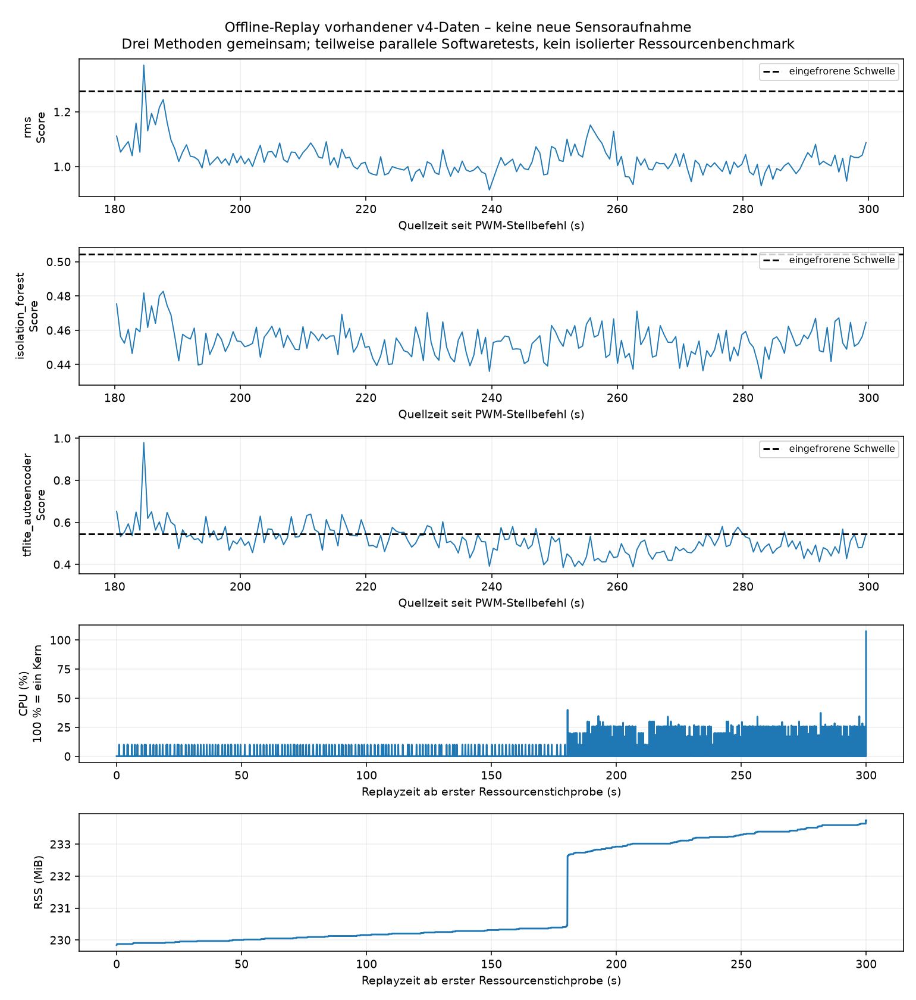

# Softwarefortschritt: 50-%-Normaltest und eingefrorener Live-Datenweg

Es wurden keine neuen Hardwaremessungen ausgeführt und keine PWM-Einstellungen verändert. Modelle, Scaler, Schwellen, Worddatei und historische Quellen bleiben unverändert. Die spätere ausdrückliche Nutzerfreigabe für automatische Starts/Stopps ist dokumentiert; die aktuelle Anfangsbereitschaft ohne Platte ist noch offen.

## Umgesetzt und geprüft

- Separater 50-%-Aufnahme-/Importadapter mit vollständigem Protokoll, 20000 ns Tastzeit bei 40000 ns Periode, NORMAL-Label und unverändertem Modellpaket.
- Drei vorab autorisierte Starts möglich. Initiale Bereitschaft bleibt erforderlich; später jeweils geprüfte Software-Nullstellung und mindestens 60 s zusätzliche Auszeit. Kein behaupteter mechanischer Stillstand und keine automatischen Ersatzstarts.
- Neue Streaming-Fensterbildung beginnt beim ersten XYZ-Punkt in [180,300), umfasst 128 Punkte ohne Überlappung und speichert den gesamten Rohverlauf. Der eingefrorene Fenster-/Qualitätskern bleibt unverändert.
- Pro Fenster Float64 in ursprünglicher Achsenreihenfolge und F-Speicherordnung, achsenweise Zentrierung, danach Float32 und gespeicherter Scaler. Alle Methoden erhalten Kopien desselben standardisierten Fensters.
- Begrenzte Entscheidungsqueue mit expliziten Verwerfungsereignissen, Fehlermeldungen und Rohdatensicherung; Ressourcenstichproben alle 100 ms. INVALID ist keine Normalentscheidung.
- Sensor-Reader und injizierbarer Live-Recorder sind angebunden; der vorhandene Capture-Lebenszyklus muss den PWM-Befehl und die abschließende Nullstellung weiterhin besitzen. Die bisherige GUI und Legacy-Live-CLI wurden nicht stillschweigend umgestellt.

**Softwaretests: 130 bestanden.** Darunter exakte Eingangs-/Scoregleichheit auf 194 echten archivierten Fenstern, Grenzen bei 180/300 s, Qualitätsfehler einschließlich fensterübergreifender Host-Lücke, langsamer Auswerter, teilweise Rohdatensicherung bei Leserfehler und unterbundener Folgestart bei Fehler. Die zahlreichen Joblib-/NumPy-Hinweise sind DeprecationWarnings beim Laden des vorhandenen Pakets; keine Testfehler.

## Tatsächlich ausgeführte Offline-Prüfung

Eine vorhandene vollständige 300-s-Normalaufnahme wurde mit ihren ursprünglichen Host-Zeitabständen abgespielt. Das ist weder eine unabhängige neue Testaufnahme noch Sensor-Livebetrieb. Ressourcen werden dem einen Prozess mit allen drei Methoden zugerechnet. Zeitweise liefen zusätzlich Softwaretests: Die Zahlen sind ein Entwicklungs-/Belastungscheck, kein kontrollierter isolierter Methodenbenchmark.

Alle **582 Scores und Entscheidungen (194 Fenster × 3)** entsprechen exakt den archivierten Ergebnissen. Keine neue Parameterauswahl.

| Methode | Gültig | Ungültig | Alarme auf vorhandenen Normaldaten | P99 komplett→Entscheidung (ms) |
|---|---:|---:|---:|---:|
| rms | 194 | 0 | 1 | 6.519 |
| isolation_forest | 194 | 0 | 0 | 28.244 |
| tflite_autoencoder | 194 | 0 | 51 | 28.569 |

Verworfene Entscheidungsfenster: **0**. Unvollständiger Rest im ausgewählten Abschnitt: 22 XYZ-Punkte. Alle 62140 Rohpunkte gespeichert. Nominelle 200 Hz und beobachtete 207.136909 XYZ/s bleiben getrennt. Die genaue physische Verlustzahl bleibt unbekannt.

Komplett→Entscheidung umfasst die neue Fensteraufbereitung, Queue und Methodenausführung ab dem zugeordneten Replay-Ankunftszeitpunkt. Die Dauer des Scorer-Aufrufs enthält bei TFLite Tensortransfers, invoke und MSE; sie ist **keine isolierte invoke-Latenz**. Inferenzreihenfolge im gemeinsamen Prozess beeinflusst die späteren Methoden. Die Ressourcenstichproben erfassen keinen garantierten kurzfristigen RSS-Höchstwert; Prozess-Lebenszeitspitzen werden zusätzlich gespeichert. Kalter Modellstart und CPU-Last je isolierter Methode sind noch gesondert zu messen.

## Steuerungsstatus und weitere Durchführung

Die rein lesende Kontrolle um 09:09:05 UTC (11:09:05 Ortszeit) bestätigte GPIO18/physisch 12 in a3/PWM0_CHAN2, Periode 40000 ns, Tastzeit 0 ns, enable=1, normale Polarität. fuser meldete keine Belegung der geprüften Sensor-/GPIO-Geräte. Es gab keinen Stellbefehl. Mechanischer Stillstand wurde in diesem Arbeitsabschnitt nicht beobachtet.

Das neue eingefrorene Protokoll liegt in [upright_v4_second_pwm50_20260912_091000](../upright_v4_second_pwm50_20260912_091000/protocol.md). Es verlangt zunächst die aktuelle Bestätigung: Platte entfernt, Aufbau v4 unverändert, Lüfter still, 12-V-Versorgung angeschlossen. Es wurde keine entsprechende Anfangsfreigabe erfunden und keine Aufnahme gestartet. Danach kann die genehmigte Dreierfolge ohne weitere Laufbeobachtungsfragen ablaufen.

## Noch fehlende Nachweise, in Reihenfolge

1. Drei neue NORMAL-Aufnahmen bei 50 %: 15 min Aufnahme plus mindestens 3 × 60 s zusätzliche Auszeit. Vorab festgelegter Vergleich mit allen sechs früheren unabhängigen 75-%-Normalläufen; keine nachträgliche Schwellenänderung.
2. Prospektives Sensor-Live-Protokoll mit dem neuen Recorder, Methodenauswahl vor Start und vollständiger Erfassung der Verarbeitungszeiten, Rohdaten-/Pufferverluste und ungültigen/fehlenden Entscheidungen. Für getrennte Ressourcenvergleiche je Methode frischer Prozess; drei Wiederholungen je Methode ergeben 45 min Aufnahme plus Auszeiten. Der gemeinsame Replay-Prozess ersetzt diese Messungen nicht.
3. Isolierte TFLite-invoke-Zeit und kalter Modellstart getrennt instrumentieren und per Score-Parität prüfen. Die vorhandenen Scorer-Dauern bereits ehrlich als Gesamtaufruf verwenden.
4. Falls die GUI Teil des Nachweises bleibt: dieselbe neue Vorverarbeitung auch dort explizit anbinden, dann Zusatzlast gegenüber Sensor-Livebetrieb ohne GUI messen. Das alte GUI-Profil bleibt für das v4-Pilotpaket ungeeignet.
5. Abschlussbewertung und spätere Word-Übernahme erst auf Basis der tatsächlich vorliegenden Nachweise. Keine neue Modellversion und keine künstlichen Anomalien in diesem Auftrag.

Für den nächsten kleinsten Versuch genügt der erste vorab geplante 50-%-Normallauf (300 s + 60 s zusätzliche Auszeit). Bei der freigegebenen automatischen Dreierfolge ist zwischen den Läufen kein manueller Umbau nötig. Die Anfangsbedingungen müssen einmal aktuell bestätigt werden.

Verbleibender Softwareaufwand geschätzt: 2–4 h für kontrollierte Sensor-Live-/Ressourcenprotokolle, isolierte invoke-/Kaltstartinstrumentierung und Auswertung; optional weitere 2–4 h für GUI-Anbindung und Vergleich. Diese Schätzung ersetzt keine gemessene Bearbeitungsdauer.
