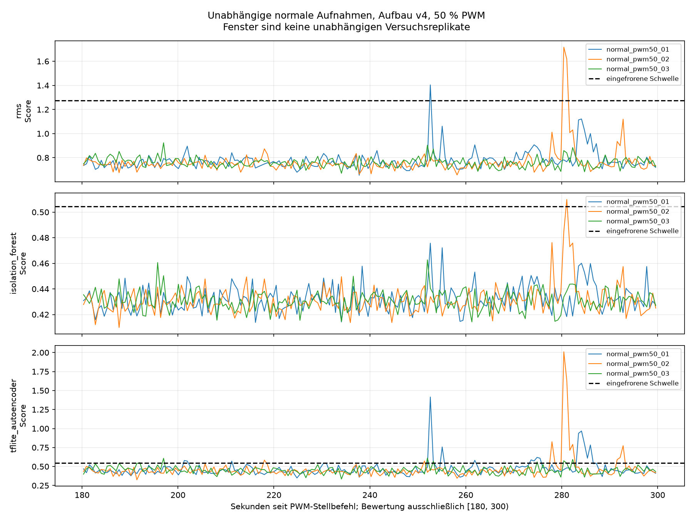

# Unabhängige Normalitätsprüfung des eingefrorenen v4-Pilotpakets

Ausgewertet: 3 vollständige unabhängige Normalläufe. Bewertung ausschließlich [180,300) s in 128er-XYZ-Fenstern ohne Überlappung.

| Lauf | Methode | Gültig | Ungültig | Fehlalarme | Fehlalarmrate unter gültigen Fenstern |
|---|---|---:|---:|---:|---:|
| normal_pwm50_01 | rms | 194 | 0 | 1 | 0.52 % |
| normal_pwm50_01 | isolation_forest | 194 | 0 | 0 | 0.00 % |
| normal_pwm50_01 | tflite_autoencoder | 194 | 0 | 17 | 8.76 % |
| normal_pwm50_02 | rms | 194 | 0 | 2 | 1.03 % |
| normal_pwm50_02 | isolation_forest | 194 | 0 | 1 | 0.52 % |
| normal_pwm50_02 | tflite_autoencoder | 194 | 0 | 11 | 5.67 % |
| normal_pwm50_03 | rms | 194 | 0 | 0 | 0.00 % |
| normal_pwm50_03 | isolation_forest | 194 | 0 | 0 | 0.00 % |
| normal_pwm50_03 | tflite_autoencoder | 194 | 0 | 7 | 3.61 % |
| pooled | rms | 582 | 0 | 3 | 0.52 % |
| pooled | isolation_forest | 582 | 0 | 1 | 0.17 % |
| pooled | tflite_autoencoder | 582 | 0 | 35 | 6.01 % |

Die gesamte Anlaufphase bleibt in den Rohdaten. 180 Sekunden sind weiterhin eine vorläufige Einlaufzeit. Hohe Fehlalarmraten bleiben als Testergebnis erhalten; es erfolgt keine Anpassung.

Ungültige Fenster zählen weder als NORMAL noch zum Fehlalarmnenner. Benachbarte Fenster sind abhängig. Aus diesen ausschließlich normalen Daten werden kein Anomalie-Recall, kein F1-Wert und keine allgemeine Erkennungsleistung abgeleitet.

Nominell 200 Hz und beobachteter XYZ-Durchsatz bleiben getrennt; genaue physische Verluste und Drehzahl sind unbekannt. 0 % PWM im Steuerjournal belegen keinen mechanischen Stillstand.

Nächster Nachweis: konsistenter Sensor-Livebetrieb und Ressourcenmessung. Kein automatischer Plattenversuch. Für weitere Hardwaremessungen sind Versuchsbedingungen und Freigabe zu dokumentieren. Bestehende Testergebnisse dürfen nicht für eine nachträgliche Schwellenwahl verwendet werden; Änderungen erfordern ein neues Modellpaket und neue unabhängige Tests.
