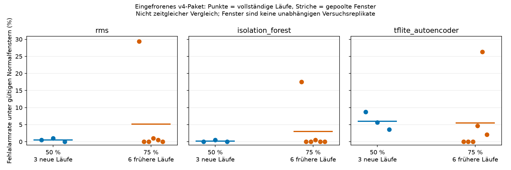
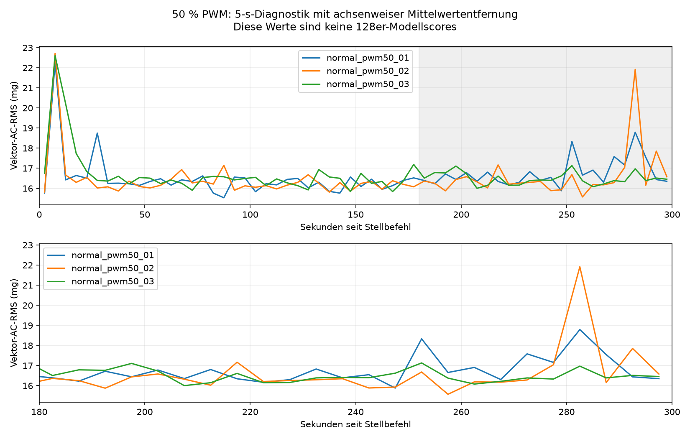

# Unabhängige Normalitätsprüfung bei 50 % PWM – Aufbau v4

Drei separat gespeicherte normale Betriebsläufe ohne Platte wurden bei 50 % PWM und 25 kHz ausgeführt. Der Nutzer bestätigte vor der Folge die entfernte Platte, unveränderten Aufbau v4, mechanischen Stillstand und angeschlossene Versorgung. Die zuvor ausdrücklich erlaubte automatische Steuerung wurde für die drei geplanten Starts verwendet. Zwischen den Läufen wurden 0 % eingestellt und zurückgelesen; ein neuer mechanischer Stillstand wurde dabei nicht beobachtet. Deshalb handelt es sich um drei getrennte Stellstarts mit dokumentierter Auszeit, nicht um drei jeweils durch Sichtprüfung bestätigte mechanische Neustarts.

Das eingefrorene Modellpaket, Scaler, Schwellen, Vorverarbeitung und Abschnitt [180,300) s blieben unverändert. Rohdaten enthalten den gesamten Anlauf. Pro Methode wurden dieselben 128er-XYZ-Fenster mit Schrittweite 128 ohne Überlappung verwendet; keine Fenster über Aufnahmegrenzen. Die Mittelwertentfernung erfolgt achsenweise in Float64, danach Float32 und gespeicherte Skalierung.

## Durchführung und Zeitbasis

| Lauf | Stellbefehl (CEST) | Erstes XYZ (CEST) | Versatz (ms) | XYZ-Punkte | Host-Spanne (s) | Beobachtete XYZ/s |
|---|---|---|---:|---:|---:|---:|
| normal_pwm50_01 | 12:04:20.761 | 12:04:20.860 | 98.425 | 62142 | 299.989086 | 207.144203 |
| normal_pwm50_02 | 12:10:21.354 | 12:10:21.451 | 97.072 | 62133 | 299.992610 | 207.111769 |
| normal_pwm50_03 | 12:16:21.911 | 12:16:22.006 | 94.856 | 62133 | 299.988657 | 207.114497 |

Der erste UTC-Zeitpunkt eines XYZ-Werts wird aus Stellbefehl-UTC und monotonem Versatz zugeordnet. Host-Leseabschluss ist nicht Sensor-Konversionszeit. Nominell eingestellt sind weiterhin **200 Hz**, ±2 g, Full Resolution, 0,0039 g/LSB, FIFO-Stream und I²C-Konfiguration 100 kHz. Sensorregister: BW_RATE 0x0b, DATA_FORMAT 0x08, INT_ENABLE 0x00, FIFO_CTL 0x90, POWER_CTL 0x08. Die Steuerung verwendet BCM GPIO18 (physischer Pin 12), a3/PWM0_CHAN2, Periode 40000 ns und bei 50 % eine Tastzeit von 20000 ns. Drehzahl und elektrischer Signalverlauf wurden nicht unabhängig gemessen.

| Lauf | Zusätzliche Auszeit ab Freigabe/Fortsetzung (s) | Gesamtzeit seit vorheriger Nullstellung (s) | Abschließender 0-%-Befehl (CEST) |
|---|---:|---:|---|
| normal_pwm50_01 | 60.027280 | unbekannt/nicht definiert | 12:09:21.167 |
| normal_pwm50_02 | 60.023911 | 60.186546 | 12:15:21.720 |
| normal_pwm50_03 | 60.023959 | 60.191916 | 12:21:22.317 |

Die erste gesamte vorangegangene Auszeit ist unbekannt. Die folgenden Gesamtzeiten werden ab Abschluss des vorherigen Software-Nullstellbefehls gerechnet, nicht ab einem gemessenen mechanischen Stopp. Die 60 s sind eine zusätzliche Software-Auszeit; identische gesamte Auszeiten oder Kühlbedingungen werden nicht behauptet. Es gab keine automatischen Ersatzstarts.

## Datenqualität

| Lauf | Host-P99 / Maximum (ms) | Abstände >10 / >160 ms | FIFO-Maximum | Gap / Overrun / Sättigung | Gültige / ungültige Modellfenster | Rest-XYZ in [180,300) |
|---|---|---|---:|---|---|---:|
| normal_pwm50_01 | 5.691 / 8.576 | 0 / 0 | 1 | 0 / 0 / 0 | 194 / 0 | 25 |
| normal_pwm50_02 | 5.692 / 9.790 | 0 / 0 | 2 | 0 / 0 / 0 | 194 / 0 | 20 |
| normal_pwm50_03 | 5.694 / 9.427 | 0 / 0 | 2 | 0 / 0 / 0 | 194 / 0 | 22 |

Die Prüfung umfasst monotone Zeitstempel, fortlaufende Indizes, konsistente relative und nominelle Zeitbasis, nichtendliche XYZ-Werte, FIFO-Vollstand, Rohwert-Sättigungsgrenzen und die gespeicherten Qualitätsflags. Ein Host-Abstand über 10 ms allein belegt keinen verlorenen Sensorwert. Die genaue Zahl physisch verlorener Samples bleibt **unbekannt**, auch bei fehlenden Verlustflags. Ein XYZ-Messpunkt enthält drei Achsenwerte; Achsenwerte werden nicht als drei zeitliche Messpunkte gezählt. Ungültige Modellfenster werden nicht als NORMAL und nicht im Fehlalarmnenner gezählt.

## Eingefrorener Modellvergleich

| Betriebspunkt / Lauf | Methode | Gültig | Ungültig | Fehlalarme | Fehlalarmrate |
|---|---|---:|---:|---:|---:|
| 50 % / normal_pwm50_01 | rms | 194 | 0 | 1 | 0.52 % |
| 50 % / normal_pwm50_01 | isolation_forest | 194 | 0 | 0 | 0.00 % |
| 50 % / normal_pwm50_01 | tflite_autoencoder | 194 | 0 | 17 | 8.76 % |
| 50 % / normal_pwm50_02 | rms | 194 | 0 | 2 | 1.03 % |
| 50 % / normal_pwm50_02 | isolation_forest | 194 | 0 | 1 | 0.52 % |
| 50 % / normal_pwm50_02 | tflite_autoencoder | 194 | 0 | 11 | 5.67 % |
| 50 % / normal_pwm50_03 | rms | 194 | 0 | 0 | 0.00 % |
| 50 % / normal_pwm50_03 | isolation_forest | 194 | 0 | 0 | 0.00 % |
| 50 % / normal_pwm50_03 | tflite_autoencoder | 194 | 0 | 7 | 3.61 % |
| 75 % / normal_test_01 (75 %) | rms | 194 | 0 | 57 | 29.38 % |
| 75 % / normal_test_01 (75 %) | isolation_forest | 194 | 0 | 34 | 17.53 % |
| 75 % / normal_test_01 (75 %) | tflite_autoencoder | 194 | 0 | 0 | 0.00 % |
| 75 % / normal_test_02 (75 %) | rms | 194 | 0 | 0 | 0.00 % |
| 75 % / normal_test_02 (75 %) | isolation_forest | 194 | 0 | 0 | 0.00 % |
| 75 % / normal_test_02 (75 %) | tflite_autoencoder | 194 | 0 | 0 | 0.00 % |
| 75 % / normal_test_03 (75 %) | rms | 194 | 0 | 0 | 0.00 % |
| 75 % / normal_test_03 (75 %) | isolation_forest | 194 | 0 | 0 | 0.00 % |
| 75 % / normal_test_03 (75 %) | tflite_autoencoder | 194 | 0 | 0 | 0.00 % |
| 75 % / normal_sep11 (75 %) | rms | 194 | 0 | 2 | 1.03 % |
| 75 % / normal_sep11 (75 %) | isolation_forest | 194 | 0 | 1 | 0.52 % |
| 75 % / normal_sep11 (75 %) | tflite_autoencoder | 194 | 0 | 9 | 4.64 % |
| 75 % / normal_before (75 %) | rms | 194 | 0 | 1 | 0.52 % |
| 75 % / normal_before (75 %) | isolation_forest | 194 | 0 | 0 | 0.00 % |
| 75 % / normal_before (75 %) | tflite_autoencoder | 194 | 0 | 51 | 26.29 % |
| 75 % / normal_after (75 %) | rms | 194 | 0 | 0 | 0.00 % |
| 75 % / normal_after (75 %) | isolation_forest | 194 | 0 | 0 | 0.00 % |
| 75 % / normal_after (75 %) | tflite_autoencoder | 194 | 0 | 4 | 2.06 % |
| 50 % / pooled | rms | 582 | 0 | 3 | 0.52 % |
| 50 % / pooled | isolation_forest | 582 | 0 | 1 | 0.17 % |
| 50 % / pooled | tflite_autoencoder | 582 | 0 | 35 | 6.01 % |
| 75 % / pooled | rms | 1164 | 0 | 60 | 5.15 % |
| 75 % / pooled | isolation_forest | 1164 | 0 | 35 | 3.01 % |
| 75 % / pooled | tflite_autoencoder | 1164 | 0 | 64 | 5.50 % |

Die Referenzgruppe umfasst alle sechs im Protokoll festgelegten früheren unabhängigen normalen v4-Testaufnahmen bei 75 %. Trainings- und Validierungsfenster sowie Plattenaufnahmen bleiben außerhalb dieser Vergleichsnenner. Die genaue Zuordnung mit CSV-, Session- und Ergebnis-Hashes steht in `comparison_50_vs_75/baseline_provenance.json`. Der Vergleich ist nicht zeitgleich und isoliert daher keinen kausalen PWM-Effekt von zeitlicher Drift oder anderen nicht erfassten Einflüssen.

Die gepoolten Raten sind deskriptive Fensteranteile. Die unabhängige Auswertungseinheit bleibt die vollständige Aufnahme. Benachbarte Fenster sind keine unabhängigen Versuchsreplikate; es werden keine naiven fensterbasierten Signifikanztests oder Konfidenzintervalle verwendet. Aus ausschließlich normalen Testdaten folgen weder Anomalie-Recall noch F1 oder allgemeine Erkennungsleistung.

## Ergänzende Vibrationsdiagnostik

| Lauf | Mittel 180–300 s (mg) | SD der 5-s-Blöcke (mg) | Bereich (mg) | Deskriptiver linearer Trend (mg/min) | Zweite minus erste Hälfte (mg) |
|---|---:|---:|---|---:|---:|
| normal_pwm50_01 | 16.761 | 0.690 | 15.882–18.792 | 0.477 | 0.562 |
| normal_pwm50_02 | 16.600 | 1.226 | 15.574–21.918 | 0.691 | 0.511 |
| normal_pwm50_03 | 16.485 | 0.308 | 16.003–17.132 | -0.075 | 0.008 |

Der physische Vektor-AC-RMS wird für jeden 5-s-Abschnitt nach Entfernung seiner drei Achsenmittelwerte berechnet. Diese Diagnose ist von dem standardisierten RMS-Modellscore eines 128er-Fensters zu unterscheiden. Die 180 s bleiben ein vorab festgelegter Prüfabschnitt; die Testergebnisse führen nicht zu nachträglicher Abschnittsauswahl. Unterschiede zwischen Laufmittelwerten und zeitliche Trends innerhalb eines Laufs werden getrennt ausgewiesen.

## Grenzen und nächster Nachweis

Der nächste gezielte Nachweis ist der Sensor-Livebetrieb des eingefrorenen Pakets mit der bereits geprüften Vorverarbeitung, Rohdatensicherung, begrenzter Entscheidungsqueue und Ressourcenprotokollierung. Dafür müssen die Versuchsparameter und Messgrößen vorab feststehen: komplettiertes Fenster bis Entscheidung, Scorer-/Inferenzzeiten, CPU, RSS, verworfene Fenster, Rohdaten-/Pufferverluste und ungültige Entscheidungen. Offline-Replay, Sensor-Livebetrieb ohne GUI und GUI-Zusatzlast sind getrennte Bedingungen. Ein gemeinsamer Prozess mit drei Methoden liefert keine isolierten CPU-/RAM-Kosten der Einzelmethoden.

Es erfolgt kein Nachtraining, keine neue Skalierung, keine Schwellenanpassung und kein erneuter Plattenversuch. Falls später eine Modelländerung beschlossen wird, braucht sie eine neue Version und neue unabhängige Testaufnahmen. Worddatei, Modelle, Originaldaten und historische Berichte bleiben unverändert.

Der anfängliche reine Software-Vorprüfaufruf verwendete zunächst das System-Python ohne Pandas und brach beim Import ab. Die Vorprüfung wurde anschließend in der vorhandenen Projektumgebung ausgeführt. Dieser Importfehler trat vor Sensorzugriff und Stellbefehl auf; er erzeugte keinen Lüfterstart und keine Aufnahme. Er ist in `initial_readonly_preflight.json` dokumentiert.

Der abschließende Steuerungszustand wird in `final_control_status.json` zusätzlich rein lesend geprüft. Eine bestätigte Vorgabe von 0 % ist keine Sichtbestätigung des mechanischen Stillstands.
