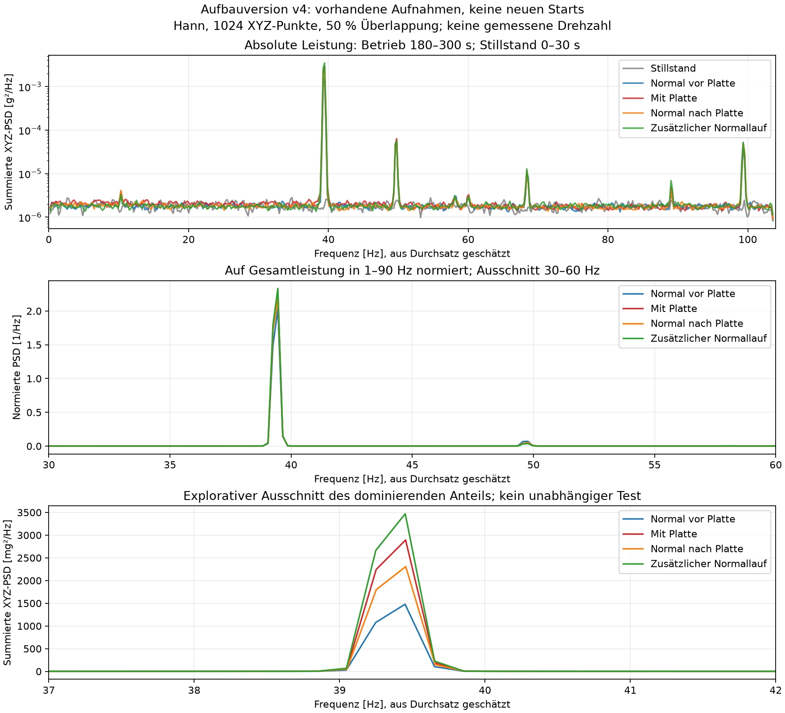
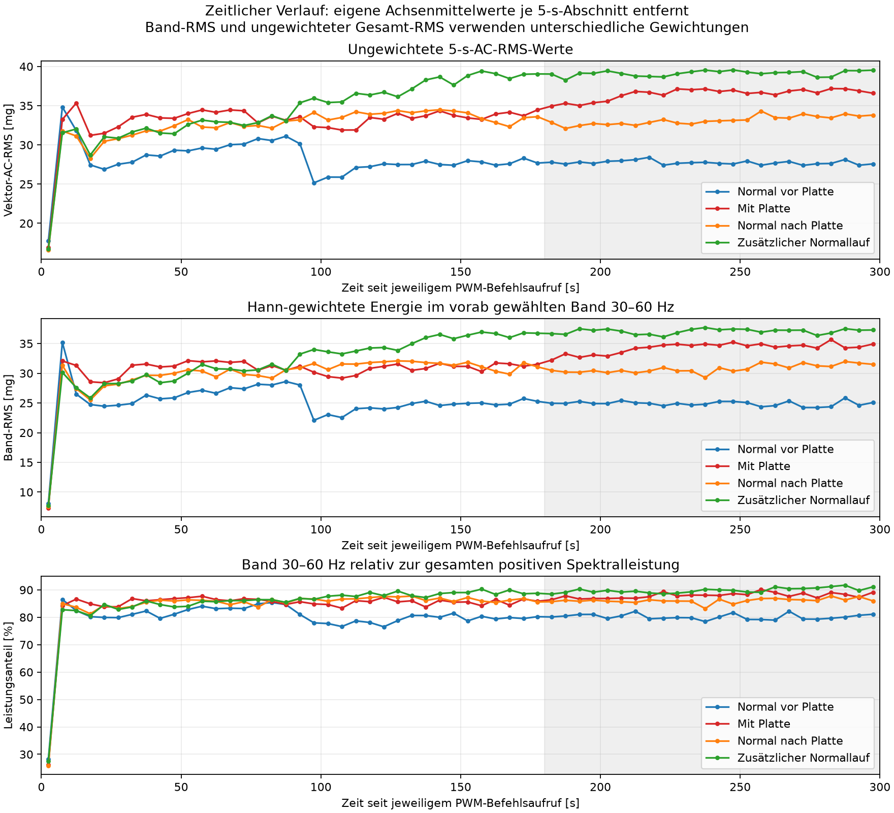

# Spektralvergleich der vorhandenen Aufnahmen: Aufbauversion v4

11.09.2026. Reine Dateiauswertung; **keine neue Aufnahme und kein Lüfterstart**. Verwendet werden ausschließlich die drei Normalaufnahmen und die eine Plattenaufnahme der Aufbauversion `fan_upright_position_v4_20260911_103726`. Ihre 30-s-Stillstandsreferenz wird separat dargestellt. Frühere Aufbauversionen werden nicht zusammengeführt.

**Ergebnis:** Die Unterschiede der Vibrationsstärke konzentrieren sich überwiegend auf denselben dominanten Frequenzanteil bei ungefähr **39,45 Hz** auf der aus dem Durchsatz geschätzten Frequenzachse. Die Plattenaufnahme zeigt in diesem Vergleich keinen eigenen, nur ihr zugeordneten dominanten Spektralanteil. Der zusätzliche Normalstart hat sogar die größte Stärke dieses gemeinsamen Anteils. Ein zuverlässiges Unterscheidungsmerkmal der Plattenbedingung ist somit weiterhin nicht belegt. Dies schließt andere Merkmale nicht grundsätzlich aus und ist keine Bewertung eines trainierten Modells.

## Daten und Methode

Primär verglichen werden **180–300 s ab dem jeweiligen PWM-Befehlsaufruf**. Die vorläufige Einlaufzeit wird nicht nachträglich passend zu den Spektren verändert. Alle Betriebsaufnahmen wurden mit 75 % PWM bei 25 kHz sowie derselben rückgelesenen ADXL345-Konfiguration erfasst: nominell 200 Hz, ±2 g, Full Resolution, FIFO-Stream, 0,0039 g/LSB. Der Hardwareaufbau und die Istgeometrie werden entsprechend den erhaltenen Aufnahmeprotokollen übernommen; insbesondere bleibt die tatsächliche Plattengeometrie unbekannt.

Die vorhandene Funktion `spectrum()` aus [fft_pilot.py](../../src/fft_pilot.py) wurde wiederverwendet. Je Achse und FFT-Segment wird der eigene Mittelwert entfernt; danach folgen ein symmetrisches Hann-Fenster, eine reelle FFT und eine einseitige Leistungsdichte mit Skalierung `abs(FFT)² / (fs × sum(window²))`. Positive Frequenzbins werden außer Nyquist verdoppelt. Die drei Achsenleistungsdichten werden addiert. Es wird nicht das Spektrum des Betrags des XYZ-Vektors verwendet.

Die mittleren Spektren verwenden 1024 XYZ-Punkte pro Segment und 512 Punkte Überlappung. Daraus folgen bei den beobachteten Raten ungefähr **4,94 s Segmentdauer und 0,2023 Hz Frequenzraster**. Das Raster ist keine Genauigkeitsgarantie; die Hann-Fensterung verbreitert einzelne Spektrallinien. Pro Betriebsabschnitt werden 47 vollständige Segmente gemittelt, für den Stillstand 11. Am Ende des jeweiligen Ausschnitts verbleiben 285–289 nicht in einem vollständigen FFT-Segment enthaltene Betriebspunkte beziehungsweise 61 Stillstandspunkte. Diese Punkte bleiben in den Rohdaten erhalten. Die ergänzende 5-s-Auswertung verwendet dagegen alle Punkte jedes jeweiligen Hostzeitfensters.

Die [vorab gespeicherte Analyseplanung](analysis_plan.json) legt die beschreibenden Bänder 0–10, 10–30, 30–60, 60–90 und ab 90 Hz bis zur jeweiligen Nyquistgrenze fest. Der spätere Grafikausschnitt 37–42 Hz dient nur der explorativen Darstellung der gefundenen dominanten Spitze. Er ist keine vorab validierte Merkmals- oder Schwellenauswahl.

Die beobachteten Raten betragen etwa 207,09–207,19 XYZ/s. Die Frequenzachse setzt einen gleichmäßigen Sensortakt entsprechend dem mittleren FIFO-Durchsatz sowie keine unerkannten Verluste voraus. Host-Leseabstände werden nicht als Wandlungsabstände interpretiert und nicht zur Erzeugung interpolierter Rohwerte verwendet. Bei einer rein nominellen 200-Hz-Achse läge derselbe dominante Bin stattdessen bei **38,08594 Hz**. Beide Achsen stehen in den CSV-Dateien. Eine unabhängig kalibrierte Sensorzeitbasis liegt nicht vor.

CSV-Hashes, abgeschlossene Pilotmetadaten, steigende Hostzeitstempel, fortlaufende Softwareindices, endliche Achsenwerte und zulässige Qualitätsflags wurden erneut geprüft. Die genaue physische Verlustzahl bleibt unbekannt. Die PSD-Integration wurde gegen die Hann-gewichtete Zeitbereichsenergie geprüft. Eine zusätzliche Berechnung mit `scipy.signal.welch` und identischen Fensterkoeffizienten stimmt numerisch überein; die maximale absolute PSD-Abweichung beträgt weniger als **1 × 10⁻¹⁶ g²/Hz**. Beleg: [numerical_validation.json](numerical_validation.json).

## Ergebnisse in 180–300 Sekunden

| Zustand | Mittlerer ungewichteter 5-s-AC-RMS [mg] | Größter PSD-Bin [Hz, geschätzt] | Band-RMS 30–60 Hz [mg] | Anteil 30–60 Hz an positiver Spektralleistung |
|---|---:|---:|---:|---:|
| Normal vor Platte | 27,737 | 39,450 | 24,851 | 80,14 % |
| Mit Platte | 36,481 | 39,454 | 34,230 | 88,06 % |
| Normal nach Platte | 33,148 | 39,455 | 30,739 | 85,98 % |
| Zusätzlicher Normallauf | 39,128 | 39,452 | 37,080 | 89,86 % |

Band-RMS und Gesamt-AC-RMS sind unterschiedlich gewichtet: Die Bandenergie stammt aus Hann-gewichteten Spektren; der Gesamt-AC-RMS aus den bisherigen ungewichteten 5-s-Fenstern. Sie dürfen nicht als exakt identische Zerlegung desselben Zeitbereichswerts behandelt werden. Bandanteile beziehen sich auf die gesamte positive Spektralleistung ohne DC.

Die dominanten Frequenzen belegen in allen Betriebsläufen denselben FFT-Bin. Die kleinen Unterschiede der Hz-Angaben entstehen aus den leicht unterschiedlichen Durchsatzschätzungen und liegen deutlich unter dem Frequenzraster. Daraus wird weder eine echte Frequenzverschiebung noch eine konstante oder veränderte Drehzahl nachgewiesen. Weitere ausgeprägte gemeinsame Anteile liegen ungefähr bei 49,77, 68,39 und 99,34 Hz. Die Stillstandsreferenz zeigt keinen mit dem Betrieb vergleichbar starken schmalen Anteil bei 39,45 Hz; sie ist damit aber keine nachgewiesene reine Sensorrauschmessung.

Von der Zunahme der positiven Spektralleistung zwischen erstem und zusätzlichem Normallauf entfallen **99,717 % auf das Band 30–60 Hz**. Andere Bänder verändern sich deutlich weniger: Ihr Band-RMS liegt im Betrieb bei ungefähr 4,2–4,6 mg unter 10 Hz, 6,0–6,4 mg bei 10–30 Hz, 7,4–7,7 mg bei 60–90 Hz und 6,3–6,5 mg oberhalb 90 Hz. Die beobachtete Veränderung ist somit überwiegend eine stärkere gemeinsame Spektralkomponente, keine gleichmäßige Verstärkung aller Frequenzanteile. Eine physische Ursache ist damit nicht bestimmt.

Nach Normierung auf die Leistung in 1–90 Hz ähneln sich die dominanten Spektralformen stark. Die beschreibenden Kosinusähnlichkeiten liegen über 0,999, werden aber durch die große gemeinsame Spitze dominiert. Sie sind weder Erkennungsraten noch ein statistischer Nachweis gleicher Zustände. Die gesamte Variationsdistanz zwischen den normierten Formen liegt je nach Paar zwischen ungefähr 0,021 und 0,128. Die Gegenüberstellung verwendet gleiche FFT-Bin-Indizes ohne Interpolation; die größte Differenz ihrer geschätzten Frequenzkoordinaten beträgt dabei rund 0,0104 Hz. Details stehen in [analysis/comparison.json](analysis/comparison.json).

Der Verlauf in den 5-s-Abschnitten bestätigt, dass die zuvor beobachteten zeitlichen RMS-Veränderungen überwiegend auch im Band 30–60 Hz auftreten. Veränderungen innerhalb eines Starts und Unterschiede zwischen den mittleren Startniveaus bleiben getrennte Beobachtungen. Die überlappenden FFT-Segmente und benachbarten Zeitfenster sind keine unabhängigen Versuchsreplikate.

## Grenzen und Entscheidung

Die derzeitigen Daten zeigen keine belegte, allein der Platte zuzuordnende dominante Frequenzkomponente. Auch ihr hauptsächlicher Leistungsanteil liegt innerhalb der durch die drei Normalstarts beobachteten Variation. Das rechtfertigt weder die Auswahl einer nachträglich passenden RMS-Schwelle noch die Behauptung erfolgreicher Anomalieerkennung. Die größere Schwingungsstärke des zusätzlichen Normalstarts wird nicht ohne unabhängigen Nachweis als Defekt umetikettiert.

Ungeklärt bleiben die Ursachen der wechselnden Amplituden und die Abweichung zwischen nomineller und beobachteter Sensorzeitbasis. Messwerte zu Drehzahl, elektrischer PWM-Wellenform, Versorgung unter Last und thermischem Zustand liegen nicht vor. Der Anteil nahe 99,34 Hz liegt nahe der beobachteten Nyquistgrenze von etwa 103,6 Hz. Aus diesen Aufnahmen allein lassen sich weder Aliasfreiheit noch eine hinreichende analoge Bandbegrenzung oder die physische Herkunft einzelner Spitzen nachweisen. Die aktuelle Sensor-ODR wurde nicht verändert, und es wurde keine neue endgültige Bandgrenze festgelegt.

**Nächster sinnvoller Hardwareversuch:** Eine zweite vollständige Folge **Normal → Platte → Normal**, jeweils 300 s ab Stellbefehl bei 75 % PWM und 25 kHz. Sie prüft die konkrete offene Frage, ob Einsetzen und Entfernen derselben Platte erneut eine Zustandsänderung hervorruft, die größer als der Unterschied ihrer beiden zugehörigen Normalreferenzen ist. Ein weiterer isolierter Normalstart beantwortet diese Frage nicht. Die Wiederholung ist ein weiterer Pilot, keine ausreichende allgemeine Reproduzierbarkeits- oder Erkennungsprüfung.

Vor diesem Versuch ist nur die bislang fehlende Plattengeometrie zu konkretisieren; Sensorbefestigung und Lüfteraufstellung bleiben als geklärte Randbedingungen erhalten. Die bereits entfernte Platte kann zunächst separat in Breite und Höhe vermessen werden. Beim nächsten Einsetzen sind tatsächlicher Abstand zur Auslassebene, parallele Ausrichtung und Position entsprechend dem bisherigen Plan zu dokumentieren: vorgesehen 60 × 120 mm, 100 mm Abstand und rechte Rahmenhälfte bei Blick in den Auslass. Frühere unbekannte Istwerte werden nicht nachträglich behauptet. Eine wiederholbar positionierte, separate Plattenhalterung darf weder Lüfter noch Sensor verschieben oder berühren.

Der vorhandene Ablauf mit expliziter Freigabe pro Phase bleibt bestehen. Die externe 12-V-Versorgung wird vom Nutzer vor jedem manuellen Umbau getrennt; vor dem Eingriff wartet er auf vollständigen Stillstand. Nach erneut angeschlossener Versorgung und Freigabe folgen 60 s zusätzliche Auszeit, anschließend ein Start und 300 s Erfassung. Die Vorbereitung der Dateien muss vor Annahme der Freigabe abgeschlossen sein, damit sie die 60-s-Zusatzzeit nicht erneut verlängert. Gesamte Auszeiten und tatsächliche Verzögerungen bleiben separat zu dokumentieren; gleiche Zusatzzeit bedeutet keine gleiche gesamte Abkühlzeit. Es gibt keine Antwortfristen, automatischen Wiederholungsstarts oder Eingriffe am laufenden Rotor.

Für diese Wiederholung bleiben 5-s-Fenster und 180–300 s als vorläufiger Prüfabschnitt vorab festgelegt. Amplituden, Frequenzverteilung und Rückkehrverhalten werden gemeinsam betrachtet. Falls die Plattenfolge erneut keine von den normalen Schwankungen unterscheidbare Änderung zeigt, ist das als Grenze dieses kontrollierten Betriebszustands zu berichten. Die Auswertung darf nicht durch nachträgliche Schwellenwahl oder zufällige Verteilung benachbarter Fenster eine scheinbar erfolgreiche Erkennung erzeugen. Für spätere Training-, Validierungs- und Testgruppen bleiben vollständige unabhängige Aufnahmen die Einheit der Aufteilung; diese bereits untersuchten Piloten sind keine unabhängigen abschließenden Tests.

## Dateien und aktueller Zustand

Die vollständigen Spektren mit nominaler und beobachteter Frequenzachse, Achsen-PSD und summierter XYZ-PSD sowie die zeitaufgelösten Bandwerte liegen im Unterordner [analysis](analysis). Für jeden Zustand gibt es eine eigene Zusammenfassung mit Rohdaten- und Metadatenhashes. [Vergleichsdaten](analysis/comparison.json), [numerische Gegenprüfung](numerical_validation.json), [Analysecode](analyze_spectra.py), [Grafikcode](plot_spectra.py), [Spektralgrafik als PDF](analysis/spectral_comparison.pdf) und [Zeitverlauf als PDF](analysis/spectral_time_course.pdf) sind separat gespeichert.

Während dieser Auswertung erfolgten keine Sensoraufnahme und keine PWM-Stellbefehle. **0 % PWM bei 25 kHz** wurden zu Beginn rückgelesen; die GPIO18-Pin-Funktion war `a3` / `PWM0_CHAN2`. Mechanischer Stillstand nach dem letzten Hardwarelauf wurde damit nicht gemessen und wird nicht allein aus der Stellvorgabe abgeleitet. Noch keine Modelle trainiert. Worddatei, vorhandene Modelle, Rohdaten und frühere Berichte bleiben unverändert. Der vorgeschlagene nächste Hardwareversuch wurde nicht gestartet.
