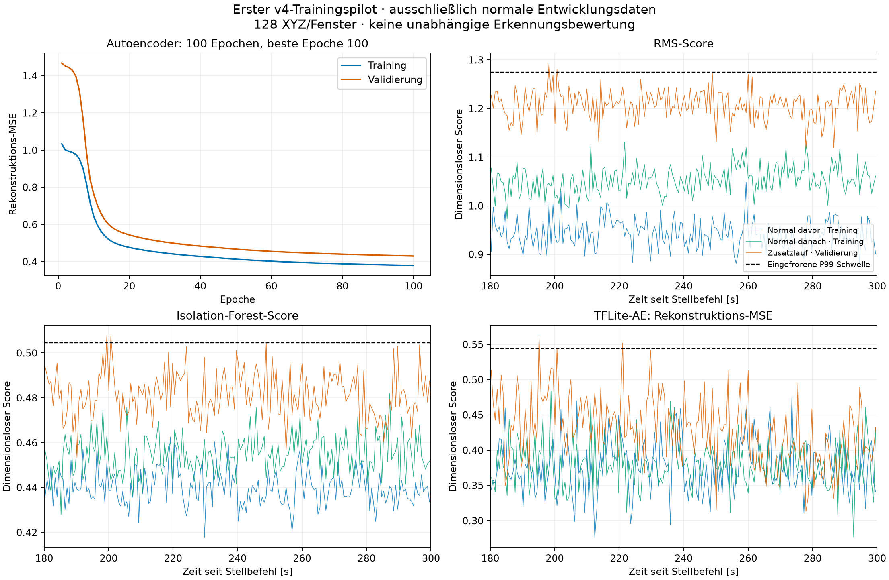

# Erster echter Trainingspilot für die aufrechte Aufbauversion v4

Datum: 11.09.2026. Der Nutzer hat den ersten technischen Trainingspilot mit „Starte damit dann“ nach Erläuterung der Trainingsfreigabe autorisiert. Es wurde genau ein echter Trainingslauf mit den vorhandenen Normaldaten ausgeführt. Er endete erfolgreich mit `ready_development_only`. Es gab keine neue Messung und keine PWM-Änderung. Vorhandene Daten, alte Modelle, historische Berichte und Worddatei bleiben unverändert.

## Ergebnis

Ein neues Autoencoder-Modell und ein Isolation Forest wurden tatsächlich trainiert. Der gemeinsame Scaler und die drei Validierungsschwellen sind gespeichert. Der Autoencoder wurde ohne Quantisierung nach Float32-TFLite konvertiert; die numerische Konsistenzprüfung bestand. Ein anschließender erneuter Durchlauf über die bekannte Normalvalidierung mit eingefrorenen Artefakten reproduzierte sämtliche **582 Ergebniszeilen = 194 Fenster × 3 Methoden** exakt, einschließlich Scores, Entscheidungen und Herkunftsangaben.

Das belegt die technische Funktionsfähigkeit dieses Offline-Trainings- und Bewertungswegs mit der aktuellen Messkette. Es belegt keine unabhängige Erkennungsleistung, keinen nachgewiesenen Defekt und noch keinen erfolgreichen Livebetrieb.

Neues Modellpaket: [eingefrorenes Pilotmanifest](run_001/frozen/pilot_bundle.json). Die Paketkennung unterscheidet sich bewusst von den alten Profilen. Neue Artefakte liegen ausschließlich unter diesem Ergebnisverzeichnis.

## Daten und feste Entscheidungen

Es wurden dieselben vorbereiteten Daten wie im [Vorbereitungsbericht](../upright_v4_pilot_preparation_20260911_123511/preparation_report.md) verwendet: Aufbau `fan_upright_position_v4_20260911_103726`, Normalzustand ohne Platte bei 75 % PWM und 25 kHz. Zwei vollständige Aufnahmeidentitäten liefern **388 Trainingsfenster**, eine dritte liefert **194 Validierungsfenster**. Die Originaldateien bleiben unverändert; Stillstand, Plattenzustand und ältere Aufbauversionen werden nicht zum Training verwendet.

Auswahl: `[180,300)` Sekunden nach Aufrufbeginn des PWM-Stellbefehls. Fenster und Schritt umfassen jeweils 128 XYZ; kein Fenster überschreitet die Quelle oder Auswahlgrenze. Die Achsenmittelwerte werden je Fenster in Float64 entfernt, anschließend erfolgt der Float32-Export. Alle drei Methoden verwenden identische standardisierte AC-Fenster. Die nominelle Sensor-Abtastrate bleibt 200 Hz, der beobachtete Durchsatz liegt in den erhaltenen Aufnahmen bei ungefähr 207 XYZ/s. Es wurde keine künstliche Zeitkorrektur oder Umabtastung eingeführt.

Der Scaler wurde ausschließlich an **49.664 XYZ = 388 × 128** aus dem Training angepasst. Die achsenweisen Skalierungsfaktoren betragen 0,009402308447 g, 0,011104527543 g und 0,026850519317 g; die globalen Mittelwerte der bereits AC-zentrierten Trainingsdaten liegen numerisch nahe null. Die stärkere dritte Normalaufnahme blieb unverändert der Validierung zugeordnet.

## Tatsächlicher Trainingslauf

Der Trainingsauftrag wurde am **11.09.2026 um 13:06:23 UTC** protokolliert. Die Umgebung und der vollständige Konsolenverlauf sind erhalten: [Trainingsauftrag](run_001/training_request.json), [Konsolenprotokoll](training_console.log). Die Ausführung erfolgte direkt auf dem Raspberry Pi, mit OpenMP/OpenBLAS auf zwei Threads und TensorFlow auf zwei Intra-/einen Inter-Op-Thread begrenzt. Das ist eine dokumentierte Laufzeiteinstellung, kein Ressourcenbenchmark.

| Parameter / Ergebnis | Tatsächlicher Stand |
|---|---|
| Autoencoder | Vorhandener kleiner zeitlicher Faltungs-Autoencoder, 128 × 3 Eingabe, 507 trainierbare Parameter |
| Optimierung | Adam, Lernrate 0,001, MSE, Batchgröße 32, Seed 42 |
| Epochenlimit | 100 |
| Tatsächliche Epochen / beste Epoche | 100 / 100 |
| Early-Stopping-Regel | Geduld 10, minimale Verbesserung 10⁻⁶; kein vorzeitiger Abbruch ausgelöst |
| Trainingsverlust während letzter Epoche | 0,379200459 |
| Mittlerer Trainings-Rekonstruktionsfehler des abschließend geladenen Modells | 0,378798932 |
| Mittlerer Validierungs-Rekonstruktionsfehler des abschließend geladenen Modells | 0,429631033 |
| Isolation Forest | 200 Bäume, `max_samples=auto`, `contamination=auto`, alle Merkmale, kein Bootstrap, ein Worker, Seed 42 |
| Neue TFLite-Dateigröße | 14.084 Byte; keine Aussage über Laufzeitspeicher |
| Neue IF-Dateigröße | 3.072.589 Byte; keine Aussage über Laufzeitspeicher |

Der Trainingsverlust während einer Epoche wird noch mit den währenddessen aktualisierten Gewichten aggregiert. Er ist deshalb nicht exakt derselbe Wert wie die anschließende Auswertung des gespeicherten Modells. Die Validierungskurve fiel bis zur letzten Epoche weiter. **Eine abgeschlossene Konvergenz ist nicht nachgewiesen.** Es wurde weder das Epochenlimit nachträglich verlängert noch die Aufteilung zur Verbesserung der Werte geändert.

## Konvertierung und eingefrorene Bewertung

| Prüfung Keras gegen Float32-TFLite | Ergebnis | Vorhandene Akzeptanzgrenze |
|---|---:|---:|
| Maximaler Unterschied einzelner Rekonstruktionswerte | 1,78814 × 10⁻⁶ | 10⁻³ |
| Maximaler Unterschied der Fenster-MSE | 6,14825 × 10⁻⁸ | 10⁻⁴ |
| Abweichende Entscheidungen an der eingefrorenen AE-Schwelle | 0 / 194 | 0 |

Die Prüfung umfasst 74.496 rekonstruierte Achsenwerte der Normalvalidierung. Der anschließende gemeinsame Vergleich verwendet `ai_edge_litert.Interpreter` mit einem Inferenzthread. Auch dort stimmen die MSE-Werte innerhalb der festgelegten Toleranz und die Entscheidungen exakt mit der Keras-Referenz überein. Die AE-Schwelle wurde beim Runtimewechsel nicht nachkalibriert. Belege: [Konvertierungsprüfung](run_001/training_stage/results/tflite_consistency.json) und [Paketmanifest](run_001/frozen/pilot_bundle.json).

| Methode | Eingefrorene Schwelle | Trainingsfenster darüber | Validierungsfenster darüber | Ungültige Entscheidungen |
|---|---:|---:|---:|---:|
| rms | 1.274769537714 | 0 / 388 | 2 / 194 | 0 |
| isolation_forest | 0.504539524706 | 0 / 388 | 2 / 194 | 0 |
| tflite_autoencoder | 0.544357966122 | 0 / 388 | 2 / 194 | 0 |

RMS- und IF-Schwellen sind die linearen empirischen 99. Perzentile der Normalvalidierung. Für TFLite bleibt die normale Keras-P99-Schwelle eingefroren. Bei 194 Validierungsfenstern und der strikten Regel `Score > Schwelle` ergeben sich hier jeweils zwei Überschreitungen, entsprechend rund 1,03 % **auf den zur Schwellenwahl verwendeten Daten**. Das ist kein unabhängiger Fehlalarmnachweis. Die rechnerische „Accuracy“ aus ausschließlich normalen Kalibrierungsdaten wird deshalb nicht als Erkennungsleistung berichtet.

Die drei Scorearten haben unterschiedliche Bedeutungen und Skalen. Eine kleinere Zahl bei einer Methode ist keine bessere Erkennungsleistung. Ebenso sind die RMS-Scores dimensionslos und nicht mit dem Vektor-AC-RMS in mg gleichzusetzen.

## Unterschiede zwischen den normalen Aufnahmen

Je Aufnahme liegen 194 aufeinanderfolgende Modellfenster vor. Streuungen in der folgenden Tabelle sind deskriptive Standardabweichungen mit `ddof=0`; die Fenster sind keine unabhängigen Versuchsreplikate.

| Aufnahme | Gruppe | RMS-Score Mittel ± SD | IF-Score Mittel ± SD | TFLite-MSE Mittel ± SD |
|---|---|---:|---:|---:|
| `normal_before` | train | 0.943065 ± 0.029503 | 0.440196 ± 0.007797 | 0.377633 ± 0.036617 |
| `normal_after` | train | 1.053057 ± 0.028776 | 0.454899 ± 0.008629 | 0.379965 ± 0.033035 |
| `normal_followup` | validation | 1.208126 ± 0.030855 | 0.481443 ± 0.010195 | 0.429631 ± 0.046544 |

| Aufnahme | Vektor-AC-RMS der 128er-Fenster, mg: Mittel ± SD | Bereich, mg |
|---|---:|---:|
| `normal_before` | 27.697 ± 0.848 | 25.771–30.366 |
| `normal_after` | 33.115 ± 0.938 | 30.555–35.982 |
| `normal_followup` | 39.100 ± 0.851 | 36.596–41.391 |

Die physische Vibrationsstärke der Validierung liegt über den beiden Trainingsläufen. RMS- und IF-Mittelwerte steigen ebenfalls zwischen den Aufnahmen. Die beiden AE-Trainingsmittel sind trotz unterschiedlicher Vibrationsstärke nahe beieinander; daraus folgt keine allgemeine Amplitudenunabhängigkeit. Die höhere Validierung wurde als normal kalibriert und nicht rückwirkend als Anomalie umetikettiert. Die Modellschwellen berücksichtigen dadurch diesen bekannten stärkeren Normalzustand; ob sie neue Normal- und veränderte Zustände sinnvoll beurteilen, bleibt zu testen.

Die obigen RMS-Werte stammen aus 128er-Modellfenstern und sind von den früheren 5-s-Diagnostikwerten zu unterscheiden. Eine unterschiedliche Fensterlänge kann leicht andere Mittelwerte liefern. Die alten Berichte werden nicht korrigiert oder ersetzt.

[Grafik als PDF](analysis/training_and_normal_scores.pdf), [vollständige Score-CSV](analysis/all_normal_window_scores.csv), [RMS-Eingangsdiagnostik](analysis/normal_input_window_rms.csv), [Statistiken](analysis/diagnostics.json).

## Ausgeführte Kontrollen und begrenzte Aussagekraft

- Quellen, Datasetmanifest und Codehashes wurden vor dem echten Training gegen den geprüften Stand kontrolliert.
- Der echte Trainingsbefehl endete mit Exitcode 0; es gab keinen zweiten Trainingsversuch und kein automatisches Nachtrainieren.
- Die vollständige Normalvalidierung wurde mit eingefrorenen Artefakten erneut ausgewertet. Alle 582 Ergebniszeilen stimmen exakt mit der ersten Bewertung überein. Eine dritte Berechnung im Diagnoseskript reproduzierte sie ebenfalls. [Replaybericht](replay_001/replay_report.json).
- Die Zahlen aller neun Kombinationen aus drei Aufnahmen und drei Methoden wurden zusätzlich unabhängig aus der exportierten Score-CSV nachgerechnet; die Statistiken stimmen exakt.
- TensorFlow protokollierte Hinweise zu einem unbekannten, ignorierten Dataset-Attribut und zur veralteten `tf.lite.Interpreter`-Schnittstelle. Der Lauf und die tatsächlichen Konsistenzprüfungen wurden erfolgreich abgeschlossen; es wurden keine Pakete geändert. Die Hinweise bleiben im vollständigen Konsolenprotokoll erhalten.
- Beim ersten nachgelagerten Diagnoseskript führte die unterschiedliche Darstellung leerer Fehlerfelder (`None` im Speicher, `NaN` nach CSV-Einlesen) zu einem Datentypvergleichsfehler. Die Gegenüberstellung erfolgt nun nach identischer CSV-Serialisierung; der Scorevergleich bleibt exakt. Der ursprüngliche Skriptstand und die [Fehlernotiz](diagnostic_attempt_001.json) bleiben erhalten. Modelle und Schwellen wurden dabei nicht geändert.

Die Normalvalidierung diente sowohl der Trainingsüberwachung als auch der Schwellenwahl. Alle drei Aufnahmen waren bereits vor dem Training untersucht. Deshalb wurden noch keine unabhängige Generalisierung, Erkennung veränderter Zustände, Robustheit am zweiten PWM-Punkt oder Live-Latenz nachgewiesen. Die 180-s-Einlaufzeit, die genaue Ursache der 200-/207-Hz-Abweichung und die tatsächliche Drehzahl bleiben offene Messkettenfragen. Ein erfolgreicher Trainingslauf hebt diese Grenzen nicht auf.

## Konkreter nächster Schritt

Empfohlen werden als nächste **Normalitätsprüfung drei neue, unabhängige Normalstarts bei 75 % PWM und 25 kHz**, jeweils 300 Sekunden mit unverändertem Aufbau und denselben Sensoreinstellungen. Die ersten 180 Sekunden werden wie zuvor aufgezeichnet, aber vorläufig von der Modellbewertung ausgeschlossen. Nach jeweils bestätigtem vollständigem Stillstand und Freigabe folgt dieselbe zusätzliche Auszeit von 60 Sekunden; die gesamten Auszeiten werden separat dokumentiert. Drei neue Starts sind eine kleine Prüfung der Startvariabilität, kein belastbarer statistischer Abschlussumfang.

Die konkrete offene Frage lautet: **Wie häufig überschreiten bisher unbenutzte normale Aufnahmen die jetzt eingefrorenen Schwellen, und unterscheiden sich die Starts?** Diese Aufnahmen dürfen nicht zur erneuten Skalierung oder Schwellenwahl verwendet werden, wenn sie als Tests berichtet werden. Falls Ergebnisse anschließend zu Entwicklungsänderungen führen, sind dafür eine neue Modellversion und später erneut unbenutzte Tests nötig. Die erste Testphase soll keine künstlich perfekte RMS-Kurve erzwingen.

Danach können kontrolliert veränderte Zustände bei derselben PWM und ein zweiter normaler PWM-Punkt mit unverändertem Modellpaket geprüft werden. Die Plattenbedingung bleibt ein kontrollierter veränderter Betriebszustand, kein nachgewiesener Defekt. Eine neue physische Messphase wurde in diesem Auftrag nicht gestartet. Der unabhängige Testimport sowie der spätere Livepfad müssen vor ihrer jeweiligen Verwendung passend zur gemeinsamen AC-Vorverarbeitung geprüft werden.

Die externe Hardware musste für diesen Trainingspilot nicht bedient werden. Die PWM-Stellvorgabe wurde nur gelesen und beträgt 0 % bei 25 kHz. Ein mechanischer Stillstand wird daraus nicht abgeleitet. Worddatei und vorhandene Modelle bleiben unverändert; die abschließende [Erhaltungsprüfung](verification.json) belegt dies.
